A comprehensive guide to working effectively with Claude Code and maximizing productivity.
## Table of Contents

---

1. [Core Principles](about:blank#core-principles)
2. [The Power of Validation](about:blank#the-power-of-validation)
3. [Effective Communication](about:blank#effective-communication)
4. [Optimal Workflows](about:blank#optimal-workflows)
5. [Advanced Techniques](about:blank#advanced-techniques)
6. [Advanced Claude Code Features](about:blank#advanced-claude-code-features)
7. [Common Pitfalls](about:blank#common-pitfalls)
8. [Pro Tips](about:blank#pro-tips)
9. [Community Resources & Ecosystem](about:blank#community-resources--ecosystem)

---

> 📚 Looking for more resources? This guide is based on best practices from the community. For a comprehensive, curated list of all Claude Code tools, workflows, agents, and resources, visit:
> 
> 
> [**Awesome Claude Code**](https://github.com/hesreallyhim/awesome-claude-code) ⭐
> 
> The awesome list includes 100+ resources across:
> - 🤖 Agent Skills & Sub-agents
> - ⚡ Slash Commands (version control, testing, deployment)
> - 🪝 Hooks (automation & lifecycle extensions)
> - 🧰 Tooling (IDE integrations, orchestrators, monitors)
> - 🧠 Workflows (RIPER, AB Method, Ralph Wiggum, and more)
> - 📂 CLAUDE.md templates (language and domain-specific)
> - 📱 Alternative Clients
> 
> *This document provides the **how** - awesome-claude-code provides the **what**.*
> 

---

## Core Principles

### 1. **Validate Early, Validate Often**

Claude Code can run tests, type checkers, and linters immediately after making changes. This creates a fast feedback loop.

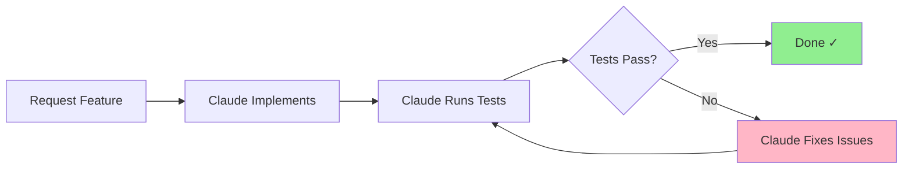

**Bad Workflow:**

```
You → Request change
Claude → Makes change
You → Try it later
You → Discover it's broken
You → Report issue
Claude → Fixes it
You → Try again
```

**Good Workflow:**

```
You → Request change + ask for validation
Claude → Makes change
Claude → Runs tests automatically
Claude → Reports "Done, all tests pass ✓"
```

### 2. **Specificity Wins**

The more context and criteria you provide, the better the results.

**Vague Request:**
> “Add user management”

**Specific Request:**
> “Add a user management page at /admin/users with a table showing email, role, last login date, and status. Include search/filter functionality. Add ‘Edit’ and ‘Delete’ buttons with confirmation modals. Use the existing admin layout pattern. Write Playwright tests for the happy path. Run validation when done.”

### 3. **Iterative Development**

Break complex features into logical steps. Claude Code excels at sequential problem-solving.

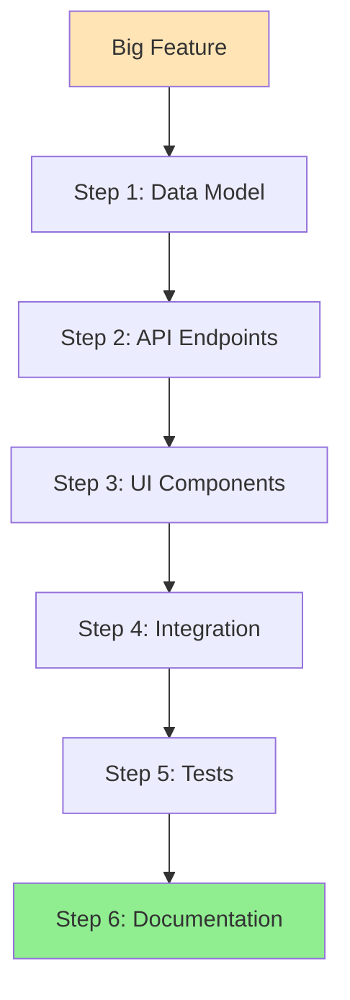

---

## The Power of Validation

### Essential Validation Tools

Claude Code can run these tools to verify work quality:

| Tool | Purpose | When to Use |
| --- | --- | --- |
| **Unit Tests** (Jest/Vitest) | Test individual functions | After logic changes |
| **E2E Tests** (Playwright/Cypress) | Test user workflows | After UI/integration changes |
| **Type Checker** (TypeScript) | Catch type errors | Always |
| **Linter** (ESLint) | Code quality & style | Before committing |
| **Formatter** (Prettier) | Consistent formatting | Before committing |
| **Build** | Ensure code compiles | Before deployment |
| **Custom Scripts** | Project-specific checks | As needed |

### Request Validation Explicitly

**Examples:**

```
"Add authentication middleware and run the test suite"

"Refactor this component and verify TypeScript passes"

"Update the API endpoint, write tests, and run validation"

"Fix this bug and verify with Playwright that the user flow works"
```

### The Validation Pyramid

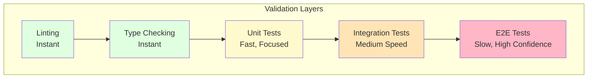

**Best Practice:** Run fast checks first (types, lint), then unit tests, then E2E.

---

## Effective Communication

### The Anatomy of a Great Request

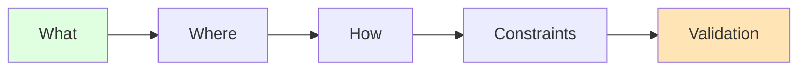

**Components:**

1. **What** - The feature/change you want
2. **Where** - Location in codebase
3. **How** - Implementation approach (optional)
4. **Constraints** - Must follow pattern X, must handle edge case Y
5. **Validation** - How to verify it works

**Example:**

> What: Add a CSV export feature for the user table
> 
> 
> **Where:** On the /admin/users page, add a button in the top-right
> 
> **How:** Use the Papa Parse library (already installed). Follow the pattern in the reports export.
> 
> **Constraints:** Must handle large datasets (1000+ rows) without freezing the browser. Include all visible columns except ‘Actions’.
> 
> **Validation:** Write a Playwright test that clicks the export button and verifies the download starts. Run the test suite.
> 

### Use Context Effectively

**Point to Examples:**

```
"Create a new admin page similar to /admin/analytics but for user activity"
```

**Reference Patterns:**

```
"Use the same authentication pattern as the API routes in /api/auth/*"
```

**Provide Error Messages:**

```
"Fix this error: [paste error]. It happens when I click the submit button."
```

---

## Optimal Workflows

### Workflow 1: Feature Development

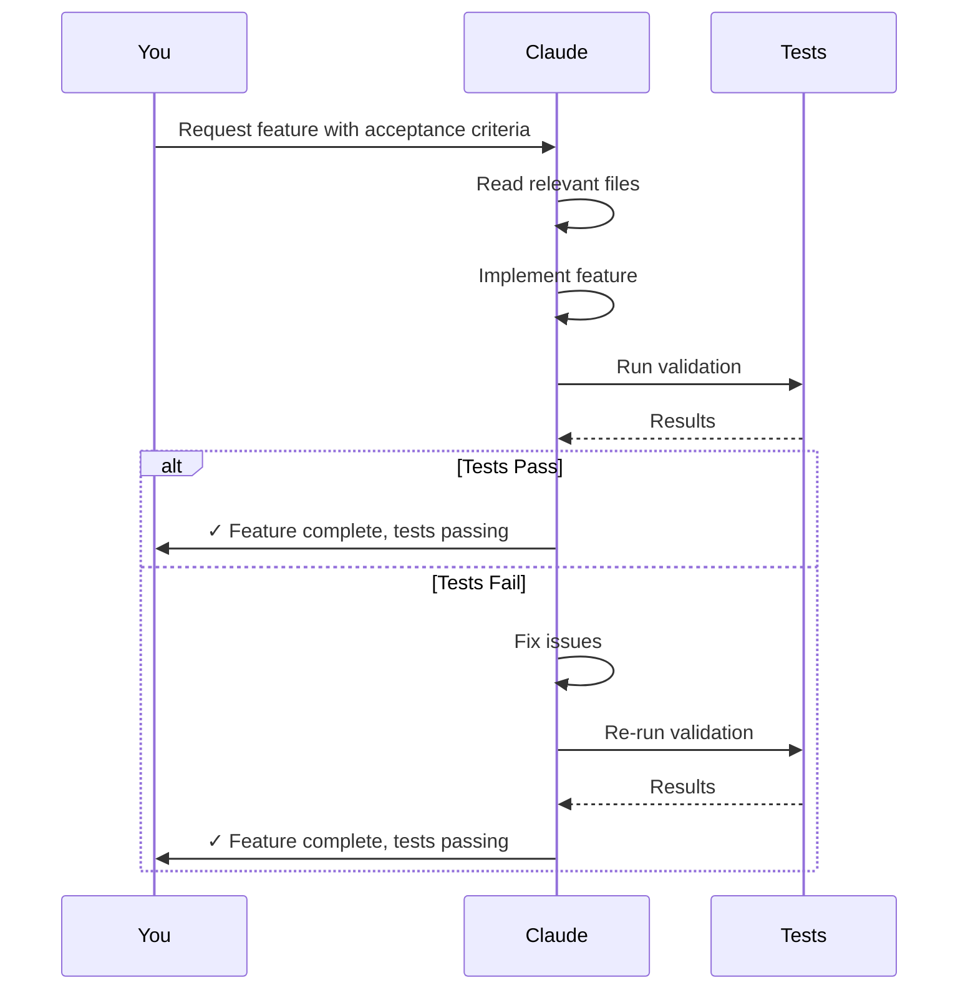

**Your part:**
1. Provide clear requirements
2. Specify validation criteria
3. Review the results

**Claude’s part:**
1. Read existing code to understand patterns
2. Implement the feature
3. Run tests and fix any issues
4. Report completion with test results

### Workflow 2: Bug Fixing

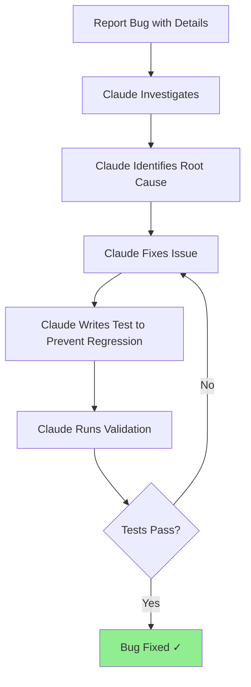

**Effective Bug Reports Include:**

- What you expected to happen
- What actually happened
- Steps to reproduce
- Error messages/screenshots
- Environment (browser, OS, etc.)

**Example:**

> Bug: User profile page shows “undefined” for users without a bio
> 
> 
> **Expected:** Should show “No bio provided” or empty state
> 
> **Reproduce:**
> 1. Go to /profile/user123
> 2. Look at the bio section
> 
> **Error:** No console errors, just displays “undefined” text
> 
> **Fix:** Add fallback handling and write a test to catch this
> 

### Workflow 3: Refactoring

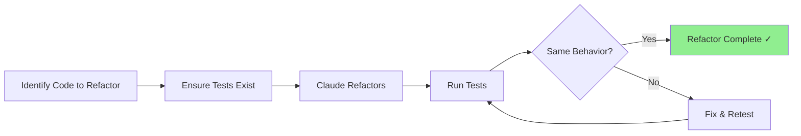

**Best Practice:** Always have tests before refactoring.

**Request Example:**

```
"Refactor the authentication logic in auth.server.ts to be more maintainable.
Extract the JWT validation into a separate function. Ensure all existing tests
still pass."
```

### Workflow 4: Git Operations

Claude Code can handle the entire git workflow:

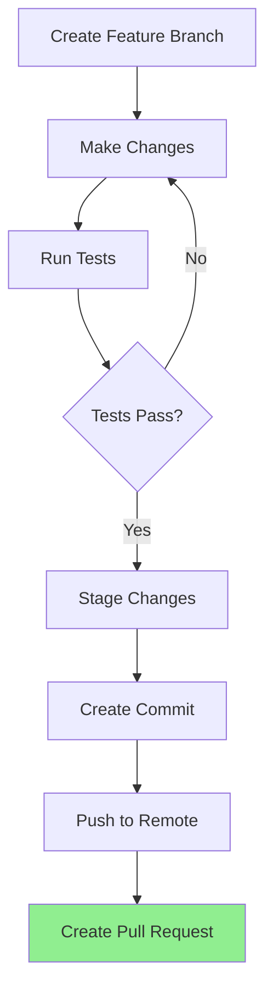

**Request:**

```
"Create a feature branch called 'add-dark-mode', implement the dark mode toggle,
run validation, commit with a descriptive message, and create a PR"
```

Claude will:

- Create the branch
- Implement the feature
- Run tests
- Stage files
- Create a commit with a proper message
- Push the branch
- Create the PR with a description

---

## Advanced Techniques

### 1. **Parallel Execution**

Claude can run multiple independent commands simultaneously:

```
"Run these in parallel: git status, npm run typecheck, and npm run lint"
```

This is **much faster** than running them sequentially.

### 2. **Multi-File Changes**

Request changes across multiple files in one shot:

```
"Update the User model to include 'lastLoginAt', update the database migration,
update the API endpoint to return it, update the UI to display it, and update
the TypeScript types. Run validation."
```

Claude will:

- Read all relevant files
- Make coordinated changes
- Ensure type consistency
- Validate everything works together

### 3. **Pattern Recognition**

Leverage Claude’s ability to learn your codebase patterns:

```
"Add a new entity called 'Project' following the same pattern as the 'User'
entity (model, routes, components, tests)"
```

### 4. **Debugging Assistance**

Let Claude investigate and fix issues:

```
"The app crashes when I click 'Submit' on the form. Check the console logs,
trace through the code, identify the issue, and fix it. Verify with tests."
```

Claude will:

- Read error messages
- Trace through the call stack
- Identify the root cause
- Implement a fix
- Add tests to prevent regression

### 5. **Documentation Generation**

```
"Review the authentication flow and create a sequence diagram in mermaid showing
how it works. Add it to the README."
```

### 6. **Code Review**

```
"Review the changes in UserService.ts and identify any potential bugs,
performance issues, or security vulnerabilities"
```

---

## Advanced Claude Code Features

### Plan Mode

Plan Mode is a powerful feature that allows Claude to think through complex tasks before executing them. It’s especially useful for:

- Large refactoring projects
- Architecture decisions
- Multi-step features with dependencies
- Unclear requirements that need exploration

**How to Use Plan Mode:**

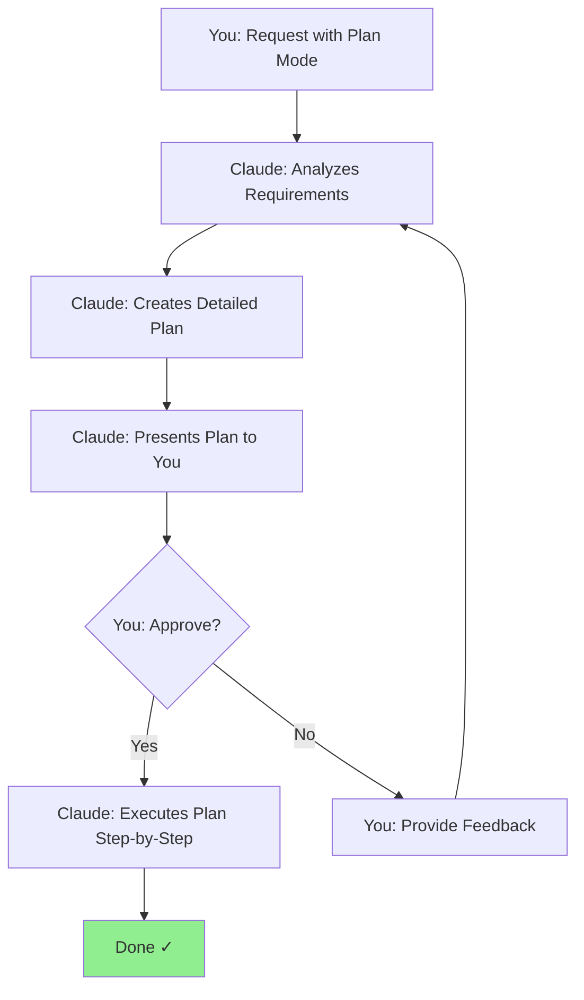

**Example Request:**

```
"Enter plan mode. I want to add multi-tenant support to the application.
Each tenant should have isolated data, separate billing, and custom branding."
```

**Claude will:**

1. Analyze the codebase
2. Identify all affected areas
3. Create a step-by-step plan
4. Estimate complexity
5. Present the plan for approval
6. Execute after you approve

**When to Use Plan Mode:**

- ✅ Complex features with many unknowns
- ✅ Major refactoring
- ✅ Need to understand scope before starting
- ✅ Want to review approach before implementation
- ❌ Simple bug fixes
- ❌ Adding a single field to a form

### Auto Accept Mode

Auto Accept Mode allows Claude to make tool calls without asking for permission each time. This dramatically speeds up development for trusted operations.

**Safety Levels:**

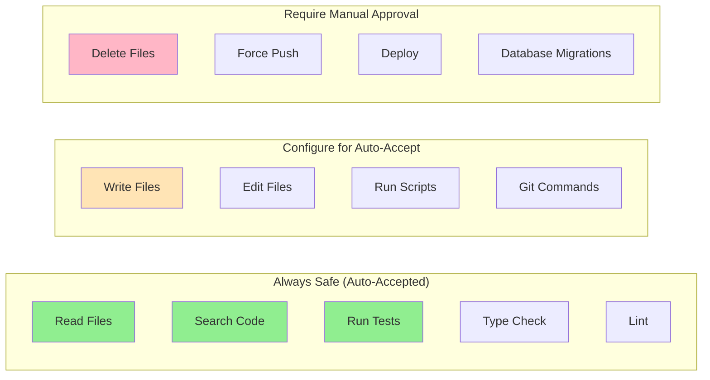

**Recommended Auto-Accept Settings:**

```
Auto-accept: Read, Glob, Grep, Bash (read-only), npm test, npm run lint
Manual approval: Write, Edit, Delete, git push, npm run deploy
```

**Best Practices:**

- Start conservative, expand trust gradually
- Always review changes in version control
- Keep risky operations manual (deploy, force push)
- Use in trusted environments (dev, not production)

### Claude Composer

Claude Composer is a feature for orchestrating complex workflows across multiple Claude instances working together.

**Use Cases:**

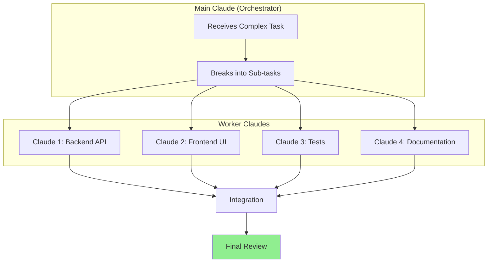

**Example Workflow:**

```
"Use composer mode to build a complete user authentication system:
- Claude 1: Build the backend (models, controllers, middleware)
- Claude 2: Build the frontend (forms, validation, state management)
- Claude 3: Write comprehensive tests (unit, integration, e2e)
- Claude 4: Create documentation (API docs, user guide, architecture diagrams)"
```

**Benefits:**

- **Parallel Work**: Multiple Claudes work simultaneously
- **Specialization**: Each Claude focuses on one domain
- **Faster Completion**: Complex projects finish much quicker
- **Better Quality**: Dedicated focus on each component

**When to Use:**

- Building complete features from scratch
- Large refactoring across multiple domains
- Need frontend + backend + tests + docs simultaneously
- Time-sensitive projects

### Claude Squad

Claude Squad is a team-based approach where multiple Claude instances have specialized roles and collaborate on a project.

**Squad Roles:**

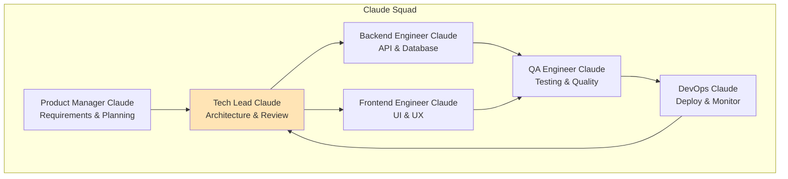

**Example Squad Formation:**

```
"Create a Claude Squad to build a real-time chat feature:

- PM Claude: Define requirements, create user stories, prioritize features
- Tech Lead Claude: Design architecture, review code, make tech decisions
- Backend Claude: Build WebSocket server, message persistence, authentication
- Frontend Claude: Build chat UI, real-time updates, notifications
- QA Claude: Write tests, perform security review, load testing
- DevOps Claude: Set up deployment pipeline, monitoring, scaling"
```

**Squad Workflow:**

1. **PM Claude** creates requirements and user stories
2. **Tech Lead Claude** designs architecture and creates tasks
3. **Backend/Frontend Claudes** implement in parallel
4. **QA Claude** continuously tests and provides feedback
5. **Tech Lead Claude** reviews and integrates work
6. **DevOps Claude** deploys and monitors

**Benefits:**

- **Division of Labor**: Each Claude has clear responsibilities
- **Continuous Quality**: QA is integrated throughout
- **Better Architecture**: Tech Lead oversees design
- **Faster Iteration**: Parallel work streams
- **Comprehensive Coverage**: Nothing falls through the cracks

**When to Use:**

- Building entire products or major features
- Need different expertise areas
- Want continuous quality assurance
- Complex projects with many moving parts
- Longer-term projects (weeks/months)

### Combining Features for Maximum Productivity

**The Ultimate Workflow:**

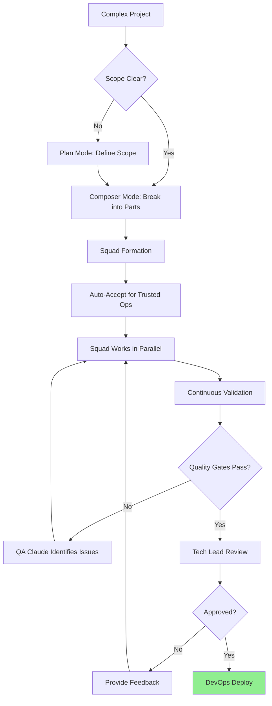

**Example Ultimate Request:**

```
"Enter plan mode and design a comprehensive analytics dashboard.
Then use composer to create a squad:

- PM: Define KPIs and user requirements
- Tech Lead: Design data pipeline and visualization architecture
- Backend: Build data aggregation APIs
- Frontend: Create dashboard UI with charts
- QA: Test performance with large datasets and write e2e tests
- DevOps: Set up caching and CDN

Use auto-accept for all read operations and tests. Require approval for
deployments. Each squad member should validate their work continuously."
```

This combines:

- ✅ Plan Mode (upfront design)
- ✅ Composer (parallel execution)
- ✅ Squad (specialized roles)
- ✅ Auto-Accept (speed)
- ✅ Continuous Validation (quality)

**Result:** A complete feature, delivered faster with higher quality.

---

## Common Pitfalls

### ❌ Pitfall 1: Vague Requests

**Bad:**
> “Make it better”

**Good:**
> “Improve error handling in the API by adding try-catch blocks, logging errors,
> and returning appropriate HTTP status codes. Follow the pattern in auth.ts.”

### ❌ Pitfall 2: No Validation

**Bad:**
> “Add the feature” [you test manually later]

**Good:**
> “Add the feature and run the test suite to verify it works”

### ❌ Pitfall 3: Too Much at Once

**Bad:**
> “Rewrite the entire authentication system, add OAuth, implement rate limiting,
> add admin dashboard, and deploy to production”

**Good:**
> “Step 1: Add OAuth provider configuration to the auth service. Run tests.”
>
> Then: “Step 2: Implement the OAuth flow. Add integration tests.”
>
> etc.

### ❌ Pitfall 4: Not Providing Context

**Bad:**
> “Fix the bug”

**Good:**
> “The login form shows ‘Error 500’ when I submit with valid credentials.
> Console shows: [error message]. This started after the recent auth update.”

### ❌ Pitfall 5: Ignoring Existing Patterns

**Bad:**
> “Add a new API endpoint however you think is best”

**Good:**
> “Add a new API endpoint following the pattern in api/users.ts (error handling,
> validation, response format)”

---

## Pro Tips

### 🎯 Tip 1: Use the Todo List for Complex Work

For multi-step tasks, Claude creates a todo list you can track:

```
You: "Implement user profile editing with avatar upload, bio editing,
      and email change. Include validation and tests."

Claude: [Creates todo list]:
1. [ ] Add avatar upload component
2. [ ] Implement bio editing form
3. [ ] Add email change with verification
4. [ ] Add form validation
5. [ ] Write unit tests
6. [ ] Write E2E tests
7. [ ] Run validation

[Works through each item, marking complete as it goes]
```

You can:

- See progress in real-time
- Ask to skip or re-prioritize items
- Know exactly what’s left

### 🎯 Tip 2: Batch Related Changes

Instead of:

```
"Add a new field to the User model"
"Update the API"
"Update the form"
"Update the types"
```

Do:

```
"Add 'phoneNumber' to User model, update the API endpoint, add it to the
registration form, update TypeScript types, and run validation"
```

Claude maintains context across all changes.

### 🎯 Tip 3: Request Explanations

```
"Before implementing, explain your approach for adding real-time notifications"
```

This helps you:

- Verify Claude understands the requirement
- Catch potential issues early
- Learn architectural patterns

### 🎯 Tip 4: Use Playwright/Cypress for Critical Flows

```
"Write a Playwright test for the complete checkout flow: add item to cart,
enter shipping info, enter payment, confirm order. Run it to verify."
```

This ensures critical user journeys work end-to-end.

### 🎯 Tip 5: Leverage Reading Capabilities

```
"Read all the files in /services and identify any security vulnerabilities"

"Analyze the database queries in UserModel and identify N+1 query problems"

"Review the React components and find any performance issues"
```

### 🎯 Tip 6: Create Custom Validation Scripts

```
"Create a validation script that checks:
- TypeScript types pass
- No console.logs in production code
- All API endpoints have error handling
- All components have tests

Add it to package.json as 'npm run validate-custom'"
```

### 🎯 Tip 7: Use Git Strategically

```
"Create a feature branch, implement X, Y, and Z, run full validation,
create commits with conventional commit messages, and open a PR with
a detailed description"
```

Claude can handle the entire workflow.

### 🎯 Tip 8: Ask for Security Reviews

```
"Review the authentication implementation for security issues:
- SQL injection
- XSS vulnerabilities
- CSRF protection
- Password storage
- Session management"
```

### 🎯 Tip 9: Performance Optimization

```
"Profile the /dashboard page load time. Identify slow queries or components.
Implement optimizations. Measure the improvement."
```

### 🎯 Tip 10: Progressive Enhancement

```
"Add dark mode support. Start with the basic toggle, verify it works, then
we'll add transition animations."
```

Start simple, validate, then enhance.

---

## The Golden Rules

### 🥇 Rule 1: Trust but Verify

Let Claude run tests, but review the changes and results.

### 🥇 Rule 2: Fast Feedback Loops

Small changes → immediate validation → quick iterations

### 🥇 Rule 3: Clear Communication

Specific requests with acceptance criteria yield better results.

### 🥇 Rule 4: Use All the Tools

Tests, types, linters, E2E - they all help ensure quality.

### 🥇 Rule 5: Context is King

Point to examples, provide error messages, explain constraints.

---

## Quick Reference: Request Templates

### New Feature

```
Add [feature] to [location]. It should [behavior]. Follow the pattern in
[example]. Handle edge cases: [cases]. Write [test type] tests. Run validation.
```

### Bug Fix

```
Fix: [description]
Expected: [expected behavior]
Actual: [actual behavior]
Error: [error message]
Reproduce: [steps]
Verify the fix with tests.
```

### Refactoring

```
Refactor [component/module] to [improvement]. Ensure all tests still pass.
The behavior should remain identical.
```

### Code Review

```
Review [file/module] for:
- [concern 1]
- [concern 2]
- [concern 3]
Suggest improvements with examples.
```

### Testing

```
Write [test type] tests for [feature/component] covering:
- Happy path
- Edge cases: [list]
- Error cases: [list]
Run the tests to verify.
```

---

## Measuring Success

You’re using Claude Code effectively when:

✅ Features work on the first try (because tests validated them)

✅ You spend less time debugging and more time building

✅ Your codebase has consistent patterns (Claude follows them)

✅ Tests prevent regressions

✅ You can refactor confidently (tests provide safety net)

✅ Code reviews are faster (fewer bugs make it to PR)

✅ You’re shipping faster without sacrificing quality

---

## Community Resources & Ecosystem

The Claude Code community has created an extensive ecosystem of tools, workflows, and resources. Here are the most valuable ones to enhance your productivity.

> 💡 Complete Resource Directory
> 
> 
> This section highlights the **most essential** tools and workflows. For the complete, continuously-updated list of **all** Claude Code resources, visit:
> 
> [**Awesome Claude Code**](https://github.com/hesreallyhim/awesome-claude-code) - The definitive community-curated list with 100+ tools, agents, workflows, and guides.
> 
> Think of this section as “Best Of” and awesome-claude-code as “Complete Library”.
> 

### 🎯 Getting Started: Claude Code Templates

[**Claude Code Templates**](https://github.com/davila7/claude-code-templates) is the fastest way to supercharge your Claude Code setup. It provides 100+ pre-configured components with a beautiful UI.

### What It Includes

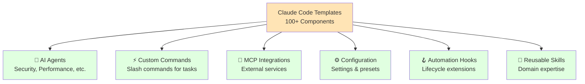

### Installation & Basic Usage

**Quick Start (Interactive):**

```bash
npx claude-code-templates@latest
```

This launches an interactive menu to browse and install components.

**Install Specific Components:**

```bash
# Install a specific agent
npx claude-code-templates@latest --agent development-tools/code-reviewer --yes

# Install a command
npx claude-code-templates@latest --command git/smart-commit --yes

# Install a hook
npx claude-code-templates@latest --hook quality/pre-commit-lint --yes
```

**Browse Templates:**

Visit [aitmpl.com](https://aitmpl.com/) to explore all available templates with descriptions and examples.

### Powerful Built-in Tools

**1. Analytics Dashboard** 📊

Monitor your Claude Code usage in real-time:

```bash
npx claude-code-templates@latest --analytics
```

**Features:**
- Token usage tracking
- Cost analysis
- Session duration metrics
- Most-used commands
- Error rate monitoring

**2. Conversation Monitor** 💬

Mobile-optimized interface to view Claude’s responses:

```bash
npx claude-code-templates@latest --chats
```

**Features:**
- Live conversation streaming
- Search across sessions
- Export conversations
- Mobile-friendly UI
- Share conversations with team

**3. Health Check** 🏥

Comprehensive diagnostics for your Claude Code installation:

```bash
npx claude-code-templates@latest --health-check
```

**Checks:**
- Claude CLI version
- Configuration files validity
- MCP servers connectivity
- Hooks functionality
- Agent availability
- Common issues detection

**4. Plugin Dashboard** 🔌

Manage your entire Claude Code ecosystem:

```bash
npx claude-code-templates@latest --plugins
```

**Features:**
- View installed plugins
- Browse marketplace
- Manage permissions
- Update components
- Remove unused plugins

### Example Workflow

**Setting Up a New Project:**

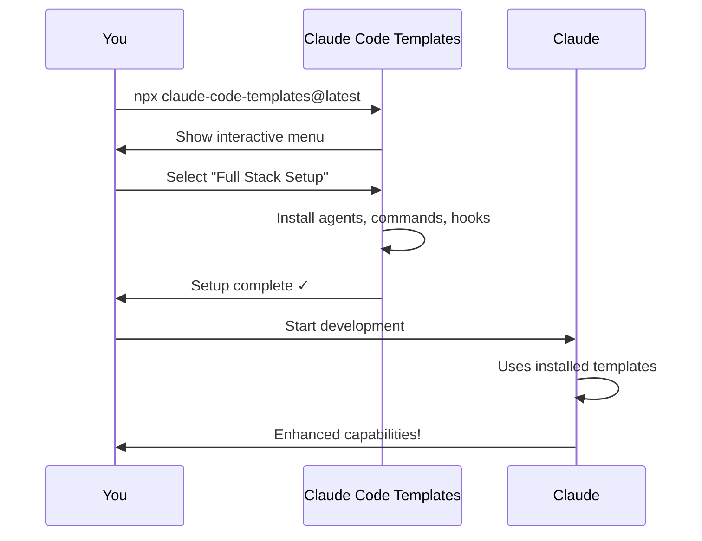

**Step-by-step:**

1. **Initial Setup**
    
    ```bash
    cd my-project
    npx claude-code-templates@latest
    ```
    
2. **Select Components** (via interactive menu)
    - ✅ Code Reviewer Agent
    - ✅ Smart Commit Command
    - ✅ Pre-commit Hook (lint + format)
    - ✅ Test Runner Command
    - ✅ Performance Analyzer Agent
3. **Verify Installation**
    
    ```bash
    npx claude-code-templates@latest --health-check
    ```
    
4. **Start Using**
    
    ```bash
    claude
    # Now you have access to all installed templates!
    /smart-commit    # Uses installed command
    # Claude uses code-reviewer agent automatically
    ```
    

### Popular Template Categories

**🔒 Security Templates:**
- Security auditor agent
- Vulnerability scanner command
- Dependency audit hook
- Secret detection hook

**⚡ Performance Templates:**
- Performance analyzer agent
- Bundle size checker
- Load time profiler
- Memory leak detector

**🧪 Testing Templates:**
- Test generator agent
- Coverage reporter command
- E2E test runner
- Visual regression tester

**📚 Documentation Templates:**
- Auto-doc generator agent
- README updater command
- API doc creator
- Changelog generator

**🎨 Code Quality Templates:**
- Code reviewer agent
- Lint fixer command
- Format enforcer hook
- Type checker integration

### Best Practices

**1. Start Small**

```bash
# Don't install everything at once
# Start with 3-5 essential components
npx claude-code-templates@latest --agent code-reviewer --yes
npx claude-code-templates@latest --command smart-commit --yes
```

**2. Use Health Check Regularly**

```bash
# Weekly health check
npx claude-code-templates@latest --health-check

# Add to CI/CD
npm run health-check  # Add to package.json
```

**3. Monitor Usage**

```bash
# Check analytics weekly
npx claude-code-templates@latest --analytics

# Identify what's actually being used
# Remove unused components
```

**4. Customize Templates**

After installation, templates are in `.claude/`:

```bash
.claude/
├── agents/
│   └── code-reviewer.md    # Customize this!
├── commands/
│   └── smart-commit.md     # Modify prompts
└── hooks/
    └── pre-commit.sh       # Adjust behavior
```

Edit them to match your project needs.

**5. Keep Updated**

```bash
# Check for updates
npx claude-code-templates@latest --update

# Re-run installation to get latest templates
npx claude-code-templates@latest
```

### Integration with Existing Setup

**Won’t overwrite your custom configs!**

```bash
# Safe to run - prompts before overwriting
npx claude-code-templates@latest --agent code-reviewer

# Use --force to overwrite (use carefully)
npx claude-code-templates@latest --agent code-reviewer --force
```

**Merge with existing:**

```bash
# Your custom CLAUDE.md
cat CLAUDE.md > CLAUDE.md.backup

# Install template agent
npx claude-code-templates@latest --agent my-agent

# Manually merge if needed
```

### Troubleshooting

**Templates not working?**

```bash
# Run health check
npx claude-code-templates@latest --health-check

# Check Claude Code version
claude --version

# Verify installation
ls -la .claude/
```

**Analytics not showing data?**

```bash
# Ensure Claude Code is logging
echo $CLAUDE_CODE_LOG_LEVEL

# Check log directory
ls -la ~/.claude/
```

**Hooks not triggering?**

```bash
# Verify hook permissions
chmod +x .claude/hooks/*

# Test hook manually
./.claude/hooks/pre-commit.sh
```

### Advanced: Creating Your Own Templates

**Template Structure:**

```bash
my-template/
├── agent.md           # Agent configuration
├── commands/          # Slash commands
│   └── my-cmd.md
├── hooks/             # Lifecycle hooks
│   └── pre-prompt.sh
└── README.md          # Template documentation
```

**Share with Community:**

1. Create your template
2. Test thoroughly
3. Submit PR to [claude-code-templates](https://github.com/davila7/claude-code-templates)
4. Follow [Contributing Guidelines](https://github.com/davila7/claude-code-templates/blob/main/CONTRIBUTING.md)

### Why Use Claude Code Templates?

✅ **Save time** - No need to write templates from scratch

✅ **Best practices** - Templates created by experienced users

✅ **Comprehensive** - Covers all aspects of development

✅ **Easy management** - Beautiful UI and CLI tools

✅ **Community-driven** - Constantly updated with new templates

✅ **Analytics included** - Built-in usage monitoring

✅ **Well-documented** - Full docs at [docs.aitmpl.com](https://docs.aitmpl.com/)

### Quick Reference Commands

```bash
# Interactive menu
npx claude-code-templates@latest

# View analytics
npx claude-code-templates@latest --analytics

# Monitor conversations
npx claude-code-templates@latest --chats

# Health check
npx claude-code-templates@latest --health-check

# Plugin dashboard
npx claude-code-templates@latest --plugins

# Install specific component
npx claude-code-templates@latest --agent <name> --yes
npx claude-code-templates@latest --command <name> --yes
npx claude-code-templates@latest --hook <name> --yes

# Update all
npx claude-code-templates@latest --update
```

---

### Essential Community Tools

### 📊 Usage Monitoring & Analytics

**Track your usage and optimize costs:**

- [**ccflare**](https://github.com/snipeship/ccflare) - Beautiful web dashboard with comprehensive metrics, detailed logging, and impressive UI
- [**better-ccflare**](https://github.com/tombii/better-ccflare/) - Enhanced fork with performance improvements and Docker deployment
- [**CC Usage**](https://github.com/ryoppippi/ccusage) - CLI tool with cost analysis and token consumption dashboard
- [**Claudex**](https://github.com/kunwar-shah/claudex) - Web browser for exploring conversation history with full-text search

**Why use these:**
Monitor spending, identify expensive patterns, optimize prompt efficiency.

### 🪝 Hooks & Automation

**Hooks** extend Claude Code’s behavior at specific lifecycle points:

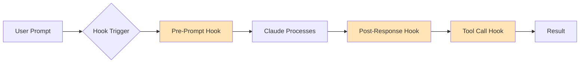

**Popular Hooks:**

- **File Watchers** - Auto-reload context when files change
- **TDD Guards** - Prevent commits without passing tests
- **Quality Gates** - Run linters/formatters before tool calls
- **Context Injection** - Automatically load project-specific context

**Example Hook Use Cases:**

```
"Create a pre-prompt hook that automatically loads the current git branch
and recent commits into context before each session"

"Add a post-tool-call hook that runs prettier on any edited files"

"Create a hook that prevents Claude from running npm install without approval"
```

### 🔪 Slash Commands

**Slash commands** are reusable prompt templates. Think of them as shortcuts for common tasks.

**Categories:**

| Category | Example Commands | Purpose |
| --- | --- | --- |
| **Version Control** | `/commit`, `/pr`, `/review` | Git operations |
| **Testing** | `/test`, `/coverage`, `/e2e` | Run test suites |
| **Code Quality** | `/lint`, `/format`, `/audit` | Code analysis |
| **Documentation** | `/docs`, `/readme`, `/changelog` | Generate docs |
| **Context** | `/prime`, `/load-specs`, `/context` | Load project info |
| **Deployment** | `/deploy`, `/build`, `/release` | CI/CD operations |

**Creating Custom Slash Commands:**

```bash
# Location: .claude/commands/my-command.md
```

```markdown
# My Custom Command

Description: Briefly describe what this command does

## Instructions

1.Read the current branch name
2.Run tests
3.If tests pass, commit with conventional commit message
4.Create a PR with auto-generated description
```

**Best Practices for Slash Commands:**

- Keep them focused (one command = one purpose)
- Include validation steps
- Document expected inputs/outputs
- Use descriptive names
- Chain simpler commands for complex workflows

### 🤖 Agent Skills & Workflows

**Agent Skills** are specialized configurations that give Claude domain expertise.

**Popular Skills:**

- [**Superpowers**](https://github.com/obra/superpowers) - Core software engineering competencies (planning, reviewing, testing, debugging)
- [**Claude Codex Settings**](https://github.com/fcakyon/claude-codex-settings) - Cloud platform integrations (GitHub, Azure, MongoDB)
- [**Context Engineering Kit**](https://github.com/NeoLabHQ/context-engineering-kit) - Advanced context patterns for better results
- [**TÂCHES Resources**](https://github.com/glittercowboy/taches-cc-resources) - Meta-skills like “skill-auditor” and hook creation

**Workflow Frameworks:**

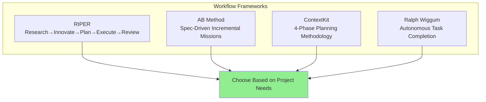

### The Ralph Wiggum Technique

**Ralph Wiggum** is an autonomous development pattern where Claude Code iteratively works on a task until completion.

**How it Works:**

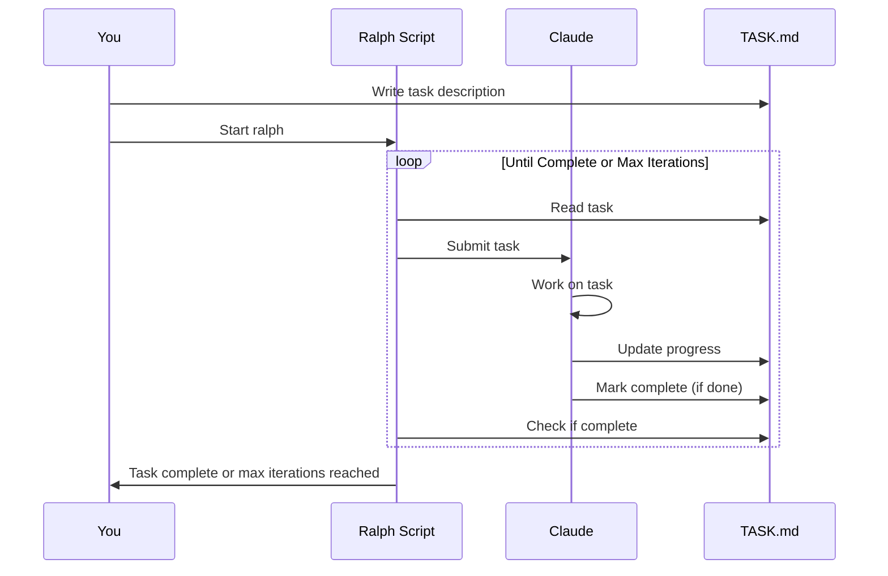

**Example Setup:**

```bash
# CreateTASK.md
echo "Build a REST API for user management with CRUD operations" > TASK.md

# Run Ralph
./ralph-claude-code.sh
```

**Ralph will:**

1. Read the task from `TASK.md`
2. Submit it to Claude Code
3. Claude works on it
4. Updates `TASK.md` with progress
5. Marks it complete when done
6. Repeat until task is finished or iteration limit

**Safety Features:**

- Rate limiting (prevent API overuse)
- Circuit breakers (stop infinite loops)
- Max iteration limits
- Exit detection (recognizes when task is complete)

**Best Use Cases:**

- ✅ Well-defined, automatable tasks
- ✅ Background processing while you work on other things
- ✅ Batch processing multiple similar tasks
- ❌ Tasks requiring human judgment
- ❌ Unclear or evolving requirements

**Popular Ralph Implementations:**

- [**ralph-claude-code**](https://github.com/frankbria/ralph-claude-code) - Bash-based with tmux monitoring, 75+ tests
- [**ralph-orchestrator**](https://github.com/mikeyobrien/ralph-orchestrator) - Robust, well-tested orchestration system
- [**The Ralph Playbook**](https://github.com/ClaytonFarr/ralph-playbook) - Comprehensive guide with theory and practice

### IDE Integrations

Bring Claude Code directly into your editor:

| IDE | Tool | Features |
| --- | --- | --- |
| **VS Code** | [Claude Code Chat](https://marketplace.visualstudio.com/items?itemName=AndrePimenta.claude-code-chat) | Chat interface, session management |
| **VS Code** | [Claudix](https://github.com/Haleclipse/Claudix) | Interactive chat, file ops, terminal execution |
| **Emacs** | [claude-code-ide.el](https://github.com/manzaltu/claude-code-ide.el) | Ediff suggestions, LSP integration, MCP support |
| **Emacs** | [claude-code.el](https://github.com/stevemolitor/claude-code.el) | CLI interface |
| **Neovim** | [claude-code.nvim](https://github.com/greggh/claude-code.nvim) | Seamless integration |
| **Desktop** | [crystal](https://github.com/stravu/crystal) | Full orchestration app |

### Multi-Agent Orchestration

**Go beyond single Claude instances:**

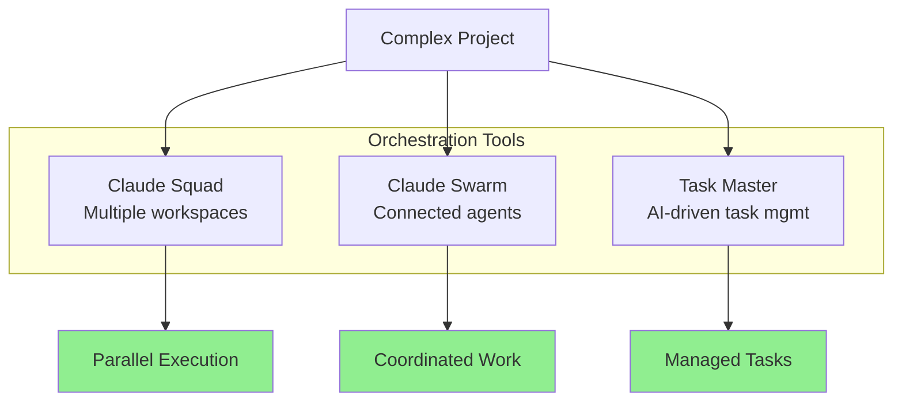

**Tools:**

- [**Claude Squad**](https://github.com/smtg-ai/claude-squad) - Manage multiple Claude instances in separate workspaces
- [**Claude Swarm**](https://github.com/parruda/claude-swarm) - Connected swarm of Claude agents
- [**Claude Task Master**](https://github.com/eyaltoledano/claude-task-master) - AI-driven task management

### Essential Utilities

**Quality of Life Improvements:**

| Tool | Purpose |
| --- | --- |
| [**cchistory**](https://github.com/eckardt/cchistory) | View all commands Claude ran in a session |
| [**recall**](https://github.com/zippoxer/recall) | Full-text search across sessions |
| [**ccexp**](https://github.com/nyatinte/ccexp) | Interactive CLI for managing configs |
| [**cclogviewer**](https://github.com/Brads3290/cclogviewer) | Pretty HTML viewer for conversation logs |
| [**tweakcc**](https://github.com/Piebald-AI/tweakcc) | Customize Claude Code styling |

### CLAUDE.md Best Practices

**CLAUDE.md** is your project’s instruction manual for Claude Code.

**What to Include:**

```markdown
# Project Name

## Overview
Brief description of what this project does

## Architecture
Key architectural decisions and patterns

## Development Workflow
1.How to set up the environment
2.How to run tests
3.How to deploy

## Code Patterns
-How we structure components
-Naming conventions
-File organization

## Common Commands
List of frequently used npm/make/etc commands

## Testing Strategy
What to test, how to test it

## Pitfalls & Gotchas
Common issues and how to avoid them

## Domain Knowledge
Business logic, domain concepts, terminology
```

**Tips:**

- Keep it concise (Claude reads this every session)
- Update it as patterns evolve
- Include examples of “good” code
- Reference existing files as patterns
- Document non-obvious decisions

**Example from Real Projects:**

```
"Before making changes, read CLAUDE.md to understand our patterns,
then implement the feature following those guidelines"
```

### Docker & Containerization

**Run Claude Code in isolated environments:**

- [**run-claude-docker**](https://github.com/icanhasjonas/run-claude-docker) - Safe isolated container with auth/ssh/keys forwarded
- [**Container Use**](https://github.com/dagger/container-use) - Dev environments for multiple agents
- [**viwo-cli**](https://github.com/OverseedAI/viwo) - Docker + git worktrees for safer `-dangerously-skip-permissions`

**Why containerize:**

- ✅ Test risky operations safely
- ✅ Avoid polluting host system
- ✅ Consistent environment across team
- ✅ Easy cleanup after experimentation

### Voice Input

**Talk to Claude Code:**

- [**VoiceMode MCP**](https://github.com/mbailey/voicemode) - Natural conversations with OpenAI-compatible voice services
- [**stt-mcp-server-linux**](https://github.com/marcindulak/stt-mcp-server-linux) - Push-to-talk transcription (local, no API calls)

**Use Cases:**

- Hands-free coding while walking
- Faster brainstorming
- Accessibility
- Exploratory conversations

### Advanced Patterns

**Agentic Workflow Patterns:**

From [Agentic Workflow Patterns](https://github.com/ThibautMelen/agentic-workflow-patterns):

1. **Subagent Orchestration** - Main agent delegates to specialized subagents
2. **Progressive Skills** - Agents gain capabilities over time
3. **Parallel Tool Calling** - Execute multiple operations simultaneously
4. **Master-Clone Architecture** - One master coordinates multiple clones
5. **Wizard Workflows** - Step-by-step guided processes

**Example: Subagent Orchestration**

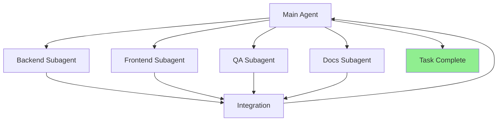

### Resource Hub

**📚 The Complete Library:**

- [**Awesome Claude Code**](https://github.com/hesreallyhim/awesome-claude-code) ⭐ **← START HERE**
    - The definitive, community-curated list of **all** Claude Code resources
    - 100+ tools, agents, workflows, and guides
    - Organized by category (Skills, Workflows, Tooling, Hooks, Commands, Templates)
    - Continuously updated by the community
    - Your one-stop directory for everything Claude Code

**Quick-Start Collections:**

- [**Claude Code Templates**](https://github.com/davila7/claude-code-templates) - Polished UI with usage dashboard and analytics
- [**ClaudoPro Directory**](https://github.com/JSONbored/claudepro-directory) - Well-crafted hooks, commands, and subagents

**Learning Resources:**

- [**Claude Code Handbook**](https://nikiforovall.blog/claude-code-rules/) - Best practices and techniques blog
- [**Claude Code System Prompts**](https://github.com/Piebald-AI/claude-code-system-prompts) - All builtin prompts and tool descriptions
- [**Claude Code Tips**](https://github.com/ykdojo/claude-code-tips) - 35+ tips with demos and scripts

### Recommended Starting Point

**For beginners (Start here!):**

1. **Install [Claude Code Templates](https://github.com/davila7/claude-code-templates)**
    
    ```bash
    npx claude-code-templates@latest
    ```
    
    Start with code-reviewer, smart-commit, and pre-commit-lint templates.
    
2. **Create CLAUDE.md** in your project root with basic context
3. **Run health check** to verify everything works
    
    ```bash
    npx claude-code-templates@latest --health-check
    ```
    
4. **Monitor usage** to understand your patterns
    
    ```bash
    npx claude-code-templates@latest --analytics
    ```
    

**For intermediate users:**

1. **Customize templates** in `.claude/` to match your workflow
2. Implement **hooks** for quality gates (linting, testing, etc.)
3. Try **Ralph Wiggum** for autonomous background tasks
4. Set up **IDE integration** for your editor (VS Code, Neovim, Emacs)
5. Create **project-specific slash commands** for common tasks

**For advanced users:**

1. Build **multi-agent orchestration** setups (Squad, Swarm)
2. Create **custom agentic patterns** for your domain
3. **Contribute templates** to claude-code-templates
4. Write **custom hooks** with complex logic
5. Share your **learnings and tools** with the community

---

## Final Thoughts

The best developers using Claude Code treat it as a **collaborative partner**, not just a code generator. They:

- Provide clear requirements
- Request validation upfront
- Iterate based on results
- Leverage all available tools
- Build quality in from the start

**The secret:** If you would manually test something, ask Claude to programmatically test it instead. This creates a faster, more reliable workflow.

---

## Quick Links

### Must-Have Resources

- 🎯 [**Claude Code Templates**](https://github.com/davila7/claude-code-templates) - Start here! 100+ templates, analytics, beautiful UI
- 📚 [Awesome Claude Code](https://github.com/hesreallyhim/awesome-claude-code) - Complete curated list of all resources
- 📖 [Official Claude Code Docs](https://docs.anthropic.com/en/docs/claude-code) - Official documentation
- 💪 [Superpowers](https://github.com/obra/superpowers) - Essential agent skills for engineering
- 📊 [better-ccflare](https://github.com/tombii/better-ccflare/) - Usage monitoring dashboard

### Getting Started (5-Minute Setup)

1. **Install Templates** (fastest way to get started)
    
    ```bash
    npx claude-code-templates@latest
    ```
    
    Select 3-5 components from the interactive menu.
    
2. **Create CLAUDE.md** in your project root
    
    ```bash
    # Add project context, patterns, commands
    ```
    
3. **Run Health Check**
    
    ```bash
    npx claude-code-templates@latest --health-check
    ```
    
4. **Start Using Claude Code**
    
    ```bash
    claude
    # You now have agents, commands, hooks, and analytics!
    ```
    
5. **Monitor Your Usage**
    
    ```bash
    npx claude-code-templates@latest --analytics
    ```
    
6. **Join the community** - Share your learnings!

### Community & Support

- [**Awesome Claude Code**](https://github.com/hesreallyhim/awesome-claude-code) - Main community hub with all resources
- **GitHub Discussions** - Ask questions, share tips on the awesome-claude-code repo
- **Discord/Slack** - Real-time community chat (links in awesome-claude-code)
- **Contribute** - Submit your own tools and workflows to [awesome-claude-code](https://github.com/hesreallyhim/awesome-claude-code)

---

## Additional Resources

This guide provides best practices and workflows. For comprehensive coverage of all available tools:

📚 [**Awesome Claude Code**](https://github.com/hesreallyhim/awesome-claude-code) ⭐

Browse by category:
- **Agent Skills** - Specialized AI configurations for different tasks
- **Workflows** - Complete development methodologies (RIPER, AB Method, etc.)
- **Tooling** - IDE integrations, orchestrators, usage monitors
- **Hooks** - Automation and lifecycle extensions
- **Slash Commands** - Pre-built commands for every task
- **CLAUDE.md Files** - Language and domain-specific templates
- **Alternative Clients** - Different interfaces for Claude Code

**Contributing:** Found a great tool or created your own? Submit it to awesome-claude-code to share with the community!

---

Happy coding! 🚀

---

**Last updated:** 2026-01-14

*This document is based on community best practices from [Awesome Claude Code](https://github.com/hesreallyhim/awesome-claude-code).*