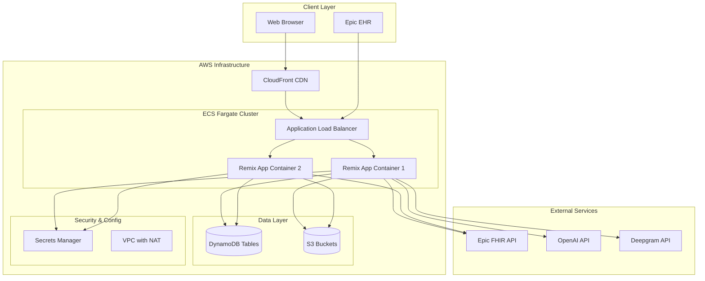
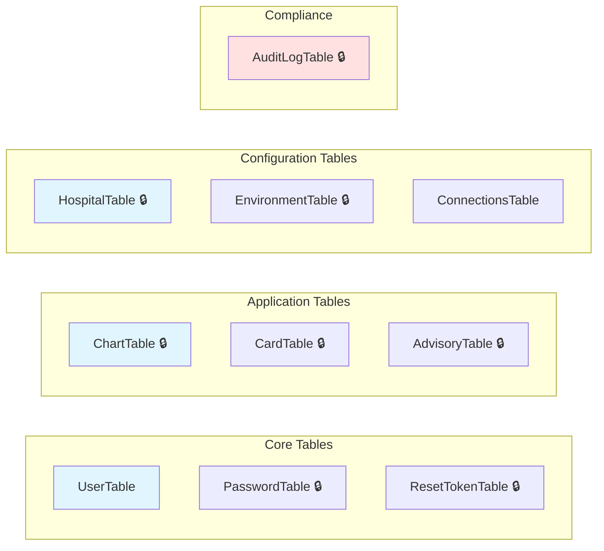
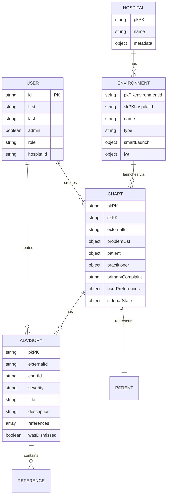
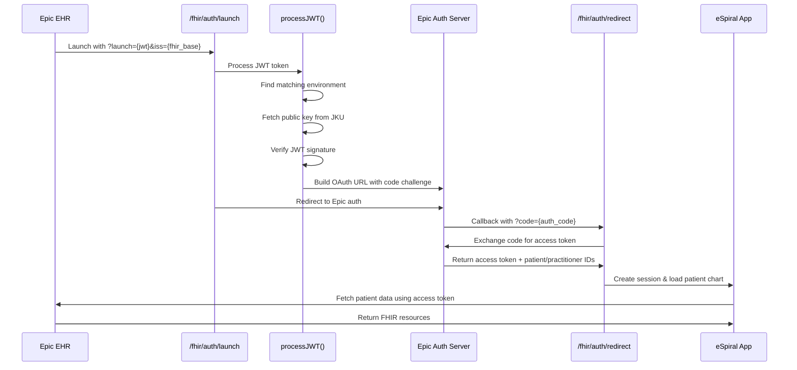
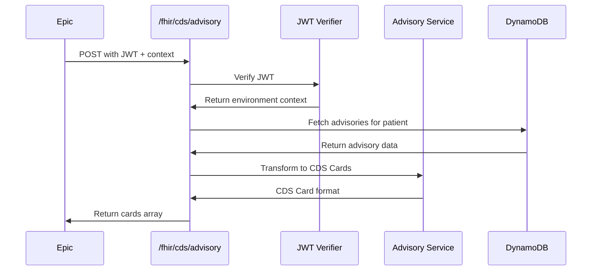
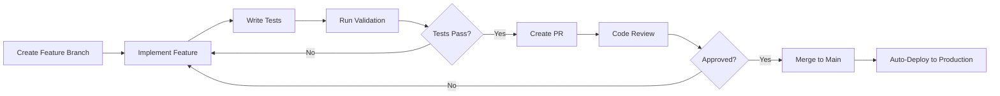
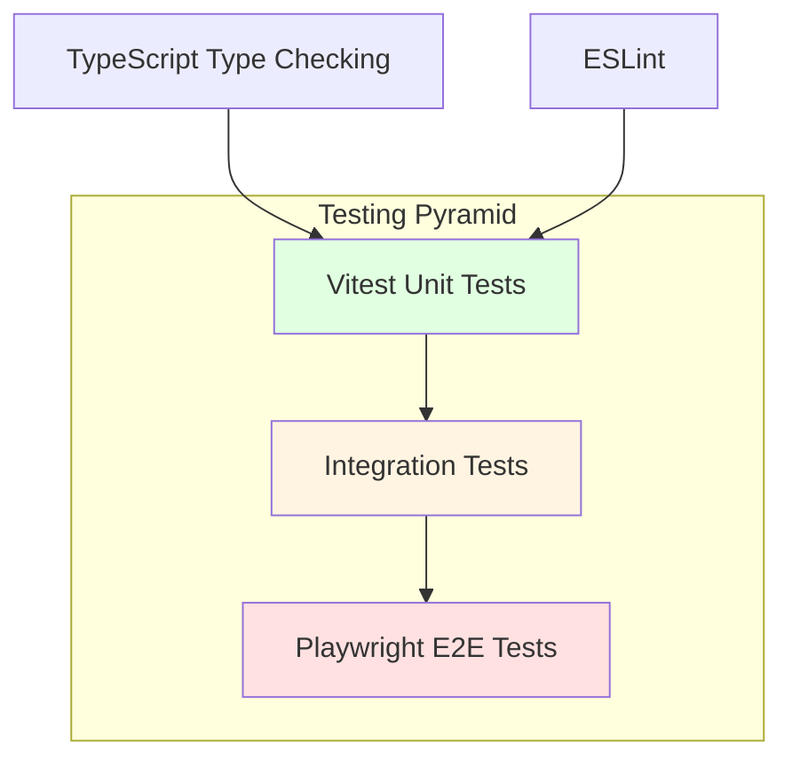
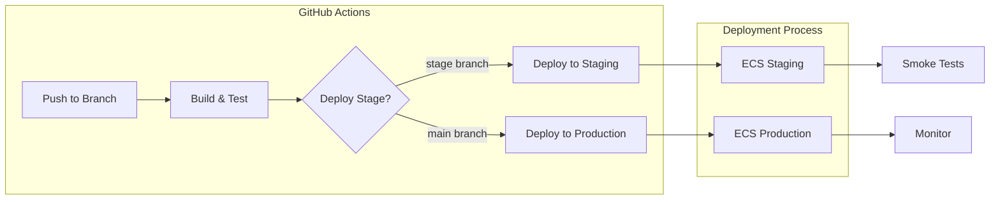

Focus: No
Preview Environment: staging.espiral.healthcare
Project Hub: eSpiral Health (https://www.notion.so/eSpiral-Health-000f4e4b5e3a4aa586f9d5ba0ced0fc6?pvs=21) 
Stack: CDS  Hooks, FHIR, d3, dynamo, fargate, radix, remix, shadcn, sst
Type: Retainer
# Engineering Onboarding

Welcome to the eSpiral Healthcare engineering team! This document will help you understand our system architecture, development workflows, and get you up and running.

## Table of Contents

1. [Project Overview](about:blank#project-overview)
2. [System Architecture](about:blank#system-architecture)
3. [Getting Started](about:blank#getting-started)
4. [Codebase Structure](about:blank#codebase-structure)
5. [Key Technologies](about:blank#key-technologies)
6. [Data Models](about:blank#data-models)
7. [Authentication & Authorization](about:blank#authentication--authorization)
8. [FHIR Integration](about:blank#fhir-integration)
9. [Development Workflows](about:blank#development-workflows)
10. [Testing](about:blank#testing)
11. [Deployment](about:blank#deployment)
12. [Common Tasks](about:blank#common-tasks)

---

## Project Overview

eSpiral Healthcare is a visualization tool designed for pre-visit chart reviews in healthcare settings. It helps clinicians review patient medical history and serves as a medium for team-based learning in residency programs.

### Key Features

- **Spiral Visualization**: Visual representation of patient medical history over time
- **Advisory System**: AI-powered clinical advisories with image/audio support
- **FHIR Integration**: Epic EHR integration via SMART on FHIR
- **Multi-tenant**: Supports multiple hospitals and environments (production/sandbox)
- **Compliance-first**: HIPAA-compliant with comprehensive audit logging

---

## System Architecture

### High-Level Architecture



### Infrastructure Components

| Component | Purpose | Notes |
| --- | --- | --- |
| **ECS Fargate** | Containerized hosting | 2 vCPU, 4GB RAM per container |
| **Application Load Balancer** | Traffic distribution | Listens on port 80, forwards to 3000 |
| **DynamoDB** | NoSQL database | 10 tables, encryption at rest |
| **S3** | File storage | Media uploads, static assets |
| **CloudFront** | CDN | Global distribution |
| **VPC** | Network isolation | Managed NAT for internet access |
| **Secrets Manager** | Credential storage | API keys, client IDs |

### DynamoDB Tables



**🔒 = Encrypted at rest**

---

## Getting Started

### Prerequisites

- **Node.js**: v20 or higher
- **npm**: v10+
- **AWS CLI**: Configured with `espiral` profile
- **Docker** (optional, only for full SST dev mode)

### Initial Setup

1. **Clone the repository**
    
    ```bash
    git clone <repository-url>
    cd espiral.healthcare
    ```
    
2. **Install dependencies**
    
    ```bash
    npm i
    ```
    
3. **Fix SST platform binary** (Apple Silicon Macs)
    
    ```bash
    npm install --save-dev sst-darwin-arm64
    ```
    
4. **Set up environment variables**
    
    Create a `.env` file in the root directory:
    
    - Option A: Get values from AWS Secrets Manager (`eSpiralDev` secret)
    - Option B: Copy `.env.example` and ask a team member for values
5. **Configure AWS credentials**
    
    ```bash
    aws configure --profile espiral
    ```
    

### Running the Application

**Recommended for most development:**

```bash
npm start
```

- Runs local Express server
- Uses shared staging AWS resources
- Fast startup, no Docker required

**Full SST dev mode** (infrastructure testing only):

```bash
npm run dev:local    # Uses staging infrastructure
# OR
npm run dev          # Creates personal dev infrastructure
```

### Verify Setup

```bash
npm run validate
```

This runs tests, linting, type checking, and e2e tests.

---

## Codebase Structure

```
espiral.healthcare/
├── app/
│   ├── routes/               # Remix routes (pages + API endpoints)
│   │   ├── _index.tsx        # Landing page
│   │   ├── charts.tsx        # Chart viewer
│   │   ├── fhir.auth.*.tsx   # FHIR authentication
│   │   ├── api.*.ts          # API endpoints
│   │   └── admin.*.tsx       # Admin pages
│   │
│   ├── components/           # React components
│   │   ├── advisory/         # Advisory builder UI
│   │   ├── deepdive/         # Spiral chart visualization
│   │   │   ├── charts/       # D3-based chart components
│   │   │   ├── sidebar/      # Sidebar navigation
│   │   │   └── icons/        # ICD-10 letter icons
│   │   ├── base/             # Shared components
│   │   ├── ui/               # Base UI primitives
│   │   └── magicui/          # Animation components
│   │
│   ├── models/               # Data access layer
│   │   ├── user.server.ts
│   │   ├── chart.server.ts
│   │   ├── advisory.server.ts
│   │   ├── hospital.server.ts
│   │   └── environment.server.ts
│   │
│   ├── services/             # Business logic
│   │   ├── auth/jwt.server.ts
│   │   ├── audit.server.ts
│   │   ├── permissions.server.ts
│   │   └── phi/retention.server.ts
│   │
│   ├── utilities/            # Helper functions
│   │   ├── jwt.server.ts
│   │   ├── advisory-stream.server.ts
│   │   └── email.server.ts
│   │
│   ├── lib/                  # Core libraries
│   │   └── dynamodb.server.ts
│   │
│   ├── hooks/                # React hooks
│   ├── context/              # React context providers
│   └── types.ts              # TypeScript type definitions
│
├── public/                   # Static assets
├── scripts/                  # Utility scripts
├── tests/                    # Playwright e2e tests
├── docs/                     # Documentation site
├── sst.config.ts             # SST infrastructure config
├── server.ts                 # Express production server
├── vite.config.js            # Vite configuration
└── tailwind.config.ts        # Tailwind CSS config
```

---

## Key Technologies

### Frontend Stack

| Technology | Purpose |
| --- | --- |
| **Remix** | Full-stack React framework |
| **React** | UI library |
| **TypeScript** | Type safety |
| **Tailwind CSS** | Styling |
| **D3.js** | Data visualization (spiral charts) |
| **Framer Motion** | Animations |
| **Radix UI** | Accessible UI primitives |

### Backend Stack

| Technology | Purpose |
| --- | --- |
| **Remix (Node.js)** | Server-side rendering & API routes |
| **Express** | Production HTTP server |
| **AWS SDK** | AWS service integration |
| **jsonwebtoken** | JWT verification |
| **bcryptjs** | Password hashing |
| **OpenAI API** | AI-powered advisories |
| **Deepgram API** | Audio transcription |

### Infrastructure

| Technology | Purpose |
| --- | --- |
| **SST v3** | Infrastructure as Code |
| **ECS Fargate** | Container orchestration |
| **DynamoDB** | NoSQL database |
| **S3** | Object storage |
| **CloudFront** | CDN |
| **Secrets Manager** | Secure credential storage |

---

## Data Models

### Core Data Relationships



### Key Data Access Patterns

**Charts:**
- `ChartTable` uses composite key: `pk = chart#{externalId}`, `sk = {userId}`
- Each user gets their own instance of a chart (first-to-open ownership)
- Global Secondary Index (GSI) `byUser` for querying all charts by user

**Environments:**
- Multi-tenant configuration per hospital
- JWT settings (aud, iss, jku) stored per environment
- SMART launch configuration (client IDs, redirect URIs)

**Audit Logs:**
- Time-series data with TTL for auto-deletion
- GSI `byTimestamp` for time-based queries
- Compliance-focused event tracking

---

## Authentication & Authorization

### FHIR/SMART Authentication Flow



### JWT Verification Process

1. **Decode JWT** without verification to extract claims (`aud`, `iss`, `sub`)
2. **Find Environment** matching JWT claims in DynamoDB
3. **Fetch Public Key** from JKU endpoint (cached 5 minutes)
4. **Verify Signature** using RS256 algorithm
5. **Validate Claims** (audience, issuer, subject)
6. **Return Environment** context with verified payload

### User Roles & Permissions

```tsx
type UserRole = 'super_admin' | 'hospital_admin' | 'clinician' | 'readonly';

interface UserPermissions {
  canManageHospitals: boolean;
  canManageEnvironments: boolean;
  canManagePHI: boolean;
  canViewAuditLogs: boolean;
  canManageUsers: boolean;
  hospitalAccess?: string[]; // Scoped access
}
```

**Permission Levels:**
- `super_admin`: Full system access
- `hospital_admin`: Hospital-scoped management
- `clinician`: Patient chart access
- `readonly`: View-only access

---

## FHIR Integration

### Supported FHIR Resources

| Resource | Usage |
| --- | --- |
| **Patient** | Demographics, DOB, gender |
| **Practitioner** | Clinician information |
| **Condition** | Problem list (ICD-10 codes) |
| **Encounter** | Visit context |
| **Observation** | Clinical observations |

### CDS Hooks Implementation

The application implements the CDS Hooks standard for clinical decision support:

**Endpoint:** `/fhir/cds/advisory`

**Hook:** `patient-view`

**Response:** CDS Cards with clinical advisories



---

## Development Workflows

### Feature Development



### Local Development Loop

1. **Start dev server:** `npm start`
2. **Make changes** in `app/` directory
3. **Hot reload** automatically updates browser
4. **Test manually** in browser
5. **Run validation:** `npm run validate`
6. **Commit changes** when ready

### Working with DynamoDB

```tsx
import { dynamodb } from "~/lib/dynamodb.server";

// Query
const result = await dynamodb.query("chart", {
  KeyConditionExpression: "pk = :pk",
  ExpressionAttributeValues: { ":pk": chartId },
});

// Get
const chart = await dynamodb.get("chart", { pk: chartId, sk: userId });

// Put
await dynamodb.put("chart", { pk: chartId, sk: userId, data: chartData });

// Delete
await dynamodb.delete("chart", { pk: chartId, sk: userId });
```

### API Development

**API routes** are in `app/routes/api.*.ts`:

```tsx
// app/routes/api.example.ts
import type { ActionFunction } from "@remix-run/node";
import { json } from "@remix-run/node";

export const action: ActionFunction = async ({ request }) => {
  // Handle POST/PUT/DELETE
  const data = await request.json();
  // ... process data
  return json({ success: true });
};
```

---

## Testing

### Test Stack



### Running Tests

```bash
# Run all validations
npm run validate

# Unit tests (Vitest)
npm run test

# E2E tests (Playwright)
npm run test:e2e          # Headless CI mode
npm run test:e2e:ui       # Interactive UI mode
npm run test:e2e:debug    # Debug mode

# Type checking
npm run typecheck

# Linting
npm run lint
npm run lint -- --fix     # Auto-fix issues

# Formatting
npm run format
```

### Writing Tests

**Vitest (Unit/Integration):**

```tsx
import { expect, test } from 'vitest';

test('should transform chart data', () => {
  const result = transformChartItem(mockData);
  expect(result.problemList).toBeInstanceOf(Array);
});
```

**Playwright (E2E):**

```tsx
import { test, expect } from '@playwright/test';

test('user can view chart', async ({ page }) => {
  await page.goto('/charts');
  await expect(page.getByRole('heading')).toContainText('Charts');
});
```

---

## Deployment

### CI/CD Pipeline



### Deployment Commands

**Staging:**

```bash
npx sst deploy --stage staging
```

**Production:**

```bash
npx sst deploy --stage production
```

**Remove a stage:**

```bash
npx sst remove --stage <stage-name>
```

### Environment Variables

**Managed in SST:**
- `SST_STAGE`: Current deployment stage
- `NODE_ENV`: Production/development mode

**Managed in Secrets Manager:**
- `DeepgramApiKey`: Audio transcription
- `OpenAIApiKey`: AI advisories
- `SessionSecret`: Session encryption
- `EpicClientIdProduction`: Epic OAuth client ID (prod)
- `EpicClientIdNonProduction`: Epic OAuth client ID (sandbox)
- `RedirectUri`: OAuth redirect endpoint

### Deployment Architecture

**Production Domain:** `espiral.healthcare`
- CloudFront: `d2z23u3ltafva9.cloudfront.net`
- ALB: Managed by SST
- ECS: Auto-scaling 1-4 containers

**Staging Domain:** `staging.espiral.healthcare`
- Separate ECS cluster
- Shared DynamoDB tables (with stage prefixes)

---

## Common Tasks

### Adding a New DynamoDB Table

1. **Update `sst.config.ts`:**
    
    ```tsx
    const newTable = new sst.aws.Dynamo("NewTable", {
      fields: { pk: "string" },
      primaryIndex: { hashKey: "pk" },
      transform: {
        table: {
          serverSideEncryption: { enabled: true },
        },
      },
    });
    ```
    
2. **Link to service:**
    
    ```tsx
    link: [...existingTables, newTable]
    ```
    
3. **Update `app/lib/dynamodb.server.ts`:**
    
    ```tsx
    const TABLE_MAP = {
      // ... existing tables
      newTable: Resource.NewTable.name,
    };
    ```
    

### Creating a New Admin Page

1. **Create route:** `app/routes/admin.feature.tsx`
2. **Add admin check:**
    
    ```tsx
    export const loader: LoaderFunction = async ({ request }) => {
      const user = await requireAdmin(request);
      // ... load data
    };
    ```
    
3. **Implement UI** using existing components

### Adding a FHIR Resource Type

1. **Update FHIR fetch utility** in `app/utilities/fhir.server.ts`
2. **Add type definition** in `app/types.ts`
3. **Update chart model** to store new resource
4. **Add visualization** component if needed

### Debugging JWT Issues

```bash
# Test JWT endpoint
curl -X GET "https://staging.espiral.healthcare/admin/environments/test-jwt?environmentId=<id>"

# View JWT structure
# Decode at jwt.io or use:
node -e "console.log(JSON.stringify(require('jsonwebtoken').decode(process.argv[1], {complete: true}), null, 2))" "<jwt-token>"
```

### Viewing Audit Logs

Navigate to: `/admin/audit/logs`

**Features:**
- Filter by event type
- Time range selection
- Export to CSV
- PHI access tracking

---

## Additional Resources

### Documentation

- [CLAUDE.md](./CLAUDE.md) - Claude Code instructions
- [README.md](./README.md) - Quick start guide
- [SST_MIGRATION_PLAN.md](./SST_MIGRATION_PLAN.md) - Infrastructure migration notes
- [SECURITY.md](./SECURITY.md) - Security guidelines
- [docs/](./docs/) - Full documentation site

### External Documentation

- [Remix Documentation](https://remix.run/docs)
- [SST v3 Documentation](https://sst.dev/docs)
- [Epic FHIR API](https://fhir.epic.com/)
- [CDS Hooks Specification](https://cds-hooks.org/)
- [SMART on FHIR](https://docs.smarthealthit.org/)

### Getting Help

- **GitHub Issues**: Report bugs or request features
- **Team Chat**: Ask questions in Slack/Teams
- **Code Review**: Request reviews on PRs
- **Pair Programming**: Schedule sessions with teammates

---

## Appendix: Key File Reference

| File | Purpose |
| --- | --- |
| `sst.config.ts` | Infrastructure definition |
| `server.ts` | Production Express server |
| `app/lib/dynamodb.server.ts` | DynamoDB abstraction layer |
| `app/models/chart.server.ts` | Chart data access |
| `app/services/auth/jwt.server.ts` | JWT verification |
| `app/routes/fhir.auth.launch.tsx` | FHIR SMART launch |
| `app/routes/fhir.cds.advisory.tsx` | CDS Hooks endpoint |
| `app/components/deepdive/charts/SpiralChart.tsx` | Main visualization |

---

**Welcome to the team!** 🎉

If you have questions or suggestions for this document, please submit a PR or open an issue.