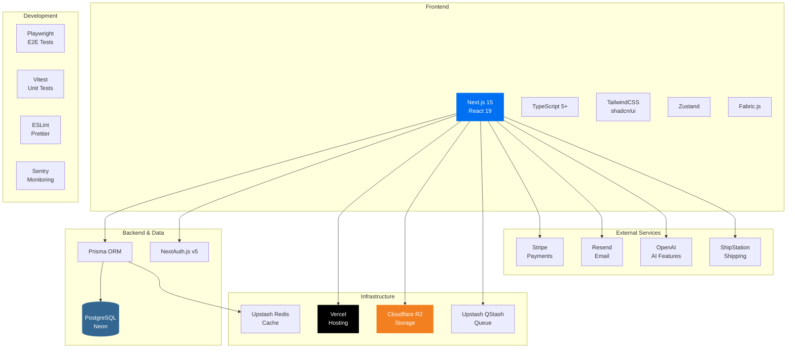
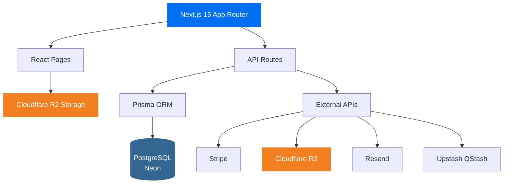
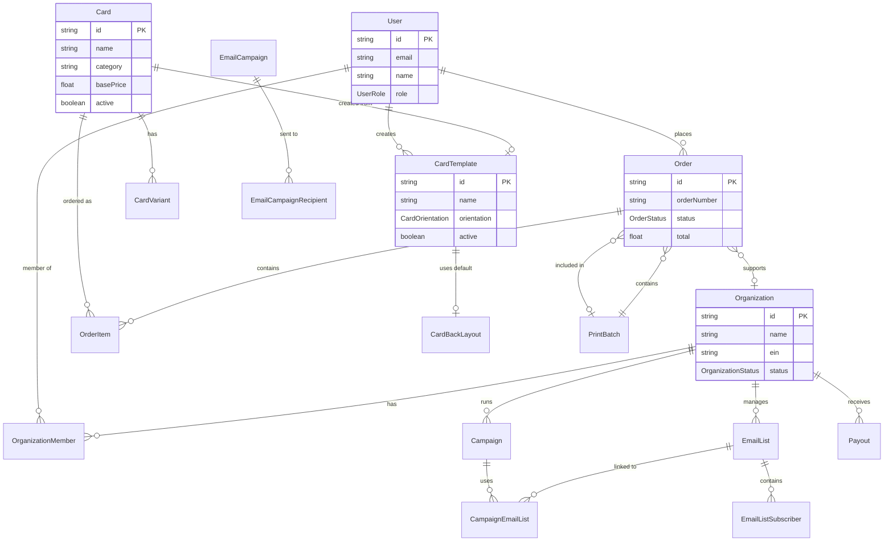
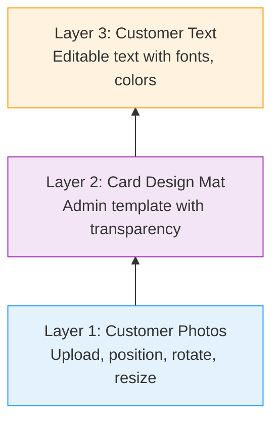

Focus: No
Preview Environment: dev.givingprints.com
Project Hub: Giving Prints (https://www.notion.so/Giving-Prints-252f3cf2487f809d8019cc4d7d0f3b9c?pvs=21) 
Stack: NextJS, Postgres, reSend, shadcn
Type: Equity

# Engineer Onboarding Guide

> Welcome to GivingPrints! This document will help you get up to speed with our codebase, architecture, and development practices.


**Last Updated**: January 2026
**Project Status**: 🚀 Production Ready
**Build Status**: ✅ Passing (260+ E2E tests)
**Codebase Size**: ~493 TypeScript files

---

## Table of Contents

1. [Project Overview](about:blank#project-overview)
2. [Technical Stack](about:blank#technical-stack)
3. [Getting Started](about:blank#getting-started)
4. [Architecture & Project Structure](about:blank#architecture--project-structure)
5. [Database Schema](about:blank#database-schema)
6. [API Architecture](about:blank#api-architecture)
7. [Key Features & Components](about:blank#key-features--components)
8. [Development Workflow](about:blank#development-workflow)
9. [Testing Strategy](about:blank#testing-strategy)
10. [Deployment & Infrastructure](about:blank#deployment--infrastructure)
11. [Common Tasks](about:blank#common-tasks)
12. [Troubleshooting](about:blank#troubleshooting)
13. [Additional Resources](about:blank#additional-resources)

---

## Project Overview

### What is GivingPrints?

GivingPrints is a modern e-commerce platform for premium holiday greeting cards with an integrated charity donation model. We’re building a mobile-first, streamlined alternative to Shutterfly/Minted that focuses on quality over quantity and social impact.

### Core Value Proposition

- **Curated Design**: Fewer, higher-quality card options with admin template system
- **Premium Quality**: Single paper option, 5x7 format (portrait & landscape)
- **100% Profit to Nonprofits**: ALL profits donated to customer-selected charities
- **Simplified Pricing**: Transparent pricing model
- **Mobile-First**: Clean, intuitive mobile experience
- **AI-Enhanced**: 20+ AI endpoints for image enhancement and quality optimization
- **Nonprofit Empowerment**: Full self-service portal for nonprofit organizations

### Business Model

**Entity Structure**: Single for-profit entity (GivingPrints LLC)

**Profit Distribution** ✅ IMPLEMENTED
- **100% of profits** distributed to customer-selected charities
- Quarterly calculations and payouts (Q1, Q2, Q3, Q4)
- Automated payout tracking via Payout model
- Stripe Connect integration for direct nonprofit payouts

**Revenue Model**

```
Card Sale: $5.00
- Production Cost: $1.50
- Shipping: $1.00
- Platform Costs: $0.50
= Profit: $2.00

100% Profit Model:
- Charity/Nonprofit: $2.00 (100% of profit)
- Platform Fee: Covered by sales volume
```

### Key Differentiators

**vs. Postable** (Closest Competitor)
- **Business Model**: Postable = full-service mailing ($1.95-2.90/card), GivingPrints = customer mails ($4.49-5.99/card bulk)
- **Social Impact**: 100% profit to charity vs. no charitable component
- **Pricing**: Bulk orders significantly cheaper (100 cards: $449 vs $190-290 for Postable)

**vs. Shutterfly/Minted**
- Mobile-first interface (60% mobile conversion target vs industry 30%)
- Curated designs (fewer, higher quality options)
- Integrated charity model (built-in social impact)

---

## Technical Stack

### Frontend

- **Framework**: Next.js 15 with App Router
- **Runtime**: React 19
- **Language**: TypeScript 5+ (strict mode enabled)
- **Styling**: TailwindCSS + shadcn/ui components
- **State Management**: Zustand for global state
- **Image Editing**: Fabric.js for in-card editing
- **File Uploads**: React Dropzone
- **Forms**: React Hook Form + Zod validation

### Backend & Infrastructure

- **Database**: PostgreSQL via Neon (serverless, edge-replicated)
- **ORM**: Prisma 6.14+ (type-safe database client)
- **Hosting**: Vercel (Next.js optimized, serverless functions)
- **Authentication**: NextAuth.js v5
- **Payment**: Stripe API v2025-08-27.basil + Shopify integration
- **Storage**: Cloudflare R2 + Images (60-80% cheaper than S3)
- **PDF Generation**: @react-pdf/renderer
- **Queue**: Upstash QStash (serverless message queue)
- **Email**: Resend
- **Cache**: Upstash Redis

### Development Tools

- **Linting**: ESLint with Next.js config + TypeScript rules
- **Formatting**: Prettier with Tailwind plugin
- **Pre-commit**: Husky + lint-staged
- **Testing**: Playwright (260+ E2E tests) + Vitest (unit tests)
- **Monitoring**: Vercel Analytics + Sentry
- **Analytics**: PostHog + Fathom (privacy-first)

### External Services

- **IRS EIN Verification**: For nonprofit validation
- **ShipStation**: Shipping label generation
- **Stripe Connect**: Direct nonprofit payouts
- **OpenAI**: AI-powered image enhancement (20+ endpoints)

### Technology Stack Diagram



---

## Getting Started

### Prerequisites

- Node.js 20+ (LTS)
- npm or yarn
- PostgreSQL (via Neon cloud or local)
- Git

### Initial Setup

1. **Clone the repository**
    
    ```bash
    cd givingprints/givingprints.com
    ```
    
2. **Install dependencies**
    
    ```bash
    npm install
    ```
    
3. **Set up environment variables**
    
    ```bash
    cp .env.example .env.local
    ```
    
    Fill in the required values (see [Environment Variables](about:blank#environment-variables) section)
    
4. **Set up the database**
    
    ```bash
    # Generate Prisma client
    npx prisma generate
    
    # Push schema to database (development)
    npx prisma db push
    
    # (Optional) Seed database with test data
    npm run db:seed
    ```
    
5. **Start development server**
    
    ```bash
    npm run dev
    ```
    
    Open [http://localhost:3000](http://localhost:3000/) in your browser
    

### Environment Variables

Key environment variables you’ll need to configure (see `.env.example` for complete list):

```
# Database - Neon PostgreSQL
DATABASE_URL="postgresql://..."
DIRECT_URL="postgresql://..."

# Authentication
NEXTAUTH_SECRET="..." # Generate with: openssl rand -base64 32
NEXTAUTH_URL="http://localhost:3000"

# Cloudflare R2 Storage
CLOUDFLARE_ACCOUNT_ID="..."
R2_ACCESS_KEY_ID="..."
R2_SECRET_ACCESS_KEY="..."
R2_BUCKET_NAME="givingprints-assets"

# Email (Resend)
RESEND_API_KEY="..."
RESEND_FROM_EMAIL="..."

# Payment (Stripe)
NEXT_PUBLIC_STRIPE_PUBLISHABLE_KEY="pk_test_..."
STRIPE_SECRET_KEY="sk_test_..."
STRIPE_WEBHOOK_SECRET="whsec_..."

# Queue (Upstash QStash)
QSTASH_TOKEN="..."
QSTASH_CURRENT_SIGNING_KEY="..."
QSTASH_NEXT_SIGNING_KEY="..."

# Analytics (Optional)
NEXT_PUBLIC_FATHOM_SITE_ID="..."
NEXT_PUBLIC_POSTHOG_KEY="..."
```

### Development Commands

```bash
# Development
npm run dev              # Start dev server with Turbopack
npm run lint             # Check linting
npm run lint:fix         # Fix linting issues
npm run format           # Format with Prettier
npm run format:check     # Check formatting
npm run type-check       # TypeScript type checking
npm run build            # Production build
npm run start            # Start production server

# Database
npm run db:generate      # Generate Prisma client
npm run db:push          # Push schema to database
npm run db:studio        # Open Prisma Studio (database GUI)
npm run db:seed          # Seed test data
npx prisma migrate dev   # Create migration (use sparingly)

# Testing
npm run test             # Run Vitest unit tests
npm run test:ui          # Vitest UI
npm run test:e2e         # Run Playwright E2E tests

# Documentation
npm run docs:dev         # Start Docusaurus docs server
npm run docs:build       # Build documentation
npm run docs:serve       # Serve built docs

# Scripts
npm run create-printer-users    # Create printer role users
npm run r2:upload-cards         # Upload cards to R2
npm run test:create-order       # Create test order
```

---

## Architecture & Project Structure

### High-Level Architecture



### Project Directory Structure

```
givingprints/
├── docs/                       # Docusaurus documentation site
├── figma-demo/                 # Design demos
└── givingprints.com/           # Main Next.js application
    ├── .next/                  # Next.js build output (gitignored)
    ├── prisma/
    │   ├── schema.prisma       # Database schema
    │   ├── seed.ts             # Database seeding
    │   └── migrations/         # Database migrations
    ├── public/                 # Static assets
    ├── src/
    │   ├── app/                # Next.js 15 App Router
    │   │   ├── (marketing)/    # Marketing pages (landing, about)
    │   │   ├── admin/          # Admin dashboard & management
    │   │   ├── api/            # API routes (100+ endpoints)
    │   │   ├── cards/          # Card browsing & catalog
    │   │   ├── cart/           # Shopping cart
    │   │   ├── checkout/       # Checkout flow
    │   │   ├── editor/         # Card customization editor
    │   │   ├── nonprofit/      # Nonprofit organization portal
    │   │   ├── orders/         # Order history & tracking
    │   │   └── printer/        # Printer fulfillment portal
    │   ├── components/         # React components
    │   │   ├── admin/          # Admin-specific components
    │   │   ├── cart/           # Cart components
    │   │   ├── charity/        # Charity selection
    │   │   ├── checkout/       # Checkout flow components
    │   │   ├── docs/           # Documentation components
    │   │   ├── editor/         # Card editor UI (31 files)
    │   │   ├── nonprofit/      # Nonprofit portal components
    │   │   └── ui/             # shadcn/ui components (24 files)
    │   ├── hooks/              # Custom React hooks
    │   ├── lib/                # Utility libraries & configs
    │   │   ├── analytics/      # Analytics integrations
    │   │   ├── api/            # API clients & helpers
    │   │   ├── auth.ts         # NextAuth configuration
    │   │   ├── config/         # App configuration
    │   │   ├── core/           # Core business logic
    │   │   ├── editor/         # Card editor utilities
    │   │   ├── email/          # Email templates & sending
    │   │   ├── features/       # Feature-specific logic
    │   │   ├── fulfillment.ts  # Order fulfillment logic
    │   │   ├── integrations/   # External service integrations
    │   │   ├── orders/         # Order processing
    │   │   ├── organizations/  # Nonprofit management
    │   │   ├── payments/       # Stripe & payment logic
    │   │   ├── pdf/            # PDF generation
    │   │   ├── prisma.ts       # Prisma client
    │   │   ├── qstash.ts       # Queue configuration
    │   │   ├── shipping/       # Shipping calculations
    │   │   ├── storage/        # R2 storage abstraction
    │   │   └── tax/            # Tax calculations
    │   ├── stores/             # Zustand state stores
    │   ├── styles/             # Global styles
    │   └── types/              # TypeScript type definitions
    ├── tests/                  # Playwright E2E tests
    ├── .env.example            # Environment variable template
    ├── .eslintrc.json          # ESLint configuration
    ├── .prettierrc             # Prettier configuration
    ├── next.config.ts          # Next.js configuration
    ├── package.json            # Dependencies & scripts
    ├── playwright.config.ts    # Playwright test config
    ├── tailwind.config.ts      # Tailwind CSS config
    ├── tsconfig.json           # TypeScript configuration
    └── vitest.config.ts        # Vitest test config
```

### Key File Locations

| Purpose | Location |
| --- | --- |
| Database schema | `prisma/schema.prisma` |
| API routes | `src/app/api/` |
| Authentication | `src/lib/auth.ts` |
| Storage abstraction | `src/lib/storage/` |
| Stripe integration | `src/lib/payments/` |
| Email templates | `src/lib/email/` |
| Card editor | `src/components/editor/` |
| Admin components | `src/components/admin/` |
| UI components | `src/components/ui/` |
| Type definitions | `src/types/` |

---

## Database Schema

### Overview

The database uses PostgreSQL (via Neon) with Prisma ORM. The schema includes 40+ models covering:

- E-commerce (cards, orders, cart)
- Card templates & design system
- Nonprofit organization management
- Email marketing & campaigns
- Social media scheduling
- Print fulfillment & batching
- User management & authentication
- Stripe Connect payouts

### Entity Relationship Diagram



### Core Models

### E-Commerce Models

**Card** - Published card products

```
model Card {
  id            String   @id @default(cuid())
  name          String
  category      String
  basePrice     Float
  designData    Json     // Card design configuration
  active        Boolean  @default(true)
  description   String?

  // Template reference
  templateId    String?
  template      CardTemplate?

  // Inventory
  stockQuantity     Int @default(0)
  lowStockThreshold Int @default(10)
  trackInventory    Boolean @default(true)
  sku               String? @unique

  // Shopify integration
  shopifyProductId  String? @unique
  shopifyHandle     String?
  shopifySyncedAt   DateTime?

  // Relations
  variants        CardVariant[]
  orderItems      OrderItem[]
  inventoryLogs   InventoryLog[]
  supplierPricing SupplierPricing?
}
```

**Order** - Customer orders

```
model Order {
  id             String      @id @default(cuid())
  orderNumber    String      @unique
  customerEmail  String
  charityId      String?
  subtotal       Float
  taxAmount      Float
  shippingCost   Float
  discountAmount Float @default(0)
  total          Float
  status         OrderStatus @default(PENDING)
  priority       OrderPriority @default(STANDARD)

  // Payment fields
  stripePaymentId  String?
  stripeTransferId String?
  platformFee      Float @default(0)
  supplierCost     Float @default(0)
  charityAmount    Float @default(0)

  // Shipping fields
  shipengineShipmentId String?
  shipengineRateId     String?
  shippingCarrier      String?
  trackingNumber       String?

  // Relations
  items          OrderItem[]
  charity        Charity?
  organization   Organization?
  user           User?
  batch          PrintBatch?
  donations      CharityDonation[]
}

enum OrderStatus {
  PENDING
  PAID
  AWAITING_FULFILLMENT
  IN_PRODUCTION
  QUALITY_CHECK
  READY_TO_SHIP
  SHIPPED
  DELIVERED
  CANCELLED
  REFUNDED
  FAILED
}
```

### Card Template System

**CardTemplate** - Admin-created reusable designs

```
model CardTemplate {
  id          String  @id @default(cuid())
  name        String
  category    String  // "Holiday", "Birthday", etc.
  description String?
  orientation CardOrientation @default(PORTRAIT)

  // Design Assets
  designMatUrl        String  // 2300×3100 PNG
  thumbnailUrl        String  // 400×560 preview
  galleryThumbnailUrl String?
  sampleCardImageUrl  String?

  // Template Zones
  photoBoxes Json  // PhotoBox[] - suggested placements
  textBoxes  Json  // TextBox[] - suggested text areas

  // Back Card Defaults
  defaultBackgroundColor String @default("#FFFFFF")
  defaultTextColor       String @default("#000000")
  defaultFontFamily      String @default("Arial")
  defaultFontSize        Int @default(24)
  defaultBackLayoutId    String?
  defaultBackLayout      CardBackLayout?

  // Font Configuration
  allowedFonts String[] @default([...])

  // Status
  active   Boolean @default(false)
  featured Boolean @default(false)

  // Relations
  cards Card[]
}

enum CardOrientation {
  PORTRAIT   // 2300×3100 (5×7 vertical)
  LANDSCAPE  // 3100×2300 (7×5 horizontal)
}
```

**CardBackLayout** - Predefined photo/text arrangements (20 templates)

```
model CardBackLayout {
  id             String @id @default(cuid())
  templateId     Int    // 0-19 from CSV
  orientation    CardOrientation
  description    String
  backgroundType String // "Design Pattern" or "Default color"

  // Textbox Configuration
  hasTextbox    Boolean @default(false)
  textboxWidth  Int?
  textboxHeight Int?
  textboxX      Int?
  textboxY      Int?

  // Photo Boxes (JSON array)
  photoBoxes   Json  // {width, height, x, y}[]
  thumbnailUrl String?
}
```

### Nonprofit Organization System

**Organization** - Nonprofit organizations

```
model Organization {
  id               String @id @default(cuid())
  name             String
  ein              String @unique  // Tax ID
  missionStatement String?
  website          String?
  status           OrganizationStatus @default(PENDING)

  // Contact
  contactEmail String
  contactPhone String?

  // Stripe Connect
  stripeAccountId        String? @unique
  stripeOnboardingStatus String? @default("not_started")

  // Relations
  members        OrganizationMember[]
  campaigns      Campaign[]
  orders         Order[]
  payouts        Payout[]
  emailLists     EmailList[]
  socialPosts    SocialPost[]
}

enum OrganizationStatus {
  PENDING    // Awaiting admin approval
  APPROVED   // Active nonprofit
  REJECTED   // Application rejected
  SUSPENDED  // Temporarily suspended
}
```

**OrganizationMember** - Team member management

```
model OrganizationMember {
  id             String @id @default(cuid())
  organizationId String
  userId         String
  role           OrganizationRole

  organization Organization @relation(fields: [organizationId], references: [id])
  user         User @relation(fields: [userId], references: [id])
}

enum OrganizationRole {
  ADMIN    // Full access
  MANAGER  // Manage campaigns, view reports
  MEMBER   // Create content
  VIEWER   // View-only access
}
```

### Email Marketing System

**EmailList** - Subscriber list management

```
model EmailList {
  id             String @id @default(cuid())
  name           String
  description    String?
  organizationId String?

  // Metrics
  subscriberCount Int @default(0)
  activeCount     Int @default(0)

  // Relations
  subscribers EmailListSubscriber[]
  campaigns   CampaignEmailList[]
}
```

**EmailCampaign** - Email campaign creation

```
model EmailCampaign {
  id          String @id @default(cuid())
  name        String
  subject     String
  htmlContent String  // Email HTML
  textContent String? // Plain text fallback

  // Scheduling
  status        CampaignStatus @default(DRAFT)
  scheduledAt   DateTime?
  sentAt        DateTime?

  // Metrics
  totalRecipients Int @default(0)
  sentCount       Int @default(0)
  openedCount     Int @default(0)
  clickedCount    Int @default(0)
  bouncedCount    Int @default(0)

  // Relations
  recipients EmailCampaignRecipient[]
}

enum CampaignStatus {
  DRAFT
  SCHEDULED
  SENDING
  SENT
  CANCELLED
}
```

### Print Fulfillment System

**PrintBatch** - Batch order management

```
model PrintBatch {
  id          String @id @default(cuid())
  batchNumber String @unique
  status      BatchStatus @default(PENDING)

  // Supplier Cost Tracking
  totalSupplierCost Float @default(0)
  supplierPaidAt    DateTime?

  // Processing
  createdAt    DateTime @default(now())
  processedAt  DateTime?
  downloadedAt DateTime?

  // Relations
  orders Order[]
}

enum BatchStatus {
  PENDING      // Created but not processed
  PROCESSING   // Generating batch files
  READY        // Ready for download
  DOWNLOADED   // Printer downloaded
  COMPLETED    // All orders shipped
  CANCELLED    // Batch cancelled
}
```

### User Roles & Permissions

```
enum UserRole {
  CUSTOMER           // Regular customer
  CHARITY_ADMIN      // Legacy charity admin
  NONPROFIT_ADMIN    // Organization admin (full access)
  NONPROFIT_MEMBER   // Organization member (limited access)
  PRINTER            // Print fulfillment access
  ADMIN              // Platform admin
  SUPER_ADMIN        // Full platform access
}
```

### Database Commands

```bash
# Open Prisma Studio (GUI)
npx prisma studio

# Generate Prisma client (after schema changes)
npx prisma generate

# Push schema to database (development)
npx prisma db push

# Create migration (production)
npx prisma migrate dev --name migration_name

# Reset database (WARNING: deletes all data)
npx prisma migrate reset

# Seed database
npm run db:seed
npm run db:seed:production
npm run db:seed:all
```

---

## API Architecture

### Overview

The application has **100+ API routes** organized by feature area. All routes use Next.js 15 App Router conventions (`route.ts` files).

### API Route Categories

```
src/app/api/
├── ai/                  # 20+ AI-powered endpoints
│   ├── enhance-image/
│   ├── remove-background/
│   ├── smart-crop/
│   ├── super-resolution/
│   ├── style-transfer/
│   ├── detect-faces/
│   ├── color-harmony/
│   ├── print-optimization/
│   └── ...
├── admin/               # 40+ admin management endpoints
│   ├── users/
│   ├── orders/
│   ├── organizations/
│   ├── batches/
│   ├── analytics/
│   ├── reports/
│   ├── templates/
│   ├── campaigns/
│   └── ...
├── nonprofit/           # 15+ nonprofit portal endpoints
│   ├── banking/
│   ├── campaigns/
│   ├── members/
│   └── ...
├── notifications/       # 18 notification endpoints
│   ├── email/
│   ├── sms/
│   ├── push/
│   └── preferences/
├── reports/             # 12 reporting endpoints
│   ├── orders/
│   ├── financial/
│   ├── charity-donations/
│   └── comparison/
├── suppliers/           # 8 supplier management endpoints
├── cards/               # Card catalog endpoints
├── orders/              # Order management
├── checkout/            # Checkout flow
├── cart/                # Shopping cart
├── auth/                # Authentication (NextAuth)
├── webhooks/            # Stripe, ShipStation webhooks
├── jobs/                # Background jobs (QStash)
└── images/              # Image delivery (R2/Cloudflare)
```

### API Standards

### Authentication

All protected routes use NextAuth.js session validation:

```tsx
import { auth } from '@/lib/auth';
import { NextResponse } from 'next/server';

export async function GET(request: Request) {
  const session = await auth();

  if (!session) {
    return NextResponse.json(
      { error: 'Unauthorized' },
      { status: 401 }
    );
  }

  // Route logic...
}
```

### Role-Based Access Control

```tsx
import { requireRole } from '@/lib/auth-helpers';

export async function POST(request: Request) {
  const session = await requireRole(['ADMIN', 'SUPER_ADMIN']);

  // Only ADMIN or SUPER_ADMIN can access this route
}
```

### Validation

All endpoints use Zod for request validation:

```tsx
import { z } from 'zod';

const createOrderSchema = z.object({
  cardId: z.string().cuid(),
  quantity: z.number().min(1).max(500),
  charityId: z.string().cuid(),
  customization: z.object({
    photos: z.array(z.object({
      url: z.string().url(),
      position: z.object({ x: z.number(), y: z.number() }),
    })),
    text: z.string().optional(),
  }),
});

const body = await request.json();
const validated = createOrderSchema.parse(body); // Throws if invalid
```

### Error Handling

Standardized error responses:

```tsx
// 400: Bad Request (validation errors)
return NextResponse.json(
  { error: 'Invalid request', details: validationErrors },
  { status: 400 }
);

// 401: Unauthorized (auth required)
return NextResponse.json(
  { error: 'Unauthorized', code: 'AUTH_REQUIRED' },
  { status: 401 }
);

// 403: Forbidden (insufficient permissions)
return NextResponse.json(
  { error: 'Forbidden', code: 'INSUFFICIENT_PERMISSIONS' },
  { status: 403 }
);

// 404: Not Found
return NextResponse.json(
  { error: 'Not found' },
  { status: 404 }
);

// 500: Internal Server Error (logged to Sentry)
return NextResponse.json(
  { error: 'Internal server error' },
  { status: 500 }
);
```

### Pagination

Cursor-based pagination with limit/offset:

```tsx
GET /api/orders?limit=50&offset=0&cursor=clx123...

Response:
{
  data: Order[],
  pagination: {
    total: 1250,
    limit: 50,
    offset: 0,
    hasMore: true,
    nextCursor: 'clx456...'
  }
}
```

### Testing

Development testing header for bypassing auth:

```tsx
// Only works in development
headers: { 'x-test-admin': 'true' }
```

---

## Key Features & Components

### 1. Card Editor System

**Location**: `src/components/editor/`

The card editor is a sophisticated 3-layer system for customer card customization.

**Architecture**:



**Key Components**:
- `FabricEditor.tsx` - Core Fabric.js integration
- `PhotoUploader.tsx` - Drag-and-drop photo upload
- `TextEditor.tsx` - Text customization UI
- `BackLayoutSelector.tsx` - Choose back card layout
- `CardPreview.tsx` - Real-time preview with safe zones

**Print Specifications**:
- **Resolution**: 400 DPI (scalable to 600 DPI)
- **Card Size**: 5” × 7” = 2000px × 2800px at 400 DPI
- **Bleed Area**: 1/8” per side = 50px
- **Crop Marks**: 100px space
- **Total Dimensions**: 2300px × 3100px (portrait)

### 2. Admin Portal

**Location**: `src/app/admin/` & `src/components/admin/`

Comprehensive admin dashboard with full CRUD operations.

**Key Features**:
- User management (create, edit, delete, role assignment)
- Order management (view, filter, bulk actions)
- Nonprofit approval workflow
- Template designer with live preview
- Batch processing & fulfillment
- Financial reports with P&L analysis
- Analytics dashboard
- Audit logging

**Admin Roles**:
- `ADMIN` - Full platform access
- `SUPER_ADMIN` - Everything + system settings

### 3. Nonprofit Organization Portal

**Location**: `src/app/nonprofit/`

Self-service portal for nonprofit organizations.

**Features**:
- **Application Portal** (`/apply-nonprofit`) - EIN verification, 501(c)(3) validation
- **Campaign Management** - Create fundraising campaigns with goals
- **Email Marketing** - List management, campaign creation, analytics
- **Social Media** - Multi-platform post scheduling
- **Team Management** - Invite members with role-based permissions
- **Stripe Connect** - Direct payout onboarding
- **Analytics** - Campaign performance, donation tracking

**Organization Roles**:
- `ADMIN` - Full organization access
- `MANAGER` - Manage campaigns, view reports
- `MEMBER` - Create content
- `VIEWER` - View-only access

### 4. Printer Fulfillment Portal

**Location**: `src/app/printer/` (planned)

Portal for print suppliers to manage order fulfillment.

**Features** (In Progress):
- Dashboard with metrics (Awaiting Fulfillment, In Production, Completed)
- Batch download system (ZIP with manifest CSV)
- Order detail view with all print files
- Status update workflow
- Quality control checklist
- Tracking number management

**Order Fulfillment Flow**:

```mermaid
flowchart LR
    A[Customer Order] --> B[Payment]
    B --> C[Print Files Generated]
    C --> D[R2 Storage]
    D --> E[Batch Created]
    E --> F[Printer Downloads]
    F --> G[Production]
    G --> H[Quality Check]
    H --> I[Shipping]
    I --> J[Tracking Updated]
    J --> K[Delivered]

    style A fill:#e3f2fd,stroke:#2196f3
    style B fill:#c8e6c9,stroke:#4caf50
    style K fill:#c8e6c9,stroke:#4caf50
```



### 5. AI-Powered Image Enhancement

**Location**: `src/app/api/ai/`

20+ AI endpoints for image processing and optimization.

**Available Endpoints**:
- `/api/ai/enhance-image` - General image enhancement
- `/api/ai/remove-background` - Background removal
- `/api/ai/smart-crop` - Intelligent cropping
- `/api/ai/super-resolution` - Image upscaling
- `/api/ai/style-transfer` - Artistic style application
- `/api/ai/detect-faces` - Face detection
- `/api/ai/color-harmony` - Color palette suggestions
- `/api/ai/photo-placement` - Optimal photo layout
- `/api/ai/composition-analysis` - Composition feedback
- `/api/ai/print-optimization` - Print quality optimization
- `/api/ai/accessibility-check` - Accessibility validation

### 6. Email Marketing System

**Location**: `src/lib/email/`

Complete email marketing platform for nonprofits.

**Features**:
- Email list management with subscriber tracking
- Campaign creation with scheduling
- HTML & plain text email templates
- Recipient-level tracking (opens, clicks, bounces)
- Performance analytics
- A/B testing support (future)

**Email Templates**:
- Order confirmations
- Shipping notifications
- Campaign emails
- Nonprofit invitations
- Password reset
- Welcome emails

### 7. Storage System (Cloudflare R2)

**Location**: `src/lib/storage/`

Abstracted storage layer supporting multiple providers.

**Key Features**:
- 99.7% cost savings vs AWS S3
- Automatic image optimization via Cloudflare Images
- Presigned URL generation for secure uploads
- Image variants (thumbnail, preview, full-size, social)
- R2 bucket organization by order number

**Storage Provider Interface**:

```tsx
interface StorageProvider {
  uploadFile(params: UploadParams): Promise<UploadResult>;
  getFileUrl(key: string): Promise<string>;
  deleteFile(key: string): Promise<void>;
  listFiles(prefix: string): Promise<FileList>;
}
```

**Image Variants**:

```tsx
const variants = {
  thumbnail: 'w=150,h=150,fit=cover',
  cardPreview: 'w=400,h=560,fit=cover',  // 5x7 aspect
  fullSize: 'w=1500,h=2100,fit=cover',   // Print quality
  social: 'w=1200,h=630,fit=cover'       // Social sharing
};
```

### 8. Payment System (Stripe)

**Location**: `src/lib/payments/`

Stripe integration for payments and nonprofit payouts.

**Features**:
- Checkout session creation
- Webhook handling (payment success, failures)
- Stripe Connect for nonprofit payouts
- Payment intent tracking
- Refund processing
- Subscription management (future)

**Stripe API Version**: `2025-08-27.basil`

---

## Development Workflow

### Code Quality Standards

**TypeScript**:

```json
{
  "strict": true,
  "noUnusedLocals": true,
  "noUnusedParameters": true,
  "noImplicitReturns": true,
  "noUncheckedIndexedAccess": true
}
```

**ESLint + Prettier**:
- Next.js config with TypeScript support
- Automatic import sorting
- Tailwind class sorting via prettier-plugin-tailwindcss
- Pre-commit hooks with Husky

### Git Workflow

1. **Create feature branch**
    
    ```bash
    git checkout -b feature/your-feature-name
    ```
    
2. **Make changes & commit**
    
    ```bash
    git add .
    git commit -m "feat: add new feature"
    ```
    
    **Commit Message Format**:
    
    - `feat:` - New feature
    - `fix:` - Bug fix
    - `docs:` - Documentation changes
    - `style:` - Code style changes (formatting)
    - `refactor:` - Code refactoring
    - `test:` - Test changes
    - `chore:` - Build/config changes
3. **Push & create PR**
    
    ```bash
    git push origin feature/your-feature-name
    ```
    
4. **Code review & merge**
    - At least one approval required
    - All tests must pass
    - No merge conflicts

### Pre-Commit Hooks

Husky runs these checks before every commit:

```bash
# Lint staged files
npm run lint:fix

# Format staged files
npm run format

# Type check
npm run type-check
```

### Component Development Pattern

**Recommended pattern for React components**:

```tsx
// Use arrow functions, explicit types, composition
interface CardEditorProps {
  card: Card;
  onUpdate: (updates: CardUpdate) => void;
  className?: string;
}

export const CardEditor = ({
  card,
  onUpdate,
  className
}: CardEditorProps) => {
  const [isEditing, setIsEditing] = useState(false);

  return (
    <div className={cn('card-editor', className)}>
      <CardPreview card={card} />
      <PhotoUploader onUpload={(photos) => onUpdate({ photos })} />
      <TextEditor onTextChange={(text) => onUpdate({ text })} />
    </div>
  );
};
```

### State Management

**Zustand** for global state:

```tsx
// src/stores/useCartStore.ts
import { create } from 'zustand';

interface CartStore {
  items: CartItem[];
  addItem: (item: CartItem) => void;
  removeItem: (id: string) => void;
  clearCart: () => void;
}

export const useCartStore = create<CartStore>((set) => ({
  items: [],
  addItem: (item) => set((state) => ({
    items: [...state.items, item]
  })),
  removeItem: (id) => set((state) => ({
    items: state.items.filter((i) => i.id !== id)
  })),
  clearCart: () => set({ items: [] }),
}));
```

**Usage in components**:

```tsx
const { items, addItem } = useCartStore();
```

---

## Testing Strategy

### Testing Stack

- **E2E Tests**: Playwright (260+ tests)
- **Unit Tests**: Vitest + Testing Library
- **API Tests**: Playwright API testing
- **Component Tests**: Vitest + Testing Library

### Running Tests

```bash
# Unit tests
npm run test              # Run once
npm run test:ui           # Interactive UI

# E2E tests
npm run test:e2e          # Run all E2E tests
npx playwright test --ui  # Interactive mode
npx playwright test --headed  # Show browser
```

### Test Coverage

Current coverage (260+ E2E tests):
- ✅ User authentication flow
- ✅ Card browsing & filtering
- ✅ Cart operations
- ✅ Checkout flow (guest & authenticated)
- ✅ Order creation & tracking
- ✅ Admin user management
- ✅ Nonprofit application flow
- ✅ Email campaign creation
- ✅ Template designer
- ✅ Batch processing
- ✅ Stripe webhooks
- ✅ PDF generation

### Writing Tests

**Playwright E2E Test Example**:

```tsx
// tests/checkout.spec.ts
import { test, expect } from '@playwright/test';

test.describe('Checkout Flow', () => {
  test('should complete guest checkout', async ({ page }) => {
    // Navigate to card
    await page.goto('/cards/holiday-card-1');

    // Add to cart
    await page.click('button:has-text("Add to Cart")');

    // Go to checkout
    await page.goto('/checkout');

    // Fill shipping info
    await page.fill('input[name="email"]', 'test@example.com');
    await page.fill('input[name="name"]', 'John Doe');
    await page.fill('input[name="address"]', '123 Main St');

    // Select charity
    await page.selectOption('select[name="charity"]', 'charity-1');

    // Submit order
    await page.click('button:has-text("Place Order")');

    // Verify success
    await expect(page).toHaveURL(/\/orders\/GP-\d+/);
    await expect(page.locator('h1')).toContainText('Order Confirmed');
  });
});
```

**Vitest Unit Test Example**:

```tsx
// src/lib/pricing.test.ts
import { describe, it, expect } from 'vitest';
import { calculateOrderTotal } from './pricing';

describe('Pricing Engine', () => {
  it('should calculate correct total with shipping', () => {
    const result = calculateOrderTotal({
      subtotal: 50.00,
      shippingCost: 5.00,
      taxRate: 0.08,
      discountAmount: 0,
    });

    expect(result.total).toBe(59.00);  // 50 + 5 + (50 * 0.08)
    expect(result.taxAmount).toBe(4.00);
  });

  it('should apply discount correctly', () => {
    const result = calculateOrderTotal({
      subtotal: 100.00,
      shippingCost: 5.00,
      taxRate: 0.08,
      discountAmount: 20.00,
    });

    expect(result.subtotal).toBe(80.00);  // 100 - 20
  });
});
```

---

## Deployment & Infrastructure

### Hosting

**Vercel** (Next.js optimized):
- Edge runtime for API routes
- Automatic HTTPS
- Preview deployments for PRs
- Environment variable management
- Analytics & monitoring

### Database

**Neon PostgreSQL**:
- Serverless PostgreSQL
- Edge replicas for low latency
- Automatic backups
- Branch-based development databases

### Storage

**Cloudflare R2**:
- S3-compatible object storage
- 99.7% cheaper than AWS S3
- No egress fees
- Automatic CDN distribution

**Cloudflare Images**:
- On-the-fly image optimization
- Automatic WebP/AVIF conversion
- Lazy loading support
- Multiple variants per image

### Queue

**Upstash QStash**:
- Serverless message queue
- Automatic retries (5 attempts with exponential backoff)
- Dead letter queues for failed jobs
- At-least-once delivery guarantee

**Background Jobs**:

```tsx
import { qstash } from '@/lib/qstash';

await qstash.publishJSON({
  url: `${process.env.NEXTAUTH_URL}/api/jobs/generate-pdf`,
  body: { orderId, type: 'PDF_GENERATION' },
  delay: 30,      // Wait 30 seconds
  retries: 3,     // Retry 3 times on failure
});
```

### Monitoring

**Sentry**:
- Error tracking & logging
- Performance monitoring
- Release tracking
- User feedback

**Vercel Analytics**:
- Real-time traffic analytics
- Core Web Vitals
- Deployment metrics

**PostHog** (Optional):
- Product analytics
- Feature flags
- Session recording (disabled in dev)

### Deployment Process

1. **Automatic Deployments**
    - Push to `main` → Production deployment
    - Push to any branch → Preview deployment
2. **Manual Deployment**
    
    ```bash
    # Deploy to production
    vercel --prod
    
    # Deploy preview
    vercel
    ```
    
3. **Environment Variables**
    
    ```bash
    # List environment variables
    vercel env ls
    
    # Add environment variable
    vercel env add VARIABLE_NAME
    
    # Pull environment variables locally
    vercel env pull
    ```
    
4. **Database Migrations**
    
    ```bash
    # Generate migration
    npx prisma migrate dev --name migration_name
    
    # Deploy migration to production
    npx prisma migrate deploy
    ```
    

### Performance Optimization

**Next.js 15 Features**:
- Turbopack for faster builds
- Automatic code splitting
- Image optimization with `next/image`
- Font optimization with `next/font`
- Edge runtime for API routes

**Caching Strategy**:

```tsx
// Page caching
export const revalidate = 3600; // Revalidate every hour

// API route caching
return NextResponse.json(data, {
  headers: {
    'Cache-Control': 'public, s-maxage=3600, stale-while-revalidate=86400'
  }
});
```

---

## Common Tasks

### Adding a New API Route

1. Create route file:
    
    ```bash
    # Example: POST /api/cards
    touch src/app/api/cards/route.ts
    ```
    
2. Implement handler:
    
    ```tsx
    import { NextResponse } from 'next/server';
    import { z } from 'zod';
    import { auth } from '@/lib/auth';
    import { prisma } from '@/lib/prisma';
    
    const createCardSchema = z.object({
      name: z.string().min(1),
      category: z.string(),
      basePrice: z.number().min(0),
    });
    
    export async function POST(request: Request) {
      try {
        const session = await auth();
        if (!session) {
          return NextResponse.json(
            { error: 'Unauthorized' },
            { status: 401 }
          );
        }
    
        const body = await request.json();
        const validated = createCardSchema.parse(body);
    
        const card = await prisma.card.create({
          data: validated,
        });
    
        return NextResponse.json(card, { status: 201 });
      } catch (error) {
        if (error instanceof z.ZodError) {
          return NextResponse.json(
            { error: 'Invalid request', details: error.errors },
            { status: 400 }
          );
        }
    
        console.error('Error creating card:', error);
        return NextResponse.json(
          { error: 'Internal server error' },
          { status: 500 }
        );
      }
    }
    ```
    

### Adding a New Database Model

1. Update Prisma schema:
    
    ```
    // prisma/schema.prisma
    model NewModel {
      id        String   @id @default(cuid())
      name      String
      createdAt DateTime @default(now())
      updatedAt DateTime @updatedAt
    
      @@map("new_models")
    }
    ```
    
2. Generate Prisma client:
    
    ```bash
    npx prisma generate
    ```
    
3. Push to database (development):
    
    ```bash
    npx prisma db push
    ```
    
4. Create migration (production):
    
    ```bash
    npx prisma migrate dev --name add_new_model
    ```
    

### Adding a New Component

1. Create component file:
    
    ```bash
    touch src/components/MyComponent.tsx
    ```
    
2. Implement component:
    
    ```tsx
    import { cn } from '@/lib/utils';
    
    interface MyComponentProps {
      title: string;
      description?: string;
      className?: string;
    }
    
    export const MyComponent = ({
      title,
      description,
      className
    }: MyComponentProps) => {
      return (
        <div className={cn('my-component', className)}>
          <h2 className="text-2xl font-bold">{title}</h2>
          {description && (
            <p className="text-gray-600">{description}</p>
          )}
        </div>
      );
    };
    ```
    
3. Use component:
    
    ```tsx
    import { MyComponent } from '@/components/MyComponent';
    
    <MyComponent title="Hello" description="World" />
    ```
    

### Running Database Migrations

**Development**:

```bash
# Push schema changes directly (no migration file)
npx prisma db push

# Generate migration file
npx prisma migrate dev --name migration_description
```

**Production**:

```bash
# Deploy migrations
npx prisma migrate deploy
```

### Uploading Files to R2

```tsx
import { storageProvider } from '@/lib/storage';

// Upload file
const result = await storageProvider.uploadFile({
  file: fileBuffer,
  fileName: 'card-design.png',
  contentType: 'image/png',
  folder: 'cards',
});

console.log(result.url); // Public URL

// Get presigned URL for direct upload
const presignedUrl = await storageProvider.getPresignedUploadUrl({
  fileName: 'photo.jpg',
  contentType: 'image/jpeg',
  folder: 'orders/GP-2024-12345',
});
```

### Sending Emails

```tsx
import { sendEmail } from '@/lib/email';

await sendEmail({
  to: 'customer@example.com',
  subject: 'Order Confirmation',
  template: 'order-confirmation',
  data: {
    orderNumber: 'GP-2024-12345',
    total: '$59.99',
    items: [...],
  },
});
```

### Queueing Background Jobs

```tsx
import { qstash } from '@/lib/qstash';

// Queue PDF generation
await qstash.publishJSON({
  url: `${process.env.NEXTAUTH_URL}/api/jobs/generate-pdf`,
  body: {
    orderId: 'clx123',
    type: 'PDF_GENERATION',
  },
  delay: 30,      // Wait 30 seconds
  retries: 3,     // Retry 3 times on failure
});
```

---

## Troubleshooting

### Common Issues

### TypeScript Errors

**Issue**: Type errors with Prisma or third-party libraries

**Solution**:

```tsx
// Use pragmatic `as any` for complex types
const metadata = data.metadata as any;

// Use double assertion for JsonValue conversions
const config = data.config as unknown as CardConfig;

// Add type guards
if (typeof value === 'string') {
  // TypeScript knows value is string here
}
```

### Database Schema Drift

**Issue**: Database schema doesn’t match Prisma schema

**Solution**:

```bash
# Sync schema to database (development only!)
npx prisma db push --accept-data-loss

# Verify schema
npx prisma validate

# Reset database (WARNING: deletes all data)
npx prisma migrate reset
```

### Build Errors

**Issue**: Next.js build fails with type errors

**Solution**:

```bash
# Clear Next.js cache
rm -rf .next

# Regenerate Prisma client
npx prisma generate

# Type check
npm run type-check

# Build
npm run build
```

### Fabric.js Type Issues

**Issue**: TypeScript errors with Fabric.js canvas types

**Solution**:

```tsx
// Use Promise API
fabric.Image.fromURL(url, options).then((img) => {
  canvas.add(img);
});

// Add type assertions for canvas
const canvas = new fabric.Canvas('canvas') as any;

// Check property naming (underscore prefix)
object._type  // Not object.type
object._metadata  // Not object.metadata
```

### R2 Storage 403 Errors

**Issue**: 403 Forbidden when accessing R2 images

**Solution**:

```tsx
// Use Cloudflare Images URL instead of R2 direct URL
const imageUrl = `https://imagedelivery.net/${accountHash}/${imageId}/public`;

// Not: https://${bucket}.${accountId}.r2.cloudflarestorage.com/...
```

### Edge Runtime Errors

**Issue**: Middleware or API route fails on Vercel edge runtime

**Solution**:

```tsx
// Use edge-compatible packages only
export const runtime = 'edge'; // Explicitly set runtime

// Avoid Node.js-specific APIs (fs, path, etc.)
// Use Web APIs instead
```

### PostHog Session Recording Conflicts

**Issue**: PostHog blocks development with session recording

**Solution**:

```tsx
// src/components/PostHogProvider.tsx
PostHog.init(key, {
  api_host: process.env.NEXT_PUBLIC_POSTHOG_HOST,
  disable_session_recording: process.env.NODE_ENV === 'development',
});
```

### Debugging Tips

**Enable verbose logging**:

```tsx
// Add to .env.local
DEBUG=true
LOG_LEVEL=debug
```

**Prisma query logging**:

```tsx
// src/lib/prisma.ts
const prisma = new PrismaClient({
  log: ['query', 'info', 'warn', 'error'],
});
```

**Next.js debugging**:

```bash
# Enable verbose output
NODE_OPTIONS='--inspect' npm run dev

# Chrome DevTools
# Open chrome://inspect
```

**API route debugging**:

```tsx
export async function POST(request: Request) {
  console.log('Request body:', await request.json());
  console.log('Headers:', Object.fromEntries(request.headers));

  // Your logic...
}
```

---

## Additional Resources

### Documentation

- **Main Docs**: `/docs` directory (Docusaurus site)
- **CLAUDE.md**: `/givingprints.com/CLAUDE.md` - Comprehensive dev guide
- **Requirements**: `/docs/requirements/` - Feature specifications
- **API Docs**: (Future: Swagger/OpenAPI)

### External Links

- [Next.js 15 Docs](https://nextjs.org/docs)
- [Prisma Docs](https://www.prisma.io/docs)
- [Stripe API](https://stripe.com/docs/api)
- [Cloudflare R2](https://developers.cloudflare.com/r2/)
- [Tailwind CSS](https://tailwindcss.com/docs)
- [shadcn/ui](https://ui.shadcn.com/)
- [Playwright](https://playwright.dev/)

### Internal Tools

- **Prisma Studio**: `npx prisma studio` - Database GUI
- **Vercel Dashboard**: https://vercel.com/dashboard
- **Stripe Dashboard**: https://dashboard.stripe.com
- **Cloudflare Dashboard**: https://dash.cloudflare.com
- **PostHog**: https://app.posthog.com (if configured)
- **Sentry**: https://sentry.io (if configured)

### Slack Channels (if applicable)

- `#engineering` - Engineering discussions
- `#product` - Product updates
- `#deployments` - Deployment notifications
- `#bugs` - Bug reports
- `#help` - Ask questions

### Key Contacts

- **Engineering Lead**: [Name]
- **Product Manager**: [Name]
- **DevOps**: [Name]

---

## Next Steps

Now that you’ve read this guide:

1. ✅ Set up your local development environment
2. ✅ Read through the codebase structure
3. ✅ Run the test suite to ensure everything works
4. ✅ Pick a small task or bug to start with
5. ✅ Review the CLAUDE.md file for additional context
6. ✅ Ask questions in the team chat!

**Welcome to the team! 🎉**

---

*Last updated: January 2026*