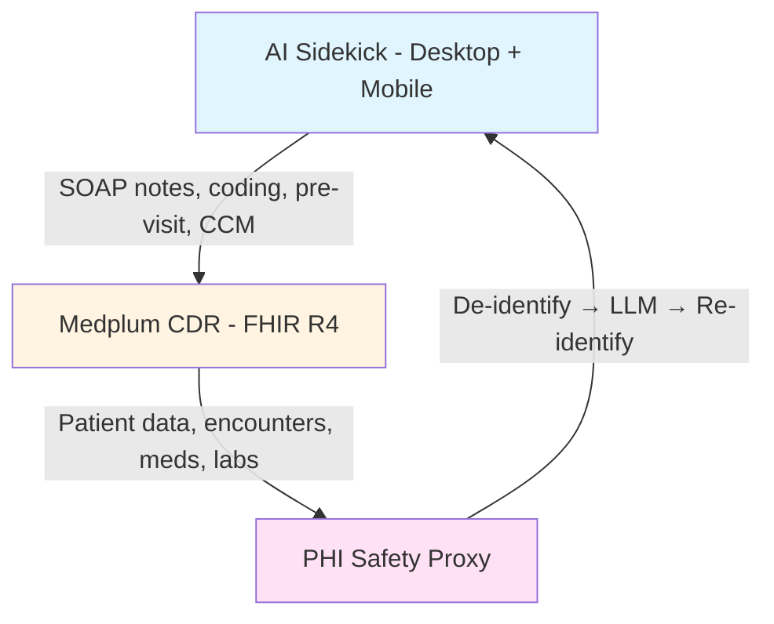

Created: February 16, 2026 12:10 AM
Tags: Engineering, Product
*Updated: March 7, 2026*

<aside>
🔧 MedScrub's three-layer architecture creates compounding moats. Each layer makes the next more valuable and harder to displace.

</aside>
## Architecture Overview

MedScrub is a three-layer system:



This creates a layered architecture diagram showing the three main components and their relationships.

## Layer 1: PHI Safety Proxy (Trust Foundation)

The proxy sits between MedScrub and any external AI service. It ensures PHI never reaches consumer LLMs in identifiable form.

- **Function:** Automatically de-identifies PHI before sending to LLMs, re-identifies in responses
- **Method:** Reversible tokenization — 'John Smith, DOB 1985-03-15' → 'PATIENT_A7X2, DOB DATE_B3Y1'
- **PHI types:** All 18 HIPAA identifiers (names, dates, SSN, MRN, addresses, phone, email, etc.)
- **Deployment:** Docker container, self-hosted on customer infrastructure or MedScrub cloud
- **LLM agnostic:** Works with Claude, GPT-4, Gemini, Llama — any model. Improves as models improve.
- **Compliance:** HIPAA Safe Harbor (all 18 identifiers). Expert Determination analysis endpoints available (backlog). PHI never leaves customer's environment in self-hosted mode.
- **Capital efficiency:** No need to train custom models. Leverage best consumer LLMs safely.

## Layer 2: Medplum CDR (Data Gravity)

The Clinical Data Repository stores longitudinal patient data in FHIR R4 format. This is the moat — it turns MedScrub from a stateless tool into a persistent clinical brain.

- **Platform:** Medplum (open-source FHIR server, backed by venture capital)
- **Data model:** FHIR R4 resources — Patient, Encounter, Observation, MedicationRequest, Condition, DiagnosticReport, etc.
- **EHR sync:** Bi-directional FHIR API connection to athenahealth (primary), Epic (secondary), Oracle Health/Cerner (implemented)
- **What it stores:** Every visit note, lab result, medication, diagnosis, referral, prior auth — the full patient story
- **Why it matters:** Enables pre-visit planning, longitudinal summaries, care gap detection, CCM tracking — features impossible without persistent data
- **Multi-tenant:** Each practice has isolated data. RBAC via Medplum access policies.

## Layer 3: AI Sidekick (Daily Habit)

The user-facing application where physicians interact with MedScrub. Desktop-first, mobile companion.

- **Desktop app:** Electron app. Primary work environment — SOAP notes, coding, pre-visit prep, patient messaging, daily briefings, EHR sync (athena/Oracle/Epic)
- **Mobile app:** React Native + Expo SDK 54. QR enrollment, on-the-go dictation, quick inbox review
- **Skill-based execution:** All AI workflows are defined as declarative JSON skill files and executed through a single generic pipeline (see Skill SDK below)
- **CDR integration:** Every AI interaction enriched with patient context from CDR
- **EHR push:** Notes, coding suggestions, and documents push back to EHR via FHIR API

---

## Skill SDK (Workflow Engine)

All AI workflows in MedScrub are powered by the Skill SDK — a declarative system where clinical workflows are defined as JSON files and executed through a single generic pipeline.

### Why a Skill SDK

Previously, each workflow (SOAP notes, prior auth, patient messaging, etc.) had its own hardcoded TypeScript function duplicating the same 5-stage pipeline. Adding a new template required modifying 3-4 TypeScript files, rebuilding, and releasing. The Skill SDK replaces this with JSON definition files that the runtime loads, validates, and executes.

### Skill Definition Format

Each skill is a `.skill.json` file in `desktop/src/skills/` containing:

- **Input configuration** — which FHIR resources to fetch, what variables the physician provides
- **Prompt templates** — system prompt, user prompt with `{variable}` placeholders, optional prompt variants
- **LLM settings** — temperature, max tokens, estimated token usage
- **Output configuration** — whether to re-identify PHI, post-processing (e.g., append AB 3030 disclosure)
- **Metadata** — category, specialty, tier, icon, description

```
desktop/src/skills/
├── soap-note.skill.json              # SOAP note generation
├── pre-visit-summary.skill.json      # Pre-visit planning
├── prior-auth-mri.skill.json         # Prior auth (MRI variant)
├── prior-auth-specialty-drug.skill.json  # Prior auth (specialty drug)
├── coding-optimization.skill.json    # E/M coding analysis
├── icd10-suggester.skill.json        # ICD-10 code suggestions
├── message-lab-results.skill.json    # Patient message: lab results
├── message-post-visit.skill.json     # Patient message: post-visit
├── message-pre-visit-prep.skill.json # Patient message: pre-visit prep
├── message-care-gap.skill.json       # Patient message: care gap nudge
├── patient-education.skill.json      # Patient education materials
├── referral-letter.skill.json        # Referral letters
├── lab-results-explanation.skill.json # Lab results explanation
├── care-plan-diabetes.skill.json     # Diabetes care plan
├── lab-triage.skill.json             # Lab result triage
├── screening-gap-analyzer.skill.json # USPSTF screening gaps
├── daily-briefing-header.skill.json  # Daily briefing overview
├── prior-auth.ext.ts                 # Extension: conditional prompt variant
├── coding-optimization.ext.ts        # Extension: JSON parsing, skip re-identify
└── patient-message.ext.ts            # Extension: AB 3030 disclosure
```

### Generic Pipeline

All skills execute through a single `executeSkill()` function with 5 stages:

```
1. Fetch patient FHIR data    → CDR via Medplum or SMART on FHIR
2. De-identify PHI            → PHI proxy (reversible tokenization)
  2.5 Extension: transformInput() — optional pre-prompt hook
3. Build prompt               → Interpolate skill JSON template with variables
4. Call LLM                   → Claude/GPT via configurable provider
  4.5 Extension: transformOutput() — optional post-LLM hook
5. Re-identify PHI            → PHI proxy (restore original identifiers)
  5.5 Post-process            → Append disclosures, parse JSON, etc.
```

### TypeScript Extensions

When a skill needs logic beyond declarative JSON (3 of 17 skills), a co-located `.ext.ts` file provides hooks:

- **`prior-auth.ext.ts`** — Routes to MRI or specialty drug prompt variant based on `authType` input
- **`coding-optimization.ext.ts`** — Parses structured JSON from LLM output, skips re-identification
- **`patient-message.ext.ts`** — Injects AB 3030 disclosure text into the system prompt

### Architecture

```
  Skill JSON Files                Skill Registry
  desktop/src/skills/             (loads, validates, indexes)
  *.skill.json + *.ext.ts              |
         |                        Zod validation
         +--- SkillRegistry ---+       |
                                 SkillIndex (Map)
                                       |
                              executeSkill(id, vars, config)
                                       |
                          Generic Pipeline Executor
                                       |
          ┌────────────────────────────┤
          │                            │
    fetchPatientData()          buildPrompt()
    deidentifyFHIR()            llmClient.chat()
    reidentifyFHIR()            extension hooks
          │                            │
          └────────────────────────────┘
                                       |
                              WorkflowOutput
```

### Extensibility Path

The SDK is designed for progressive opening:

1. **Internal (current)** — MedScrub team authors JSON skill files, ships with app updates
2. **IT Admin (future)** — Admins create skills in `~/.medscrub/skills/` for their organization
3. **Physician (future)** — Physicians author simple skills via a form-based editor in the app
4. **Adapters (future)** — External API connectors (FHIR queries, HTTP calls) and output adapters (PDF, EHR write-back)

---

## Data Flow: Generic Skill Execution

All workflows (SOAP notes, pre-visit, prior auth, messaging, coding, etc.) follow this data flow:

1. Physician selects a skill (workflow) and provides input variables
2. Skill executor fetches patient FHIR bundle from CDR (if skill requires it)
3. PHI proxy de-identifies the bundle (reversible tokenization)
4. Skill's prompt template is interpolated with de-identified data + physician variables
5. De-identified prompt → LLM (Claude/GPT) for generation
6. Extension hooks apply any post-LLM transformations
7. PHI proxy re-identifies the output
8. Post-processing applied (AB 3030 disclosure, JSON parsing, etc.)
9. Output displayed for physician review + edit
10. Physician approves → save to CDR, push to EHR, or copy to clipboard

## Data Flow: Daily Briefing (Batch)

1. Physician selects patients for the day via multi-select modal
2. For each patient: executes the `pre-visit-summary` skill sequentially
3. After all patients processed: executes `daily-briefing-header` skill on concatenated results
4. Schedule overview + per-patient briefing cards displayed
5. Physician reviews, exports, or prints for morning huddle

## Data Flow: Prior Auth

1. Physician requests prior auth for procedure/medication
2. CDR pulls relevant clinical justification (diagnosis history, failed treatments, lab trends)
3. Extension hook routes to correct prompt variant (MRI vs. specialty drug)
4. PHI proxy de-identifies → LLM generates payer-specific prior auth → re-identifies
5. Physician reviews, approves, submits via payer API (CMS-0057-F)
6. Status tracked in CDR. On denial → auto-generate appeal with expanded clinical evidence.

---

## EHR Integration Architecture

### athenahealth (Primary Target)

- FHIR R4 API via athenahealth Marketplace
- OAuth 2.0 SMART on FHIR authorization
- Read: Patient, Encounter, Observation, Medication, Condition, DocumentReference
- Write: DocumentReference (notes), Observation (vitals), CommunicationRequest
- Webhook subscriptions for real-time updates

### Epic (Secondary)

- FHIR R4 via Epic App Orchard / Epic on FHIR
- SMART on FHIR launch from within Epic Hyperspace/Haiku
- Epic hosted endpoint for small practices: epicproxy.et4001.epichosted.com
- Public endpoint registry: open.epic.com/MyApps/EndpointsJson

### Future: Vim Canvas (Mid-Market EHRs)

- Iframe-based embedding into eCW, NextGen, Elation, DrChrono, Practice Fusion
- Enables MedScrub inside EHRs that lack modern API extensibility
- 1PuttHealth consulting arm builds these integrations

---

## Security & Compliance

- **PHI proxy:** De-identification before any external API call
- **Expert Determination:** Analysis endpoints built (K-anonymity, L-diversity, T-closeness); formal certification on backlog
- **Encryption:** TLS 1.3 in transit, AES-256 at rest
- **Audit trail:** Every PHI access logged with user, timestamp, resource
- **Multi-tenant isolation:** Medplum access policies enforce practice-level data separation
- **Self-hosted option:** Entire stack deployable on customer infrastructure (Docker)
- **BAA:** Business Associate Agreement available for cloud-hosted deployments
- **No audio storage:** Ambient audio processed in real-time, not retained

---

## Tech Stack

- **Backend:** Node.js / TypeScript (strict mode)
- **CDR:** Medplum (FHIR R4, PostgreSQL)
- **PHI Proxy:** Custom Docker container (Express.js, multi-layer NER)
- **Desktop:** Electron 40 + React 19 + TypeScript
- **Mobile:** React Native + Expo SDK 54 + Zustand
- **Platform:** Next.js 14 + Vercel + Neon Postgres + Prisma
- **Skill Engine:** JSON skill definitions + Zod validation + generic pipeline executor
- **AI:** Claude (Anthropic) primary, GPT-4 (OpenAI) fallback, model-agnostic via LLMClient
- **Transcription:** OpenAI Whisper API
- **Auth:** NextAuth.js + JWT + API keys + license keys
- **Hosting:** Vercel (web), Cloudflare (CDN/DNS), customer infra (self-hosted)
- **Analytics:** PostHog + Fathom
- **Testing:** Vitest + Playwright