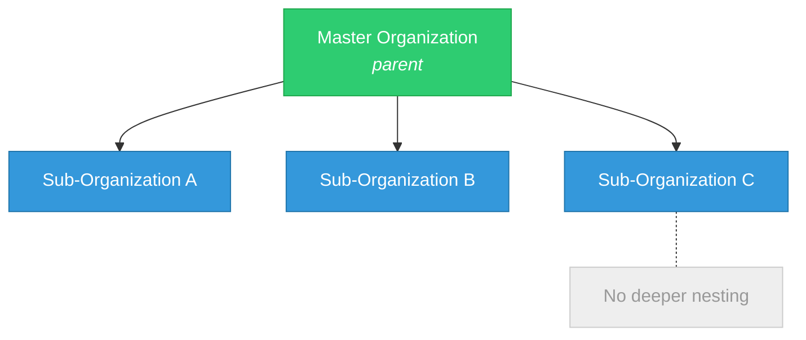

> Comprehensive technical reference for engineers migrating FROM Healthie TO Medplum.
> Covers API architecture, data model, integrations, infrastructure, developer tools, and known limitations.

**See also:** [Current State Summary](Healthie%20—%20Current%20State%20(Migrating%20FROM).md) | [Capability Mapping](Capability%20Mapping.md) | [Data Migration](Data%20Migration.md) | [FHIR Glossary](FHIR%20R4%20Glossary.md)

---

## Table of Contents

1. [API Architecture](#1-api-architecture)
2. [Data Model -- Core Entities](#2-data-model--core-entities)
3. [Integrations](#3-integrations)
4. [Infrastructure](#4-infrastructure)
5. [Developer Tools](#5-developer-tools)
6. [Webhooks & Events](#6-webhooks--events)
7. [Multi-Tenancy & Organizations](#7-multi-tenancy--organizations)
8. [Forms & Questionnaires](#8-forms--questionnaires)
9. [Telehealth](#9-telehealth)
10. [Limitations & Pain Points](#10-limitations--pain-points)

---

## 1. API Architecture

### GraphQL Foundation

Healthie exposes a **single unified GraphQL API**. There is no separate public or internal API layer, no reduced or read-only surface. The same schema, behavior, and release lifecycle are used by Healthie's own web/mobile frontend applications and by all external consumers.

- **Protocol:** GraphQL over HTTPS (POST)
- **Operations:** Queries, Mutations, Subscriptions (via ActionCable/WebSocket)
- **Specification goal:** Adhere to the latest GraphQL specification

### Endpoints

| Environment | URL | Notes |
|-------------|-----|-------|
| **Staging/Sandbox** | `https://staging-api.gethealthie.com/graphql` | No PHI allowed. Higher latency. Limited integrations (no Zoom, Outlook, iCal). |
| **Production** | `https://api.gethealthie.com/graphql` | Full PHI support. All integrations available. |
| **Sandbox signup** | `https://securestaging.gethealthie.com/users/sign_up/provider` | Select "Digital Health Startup" on registration |
| **Production signup** | `https://secure.gethealthie.com/users/sign_up/provider` | |

Staging and Production are **fully independent environments**. Data and settings cannot transfer between them.

### Authentication

Three HTTP headers are required on every API request:

```
Authorization: Basic YOUR_API_KEY_HERE
AuthorizationSource: API
```

Conditional fourth header for sharded data:
```
AuthorizationShard: YOUR_SHARD_AUTHORIZATION_ID
```

**Key characteristics:**
- API keys are **user-account scoped** -- the key inherits all permissions/behaviors of its owning user
- One user account can have **multiple API keys**
- Keys can be generated programmatically via `createApiKey` mutation (accepts `name`, `user_id`; returns `api_key`, `displayable_key`, timestamp, ID)
- All actions performed via API key are **attributed to the owning user** for audit purposes
- **No OAuth, no JWT, no user impersonation** mechanisms exist in the API
- **No IP allowlisting or key rotation policies** enforced by Healthie

**Deployment patterns:**
1. **Centralized service-account key** -- for backend/data pipeline operations
2. **Per-user keys** -- for frontend experiences and custom interfaces

Best practice: Use **different API keys per integration partner** to maintain audit separation.

### API Versioning

Healthie uses an **opt-in versioning system** via a custom HTTP header:

```
Healthie-GraphQL-API-Version: 2025-11-30
```

**Available versions** (as of Jan 2026): `2024-06-01`, `2024-07-01`, `2024-10-01`, `2024-10-20`, `2024-11-01`, `2025-01-01`, `2025-04-01`, `2025-05-15`, `2025-07-31`, `2025-10-15`, `2025-11-30`

**Version philosophy:**
- New versions are created **only when updates would cause breaking changes**
- Non-breaking improvements deploy via **accretion** across all versions automatically
- Existing integrations remain stable on their pinned version
- Developers opt in to newer versions at their own pace
- **Automated weekly changelog** generated every Friday capturing all GraphQL schema changes; retroactively backfilled for 12 months

### Rate Limits

| Limit Type | Value | Notes |
|------------|-------|-------|
| **Requests per second** | 250 RPS (standard) | 1000 RPS with dedicated API database |
| **Sign-in rate** | 100 per minute | |
| **Query complexity** | Max 2000 points per request | Scalar fields = minimal cost; connection fields multiplied by page size |
| **Query depth** | Max 25 nesting levels | Counts nesting including fragments |

**Complexity scoring details:**
- Scalar fields have minimal cost
- Object fields and connection fields cost more
- Connection fields are **multiplied by the `first`/`last` pagination argument**
- Default page size for calculation (if unspecified): 100
- Example: 3 users with nested appointments = 14 complexity; using default 100-node page = 402 complexity

**Error responses:**
- Rate exceeded: `{ "message": "Too many requests. Please try again later.", "code": "TOO_MANY_REQUESTS" }`
- Complexity exceeded: `"Query has complexity of [X], which exceeds max complexity of 2000"`
- Depth exceeded: `"Query has depth of [X], which exceeds max depth of 25"`

**Note:** Rate limits are dynamic and may vary based on endpoint, operation type, and current system load. No specific per-endpoint limits or response headers are documented.

### Pagination

Healthie supports **two pagination styles:**

**1. Offset-based pagination** (legacy/primary):
- Uses `offset` and integer page arguments on collection queries
- Common pattern for most list queries (`users`, `appointments`, etc.)

**2. Cursor-based pagination** (newer, being expanded):
- Uses standard GraphQL Relay connection pattern
- `Connection` / `PaginationConnection` types with `Edge` types containing `node` and `cursor`
- `PageInfo` with `hasNextPage`, `hasPreviousPage`, `startCursor`, `endCursor`
- Supported on newer collection endpoints (e.g., `AcceptedInsurancePlanConnection`, `AppointmentPaginationConnection`, `ApiKeyPaginationConnection`)
- Cursor-based pagination was on the H2 2025 roadmap for broader rollout

### Error Handling

As of May 1, 2024, Healthie rolled out **specific GraphQL error messaging** conforming to the latest GraphQL specification, replacing previously generic error messages. Error responses now include detailed information about the cause of errors.

---

## 2. Data Model -- Core Entities

### Naming Conventions

Healthie uses its own proprietary entity naming. Key mappings for migration engineers:

| Healthie Entity | FHIR Equivalent | Notes |
|----------------|-----------------|-------|
| `User` (patient) | `Patient` | Patients and providers are the **same `User` object type** |
| `User` (provider) | `Practitioner` | Distinguished by role, not type |
| `Appointment` | `Appointment` | |
| `AppointmentType` | `Schedule` / `Slot` (partially) | Configuration entity for booking rules |
| `Entry` | `Observation` / `DiagnosticReport` | Journal entries, clinical entries |
| `FormAnswerGroup` | `QuestionnaireResponse` | Completed form submission |
| `CustomModuleForm` | `Questionnaire` | Form template definition |
| `CustomModule` | `Questionnaire.item` | Individual form question |
| `CarePlan` | `CarePlan` | |
| `Goal` | `Goal` | |
| `Note` / `ChartingNote` | `DocumentReference` / `Encounter` | Charting/clinical notes |
| `Document` | `DocumentReference` | Uploaded files |
| `Policy` | `Coverage` | Insurance policy |
| `CMS1500` | `Claim` | Insurance claim form |
| `SuperBill` | `Claim` (self-pay) | Superbill for patient submission |
| `BillingItem` | `ChargeItem` / `Invoice` | |
| `LabOrder` | `ServiceRequest` | |
| `LabResult` | `DiagnosticReport` / `Observation` | |
| `Medication` | `MedicationStatement` | |
| `Prescription` (DoseSpot) | `MedicationRequest` | |
| `Conversation` | `Communication` | Chat/messaging thread |
| `Message` | `Communication` | Individual message |
| `Task` | `Task` | |
| `Tag` / `AppliedTag` | (no direct FHIR) | Provider-specific patient labels |
| `UserGroup` | `Group` | Patient grouping |
| `Organization` | `Organization` | |
| `Location` | `Location` | |
| `InsuranceAuthorization` | `CoverageEligibilityResponse` (partially) | |
| `MetricEntry` | `Observation` | Tracked health metrics |

### User (Patient/Provider) Object

The `User` object is Healthie's **universal person entity**. Patients and providers are the same type, distinguished by role. The object has an enormous number of fields, many irrelevant for patients.

**Key patient fields:**
- `id`, `first_name`, `last_name`, `legal_name`, `dob`, `email`, `phone_number`
- `gender`, `gender_identity`, `sex` (insurance-specific, limited to Male/Female)
- `record_identifier`, `npi`
- `active_status` ("active" or "archived")
- `signup_token`, `set_password_link` (for external welcome flows)
- `next_appt_date`
- `dietitian_id` (primary provider assignment)
- `linked_relatives` (collection of related users)
- `user_groups` (group memberships)

**Patient creation methods:**

| Method | Mutation | Caller | Required Fields |
|--------|----------|--------|-----------------|
| Provider-initiated | `createClient` | Authenticated staff | `first_name`, `last_name`, `email` (unless `skipped_email: true`), `dietitian_id` |
| Self-registration | `signUp` | Unauthenticated | `first_name`, `last_name`, `email`, `password` (8+ chars), `role: "patient"`, plus `dietitian_id` or `invite_code` |
| Booking/payment | `completeCheckout` | Unauthenticated | (combined booking + patient creation) |

**Patient update mutations:**
- `updateClient` -- staff updates patient demographics
- `bulkUpdateClients` -- limited to one field at a time (`user_group_id` OR `active_status`)
- `updateUser` -- patient or provider self-update

**Important constraint:** In `updateClient`, email/reminder triggers take precedence; demographic updates are **skipped** if communication actions are present in the same mutation.

**Patient retrieval:**
- `user` query by `id`
- `users` query with filters: `active_status`, `group_id`, `provider_id`, `sort_by`, `keywords`
- `keywords` searches across: id, first/legal/last name, record_identifier, email, dob, npi

**Patients cannot be deleted** -- only archived via `active_status`.

**Password validation:** Minimum 8 characters, strength-validated via StrongPassword Ruby gem.

### Appointment Object

**Key fields:**
- `id`, `date` (ISO8601), `contact_type`, `appointment_type_id`
- `pm_status`: "Occurred", "No-Show", "Re-Scheduled", "Cancelled", "Late Cancellation", "Checked-In"
- Provider and user references
- `form_answer_group` (form completed during session)
- `filled_embed_form` (form completed at booking time)
- `recurring_appointment_id`, `current_position_in_recurring_series`

**Active appointment** = not deleted AND status not in {Cancelled, Re-Scheduled, No-Show}.

**Appointment Types** define booking rules:
- `id`, `name`, `length` (minutes), `is_group`
- `available_contact_types` array: "Healthie Video Call", "In Person", "Phone Call"
- `is_waitlist_enabled`, `insurance_billing_enabled`
- Group restrictions via `specific_groups`, `bookable_group_ids`

**Mutations:**
- `createAppointment` -- provider-initiated (bypasses availability unless `enforce_availability: true`)
- `completeCheckout` -- patient self-scheduling (enforces availability)
- `updateAppointment` -- modify existing; status changes via `pm_status`
- `deleteAppointment` -- soft delete; `deleteRecurring` for series

**Recurring appointments:**
- `repeat_interval`: "Weekly", "Biweekly", "Monthly", "Every 4 Weeks"
- `repeat_times`: total count in series
- Series **splitting** occurs when editing non-first appointment with `updateRecurring: true`, changing interval, or modifying time/date
- Original series truncates; new series created with `previous_recurring_appointment_id` reference

**Conflict detection:** `appointmentBookingWarnings` query returns warning categories ("Event Conflicts", "Credit Deficits") before booking confirmation.

### Care Plans & Goals

- `CarePlan` -- apply common protocols to patients; can include wellness recommendations, documents, automatic goals
- `Goal` -- trackable patient goals linked to care plans
- `GoalHistory` -- progress tracking entries on goals
- CRUD mutations: `createCarePlan`, `updateCarePlan`, `deleteCarePlan`, `createGoal`, `updateGoal`, `deleteGoal`

### Entries & Metrics

- `Entry` -- journal entries (food, activity, lifestyle, clinical assessments)
- `MetricEntry` -- tracked health metrics (weight, height, BMI, body fat, custom metrics)
- Metrics sync with **Fitbit, Apple Health, GoogleFit, iHealth** scales
- Food journaling integrates with **USDA Food Database** (via Edamam, 900K+ foods)
- Clinical assessment scores transmitted via `createEntry` mutation

### Documents

- `Document` -- uploaded files (educational resources, recipes, meal plans, handouts)
- Import sources: computer upload, Dropbox, Google Drive, mobile camera
- CRUD via `createDocMutation` and related mutations
- Bulk import available via support (zip file to hello@gethealthie.com)
- Webhook events: `document.created`, `document.updated`, `document.deleted`

### Charting / Clinical Notes

- Charting templates: **SOAP**, **ADIME**, **Free Text**, and custom templates
- Templates support: conditional logic, pre-fill from intake form answers, Smart Phrases (hotkey `.` trigger)
- Single appointments can have **multiple chart notes**
- Signature workflow: providers sign notes with legal name; addendums can be appended to signed-but-unlocked notes
- Charting note addendum webhook events available

**AI Scribe** (mid-2025): generates chart notes from telehealth sessions using selected templates, integrated with HIPAA-compliant Zoom.

### Billing Entities

| Entity | Purpose | API Operations |
|--------|---------|---------------|
| `Policy` | Patient insurance information | List, retrieve, create, update |
| `CMS1500` | Insurance claim form | List, retrieve, create, update |
| `SuperBill` | Patient-facing superbill | List, retrieve, create, update |
| `BillingItem` | Individual charge/line item | CRUD |
| `Invoice` | Payment tracking | Manage out-of-pocket payments |
| `RequestedPayment` | Payment requests | CRUD |
| `WriteOff` | Write-off tracking | Discounts, uncollectible, hardship categories |

**Claims workflow:**
1. Appointments occur and generate billing data
2. CMS1500 claims can be auto-generated nightly for eligible appointments (or created manually/via API)
3. Claims are pulled from Healthie to external billing platforms (batch or real-time)
4. Status updates are pushed back into Healthie
5. Eligibility verification via **Change Healthcare** integration

**Insurance billing automation:** When `insurance_billing_enabled: true` on appointment types and appointment status = "Occurred", system auto-calculates patient responsibility and charges/invoices.

**CPT code configuration:** Admins can link appointment types to specific CPT codes and set contracted payer rates per code.

### Lab Orders & Results

- `LabOrder` -- created via `createLabOrder` mutation
- `LabResult` -- results synchronized from lab vendors
- Webhook events: `lab_order.created`, `lab_order.updated`, `lab_result.created`

### Messaging

- `Conversation` -- chat thread (1:1 or group)
- `Message` -- individual message within a conversation
- Real-time via **ActionCable** WebSocket (Rails native)
- Chat SDK (`@healthie/chat`) provides React components: `ConversationList`, `Chat`
- Webhook events: `message.created`, `message.deleted`, `conversation_membership.created/viewed/deleted`

### Tags & User Groups

**Tags:**
- Provider-specific attributes (unique per staff member)
- Unlimited tags per patient (vs. single group assignment)
- Mutations: `createTag`, `updateTag`, `deleteTag`, `bulkApply`, `removeAppliedTag`
- Webhook events: `applied_tag.created`, `applied_tag.deleted`

**User Groups:**
- Container for organizing patients
- Fields: `id`, `name`, `users_count`, `invite_code`, `onboarding_flow_id`
- Mutations: `createGroup`, `updateUserGroup`, `deleteUserGroup`
- Support group-based automation triggers and content sharing

---

## 3. Integrations

### Native Integrations (Built by Healthie)

| Integration | Category | Details |
|-------------|----------|---------|
| **Stripe** | Payments | Stripe Connect -- customers do NOT have their own Stripe accounts. Payment card collection, storage, and charging. PCI Level 1 certified. |
| **DoseSpot** | E-Prescribe | Add-on ($40/provider/month, +$20/month for EPCS). Integration with SureScripts for 95%+ US pharmacies. Uses Medispan drug database (weekly updates). |
| **Zoom** | Telehealth | HIPAA-compliant. No personal Zoom account needed. Available on Plus Plan+. Unique link per appointment. 100 meetings/provider/day limit. |
| **Change Healthcare** | Eligibility | Insurance eligibility verification |
| **Claim.MD** | Claims | Real-time eligibility, direct claim submission from notes, automated ERA processing |
| **Apple Health** | Wearables | Metric sync |
| **Google Fit** | Wearables | Metric sync |
| **Fitbit** | Wearables | Metric sync (white-label OAuth branding available) |
| **iHealth** | Wearables | Scale data sync |
| **Google Calendar** | Calendaring | Sync (requires pre-approval in sandbox) |
| **Outlook Calendar** | Calendaring | Sync (not available in sandbox) |
| **iCal** | Calendaring | Sync (not available in sandbox) |
| **Rupa Health** | Labs | 35+ specialty lab companies; draft orders, receive results, share with clients |
| **Quest Diagnostics** | Labs | Direct lab ordering (Enterprise plan, requires own vendor account) |
| **LabCorp** | Labs | Direct lab ordering (Enterprise plan, requires own vendor account) |
| **BioReference** | Labs | Direct lab ordering (Enterprise plan, requires own vendor account) |
| **Evexia** | Labs | Lab partnership |
| **Fullscript** | Supplements | Supplement dispensary integration |
| **Edamam** | Nutrition DB | 900K+ foods for nutrient tracking |
| **USDA Food Database** | Nutrition DB | Food journaling data source |
| **Office Ally** | Claims | CMS 1500 submission |
| **Google Tag Manager** | Analytics | Full white-label only |
| **Mixpanel** | Analytics | Full white-label only |
| **SendGrid** | Email | Advanced email reporting (full white-label only) |
| **Zus Health** | Data aggregation | Embedded ZAP in patient chart; CCDA pull; bidirectional sync via webhooks |

### Healthie Harbor Marketplace

Healthie's partner ecosystem ("The Harbor") includes **73+ partner integrations** across categories:
- AI Companies
- Financial Solutions / Billing & Insurance
- Provider Data & Scheduling
- Front Desk Efficiency
- Patient Records / Data Solutions
- Labs & Diagnostic Testing
- Care Support Tools
- Virtual Care / Telehealth
- Interoperability
- Service Partners (dev shops)

Partners classified as: "Developed By Healthie", "Developed by Partner", or "Not Integrated".

### Integration Architecture Patterns

**Stripe Connect:** Healthie acts as the platform; customers do not have independent Stripe accounts. All payment operations are mediated through Healthie's Connect integration.

**DoseSpot V2 constraints (breaking):**
- Drug allergies synced to DoseSpot **cannot have names changed**
- Medications synced **cannot have 'name' or 'dosage' modified** post-sync
- `monograph_path` on prescriptions becoming unavailable
- Patients **must** select medication dosage (previously optional)

**Lab integration pattern:** Lab ordering occurs in the vendor's UI or via API; results are synchronized back to Healthie. E-Labs Direct enables ordering, tracking, and receiving results within Healthie or via API.

**Zus Health pattern:** Embedded UI component in patient chart. Longitudinal CCDA pulled during initial sync. Bidirectional updates (appointments, demographics, observations) flow via webhooks.

**iFrame embedding:** Enterprise customers can embed partner UIs into Healthie by adding items to the left sidebar.

---

## 4. Infrastructure

### Technology Stack

| Component | Technology |
|-----------|------------|
| **Backend** | Ruby on Rails |
| **Database** | PostgreSQL |
| **Frontend (Web)** | React |
| **Frontend (Mobile)** | React Native (cross-platform), Swift (iOS native), Java (Android native) |
| **Real-time** | ActionCable (Rails WebSocket) |
| **API** | GraphQL (graphql-ruby gem) |
| **ORM** | ActiveRecord |
| **Hosting** | Aptible + AWS |
| **Backup** | AWS, Microsoft Azure, Aptible |
| **FHIR layer** | Aidbox by Health Samurai (add-on, Enterprise only) |

### Hosting & Security

| Attribute | Detail |
|-----------|--------|
| **Primary hosting** | Aptible (PaaS on AWS) |
| **Cloud partners** | AWS, Microsoft Azure |
| **Data encryption at rest** | Yes (encrypted even at rest) |
| **In-transit encryption** | 256-bit SSL |
| **Session encryption** | 512-bit SSL for BA sessions |
| **Video encryption** | 256-bit AES end-to-end (via Zoom) |
| **Payment data** | Tokenized via Stripe; not stored by Healthie |
| **Physical security** | Biometric, surveillance, 24/7 guards |
| **Certifications** | SOC 1, SOC 2, HIPAA, PIPEDA, GDPR, PCI, ONC |
| **Trust Center** | https://trust.gethealthie.com |
| **Penetration testing** | Annual third-party |
| **Audit logs** | SSH, SQL, platform backend, Apache access logs |
| **Disaster recovery** | Redundant power, full data backup, regular DR procedures |
| **Uptime** | 99.99% historical; Enterprise SLA available |

### Performance Characteristics

| Metric | Value |
|--------|-------|
| **Monthly API calls** | 400M+ (claims "billions" on developer page) |
| **Average response time** | 300-500ms (varies by query complexity) |
| **Concurrent capacity** | Handles 400M+ calls/month without degradation |
| **Sandbox latency** | Higher than production |
| **Sign-in rate limit** | 100/minute |

---

## 5. Developer Tools

### API Documentation

- **URL:** https://docs.gethealthie.com
- **Interactive explorer:** GraphiQL-based IDE (requires API key)
- **Schema reference:** https://docs.gethealthie.com/reference
- **Markdown export:** every page exportable as Markdown
- **AI sharing:** one-click share to ChatGPT/Claude
- **Automated changelog:** generated every Friday; tracks new fields, mutations, deprecations

### SDKs

| SDK | Package | Purpose | Dependencies |
|-----|---------|---------|--------------|
| **Chat SDK** | `@healthie/chat` | Real-time messaging components (`ConversationList`, `Chat`) | `@rails/actioncable`, `graphql-ruby-client` |
| **Forms SDK** | `@healthie/sdk` | Dynamic form rendering (`Form` component) | Apollo Client |
| **Booking SDK** | `@healthie/sdk` | Calendar and package booking | Apollo Client |
| **Awell SDK** (3rd party) | `@awell-health/healthie-sdk` | Fully-typed Node.js SDK for server-side | TypeScript, genql |

**SDK notes:**
- Built on top of **Apollo Client** (must be pre-installed)
- WebSocket via **ActionCable** -- causes SSR issues with Next.js and similar frameworks
- All SDK components wrapped in `healthie-container` CSS class
- Form component auto-prefills with user data and submits on behalf of user
- Custom styling via CSS class overrides (`input-wrapper`, `form-field-container`, etc.)

### Awell Healthie SDK (Community)

```typescript
const sdk = new HealthieSdk({
  environment: 'staging', // or 'production'
  apiKey: 'YOUR_API_KEY'
});

const result = await sdk.client.query({
  organization: {
    __args: { id: '775019' },
    organization_email: true,
    name: true
  }
});
```

- Exports all Healthie GraphQL types for TypeScript
- Supports request batching via `Promise.all()`
- Server-side only (API key protection)

### Dev Assist (MCP Tool)

- **Repo:** https://github.com/healthie/healthie-dev-assist
- **Purpose:** AI-powered GraphQL co-pilot via Model Context Protocol (MCP)
- **Built on:** Node.js (v14+), `apollo-mcp-server` (v0.5.2) binary
- **Works with:** Claude Desktop, VS Code (Claude Code), Cursor, OpenAI
- **Capabilities:** query/mutation generation, schema exploration, documentation, webhook handling guidance
- **Auto schema management:** Downloads and caches GraphQL schema on first run; keeps local schema synchronized

**Setup:**
```bash
npm install
```

**Multi-environment support:** Configure via `environments.json` file; each environment maintains separate schema files.

**Security warning:** Designed exclusively for sandbox environments. Production use requires BAA compliance with AI tools.

### Recommended HTTP Clients

- **cURL** (any HTTP client works)
- **Apollo Client** (JavaScript -- recommended for frontend)
- **GraphQL-Client** (Ruby -- recommended for Ruby backends)
- **Insomnia** / **Postman** (GUI-based testing)

---

## 6. Webhooks & Events

### Configuration

- Navigate to Settings > Developer > Webhook
- Single webhook can subscribe to **multiple event types** (since Aug 2024)
- Webhook URL must be HTTPS endpoint
- Events are configured per webhook, not globally
- Webhooks manageable via API (`createWebhook`, `updateWebhook`, etc.)

### Payload Structure

```json
{
  "resource_id": "string",
  "resource_id_type": "string",
  "event_type": "string",
  "changed_fields": ["array"]
}
```

**Key details:**
- `resource_id_type` values: `Appointment`, `FormAnswerGroup`, `Entry`, `Note`, etc.
- **Thin payloads:** Created/deleted events include ONLY resource ID and event category -- you MUST make a follow-up GraphQL API call to get full data
- **Update events** include `changed_fields` array listing which fields changed
- **Webhook-then-query model:** receive notification -> identify resource ID -> execute targeted API call

### Security / Signature Verification

Each webhook request includes cryptographic verification headers:

| Header | Content |
|--------|---------|
| `Content-Type` | `application/json` |
| `Content-Digest` | SHA-256 hash of payload |
| `Signature-Input` | Components used in signature construction |
| `Signature` | HMAC-SHA256 signature |

**Verification process:** Reconstruct data string from HTTP method, path, query, digest, content type, and length; compute HMAC-SHA256; compare against `Signature` header.

### IP Whitelisting (Optional)

| Environment | IPs |
|-------------|-----|
| **Staging** | `18.206.70.225`, `44.195.8.253` |
| **Production** | `52.4.158.130`, `3.216.152.234`, `54.243.233.84`, `50.19.211.21` |

### Retry Logic

- Failed webhooks retry for **up to 3 days** using **exponential backoff**
- Email alert sent after ~24 hours of failures
- Webhooks **automatically disabled** after ~3 days of continued errors
- Opt-in retry functionality

### SentWebhook Records

- Fetchable with pagination
- Records available for **180 days**
- Useful for debugging and replay

### Complete Event Types List (72 events)

**Appointments:**
- `appointment.created`, `appointment.updated`, `appointment.deleted`
- `appointment.transcript_available`, `appointment.recording_started`, `appointment.recording_stopped`, `appointment.participant_joined`

**Patients:**
- `patient.created`, `patient.updated`

**Forms:**
- `form_answer_group.created`, `form_answer_group.locked`, `form_answer_group.deleted`, `form_answer_group.signed`

**Clinical / Charting:**
- `entry.created`, `entry.updated`, `entry.deleted`
- `metric_entry.created`, `metric_entry.updated`, `metric_entry.deleted`
- `charting_note_addendum.created`, `charting_note_addendum.updated`, `charting_note_addendum.deleted`

**Billing:**
- `billing_item.created`, `billing_item.updated`
- `cms1500.created`, `cms1500.updated`, `cms1500.deleted`
- `requested_payment.created`, `requested_payment.updated`

**Care Plans & Goals:**
- `care_plan.created`, `care_plan.updated`, `care_plan.deleted`
- `goal.created`, `goal.updated`, `goal.deleted`
- `goal_history.created`

**Documents:**
- `document.created`, `document.updated`, `document.deleted`

**Messaging:**
- `message.created`, `message.deleted`
- `conversation_membership.created`, `conversation_membership.viewed`, `conversation_membership.deleted`
- `comment.created`, `comment.updated`, `comment.deleted`

**Insurance:**
- `insurance_authorization.created`, `insurance_authorization.updated`, `insurance_authorization.deleted`
- `policy.created`, `policy.updated`, `policy.deleted`

**Labs & Medications:**
- `lab_order.created`, `lab_order.updated`
- `lab_result.created`
- `medication.created`, `medication.updated`

**Tasks:**
- `task.created`, `task.updated`, `task.deleted`

**Tags:**
- `applied_tag.created`, `applied_tag.deleted`

**Onboarding:**
- `completed_onboarding_item.created`, `completed_onboarding_item.updated`, `completed_onboarding_item.deleted`

**Organization:**
- `organization_membership.created`, `organization_membership.updated`

**Referrals:**
- `referral.created`, `referral.updated`, `referral.deleted`

**Fax:**
- `received_fax.created`

**E-Prescribe:**
- `dosepot_notification.created`

**Forms Request:**
- `request_form_creation.completed`, `request_form_creation.updated`, `request_form_creation.deleted`

**Newer events (mid-2025+):**
- Stripe dispute events
- Zoom recording events
- Client merge events
- DoseSpot prescription status changes
- Form template update events
- Subscription events
- Archived client modification events

### Sub-Organization Behavior

- **Parent organization** webhooks receive events from ALL sub-organizations
- **Sub-organization** webhooks trigger ONLY for their own events

---

## 7. Multi-Tenancy & Organizations

### Organization Hierarchy



- **Two-level hierarchy** only (master + sub-orgs; no deeper nesting)
- **Unlimited sub-orgs** per master account
- Sub-orgs **cannot be deleted** once created (can only change email access)
- Independent existing Healthie accounts **cannot transfer** into sub-orgs
- Requires **Enterprise plan** + semi or full white-label

### Data Isolation & Sharing

| Data Type | Behavior |
|-----------|----------|
| **Clients** | Cannot exist with same profile in multiple sub-orgs. Adding to sub-org auto-adds to master client list. |
| **Providers** | Same provider can exist in **multiple sub-orgs** simultaneously |
| **Appointment Types** | Inherited from master (visible but NOT editable by sub-org) |
| **Forms** | Inherited from master (visible but NOT editable by sub-org) |
| **Appointment Settings** | Editable by sub-org (changes scoped to sub-org only) |
| **Intake flows** | Editable by sub-org (changes scoped to sub-org only) |
| **Packages/Programs** | Editable by sub-org (changes scoped to sub-org only) |

**Content push caveat:** Master content created AFTER sub-org creation does NOT automatically cascade to existing sub-orgs.

### Roles & Permissions

**Standard roles:** Admin, Standard, Support

**70+ granular permissions** across categories:

| Category | Example Permissions |
|----------|-------------------|
| **Organization** | View developer features, manage settings, branding, add/remove members, generate reports |
| **Clients** | Search all clients, view client lists, add/archive/merge clients, password resets |
| **Appointments** | View org calendars, edit/delete others' appointments, manage appointment types, view recordings |
| **Billing** | Billing access, create packages, charge clients, manage CMS 1500, Office Ally submission |
| **Charting** | Sign/lock own notes, manage others' signatures, write addendums, delete notes |
| **Chat** | Add team members to conversations, access all org chats |
| **Labs** | View labs, order through integrations |
| **Faxing** | Receive notifications, view incoming/sent faxes |
| **Care Team** | Auto-add to care teams, client scheduling, activity notifications |
| **Resource Sharing** | Share metrics, goals, documents, forms, templates, programs org-wide |

**Permission Templates** can be created and applied to streamline role assignments.

### White-Labeling

**Two tiers available (Enterprise Plan add-on):**

| Feature | Semi White-Label | Full White-Label |
|---------|-----------------|------------------|
| **Domain** | `customer.gethealthie.com` | Custom domain (e.g., `secure.customer.com`) |
| **Logo** | Sign-in page only | All instances + alternate sign-in logo |
| **Colors** | Primary + secondary | Primary + secondary + tertiary (hover, buttons, inputs) |
| **Emails** | From org domain; basic header/footer | Full customization |
| **Sidebar** | Standard | Rename, reorder, hide modules |
| **Calendar OAuth** | Standard Healthie branding | Fully white-labeled Google/Outlook sync |
| **SSO** | Not available | Available for clients and team members |
| **Sub-orgs** | Supported | Supported + per-sub-org branding |
| **Custom Twilio** | Not available | Connect your own Twilio account |
| **Analytics** | Not available | Google Tag Manager, Mixpanel, SendGrid |
| **Embeds** | White-labeled booking/intake widgets | + custom program iframes |
| **Auto-logout** | Standard | Adjustable timeout |

**Sub-org branding:** Sub-orgs can edit brand assets only if permission "can have their own branding" is set to true by master org. With full white-label on master, sub-org experience is automatically white-labeled.

---

## 8. Forms & Questionnaires

### Form Architecture

| Healthie Term | Purpose | FHIR Equivalent |
|---------------|---------|-----------------|
| `CustomModuleForm` | Form template definition | `Questionnaire` |
| `CustomModule` | Individual question within a form | `Questionnaire.item` |
| `FormAnswerGroup` | Completed form submission | `QuestionnaireResponse` |
| `FormAnswer` | Individual answer within a submission | `QuestionnaireResponse.item` |

### Form Categories

1. **Intake Forms** -- completed by new clients during onboarding
2. **Charting Templates** -- clinical documentation templates (SOAP, ADIME, Free Text, custom)
3. **Program Forms** -- recurring surveys for ongoing data collection

### Form Builder

- **Drag & drop** interface with Question Bank
- **Conditional logic** supported
- **Scored forms** (assessments, quizzes, tests)
- **Metric incorporation** -- embed health metrics tracking into forms
- Distribution: one-time or recurring, automatic triggers based on appointment type or other factors

### API Data Model

**FormAnswerGroup (completed form):**
```graphql
{
  id
  user_id          # patient chart owner
  custom_module_form_id  # template reference
  finished         # Boolean -- must be true for chart visibility
  created_at
  form_answers {
    custom_module_id
    user_id
    answer
    label
    displayed_answer
    custom_module {
      id
      label
      mod_type
      required
    }
  }
}
```

**Creating a form submission:**
```graphql
mutation {
  createFormAnswerGroup(input: {
    user_id: "patient_id"
    custom_module_form_id: "template_id"
    finished: true
    form_answers: [
      {
        custom_module_id: "question_id"
        user_id: "patient_id"
        answer: "response_value"
      }
    ]
  }) {
    formAnswerGroup {
      id
    }
  }
}
```

**Query filters:** `filler_id`, `user_id`, `custom_module_form_id`, `date`

### Integration Patterns

- **Webhook triggers:** `form_answer_group.created`, `form_answer_group.signed`, `form_answer_group.locked`, `form_answer_group.deleted`
- **Appointment-linked forms:** Each appointment can have two form answer groups:
  - `filled_embed_form` (booking-time form)
  - `form_answer_group` (session-time form)
- **Custom data capture:** For non-standard fields, create custom forms in Healthie's form builder to accept discrete data via API
- **PDF option:** Use `createDocMutation` to submit form results as PDF documents instead of discrete data
- **Task creation:** Use `createTask` mutation with priority levels based on clinical thresholds from form scores

---

## 9. Telehealth

### Video Capabilities

Healthie relies on **Zoom integration** for telehealth -- there is no Healthie-native video engine.

| Feature | Detail |
|---------|--------|
| **Provider** | HIPAA-compliant Zoom |
| **Plan requirement** | Plus Plan and above |
| **Setup** | Active by default; no personal Zoom account/subscription needed |
| **Session types** | 1:1 individual, group sessions, webinars, internal team meetings |
| **HIPAA compliance** | Unique Zoom link per appointment; 256-bit AES end-to-end encryption |
| **Daily limit** | 100 meetings per provider per day (Zoom limitation) |
| **Join link timing** | Appears 10 minutes before scheduled time |
| **Client requirements** | Zoom app download required (no account/sign-in needed); iOS and Android |
| **Recurring series** | Persistent Zoom link per recurring series |

### Configuration Requirements

1. "Healthie Video Call" must be enabled as an appointment type
2. Contact type must include "Healthie Video Call" designation
3. Users must check "Use Zoom for Video Chat" when creating appointments

### Full White-Label Telehealth

With Full White-Label, organizations can **connect their own Twilio account** -- enabling custom-branded video experiences beyond Zoom. This is the mechanism for deeper telehealth customization.

### AI Scribe Integration

Healthie's AI Scribe generates chart notes directly from Zoom telehealth sessions:
- Uses selected charting template per appointment type
- Supports SOAP, ADIME, intake forms, progress notes, and custom templates
- No third-party browser or plugin required
- Integrated with the HIPAA-compliant Zoom experience

### Webhook Events for Video

- `appointment.recording_started`
- `appointment.recording_stopped`
- `appointment.transcript_available`
- `appointment.participant_joined`

---

## 10. Limitations & Pain Points

### API Limitations

| Issue | Detail | Migration Impact |
|-------|--------|-----------------|
| **No native FHIR** | FHIR API is an Aidbox add-on layer, Enterprise-only, takes 4-6 weeks to set up | Primary migration driver; all data is in proprietary GraphQL schema |
| **Thin webhook payloads** | Created/deleted events contain only resource ID; requires follow-up API call | Adds latency and complexity to event-driven architectures |
| **No OAuth / JWT** | API keys only; no token-based auth, no user impersonation | Complicates multi-tenant integrations and delegated access patterns |
| **User object overload** | Patients and providers are the same `User` type with enormous field count | Data mapping complexity; need to distinguish by role during migration |
| **Offset pagination (legacy)** | Many collection endpoints still use offset-based pagination | Performance degrades on large datasets; cursor-based rollout still in progress |
| **Complexity limits** | 2000 points per query; connection fields multiplied by page size | Large data extractions require careful query splitting |
| **No bulk export API** | No dedicated data export endpoint | Migration requires paginated extraction across all entity types |
| **Generic errors (pre-May 2024)** | Historical error messages were non-specific | Old integrations may have workarounds for poor error context |
| **Single-field bulk updates** | `bulkUpdateClients` limited to one field at a time | Batch operations require multiple sequential API calls |
| **Email/update conflict** | `updateClient` skips demographics when communication triggers present | Silent data loss if not careful about mutation input composition |

### Integration Constraints

| Issue | Detail |
|-------|--------|
| **Stripe Connect lock-in** | Customers don't have their own Stripe accounts; all payments mediated through Healthie | Payment data migration requires Stripe Connect account separation |
| **DoseSpot immutability** | Drug allergies/medications synced to DoseSpot cannot be modified | E-prescribe data has hard constraints |
| **Sandbox limitations** | No Zoom, Outlook, iCal in sandbox; higher latency; limited integration testing | Dev workflow friction |
| **Sub-org permanence** | Sub-orgs cannot be deleted once created | Organizational restructuring is difficult |
| **Content cascade gap** | Master org content created after sub-org creation doesn't auto-push | Manual content distribution required |

### Scaling Characteristics

| Attribute | Known Behavior |
|-----------|---------------|
| **API throughput** | 250 RPS standard; 1000 RPS with dedicated database |
| **Response time** | 300-500ms average; varies significantly with query complexity |
| **Rate limit dynamism** | Limits adjust based on system load (unpredictable) |
| **Zoom daily cap** | 100 meetings per provider per day |
| **Webhook retry window** | 3 days max; webhooks disabled after continued failure |
| **SentWebhook retention** | 180 days only |

### Developer Experience Issues

- **Closed API access** -- only available on Group and Enterprise plans as a paid add-on
- **Documentation request required** -- not self-service for all plan levels
- **SSR incompatibility** -- SDKs use ActionCable (WebSocket) which breaks in Next.js/SSR frameworks
- **No CLI tools** -- all management through web UI or API
- **SDK thin documentation** -- no detailed component prop specs, limited examples
- **API key per member** -- each team member wanting sandbox access needs individual setup
- **Webhook events non-transferable** between users

### FHIR Gap Analysis

| FHIR Capability | Healthie Status |
|-----------------|-----------------|
| **FHIR R4 server** | Aidbox add-on, Enterprise only, 4-6 week setup |
| **Supported resources** | Patient, Practitioner, Observation, Condition, Encounter, Procedure, Organization, Device, Location, RelatedPerson, AllergyIntolerance, Goal, Coverage, MedicationStatement |
| **FHIR search** | Via Aidbox -- not native Healthie |
| **SMART on FHIR** | Not documented |
| **FHIR subscriptions** | Not documented (webhook system is proprietary) |
| **Bulk FHIR export** | Not documented |
| **CDS Hooks** | Not available |
| **US Core profiles** | Not documented beyond ONC certification |

---

## Key Reference URLs

See [All Links — Healthie](References.md#healthie-current-state) for 30+ consolidated URLs.

---

*Last updated: 2026-03-04*
*Sources: Healthie API documentation, Healthie Help Center, Healthie blog, GitHub repositories, third-party SDKs*
