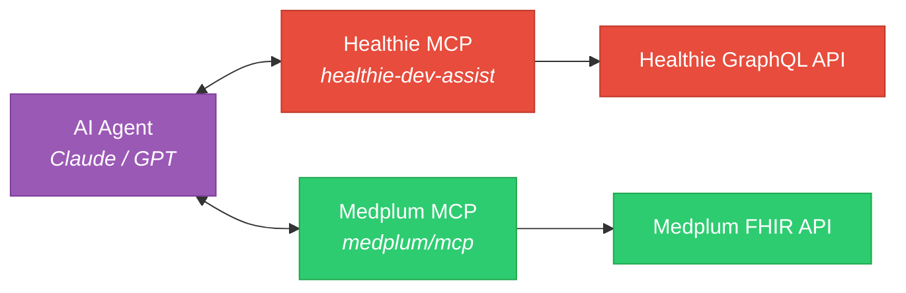
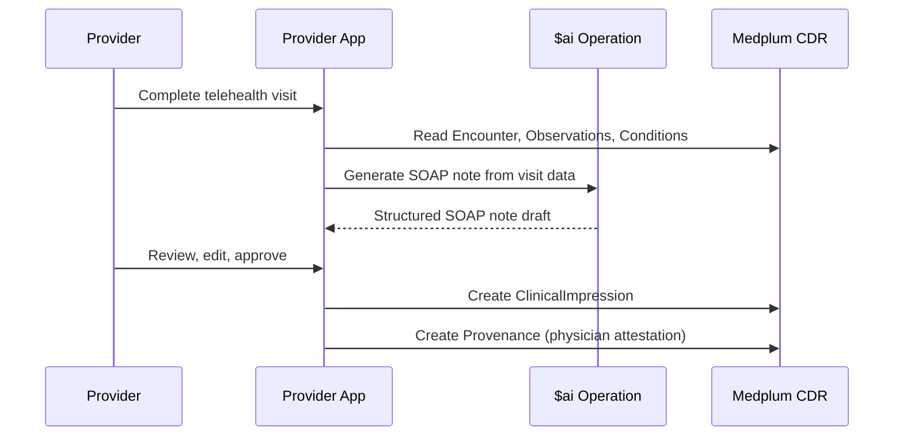
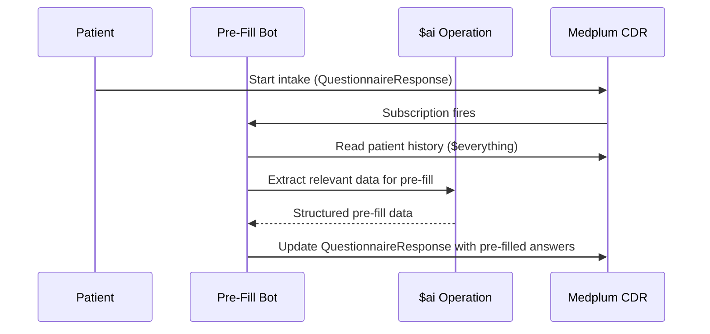
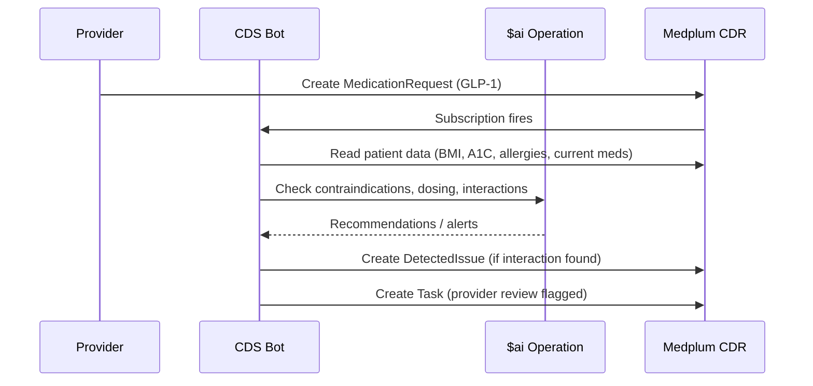

> Medplum's AI capabilities — the $ai FHIR operation, MCP server for AI agents, AWS AI services, and healthcare-specific AI patterns. Source: `packages/docs/docs/ai/`

**See also:** [Developer Experience](Developer%20Experience.md) | [Server Operations](Server%20Operations.md) | [Bots & Subscriptions](Bots%20&%20Subscriptions.md)

---

## Why FHIR + AI

Healthcare AI is an **infrastructure problem**, not just a model problem. Requirements:

| Requirement | How Medplum Solves It |
|-------------|----------------------|
| Programmatic access to clinical data | FHIR R4 REST API — every resource queryable |
| Standardized data format | FHIR resources with SNOMED, LOINC, RxNorm coding |
| Guardrails and audit trail | AccessPolicy scoping + immutable AuditEvent |
| Interoperability | SMART App Launch, Bulk FHIR, MCP |
| Security | OAuth2, HIPAA compliance, encryption at rest/transit |

FHIR's structured format gives LLMs something to reason over — not just free-text notes.

---

## The $ai Operation

Built-in FHIR operation for OpenAI integration. Endpoint: `POST /$ai`

### Capabilities

| Feature | Details |
|---------|---------|
| Models | GPT-4, GPT-3.5-turbo (configurable) |
| Streaming | SSE for real-time token delivery |
| Multi-turn | Conversation history via message array |
| Function calling | FHIR-aware functions for AI-driven operations |
| Context | Patient/encounter data injected into prompts |

### Basic Usage

```typescript
const result = await medplum.executeOperation('$ai', {
  resourceType: 'Parameters',
  parameter: [
    {
      name: 'model',
      valueString: 'gpt-4',
    },
    {
      name: 'message',
      part: [
        { name: 'role', valueString: 'system' },
        { name: 'content', valueString: 'You are a medical assistant. Summarize this patient encounter.' },
      ],
    },
    {
      name: 'message',
      part: [
        { name: 'role', valueString: 'user' },
        { name: 'content', valueString: JSON.stringify(encounterData) },
      ],
    },
  ],
});
```

### FHIR Function Calling

The $ai operation supports function calling where the AI can invoke FHIR operations:

```typescript
// AI can call functions like:
// - searchResources("Patient", { name: "Smith" })
// - readResource("Observation", "abc-123")
// - createResource({ resourceType: "Task", ... })
```

This enables conversational AI that reads and writes clinical data within AccessPolicy constraints.

---

## MCP Server (Model Context Protocol)

Medplum provides a native MCP server for AI agent integration — enables Claude, GPT, and other LLMs to interact with FHIR data via standardized tool calls.

### Available MCP Tools

| Tool | Description |
|------|-------------|
| `fhir-request` | Execute any FHIR REST operation (GET, POST, PUT, DELETE) |
| `search` | Search FHIR resources with parameters |
| `fetch` | Retrieve a specific resource by reference |

### Configuration

```json
{
  "mcpServers": {
    "medplum": {
      "url": "https://api.fhir.openloop.health/mcp",
      "auth": {
        "type": "oauth2",
        "clientId": "mcp-client-id",
        "clientSecret": "mcp-client-secret"
      }
    }
  }
}
```

### OpenLoop Use Cases

| Use Case | How It Works |
|----------|-------------|
| **Migration validation** | AI queries Healthie MCP + Medplum MCP, compares data |
| **SOAP note generation** | AI reads Encounter/Observation data, generates structured note |
| **Clinical decision support** | AI reviews patient data, suggests care plan adjustments |
| **Prior auth drafting** | AI assembles prior auth document from patient/procedure data |
| **Code assistant** | AI writes FHIR queries, bot code, and data transforms with live CDR access |

### Dual-MCP During Migration



---

## AWS AI Services (via Bots)

### AWS Textract — Document OCR

Extract structured data from faxes, scanned forms, insurance cards.

**Example bot:** `examples/medplum-demo-bots/src/textract-bot.ts`

```typescript
// Subscription: DocumentReference created (scanned fax)
export async function handler(medplum: MedplumClient, event: BotEvent): Promise<any> {
  const doc = event.input as DocumentReference;
  const binary = await medplum.readResource('Binary', doc.content[0].attachment.url);

  // Send to Textract
  const textract = new TextractClient({ region: 'us-east-1' });
  const result = await textract.send(new AnalyzeDocumentCommand({
    Document: { Bytes: binary },
    FeatureTypes: ['FORMS', 'TABLES'],
  }));

  // Create Observation resources from extracted data
  // ...
}
```

### AWS Comprehend Medical — Clinical NLP

Extract medical entities (conditions, medications, procedures) from free-text clinical notes.

**Use case:** Parse legacy Healthie notes during migration → extract structured FHIR resources.

---

## AI-Powered Workflow Patterns

### Pattern 1: SOAP Note Assistant



### Pattern 2: Intake Form Pre-Population



### Pattern 3: Clinical Decision Support



---

## OpenLoop Recommendations

1. **Phase 1:** Set up MCP server for migration validation — AI compares Healthie vs Medplum data side-by-side
2. **Phase 1:** Use Textract bot for processing incoming faxes (lab results, referrals)
3. **Phase 2:** Deploy SOAP note assistant for telehealth visits (reduces charting time)
4. **Phase 2:** Implement CDS bot for GLP-1 prescribing safety checks
5. **Phase 3:** Build intake pre-population using patient history + AI extraction
6. **Phase 3:** AI-powered coding assistant (suggest ICD-10/CPT from encounter notes)

---

## Security Considerations

| Concern | Mitigation |
|---------|------------|
| PHI in AI prompts | AccessPolicy scoping — AI only sees what the authenticated user can see |
| AI hallucination in clinical context | Human-in-the-loop — AI generates drafts, providers approve |
| Audit trail | AuditEvent captures every $ai invocation with input/output |
| Data residency | $ai calls OpenAI — ensure BAA is in place, or use Azure OpenAI for HIPAA |
| Model selection | Use GPT-4 for clinical tasks (better reasoning), GPT-3.5-turbo for simple extraction |
