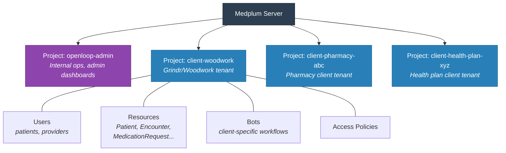
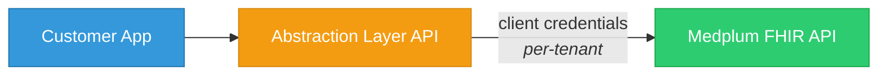

> Fine-grained RBAC and project-based isolation. Critical for OpenLoop's white-label multi-tenant model where each client gets their own data silo.

**See also:** [Architecture & Abstraction Layer](Architecture.md) | [Platform Overview](Platform%20Overview.md)

---

## Why This Matters for OpenLoop

OpenLoop serves 120+ clients as white-label tenants. Each client's patients, providers, encounters, and billing data must be completely isolated. Medplum's access control model maps directly to this requirement.

---

## Projects (Tenant Isolation)

Medplum Projects are the top-level isolation boundary. Each Project has its own:

- Users and credentials
- FHIR resources (Patient, Encounter, etc.)
- Bots and Subscriptions
- Access Policies
- Client applications

**OpenLoop mapping:** One Project per client (Grindr/Woodwork = one Project, a pharmacy chain = another). OpenLoop's internal admin gets a super-admin Project.

### Project Architecture



### Cross-Project Considerations

- Resources are **not shared** between Projects by default
- Shared provider network (OpenLoop's 20K+ clinicians) needs a design decision:
  - **Option A:** Practitioner resources replicated per Project (simple, data duplication)
  - **Option B:** Shared provider Project with cross-project references (complex, less duplication)
  - **Option C:** Provider data in the abstraction layer, not in Medplum per-tenant (cleanest separation)

---

## AccessPolicy Resources

FHIR-native resource that defines what a user or bot can read/write. Applied to individual users, bot accounts, or client applications.

### Structure

```json
{
  "resourceType": "AccessPolicy",
  "name": "Patient Portal Access",
  "resource": [
    {
      "resourceType": "Patient",
      "criteria": "Patient?_id=%patient.id",
      "readonlyFields": ["identifier", "meta"]
    },
    {
      "resourceType": "Appointment",
      "criteria": "Appointment?patient=%patient.id"
    },
    {
      "resourceType": "Observation",
      "criteria": "Observation?patient=%patient.id",
      "readonly": true
    }
  ]
}
```

### Key Concepts

| Concept | Description |
|---------|-------------|
| `resource[].resourceType` | Which FHIR resource type this rule applies to |
| `resource[].criteria` | FHIR search filter — user only sees resources matching this |
| `resource[].readonly` | If true, user can read but not write |
| `resource[].readonlyFields` | Specific fields that cannot be modified |
| `resource[].hiddenFields` | Fields completely hidden from the user |
| `%patient.id` | Variable substitution — resolves to the current user's linked Patient |

### Common Patterns for OpenLoop

**Patient self-service portal:**
- Can read own Patient, Appointment, Observation, MedicationRequest
- Can create QuestionnaireResponse (intake forms)
- Cannot see other patients' data
- Cannot modify clinical records

**Provider (clinician in network):**
- Can read/write Patient, Encounter, Observation, Condition for assigned patients
- Can create MedicationRequest (prescribe)
- Can create DocumentReference (clinical notes)
- Cannot access billing/financial resources

**Client admin (OpenLoop customer's admin):**
- Can read aggregate data for their tenant
- Can manage their own Organization settings
- Cannot access other clients' Projects

**OpenLoop internal admin:**
- Super-admin access across all Projects
- Manages provider network, credentialing
- Access to billing, RCM, analytics

---

## Compartments

FHIR Compartments define which resources "belong to" a given resource. The Patient compartment is the most important — it defines all resources associated with a patient.

**Patient Compartment includes:** Encounter, Observation, Condition, MedicationRequest, Appointment, DocumentReference, Consent, Coverage, Claim, Communication, CarePlan, AllergyIntolerance, etc.

Used with AccessPolicy criteria to restrict a user to only their own data:
```
"criteria": "Observation?patient=%patient.id"
```

---

## Authentication Model

| Method | Use Case |
|--------|----------|
| Email/password | Direct Medplum login (internal admin) |
| Google Auth | SSO for providers/patients |
| External OIDC (Okta, Auth0, Entra) | Enterprise SSO for OpenLoop clients |
| Client credentials (OAuth2) | Server-to-server (abstraction layer → Medplum) |
| SMART on FHIR | EHR-embedded app launch |

### For the Abstraction Layer

The customer-facing API (abstraction layer) authenticates to Medplum via **client credentials** (OAuth2 client_id + client_secret). Each client application gets its own credentials scoped to its Project.



---

## Audit Trail

Medplum automatically creates **AuditEvent** resources for every CRUD operation. No custom audit logging needed.

| Field | What It Captures |
|-------|-----------------|
| `agent` | Who performed the action (user, bot, client app) |
| `entity` | What resource was affected |
| `action` | Create, Read, Update, Delete |
| `recorded` | Timestamp |
| `outcome` | Success or failure |

AuditEvents are immutable — they cannot be modified or deleted. This satisfies HIPAA audit trail requirements.

---

## OpenLoop Implementation Recommendations

1. **One Medplum Project per client** — cleanest isolation, simplest access control
2. **Client credentials per Project** — the abstraction layer uses project-scoped OAuth2 tokens
3. **Shared provider data lives in the abstraction layer** — avoids cross-Project complexity
4. **AccessPolicy per role** — Patient, Provider, Client Admin, OpenLoop Admin
5. **AuditEvent for compliance** — automatic, no custom work needed
6. **Leverage hiddenFields** — hide PHI from client admin dashboards (only show aggregates)
