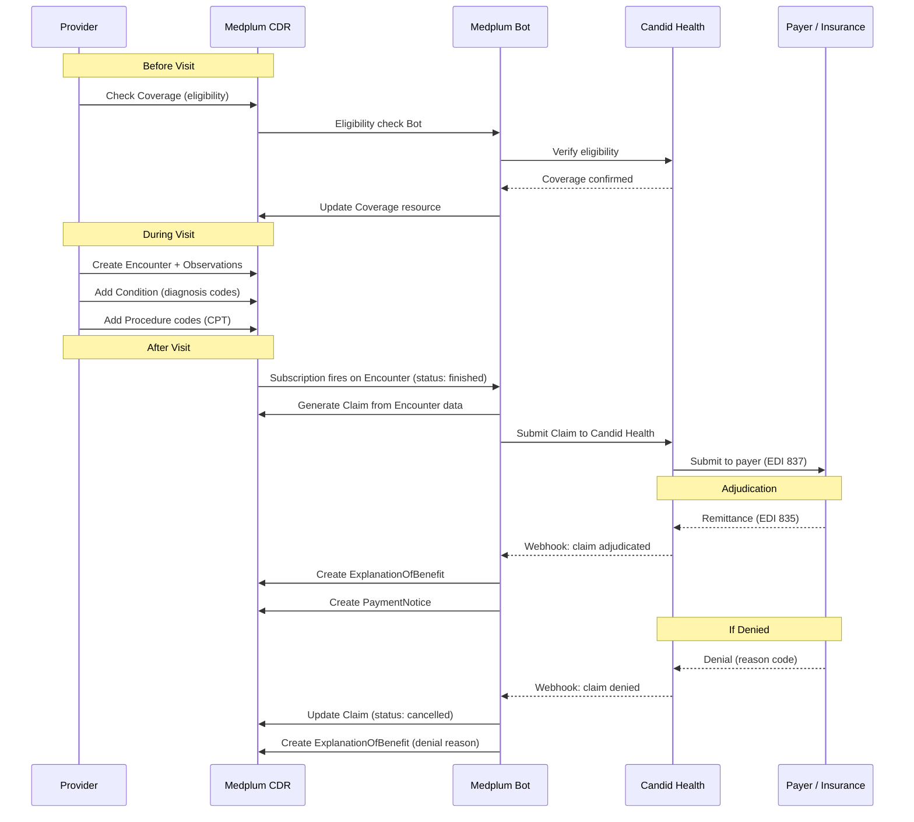
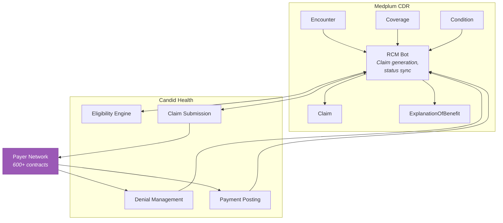

> OpenLoop has 600+ payer contracts and is standing up a dedicated RCM technology team. Candid Health is the Medplum-ecosystem billing partner.

**See also:** [Platform Overview](Platform%20Overview.md) | [Capability Mapping](Capability%20Mapping.md) | [Tech Stack](Tech%20Stack.md)

---

## Current State (Healthie)

Healthie provides built-in billing and insurance features:
- Claims submission (CMS-1500)
- Insurance eligibility verification
- Superbill generation
- Basic revenue cycle tracking

OpenLoop manages 600+ payer contracts including Medicare and Medicaid.

---

## Target State (Medplum + Candid Health)

Medplum stores billing data as FHIR resources. Candid Health (a Medplum first-party integration) handles the operational RCM — claim submission, adjudication tracking, denial management, and payment posting.

---

## Claim Lifecycle

---

## FHIR Resources for Billing

### Pre-Visit

| Resource | Purpose |
|----------|---------|
| **Coverage** | Patient's insurance plan — payer, member ID, group, coverage period |
| **CoverageEligibilityRequest** | Request to verify insurance eligibility |
| **CoverageEligibilityResponse** | Payer's response — eligible services, copay, deductible status |
| **Organization** | The payer organization (insurance company) |

### Encounter & Clinical

| Resource | Purpose |
|----------|---------|
| **Encounter** | The visit — ties clinical data to billing context |
| **Condition** | Diagnosis codes (ICD-10) — primary and secondary |
| **Procedure** | Procedure codes (CPT/HCPCS) — what was done |
| **Observation** | Supporting clinical data for medical necessity |

### Claim Submission

| Resource | Purpose |
|----------|---------|
| **Claim** | The insurance claim — maps to CMS-1500 or UB-04 |
| **ClaimResponse** | Payer's initial response to claim submission |
| **ExplanationOfBenefit** | Full adjudication detail — allowed amounts, adjustments, patient responsibility |

### Payment

| Resource | Purpose |
|----------|---------|
| **PaymentNotice** | Payment notification |
| **PaymentReconciliation** | Reconcile payments against claims |

---

## Candid Health Integration

Candid Health is a modern RCM platform purpose-built for digital health companies. It's listed as a Medplum first-party integration.

| Capability | Details |
|-----------|---------|
| Eligibility verification | Real-time payer eligibility checks |
| Claim submission | Automated claim generation from encounter data |
| Claim scrubbing | Pre-submission validation (coding, payer rules) |
| Denial management | Automated denial tracking, appeal workflows |
| Payment posting | ERA/EOB processing, payment reconciliation |
| Reporting | Revenue analytics, aging reports, denial rates |
| API | REST API + webhooks for real-time status updates |

### Integration Pattern

---

## Key Billing Workflows for OpenLoop

### 1. Insurance Eligibility Check

Run before or at the time of scheduling to verify coverage:
- Real-time 270/271 eligibility transaction via Candid
- Store result as CoverageEligibilityResponse in Medplum
- Update Coverage resource with active/inactive status
- Surface copay/deductible info to the patient-facing app

### 2. Telehealth Claim Generation

After a telehealth encounter completes:
- Bot assembles Claim from Encounter, Condition, Coverage
- Telehealth-specific modifiers: Place of Service 02 (Telehealth), modifier 95 or GT
- Attach diagnosis codes (ICD-10) from Condition resources
- Attach procedure codes (CPT) — common telehealth codes: 99201-99215 (E/M), 90834/90837 (therapy)
- Submit to Candid for scrubbing and payer submission

### 3. Medicare/Medicaid Claims

OpenLoop's 600+ payer contracts include Medicare and Medicaid. Additional requirements:
- NPI validation for rendering and billing provider
- Taxonomy codes for specialty
- State-specific Medicaid rules (telehealth parity varies by state)
- Medicare telehealth eligible CPT code validation

### 4. Patient Responsibility Collection

After adjudication:
- ExplanationOfBenefit shows patient responsibility (copay, coinsurance, deductible)
- Abstraction layer surfaces amount owed to patient-facing app
- Integrate with payment processor (Stripe — Medplum has Bot templates)

---

## OpenLoop Recommendations

1. **Candid Health as primary RCM partner** — aligns with Medplum ecosystem, purpose-built for digital health
2. **Automate claim generation via Bots** — Encounter completion triggers claim creation automatically
3. **Eligibility checks at scheduling** — prevents claim denials from coverage gaps
4. **Telehealth modifier logic in the Bot** — POS 02 and modifier 95/GT applied automatically based on Encounter class
5. **RCM team owns the Bot logic** — the new RCM technology team should own and iterate on claim generation rules
6. **Phase 1 validation** — run parallel billing (Healthie and Medplum/Candid) for pilot client to verify parity
