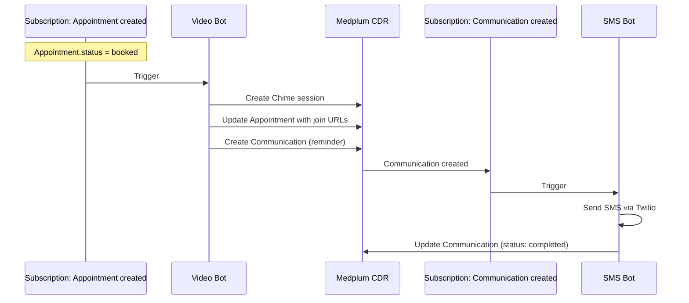

> Deep dive into Medplum's automation engine — Bot execution internals, Subscription evaluation, retry logic, and secrets management. Source: `packages/server/src/`

**See also:** [Developer Experience](Developer%20Experience.md) | [Server Operations](Server%20Operations.md) | [Care Plans & Tasks](Care%20Plans%20&%20Tasks.md)

---

## Bot Execution System

### Runtimes

| Runtime | Config Value | Best For | Key Files |
|---------|-------------|----------|-----------|
| AWS Lambda | `awslambda` | Production — scales independently, OpenLoop's existing pattern | `cloud/aws/deploy.ts`, `cloud/aws/execute.ts` |
| VM Context | `vmcontext` | Development — server-side Node.js VM, no AWS dependency | `bots/vmcontext.ts` |
| Fission | `fission` | Kubernetes — container-based serverless | `cloud/fission/deploy.ts` |

### Lambda Deployment Details

- **Runtime:** `nodejs22.x`
- **Memory:** `1024 MB`
- **Function naming:** `medplum-bot-lambda-{botId}`
- **Handler:** `index.handler`
- **Code format:** `.cjs` or `.mjs` bundled as zip
- **Lambda Layers:** Pre-bundled `@medplum/core`, pdfmake, SSH2, Twilio
- **Deployment flow:** Code stored as Binary resource → zip created → Lambda function updated
- **Retry on deploy:** Exponential backoff when Lambda reports ResourceConflictException

### BotEvent Structure

```typescript
interface BotEvent<T = unknown> {
  readonly bot: Reference<Bot>;         // Reference to the Bot resource
  readonly contentType: string;         // MIME type of input (application/json, x-application/hl7-v2+er7)
  readonly input: T;                    // Trigger payload (FHIR resource, HL7 message, etc.)
  readonly secrets: Record<string, ProjectSetting>;  // Cascaded secrets
  readonly traceId?: string;            // Correlation ID for distributed tracing
  readonly requester?: Reference;       // Who triggered the bot
  readonly headers?: Record<string, string | string[] | undefined>;  // HTTP headers (for webhook bots)
  readonly responseStream?: BotResponseStream;  // For streaming responses
}
```

### Execution Flow

```
1. $execute request received
2. Verify caller has access to Bot resource
3. Dispatch based on bot.runtimeVersion:
   - Lambda → runInLambda()
   - VM → runInVmContext()
   - Fission → executeFissionBot()
4. Generate access token via Login resource
5. Load secrets with cascading priority
6. Write input to storage (S3) for debugging
7. Execute bot handler with BotEvent
8. Return BotExecutionResult { success, logResult, returnValue }
9. Create AuditEvent recording execution outcome
```

### Timeout & Resource Limits

| Runtime | Default Timeout | Max Timeout | Memory |
|---------|----------------|-------------|--------|
| VM Context | 10 seconds | Configurable via `bot.timeout` | Server process memory |
| Lambda | 10 seconds | 900 seconds (15 min) | 1024 MB fixed |
| Fission | 10 seconds | Configurable | Container limits |

**OpenLoop recommendation:** Set `bot.timeout` to 30-60s for bots making external API calls (Stripe, Photon, Chime SDK). Default 10s will cause timeouts.

---

## Secrets Management

### Cascading Priority (lowest → highest)

```
1. Bot project system secrets     (if bot.system = true)
2. Bot project secrets            (general project settings)
3. RunAs project system secrets   (if bot runs in linked project + system = true)
4. RunAs project secrets          (highest priority — execution context)
```

Higher-priority values override lower ones. Secrets stored as `ProjectSetting` resources.

### Access Pattern

```typescript
export async function handler(medplum: MedplumClient, event: BotEvent): Promise<any> {
  // Access secrets via event parameter — NOT global scope
  const stripeKey = event.secrets['STRIPE_SECRET_KEY']?.value;
  const chimeApiKey = event.secrets['CHIME_API_KEY']?.value;

  if (!stripeKey) {
    throw new Error('STRIPE_SECRET_KEY not configured');
  }
}
```

**Security:** Secrets are passed only through the `event.secrets` parameter. They are NOT exposed as environment variables or global state.

### OpenLoop Secret Strategy

| Secret | Scope | Notes |
|--------|-------|-------|
| Stripe API keys | Project-level (per client) | Different keys per client for payment isolation |
| Chime SDK credentials | System-level (shared) | One Chime config, session scoped by Project |
| Photon Health API key | System-level (shared) | Single e-prescribe integration |
| EventBridge bus ARN | System-level (shared) | One event bus for all domains |

---

## Subscription System

### How Subscriptions Fire

```
1. Resource created, updated, or deleted (any CRUD operation)
2. addSubscriptionJobs() called in background job context
3. All active Subscriptions retrieved from database for the project
4. Each subscription's criteria evaluated against the changed resource
5. Matching subscriptions enqueued as BullMQ jobs in Redis
```

### Criteria Evaluation

- Format: FHIR search parameters (e.g., `Patient?active=true`, `Encounter?status=finished`)
- Supports complex filters and FHIRPath expressions
- Access policies checked per subscription author
- Criteria cached during single resource evaluation

### Subscription Channels

#### 1. REST Hook (HTTP POST)

```json
{
  "resourceType": "Subscription",
  "status": "active",
  "criteria": "Encounter?status=finished",
  "channel": {
    "type": "rest-hook",
    "endpoint": "https://api.openloop.health/webhooks/encounter-complete",
    "payload": "application/fhir+json",
    "header": ["Authorization: Bearer xyz"]
  }
}
```

- **Timeout:** 120 seconds per request
- **Signature:** HMAC-SHA256 via `X-Signature` header (if `channel.secret` configured)
- **Success:** HTTP 2xx or 3xx

#### 2. WebSocket (Real-Time)

```typescript
// 1. Get binding token
const token = await medplum.execute('Subscription', subscriptionId, '$get-ws-binding-token');

// 2. Connect WebSocket
const ws = new WebSocket('wss://api.openloop.health/ws/subscriptions-r5');
ws.send(JSON.stringify({ type: 'bind-with-token', payload: { token: token.value } }));

// 3. Receive events
ws.onmessage = (event) => {
  const bundle = JSON.parse(event.data);
  // bundle.entry contains SubscriptionStatus + triggering resource
};
```

- **Backed by Redis** — not the job queue, direct pub/sub
- **Real-time delivery** without queue overhead
- **Auto-cleanup** of expired WebSocket subscriptions

#### 3. Bot Endpoint

```json
{
  "resourceType": "Subscription",
  "status": "active",
  "criteria": "MedicationRequest?status=active",
  "channel": {
    "type": "rest-hook",
    "endpoint": "Bot/abc-123-bot-id"
  }
}
```

Bot receives the triggering resource as `event.input`. Full bot execution capabilities including secrets access.

### Retry Logic

**Queue:** BullMQ on Redis with exponential backoff.

| Attempt | Delay | Cumulative |
|---------|-------|------------|
| 0 | Immediate | 0s |
| 1 | 1s | 1s |
| 2 | 2s | 3s |
| 3 | 4s | 7s |
| 4+ | Continues 2x | Up to ~73 hours across 19 attempts |

- **Default max attempts:** 4 (configurable via Subscription extension)
- **Absolute maximum:** 19 attempts
- **Priority adjustment:** `priority = 1 + attemptsMade` (later retries deprioritized)

### The $resend Operation

Manually re-trigger subscription evaluation for a resource.

```
POST /fhir/R4/Encounter/abc-123/$resend
Content-Type: application/json

{
  "interaction": "update",
  "subscription": "Subscription/xyz-456",
  "verbose": true
}
```

| Parameter | Description |
|-----------|-------------|
| `interaction` | `create`, `update`, or `delete` — determines which subscriptions match |
| `subscription` | Optional — target a specific subscription |
| `verbose` | Enable verbose logging for debugging |

**Requires:** Project admin or super admin authorization.

**Use cases:**
- Re-delivery after webhook endpoint failure
- Re-evaluation after subscription rule changes
- Debugging subscription matching

---

## Event Chain Pattern (Bots Triggering Bots)

Medplum's power pattern: one bot creates a resource → subscription triggers another bot.



**Design rules:**
1. Each bot does ONE thing well
2. Bots communicate via FHIR resources, not direct calls
3. Each link in the chain has its own retry logic
4. AuditEvent trail for every step
5. Any link can be re-triggered via `$resend`

---

## Streaming Responses

For long-running bots (AI generation, large data processing):

```typescript
export async function handler(medplum: MedplumClient, event: BotEvent): Promise<void> {
  if (event.responseStream) {
    event.responseStream.write('Processing started...\n');
    // ... long operation ...
    event.responseStream.write('Complete.\n');
    event.responseStream.end();
  }
}
```

Requires `Accept: text/event-stream` header and `streamingEnabled: true` on the Bot resource.

---

## Custom FHIR Operations via Bots

Define arbitrary operations without server modification:

```json
{
  "resourceType": "OperationDefinition",
  "name": "openloop-assign-provider",
  "code": "assign-provider",
  "resource": ["Patient"],
  "system": false,
  "type": true,
  "instance": true,
  "parameter": [
    { "name": "practitioner", "use": "in", "min": 1, "max": "1", "type": "Reference" }
  ]
}
```

Point the OperationDefinition at a Bot → `POST /Patient/abc-123/$assign-provider` executes the Bot with the operation parameters as input.

**OpenLoop relevance:** Use this for the Partners API abstraction layer. Define custom operations that hide FHIR complexity from non-healthcare clients.
