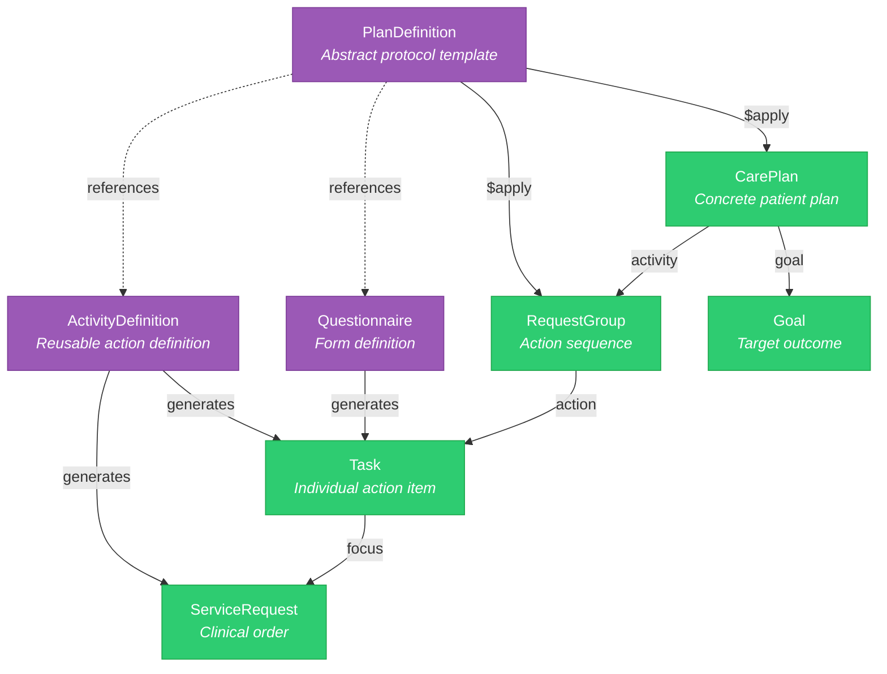
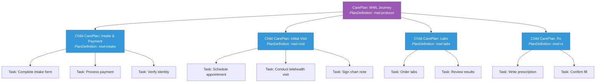
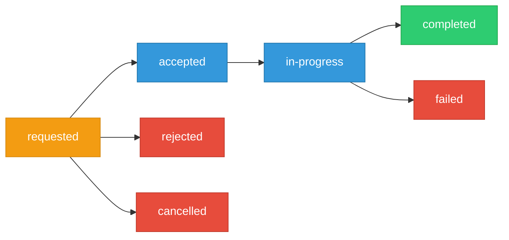

> PlanDefinition, CarePlan, Task, and RequestGroup — the engine for clinical protocol automation. Critical for OpenLoop's CarePlan hierarchy (Intake, Visit, Labs, Rx).

**See also:** [Server Operations](Server%20Operations.md) | [Bots & Subscriptions](Bots%20&%20Subscriptions.md) | [Telehealth](Telehealth.md)

---

## Resource Hierarchy



**Templates** (define once, reuse across patients): PlanDefinition, ActivityDefinition, Questionnaire
**Instances** (created per patient): CarePlan, RequestGroup, Task, ServiceRequest, Goal

---

## PlanDefinition $apply — What It Creates

When you call `POST /PlanDefinition/{id}/$apply` with a subject (Patient), Medplum:

### Input Parameters

```json
{
  "resourceType": "Parameters",
  "parameter": [
    { "name": "subject", "valueString": "Patient/{id}" },
    { "name": "encounter", "valueString": "Encounter/{id}" },
    { "name": "practitioner", "valueString": "Practitioner/{id}" },
    { "name": "organization", "valueString": "Organization/{id}" }
  ]
}
```

### Output Resources Created

| Resource | Details |
|----------|---------|
| **CarePlan** | `status: active`, `intent: plan`, links to RequestGroup, references PlanDefinition |
| **RequestGroup** | `status: active`, `intent: order`, contains action array |
| **Task** (per action) | `status: requested`, `intent: order`, assigned owner via FHIRPath |
| **ServiceRequest** (per ActivityDefinition action) | `status: draft`, linked to Task via `Task.focus` |

### Action Mapping Logic

For each `PlanDefinition.action[]`:

```
1. Check if action has definitionCanonical reference
2. Resolve the referenced resource:
   - Questionnaire → Create Task with Questionnaire as input
   - ActivityDefinition → Create ServiceRequest + Task
   - Other → Create generic Task
3. Apply conditional logic:
   - Evaluate owner from ActivityDefinition extension (FHIRPath)
   - Evaluate performerType from extension
4. Create Task with all computed data
5. Wrap Task in RequestGroupAction
6. Add to RequestGroup.action[]
```

### Task Owner Assignment (FHIRPath)

The `task-elements` extension on ActivityDefinition controls who gets assigned:

```json
{
  "url": "https://medplum.com/fhir/StructureDefinition/task-elements",
  "extension": [
    {
      "url": "owner",
      "valueExpression": {
        "language": "text/fhirpath",
        "expression": "%practitioner"
      }
    },
    {
      "url": "performerType",
      "valueCodeableConcept": {
        "coding": [{ "system": "http://snomed.info/sct", "code": "158965000", "display": "Doctor" }]
      }
    }
  ]
}
```

Variables available in FHIRPath: `%practitioner`, `%organization`, `%subject`

---

## OpenLoop's CarePlan Hierarchy

From the workshop decisions, each patient journey has 4 child CarePlans:



### Implementation Strategy

1. **Create PlanDefinition per vertical** — `mwl-protocol`, `mental-health-protocol`, `derm-protocol`
2. **Each PlanDefinition references child PlanDefinitions** via nested `action[]`
3. **$apply on the parent** creates the full hierarchy in one call
4. **Task status drives workflow progression** — Subscription on Task status changes triggers next steps
5. **Non-technical staff manage protocols** — PlanDefinitions are FHIR data, not code

---

## Task Lifecycle

### Status Flow



### Task Fields

| Field | Purpose | OpenLoop Use |
|-------|---------|-------------|
| `status` | Lifecycle state | Drive workflow progression |
| `businessStatus` | Domain-specific status | "Awaiting provider review", "Pending lab results" |
| `statusReason` | Why current status | "Patient no-show", "Insurance denied" |
| `code` | Task type (SNOMED/LOINC) | Categorize by workflow step |
| `priority` | `routine`, `urgent`, `asap`, `stat` | Triage in provider queues |
| `for` | Patient reference | Always set |
| `owner` | Assigned to (Practitioner/Organization) | Provider assignment |
| `focus` | What the task is about (ServiceRequest, etc.) | Link to clinical order |
| `basedOn` | PlanDefinition that generated this task | Traceability to protocol |
| `input` | Task parameters (e.g., Questionnaire reference) | Form to fill, data to review |
| `output` | Task results | Completed form, lab results |
| `restriction.period` | Due date/SLA | Escalation triggers |

### Automated Task Progression (Bot Pattern)

```typescript
// Subscription: Task?status=completed
export async function handler(medplum: MedplumClient, event: BotEvent): Promise<any> {
  const task = event.input as Task;

  // Check if this is an intake task
  if (task.code?.coding?.[0]?.code === 'intake-complete') {
    // Find the parent CarePlan
    const carePlan = await medplum.searchOne('CarePlan', {
      'activity-reference': `Task/${task.id}`,
    });

    // Check if all intake tasks are complete
    const allTasks = await medplum.searchResources('Task', {
      'based-on': carePlan?.basedOn?.[0]?.reference,
      'status:not': 'completed',
    });

    if (allTasks.length === 0) {
      // All intake tasks done — activate the Visit child CarePlan
      const visitPlan = await medplum.searchOne('CarePlan', {
        'part-of': `CarePlan/${carePlan?.id}`,
        title: 'Initial Visit',
      });
      if (visitPlan) {
        await medplum.updateResource({ ...visitPlan, status: 'active' });
      }
    }
  }
}
```

---

## Questionnaire → Structured Data Extraction

### The $extract Operation

Converts QuestionnaireResponse answers into discrete FHIR resources automatically.

```json
{
  "resourceType": "Questionnaire",
  "item": [
    {
      "linkId": "weight",
      "text": "Current weight (lbs)",
      "type": "decimal",
      "extension": [{
        "url": "http://hl7.org/fhir/uv/sdc/StructureDefinition/sdc-questionnaire-extraction",
        "valueCode": "observation"
      }],
      "code": [{ "system": "http://loinc.org", "code": "29463-7", "display": "Body weight" }]
    },
    {
      "linkId": "bmi",
      "text": "BMI",
      "type": "decimal",
      "code": [{ "system": "http://loinc.org", "code": "39156-5", "display": "BMI" }]
    }
  ]
}
```

When a QuestionnaireResponse is submitted, call `$extract`:

```
POST /QuestionnaireResponse/{id}/$extract
```

Output: Bundle of Observation resources with proper LOINC coding, patient reference, and encounter context.

**OpenLoop relevance:** This replaces the "Bot parses QuestionnaireResponse" pattern from the workshop design. `$extract` does it natively — no custom bot code for standard vitals/BMI extraction.

### Extraction Modes

| Mode | Description | When to Use |
|------|-------------|-------------|
| **Template-based** | Maps items to FHIR resources via embedded definitions | Standard forms (intake, vitals) |
| **FHIRPath-based** | Uses FHIRPath expressions for complex mappings | Custom data transformations |
| **Bot-based** | Custom bot triggered by QuestionnaireResponse Subscription | Non-standard extraction logic |

---

## PlanDefinition Builder (React Component)

`@medplum/react` includes a visual editor for PlanDefinition resources:

```typescript
import { PlanDefinitionBuilder } from '@medplum/react';

<PlanDefinitionBuilder
  value={planDefinition}
  onSubmit={(updated) => medplum.updateResource(updated)}
/>
```

**Features:**
- Add/remove/reorder actions
- Link actions to ActivityDefinition or Questionnaire
- Set timing rules (duration, frequency)
- Define action sequences and dependencies

**OpenLoop relevance:** Non-technical clinical ops staff can manage care protocols (MWL, mental health, derm) without code changes. This directly supports the workshop decision that "business logic lives in FHIR data, not code."

---

## RequestGroup Display

```typescript
import { RequestGroupDisplay } from '@medplum/react';

<RequestGroupDisplay value={requestGroup} />
```

Renders the action hierarchy visually — shows task relationships, status, and sequence.

---

## Key Reference Apps

| App | Path | What to Learn |
|-----|------|---------------|
| **medplum-task-demo** | `examples/medplum-task-demo/` | Full task lifecycle — create, assign, complete, delete, view queues |
| **medplum-provider** | `examples/medplum-provider/` | Encounter-driven task creation via PlanDefinition$apply |
| **medplum-patient-intake-demo** | `examples/medplum-patient-intake-demo/` | Questionnaire → QuestionnaireResponse → extraction |

---

## Migration Sequencing for Care Plans

From Medplum's migration docs (`packages/docs/docs/migration/`):

**Recommended order for loading care plan resources:**

```
1. ValueSet / CodeSystem (terminology for task types, status codes)
2. Questionnaire (intake forms, assessment tools)
3. ActivityDefinition (reusable clinical actions)
4. PlanDefinition (care protocols — references ActivityDefinition + Questionnaire)
5. Subscription (trigger Bots on Task status changes)
6. Bot (workflow automation)
```

Load templates before instances. PlanDefinitions reference ActivityDefinitions which reference Questionnaires — follow the dependency graph.
