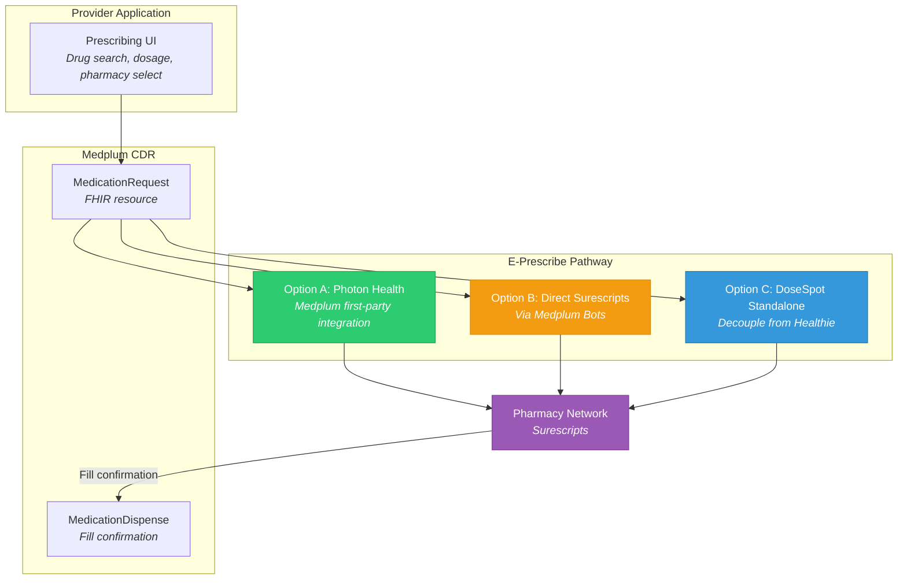
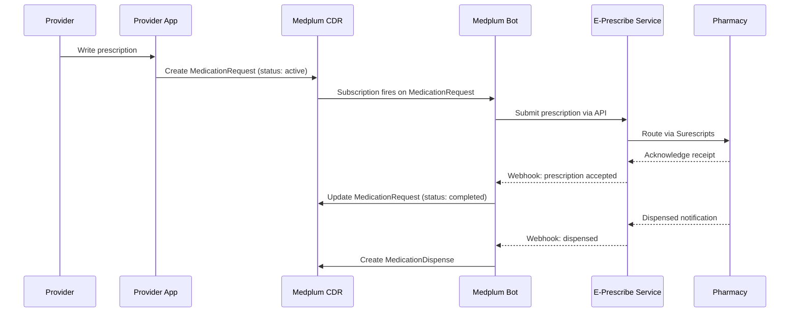

> Medplum is EPCS-certified. Replacing DoseSpot (via Healthie) with native FHIR-based prescribing is a key migration driver.

**See also:** [Platform Overview](Platform%20Overview.md) | [Capability Mapping](Capability%20Mapping.md) | [FHIR Glossary](FHIR%20R4%20Glossary.md)

---

## Current State (Healthie + DoseSpot)

OpenLoop currently prescribes via DoseSpot, integrated through Healthie. DoseSpot handles:
- Prescription writing and drug database lookup
- Pharmacy routing (Surescripts network)
- EPCS (Electronic Prescribing for Controlled Substances) — DEA-compliant
- Drug interaction and allergy checking
- Prescription history

**Limitation:** DoseSpot is tightly coupled to Healthie. Post-migration, a new e-prescribe pathway is needed.

---

## Target State (Medplum + FHIR Prescribing)

Medplum supports e-prescribing natively via FHIR MedicationRequest resources. For EPCS, Medplum is certified and can integrate with e-prescribe networks.

### Integration Options



### Option A: Photon Health (Recommended)

Medplum lists Photon Health as a first-party integration partner for e-prescribing.

| Feature | Details |
|---------|---------|
| Surescripts connectivity | Full NCPDP/Surescripts routing |
| EPCS | DEA-compliant identity proofing and two-factor signing |
| Drug database | Commercial drug database with formulary data |
| Pharmacy network | National pharmacy directory |
| API | REST API + webhooks |
| FHIR mapping | MedicationRequest → Photon Rx → Surescripts → MedicationDispense |

**Integration pattern:** Medplum Bot listens for MedicationRequest creation → calls Photon API to submit prescription → Photon routes to pharmacy via Surescripts → Photon webhook returns fill status → Bot creates MedicationDispense.

### Option B: Direct Surescripts via Bots

Build custom Surescripts integration using Medplum Bots. Requires Surescripts certification (6-12 months).

**Not recommended** for initial migration — certification timeline too long. Consider for long-term if cost savings justify it.

### Option C: DoseSpot Standalone

Decouple DoseSpot from Healthie and integrate directly. DoseSpot offers standalone API access.

**Viable as a bridge strategy** — keep DoseSpot during Phase 1-2, migrate to Photon in Phase 3.

---

## Prescription Workflow (FHIR)



---

## FHIR Resources for Prescribing

| Resource | Purpose |
|----------|---------|
| **MedicationRequest** | The prescription itself — medication, dosage, quantity, refills, prescriber, patient |
| **MedicationDispense** | Pharmacy fill record — what was actually dispensed, when, by whom |
| **Medication** | Drug reference — code (RxNorm), form, ingredients |
| **MedicationStatement** | Patient's reported medication usage (self-reported, may differ from prescriptions) |
| **AllergyIntolerance** | Drug allergies — checked before prescribing |
| **DetectedIssue** | Drug interaction alerts |

### MedicationRequest Example

```json
{
  "resourceType": "MedicationRequest",
  "status": "active",
  "intent": "order",
  "medicationCodeableConcept": {
    "coding": [{
      "system": "http://www.nlm.nih.gov/research/umls/rxnorm",
      "code": "860975",
      "display": "Semaglutide 0.25 MG/0.5ML Pen Injector"
    }]
  },
  "subject": { "reference": "Patient/abc-123" },
  "requester": { "reference": "Practitioner/def-456" },
  "dosageInstruction": [{
    "text": "Inject 0.25mg subcutaneously once weekly for 4 weeks",
    "timing": { "repeat": { "frequency": 1, "period": 1, "periodUnit": "wk" } },
    "route": {
      "coding": [{ "system": "http://snomed.info/sct", "code": "34206005", "display": "Subcutaneous route" }]
    },
    "doseAndRate": [{
      "doseQuantity": { "value": 0.25, "unit": "mg", "system": "http://unitsofmeasure.org", "code": "mg" }
    }]
  }],
  "dispenseRequest": {
    "numberOfRepeatsAllowed": 3,
    "quantity": { "value": 1, "unit": "pen", "system": "http://unitsofmeasure.org" },
    "expectedSupplyDuration": { "value": 28, "unit": "days" }
  }
}
```

---

## EPCS-Specific Requirements

EPCS (Electronic Prescribing for Controlled Substances) adds requirements beyond standard e-prescribe:

| Requirement | Details |
|-------------|---------|
| **DEA Registration** | Prescriber must have active DEA number |
| **Identity Proofing** | Prescriber identity verified to NIST IAL2 (see [Identity & Consent](Identity%20&%20Consent.md)) |
| **Two-Factor Signing** | Each controlled substance Rx requires 2FA (hardware token, biometric, or push notification) |
| **Audit Trail** | All EPCS actions must be logged with tamper-evident audit trail |
| **DEA Schedule Validation** | System must validate prescriber's DEA schedule authority (II-V) |
| **Logical Access Controls** | Role-based access — only authorized prescribers can write controlled Rx |

Medplum's EPCS certification means it satisfies the DEA's audit trail and access control requirements at the platform level. The identity proofing and two-factor signing are handled by the e-prescribe service (Photon, DoseSpot).

---

## OpenLoop Recommendations

1. **Phase 1:** Use Photon Health as primary e-prescribe integration — aligns with Medplum ecosystem
2. **Bridge strategy:** Keep DoseSpot running during dual-run period if Photon isn't ready for all use cases
3. **GLP-1 is a key workflow** — Medical Weight Loss is a top clinical delivery area. Validate semaglutide/tirzepatide prescribing end-to-end early
4. **EPCS testing in Phase 1** — validate controlled substance workflow with pilot client before broad rollout
5. **Drug interaction checks** — ensure chosen e-prescribe service provides allergy/interaction alerts that map to AllergyIntolerance resources
