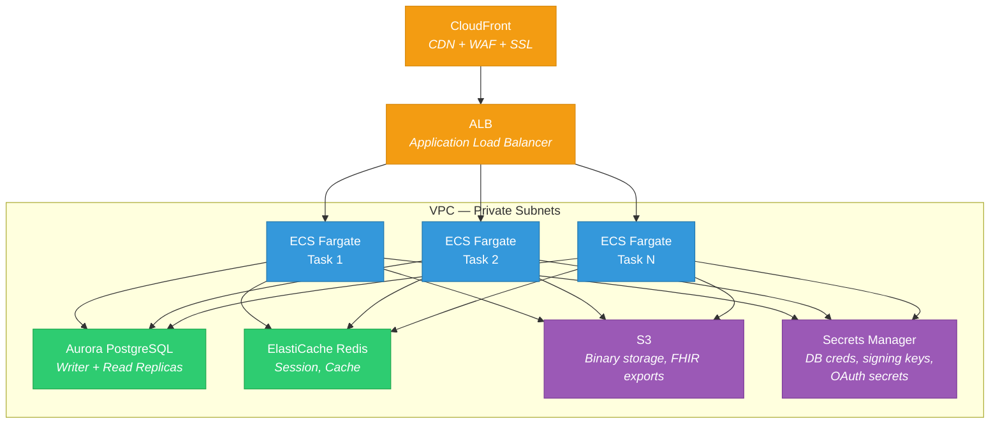
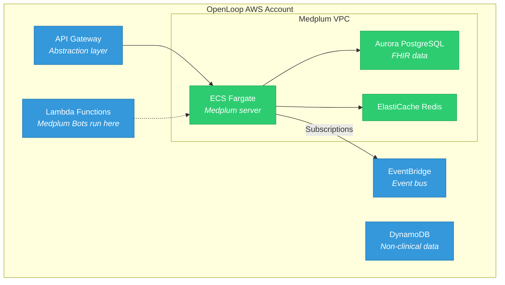

> Production deployment via AWS CDK. Aligns directly with OpenLoop's existing AWS/CDK/Fargate infrastructure.

**See also:** [Platform Overview](Platform%20Overview.md) | [Access Control](Access%20Control%20&%20Multi-Tenancy.md) | [Migration Phases](Phases.md)

---

## Deployment Options

| Option | Use Case | When to Use |
|--------|----------|-------------|
| Docker Compose | Local dev | Individual developer machines, CI pipelines |
| AWS CDK | Production & staging | OpenLoop's target deployment |
| Medplum Cloud | Managed hosting | Quick prototyping (SOC2, HIPAA BAA included) |

---

## AWS CDK Architecture



### AWS Services Used

| Component | AWS Service | Purpose |
|-----------|-------------|---------|
| Compute | ECS Fargate | Medplum server containers (no EC2 management) |
| Database | Aurora PostgreSQL | FHIR resource storage, search indices |
| Cache | ElastiCache Redis | Session management, search caching |
| CDN | CloudFront | Static assets, SSL, edge caching |
| Storage | S3 | Binary resources (PDFs, images, FHIR exports) |
| Secrets | Secrets Manager | Database credentials, signing keys |
| DNS | Route 53 | Domain management (fhir.openloop.health) |
| Certificates | ACM | SSL/TLS certificates |
| Load Balancer | ALB | HTTPS termination, health checks |
| Logs | CloudWatch | Container logs, metrics |
| WAF | AWS WAF | Web application firewall (optional, recommended) |

---

## CDK Configuration

The Medplum CDK stack is configured via a JSON settings file. Key parameters for OpenLoop:

### Core Settings

```json
{
  "name": "openloop-medplum",
  "region": "us-east-1",
  "accountNumber": "123456789012",
  "domainName": "fhir.openloop.health",
  "apiDomainName": "api.fhir.openloop.health",
  "appDomainName": "app.fhir.openloop.health",
  "storageDomainName": "storage.fhir.openloop.health",
  "apiPort": 8103,
  "storagePublicKey": "...",
  "maxAzs": 2,
  "rdsInstances": 1,
  "desiredServerCount": 2,
  "serverMemory": 4096,
  "serverCpu": 2048,
  "serverImage": "medplum/medplum-server:latest"
}
```

### Scaling Settings

| Parameter | Description | Recommended |
|-----------|-------------|-------------|
| `desiredServerCount` | Base number of Fargate tasks | 2 (minimum for HA) |
| `serverMemory` | Memory per task (MB) | 4096 for production |
| `serverCpu` | CPU per task (units, 1024 = 1 vCPU) | 2048 for production |
| `maxAzs` | Availability zones | 2–3 |
| `rdsInstances` | Aurora instances (1 writer + N readers) | 2+ for production |

### Database Settings

| Parameter | Description | Notes |
|-----------|-------------|-------|
| `rdsInstanceType` | Aurora instance size | `db.r6g.large` minimum for production |
| `rdsInstances` | Read replicas + 1 writer | Scale reads horizontally |
| `databaseProxyEnabled` | RDS Proxy for connection pooling | Recommended for Lambda Bots |

### Storage Settings

| Parameter | Description | Notes |
|-----------|-------------|-------|
| `storageBucketName` | S3 bucket for Binary resources | Auto-created by CDK |
| `binaryStorage` | Storage backend (`s3:BUCKET_NAME`) | S3 for production |

---

## Networking & Security

### VPC Design

- Medplum CDK creates its own VPC by default
- **For OpenLoop:** Consider deploying into existing VPC via `vpcId` parameter, or VPC peering
- Private subnets for database and cache (no public internet access)
- Public subnets for ALB only
- NAT Gateway for outbound internet from private subnets (Bots making external API calls)

### Security Hardening

| Layer | Control |
|-------|---------|
| Network | VPC private subnets, security groups, NACLs |
| Transport | TLS everywhere (CloudFront → ALB → Fargate) |
| WAF | AWS WAF rules on CloudFront (OWASP Top 10, rate limiting) |
| Auth | OAuth2 + SMART on FHIR, no anonymous access |
| Encryption at rest | Aurora encryption, S3 SSE, ElastiCache encryption |
| Encryption in transit | TLS 1.2+ enforced |
| Secrets | AWS Secrets Manager (not environment variables) |
| Access | IAM roles per service, least privilege |

### Connecting to OpenLoop's Existing Services



**VPC peering or PrivateLink** between Medplum VPC and existing OpenLoop VPC for the abstraction layer to reach Medplum without traversing public internet.

---

## Monitoring & Observability

| Tool | What It Monitors |
|------|-----------------|
| Datadog (sidecar) | Application metrics, request latency, error rates |
| CloudWatch | Container logs, ECS metrics, RDS metrics |
| Medplum AuditEvent | All FHIR CRUD operations (built-in) |
| CloudWatch Alarms | Auto-scaling triggers, error rate thresholds |

### Key Metrics to Watch

| Metric | Threshold | Action |
|--------|-----------|--------|
| API latency (p95) | > 500ms | Scale Fargate tasks or RDS readers |
| RDS CPU utilization | > 70% | Add read replicas |
| RDS connections | > 80% max | Enable RDS Proxy |
| ECS task count | At max | Increase auto-scaling ceiling |
| 5xx error rate | > 1% | Investigate, check logs |
| Disk IOPS (Aurora) | Sustained high | Upgrade instance type |

---

## Alignment with OpenLoop Stack

| OpenLoop Current | Medplum AWS | Integration |
|-----------------|-------------|-------------|
| AWS (same account) | AWS CDK | Same account or cross-account |
| AWS CDK (IaC) | AWS CDK | Same toolchain, same deploy pipeline |
| Aurora PostgreSQL | Aurora PostgreSQL | Medplum manages its own cluster |
| Lambda (compute) | Bots on Lambda | Bots deploy as Lambda functions |
| EventBridge | Subscriptions | Bridge: Subscription → Bot → EventBridge |
| S3 (data lake) | S3 (binary storage) | Same service, different buckets |
| Athena (analytics) | Athena on FHIR exports | Bulk FHIR → S3 → Athena queries |
| CloudWatch / Datadog | CloudWatch + Datadog sidecar | Unified observability |

---

## Key Reference URLs

See [All Links — Medplum](References.md#medplum-target-state) for consolidated URLs.
