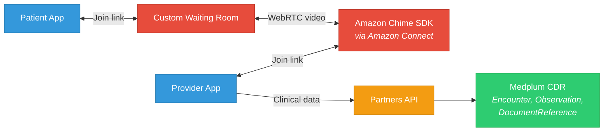
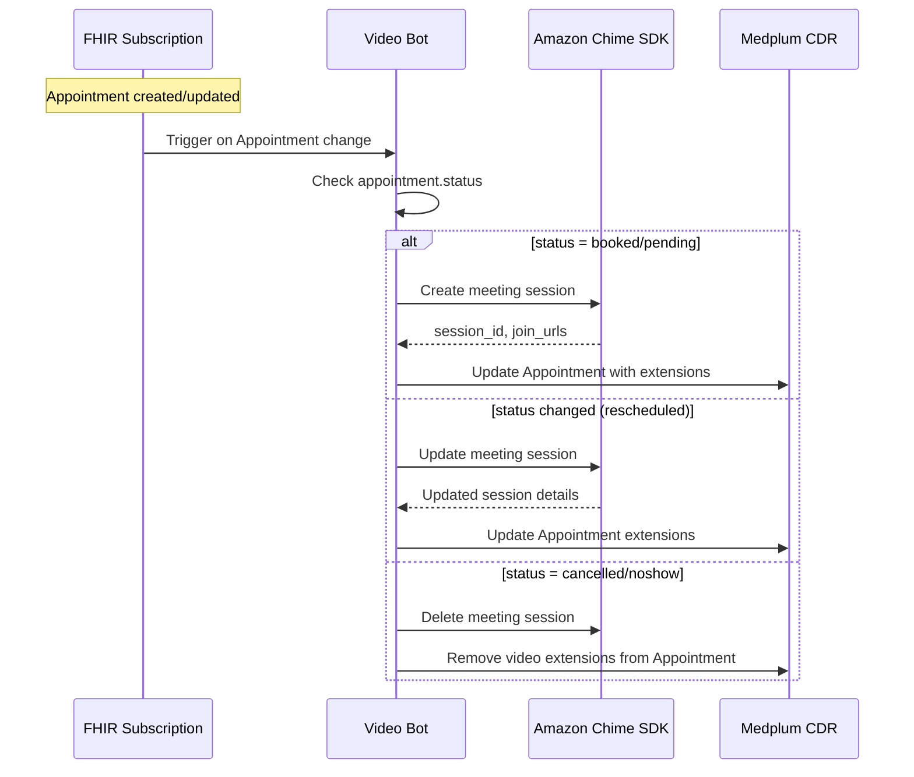
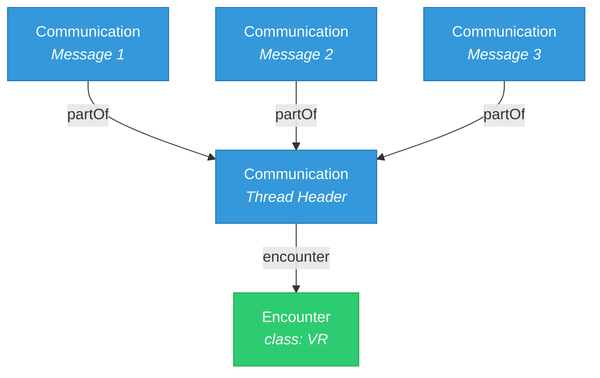
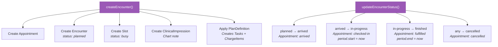
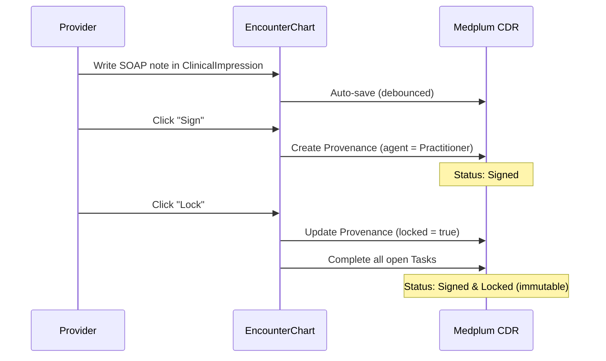
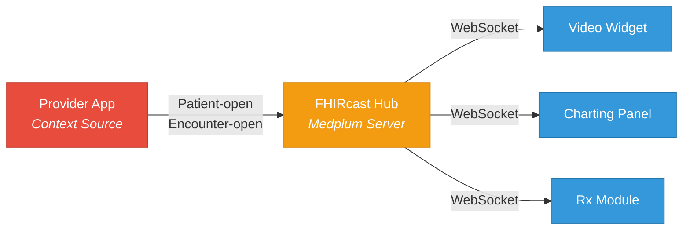
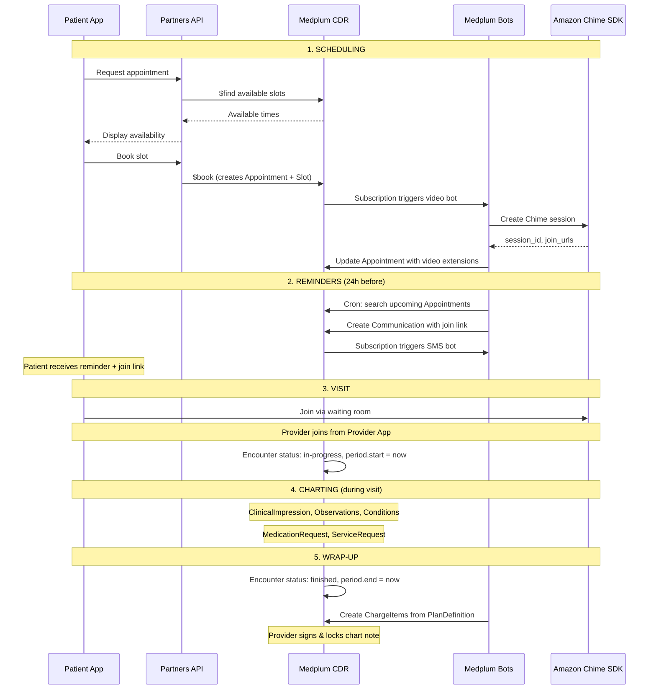
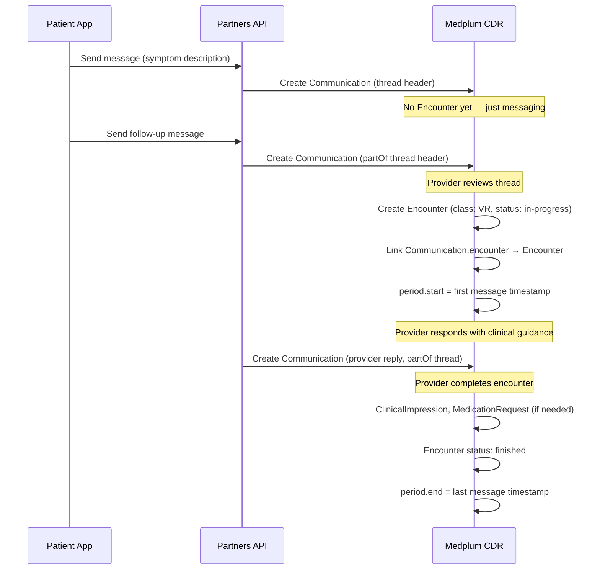

# Telehealth with Medplum

> Medplum has no native video — by design. It provides the clinical infrastructure layer (encounters, scheduling, charting, prescriptions) while video is handled externally. OpenLoop is migrating from Doxy.me to a proprietary system using Amazon Chime SDK. This doc covers the full telehealth lifecycle from repo code analysis through OpenLoop's production architecture.

**See also:** [Platform Overview](Platform%20Overview.md) | [OpenLoop Feature Map](OpenLoop%20Feature%20Map.md) | [Capability Mapping](../Migration/Capability%20Mapping.md)

---

## What Medplum Provides vs. Doesn't

| Medplum Provides | Medplum Does Not Provide |
|------------------|--------------------------|
| Encounter lifecycle management | Video/audio streaming |
| Appointment scheduling ($book, $find) | WebRTC media servers |
| FHIR resource storage (notes, vitals, Rx) | Recording/transcription |
| Bot automation (create meetings, reminders) | Virtual waiting rooms |
| FHIRcast context synchronization | Screen sharing |
| SMART on FHIR app embedding | Video quality optimization |
| AccessPolicy for participant control | TURN/STUN servers |

---

## OpenLoop's Video Architecture

### Decision Made: Amazon Chime SDK

| Attribute | Detail |
|-----------|--------|
| **Previous provider** | Doxy.me |
| **Current/target** | Amazon Chime SDK + Amazon Connect |
| **Architecture** | Custom waiting room with join links for both physicians and patients |
| **MedPlum integration** | Bots run event-driven to generate join links synchronously during appointment creation |
| **AWS-native** | Chime SDK is AWS — aligns with OpenLoop's infrastructure |



### Integration Approach

1. **Video is infrastructure, not EHR** — treat it as a separate service, not part of Medplum
2. **FHIR hooks on Chime events** — session start/end automatically creates/updates Encounter resources via a MedPlum Bot
3. **Join links via Bot** — MedPlum Bot generates Chime join links synchronously during appointment creation (event-driven, not async)
4. **Appointment extensions** — store join URLs (patient + provider) as FHIR extensions on the Appointment resource
5. **Encounter class VR** — all telehealth encounters use the `VR` (virtual) class code

---

## Reference Patterns from the Medplum Repo

### Zoom Bot — The Canonical Video Integration Pattern

**Path:** `examples/medplum-demo-bots/src/zoom-bots/zoom-create-meeting.ts` (386 lines)

The Zoom bot demonstrates how to integrate any video provider with Medplum. Adapt this pattern for Chime SDK — the FHIR extension storage, Bot trigger mechanism, and lifecycle management all remain identical.



**How meeting details are stored — FHIR Extensions on Appointment:**

```json
{
  "resourceType": "Appointment",
  "status": "booked",
  "extension": [{
    "url": "https://openloop.health/telehealth",
    "extension": [
      { "url": "session-id", "valueString": "abc-123-meeting" },
      { "url": "patient-join-url", "valueString": "https://video.openloop.health/join/abc123" },
      { "url": "provider-join-url", "valueString": "https://video.openloop.health/host/abc123" }
    ]
  }]
}
```

**Key patterns from the Zoom bot (apply to Chime):**

1. **Secrets via `event.secrets`** — credentials stored in Bot configuration, not in code
2. **Idempotent updates** — checks for existing session extension before creating. Updates if exists, creates if not.
3. **Full cleanup on cancellation** — deletes the video session AND removes extensions from the Appointment
4. **Extension namespacing** — nested extensions under a parent URL keep the Appointment clean

---

### Appointment Reminder Bot — Video Link Distribution

**Path:** `examples/medplum-demo-bots/src/appointment-bots/send-appointment-reminders.ts`

Runs on a cron schedule (daily at 7:00 AM). Extracts video join links and sends reminders:

```typescript
// Extract join URL from Appointment extensions
const joinLink = appointment.extension?.find(
  (e) => e.url === 'https://openloop.health/telehealth'
)?.extension?.find(
  (e) => e.url === 'patient-join-url'
)?.valueString;

// Build reminder message with video link
let message = `Hi ${firstName}, reminder: appointment with ${providerName} at ${appointmentTime}.`;
if (joinLink) {
  message += `\n\nJoin your visit: ${joinLink}`;
}

// Create Communication resource (triggers SMS bot downstream)
await medplum.createResource({
  resourceType: 'Communication',
  status: 'in-progress',
  subject: createReference(patient),
  payload: [{ contentString: message }],
  basedOn: [createReference(appointment)],
});
```

**Pattern:** Bot creates a `Communication` resource. A second bot subscribed to Communication sends the actual SMS (via Twilio) and updates status to `completed`. This is the Medplum event chain pattern — bots triggering bots.

---

### Async Encounters — Chat-Based Telehealth

**Path:** `packages/docs/docs/communications/async-encounters/async-encounters.md`

Medplum has first-class support for asynchronous telehealth. Each async session (SMS chain, chat thread, email exchange) maps to FHIR as:



**Key rules:**
- One `Encounter` per session, `class` = `VR` (virtual)
- Thread header `Communication` links to Encounter via `Communication.encounter`
- Individual messages link to the thread header via `Communication.partOf`
- Multi-patient sessions use parent/child Encounters (parent = session, children = per-patient)

**OpenLoop relevance:** Many service lines (weight management, dermatology, mental health) use async messaging heavily. This replaces Healthie's in-app messaging with FHIR-native threading.

---

### Chat Demo — Creating Encounters from Threads

**Path:** `examples/medplum-chat-demo/src/components/actions/CreateEncounter.tsx`

Turns an ad-hoc conversation into a tracked clinical encounter:

```typescript
const defaultEncounter = {
  resourceType: 'Encounter',
  status: 'in-progress',
  class: {
    system: 'http://terminology.hl7.org/CodeSystem/v3-ActCode',
    code: 'VR',
    display: 'virtual',
  },
  subject: getEncounterSubject(communication),     // Extract Patient from recipients
  participant: communication.recipient,             // All thread participants
  period: await getEncounterPeriod(communication),  // First message → last message
};
```

- **`getEncounterPeriod()`** calculates start/end from message timestamps
- **`getEncounterSubject()`** filters recipients for `Patient/` references
- After creating the Encounter, PATCHes the Communication to link it

---

## Encounter Lifecycle

**Path:** `examples/medplum-provider/src/utils/encounter.ts`



**`createEncounter()` does all of this in one call:**

1. Creates `Appointment` with participants and time
2. Creates `Encounter` referencing the Appointment
3. Creates `Slot` (if Schedule provided) to mark the time as busy
4. Creates `ClinicalImpression` for the provider's chart note
5. Applies `PlanDefinition` via `$apply` — auto-generates `Task` and `ChargeItem` resources

**Status sync:**

| Encounter Status | Appointment Status | Auto-set Fields |
|-----------------|-------------------|-----------------|
| `planned` | (no change) | — |
| `arrived` | `arrived` | — |
| `in-progress` | `checked-in` | `period.start = now` |
| `finished` | `fulfilled` | `period.end = now` |
| `cancelled` | `cancelled` | — |

---

## Charting During Telehealth Visits

**Path:** `examples/medplum-provider/src/components/encounter/EncounterChart.tsx`

Two-tab interface:

**Tab 1 — Notes & Tasks:**
- `ClinicalImpression` for unstructured SOAP notes (auto-saved with debounce)
- `Task` list for care plan items (generated from PlanDefinition)
- Chart note status: Unsigned → Signed → Signed & Locked
- Signature recorded via `Provenance` resource (legal attestation)

**Tab 2 — Details & Billing:**
- `ChargeItem` management for encounter billing
- `Claim` auto-created from ChargeItems
- Encounter metadata (status, period, participants)



---

## Scheduling

**Path:** `packages/docs/docs/scheduling/`

| Resource | Purpose |
|----------|---------|
| `ActivityDefinition` | Defines appointment types (e.g., "15-min telehealth follow-up") with default constraints |
| `Schedule` | Provider/location/device availability. One Schedule per actor. |
| `Slot` | Time blocks — only created for booked or blocked times (implicit availability model) |
| `Appointment` | The booked visit. Links to Schedule, Slot, and eventually Encounter. |

**Server operations:**

| Operation | Purpose |
|-----------|---------|
| `$find` | Find available slots for a given Schedule, date range, and service type |
| `$book` | Book an appointment (creates Slot + Appointment atomically) |
| `$hold` | Temporarily hold a slot during checkout |
| `$cancel` | Cancel an appointment and release the slot |

**OpenLoop relevance:** The implicit availability model (time is free by default, Slots only created for booked/blocked time) is efficient for 20K+ providers.

---

## FHIRcast — Real-Time Context Synchronization

**Path:** `packages/docs/docs/fhircast/`

Medplum implements FHIRcast STU3 — lightweight pub/sub for synchronizing clinical context across apps via WebSockets.



**Telehealth use case:** When a provider opens a telehealth encounter, FHIRcast notifies the video widget, charting panel, and e-prescribe module to all load the same patient/encounter context simultaneously.

**Supported events:** `Patient-open`, `Patient-close`, `Encounter-open`, `Encounter-close`, `DiagnosticReport-update`, `DiagnosticReport-select`

---

## SMART on FHIR — Embedding Apps

**Path:** `packages/docs/docs/integration/smart-app-launch.md`

Medplum implements SMART App Launch 2.0.0. For telehealth, this enables embedded clinical tools (decision support, medication lookup) to launch with patient + encounter context.

**Custom identifiers for OpenLoop:**

```json
{
  "launchIdentifierSystems": [
    { "resourceType": "Patient", "system": "https://openloop.health/patient-id" },
    { "resourceType": "Encounter", "system": "https://openloop.health/visit-id" }
  ]
}
```

This lets SMART apps use OpenLoop's internal IDs instead of Medplum FHIR IDs — critical for the Partners API.

---

## Complete Visit Flows

### Synchronous Video Visit



### Async Messaging Visit



---

## FHIR Resource Map by Visit Phase

### Pre-Visit

| Resource | Purpose | Key Fields |
|----------|---------|------------|
| `Schedule` | Provider availability | `actor`, SchedulingParameters extension |
| `Slot` | Booked time block | `schedule`, `status: busy`, `start/end` |
| `Appointment` | Scheduled visit | `participant`, `start`, video extension |
| `Communication` | Reminder messages | `payload`, `basedOn: Appointment` |

### During Visit

| Resource | Purpose | Key Fields |
|----------|---------|------------|
| `Encounter` | The visit record | `class: VR`, `status`, `period`, `participant` |
| `ClinicalImpression` | SOAP note | `encounter`, `description`, `finding` |
| `Observation` | Vitals / measurements | `code` (LOINC), `value[x]`, `encounter` |
| `Condition` | Diagnoses | `code` (ICD-10), `category`, `encounter` |
| `Communication` | Chat messages (async) | `encounter`, `partOf`, `payload` |

### Post-Visit

| Resource | Purpose | Key Fields |
|----------|---------|------------|
| `MedicationRequest` | Prescriptions | `medication`, `dosageInstruction`, `encounter` |
| `ServiceRequest` | Lab/imaging orders | `code`, `subject`, `encounter` |
| `DocumentReference` | Visit summary / recording | `content`, `context.encounter` |
| `ChargeItem` | Billable service | `code`, `context: Encounter` |
| `Claim` | Insurance claim | `item`, `provider`, `diagnosis` |
| `Provenance` | Chart note signature | `agent`, `recorded`, `target` |
| `Task` | Follow-up items | `focus: Encounter`, `status` |

### Telehealth Encounter Example

```json
{
  "resourceType": "Encounter",
  "status": "finished",
  "class": {
    "system": "http://terminology.hl7.org/CodeSystem/v3-ActCode",
    "code": "VR",
    "display": "virtual"
  },
  "type": [{
    "coding": [{
      "system": "http://snomed.info/sct",
      "code": "448337001",
      "display": "Telemedicine consultation with patient"
    }]
  }],
  "subject": { "reference": "Patient/abc-123" },
  "participant": [
    {
      "individual": { "reference": "Practitioner/def-456" },
      "period": { "start": "2026-03-03T10:00:00Z", "end": "2026-03-03T10:25:00Z" }
    }
  ],
  "period": {
    "start": "2026-03-03T10:00:00Z",
    "end": "2026-03-03T10:25:00Z"
  },
  "reasonCode": [{
    "coding": [{
      "system": "http://snomed.info/sct",
      "code": "44054006",
      "display": "Diabetes mellitus type 2"
    }]
  }]
}
```

---

## Scaling (250K+ Visits/Month)

At ~8,300 visits/day, ~350/hour peak:

| Concern | Approach |
|---------|----------|
| Video session creation | Bot creates Chime sessions on Appointment creation (not on join). Sessions pre-exist before visit time. |
| Concurrent sessions | Amazon Chime SDK scales independently of Medplum. AWS-managed media infrastructure. |
| Bot throughput | Medplum Bots run on AWS Lambda. Subscription-triggered bots scale horizontally. 350 creates/hour is trivial. |
| Extension storage | Video metadata (join URLs, session IDs) stored as Appointment extensions. No additional tables. |
| Reminder throughput | Cron bot runs daily, searches upcoming Appointments, creates Communications in batch. |

| Metric | Target | Medplum Capability |
|--------|--------|-------------------|
| Concurrent encounters | 1,000+ | ECS Fargate auto-scaling, Aurora PostgreSQL |
| Encounter creates/min | 100+ | FHIR REST API, batch Bundles for bulk operations |
| p95 API latency | <500ms | ElastiCache Redis for search caching |
| Encounter storage | 3M+/year | Aurora PostgreSQL, S3 for documents |

### Multi-Tenant Isolation

Each OpenLoop client is a Medplum `Project`. Chime sessions can be:

1. **Shared** — one Chime configuration, session metadata scoped by Project via AccessPolicy
2. **Per-client** — each client has their own Chime/Connect credentials stored in Bot secrets
3. **Hybrid** — shared infrastructure with white-labeled join URLs

---

## Recommendations

### Phase 0 (Weeks 1-4)

1. **Define extension schema** — standardize the FHIR extension URL for video metadata (e.g., `https://openloop.health/telehealth`)
2. **Choose sync vs async** — determine which service lines use synchronous video vs async messaging

### Phase 1 (Weeks 5-12)

3. **Build Chime bot** — adapt the Zoom bot pattern for Amazon Chime SDK. Keep the FHIR Subscription trigger, extension storage, and lifecycle management.
4. **Build encounter workflow** — port `createEncounter()` / `updateEncounterStatus()` into the Partners API
5. **Implement reminder pipeline** — appointment reminder bot → Communication → SMS bot chain
6. **Wire FHIRcast** — connect video widget to encounter context via FHIRcast WebSocket

### Phase 2 (Weeks 13-24)

7. **Load test** — target 1,000 concurrent encounters, 350+ appointment creates/hour
8. **Async encounters** — deploy Communication → Encounter pipeline for messaging-based service lines

### Phase 3 (Weeks 25-36)

9. **SMART app embedding** — enable third-party clinical tools within the telehealth experience
10. **Recording integration** — store video recordings as DocumentReference resources linked to Encounter
11. **Analytics** — encounter duration, wait times, completion rates from Encounter period data
