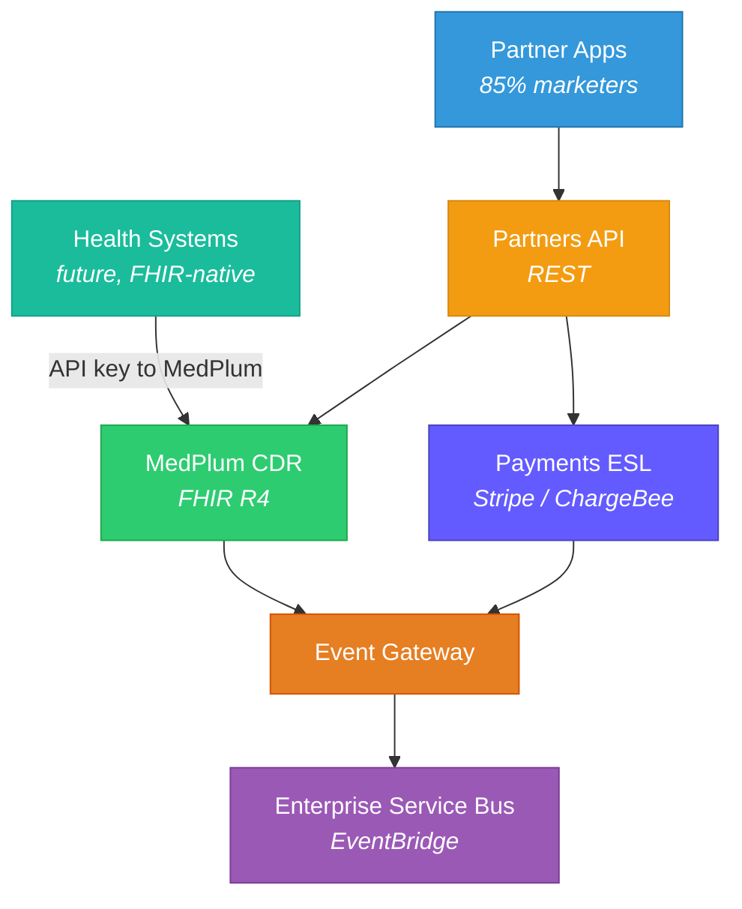

# Migration — Architecture & Abstraction Layer

> 85% of OpenLoop customers are performance marketers who'd "throw up" at FHIR. The Partners API abstracts FHIR behind a domain-friendly REST API. Future health system customers get direct FHIR access via API key to the MedPlum instance.

**See also:** [Tech Stack](Tech%20Stack.md) | [Payments & ESL](../OpenLoop/Payments%20&%20ESL.md) | [Access Control](../Medplum/Access%20Control%20&%20Multi-Tenancy.md) | [Phases](Phases.md) | [Server Operations](../Medplum/Server%20Operations.md) | [Bots & Subscriptions](../Medplum/Bots%20&%20Subscriptions.md) | [Care Plans & Tasks](../Medplum/Care%20Plans%20&%20Tasks.md)

## The Problem

OpenLoop's B2B2C clients are primarily performance marketers — non-technical, non-healthcare companies. They are good at patient acquisition and engagement but need an abstracted REST API, not FHIR. Only future health system customers (long sales cycle) will want FHIR directly.

## Partners API Design (formerly "Abstraction Layer")

The customer-facing API is called the **Partners API** internally. It serves as the single ingress point for all external integrations, abstracting both MedPlum (clinical) and the Payments ESL (financial).



## Architectural Alignment

| Pattern | OpenLoop Current | Medplum Target |
|---------|-----------------|---------------|
| Serverless compute | Lambda | Medplum Bots (can run on Lambda) |
| Event system | EventBridge | FHIR Subscriptions → EventBridge bridge |
| API layer | API Gateway + AppSync | API Gateway (abstraction) + Medplum FHIR API (internal) |
| Orchestration | Step Functions | Step Functions (unchanged) + Medplum Bots |
| Database | DynamoDB + Aurora | Medplum PostgreSQL (FHIR) + DynamoDB (non-clinical) |

## Domain Organization

OpenLoop uses **macro services** (broad domains with subdomains) rather than microservices. Each domain is a bounded context owned by a team.

- Each domain has its **own repo** and **own AWS account** (migrating from monorepo)
- Domains communicate primarily through the **Enterprise Service Bus** (EventBridge)
- Some exceptions for data that doesn't make sense to replicate (e.g., organization service — direct calls)
- **Event Gateway** transforms events from disparate sources, removes vendor implementation details, publishes canonical OpenLoop events to the ESB

## Key Architectural Decisions

1. **MedPlum as internal FHIR layer** — not exposed directly to most customers
2. **Partners API as the product surface** — domain-friendly REST for the 85%
3. **Direct FHIR access for health systems** — API key to MedPlum instance for future enterprise customers
4. **Bots for integration logic** — maps to existing Lambda patterns
5. **Event Gateway → ESB** — canonical OpenLoop events, vendor-agnostic
6. **Multi-tenant via MedPlum Projects** — each client gets isolated data/access policies
7. **Payments replication into MedPlum** — ESL is SoR for payments, but data replicates to CDR for holistic view
8. **Separate repos + accounts per domain** — enforces boundaries, prevents cross-domain dependencies

## How This Is Actually Built

The conceptual architecture above is realized by the `@olh/*` package ecosystem and the `olh-platform` CDK infrastructure. See [Platform Packages](../OpenLoop/Platform%20Packages.md) and [Platform Infrastructure](../OpenLoop/Platform%20Infrastructure.md) for full details.

### PartnerApi Authorizer — EHR Resolution at the Edge

The PartnerApi uses a custom Lambda authorizer that resolves the EHR provider from the API key at request time. This is the mechanical enabler of gradual migration — each partner's API key maps to either Healthie or Medplum.

**Flow:**
1. Client sends request with `x-api-key` header
2. API Gateway extracts `apiKeyId` from request context
3. Authorizer Lambda calls `resolveEhr(apiKeyId)` — matches against `HEALTHIE_API_KEY_ID` / `MEDPLUM_API_KEY_ID` env vars
4. Returns IAM policy with context: `{ ehr: 'healthie' | 'medplum' | '*-admin' }`
5. API Gateway injects `x-ehr-source` and `x-partner-id` headers
6. Request flows through VPC Link → NLB → domain backend
7. Domain Lambda reads `x-ehr-source` and builds `@olh/ehr-client` with the resolved provider

**To migrate a partner from Healthie to Medplum:** swap their API key mapping. No code changes in domain services — the `ehr-client` adapter handles the transport differences.

**Key file:** `olh-platform/src/features/partner-api/authorizer/function/authorizer.handler.ts`

### `@olh/ehr-client` as Migration Bridge

The `ehr-client` package implements the abstraction layer that makes gradual migration possible. It provides:

- **Same API surface** for both providers — domain services call `client.execute('getPatient', params)` regardless of backing EHR
- **Dual adapters** — MedplumAdapter (REST/GraphQL/SDK) and HealthieAdapter (GraphQL-only) handle transport differences
- **Domain endpoint registry** — each domain defines `toProviderRequest` / `fromProviderResponse` transforms per provider
- **Builder pattern** — configures auth, endpoints, and providers at initialization

The PartnerApi authorizer resolves *which* provider to use; the `ehr-client` handles *how* to talk to it.

**Key directory:** `olh-packages/src/ehr-client/`

### Event Gateway → ESB (Implementation)

The "Event Gateway → ESB" pattern from the diagram above is implemented as:

- **`@olh/events`** — 38 typed event sources with auto-generated JSON schemas from TypeScript types
- **`@olh/sdk` EventBridge wrapper** — type-safe `putEventCommand` with `AppEvent<S,D>` generics
- **`EnterpriseEventBus`** in `olh-platform` — cross-account EventBridge with KMS encryption and organization-scoped IAM role

Domain repos publish events using `@olh/sdk`, and the schemas from `@olh/events` ensure type safety and EventBridge rule matching.

### Producer/Consumer Pattern for Domain Registration

Domain repos don't deploy their own API Gateways. Instead, they use the `ProducerRestApi` construct from `@olh/constructs` to register routes on the Platform's shared API Gateway:

1. Domain CDK stack receives Platform outputs (`CONSUMER_API_ID`, `CONSUMER_API_ROLE`, `CONSUMER_API_VPC_LINK`, etc.)
2. `ProducerRestApi` assumes the Platform's `IntegrationRole` (cross-account IAM) to manage routes
3. Traffic flows through the Platform's networking: CloudFront → API Gateway → VPC Link → NLB → domain backend

---

## Medplum Capabilities That Enable This Architecture

### Custom FHIR Operations for Partners API

The Partners API abstracts FHIR complexity from non-healthcare clients. Medplum's `OperationDefinition + Bot` pattern enables this without server modification:

**Server path:** `packages/server/src/fhir/operations/custom.ts`

```json
{
  "resourceType": "OperationDefinition",
  "name": "openloop-submit-intake",
  "code": "submit-intake",
  "resource": ["Patient"],
  "system": false,
  "type": true,
  "instance": true,
  "parameter": [
    { "name": "formData", "use": "in", "min": 1, "max": "1", "type": "string" }
  ]
}
```

Point this OperationDefinition at a Bot → `POST /Patient/$submit-intake` executes the Bot. The Bot receives the domain-friendly input, creates proper FHIR resources (QuestionnaireResponse, Observation, Condition), and returns a simplified response. Partners never see FHIR.

**Use cases for OpenLoop:**
- `$submit-intake` — accept JSON intake form, create QR + run `$extract`
- `$check-eligibility` — accept patient + insurance, return coverage status
- `$request-appointment` — accept time preference, create Slot + Appointment
- `$get-patient-status` — return simplified patient journey status from CarePlan hierarchy

### Project $clone for Client Onboarding

**Server path:** `packages/server/src/fhir/operations/projectclone.ts`

```
POST /Project/{templateProjectId}/$clone
{
  "resourceType": "Parameters",
  "parameter": [
    { "name": "name", "valueString": "New Client - TrimRx" },
    { "name": "resourceTypes", "valueString": "AccessPolicy,Bot,Subscription,Questionnaire,PlanDefinition" }
  ]
}
```

Creates a new Project with copies of selected resource types from the template. **OpenLoop use:** maintain a "golden template" Project per vertical (MWL, Mental Health, Derm) with pre-configured:
- AccessPolicies (parameterized by client Organization)
- Bots (intake parsing, clinical workflow automation)
- Subscriptions (Task status → next step triggers)
- Questionnaires (Main intake per vertical)
- PlanDefinitions (care protocol templates)

New client onboarding = `$clone` template + configure client-specific settings.

### WebSocket Subscriptions for Real-Time UI

**Server path:** `packages/server/src/fhir/operations/getwsbindingtoken.ts`

For the Clinic App's real-time dashboards (provider queues, task status, patient check-in):

```typescript
// 1. Get binding token for subscription
const token = await medplum.execute('Subscription', subId, '$get-ws-binding-token');

// 2. Connect WebSocket
const ws = new WebSocket('wss://api.medplum.com/ws/subscriptions-r5');
ws.send(JSON.stringify({ type: 'bind-with-token', payload: { token: token.value } }));

// 3. Receive real-time events
ws.onmessage = (event) => {
  const bundle = JSON.parse(event.data);
  // SubscriptionStatus + triggering resource (Task, Appointment, etc.)
};
```

**OpenLoop use cases:**
- Provider dashboard updates when new patients assigned (Task created)
- Real-time appointment status changes
- Lab result notifications (DiagnosticReport created)
- Prescription fulfillment tracking (MedicationDispense status updates)

See [Bots & Subscriptions](../Medplum/Bots%20&%20Subscriptions.md) for subscription channels, retry logic, and the event chain pattern.

### Event Bridge Integration

Medplum Subscriptions → EventBridge bridge aligns with OpenLoop's ESB pattern:

```
Medplum Subscription (rest-hook)
  → Bot (transforms FHIR event to canonical OpenLoop event)
    → EventBridge putEvent (via @olh/sdk)
      → Domain consumers (Payments ESL, Organization Service)
```

This replaces Healthie webhooks with typed, reliable events that follow OpenLoop's existing `@olh/events` schema.
