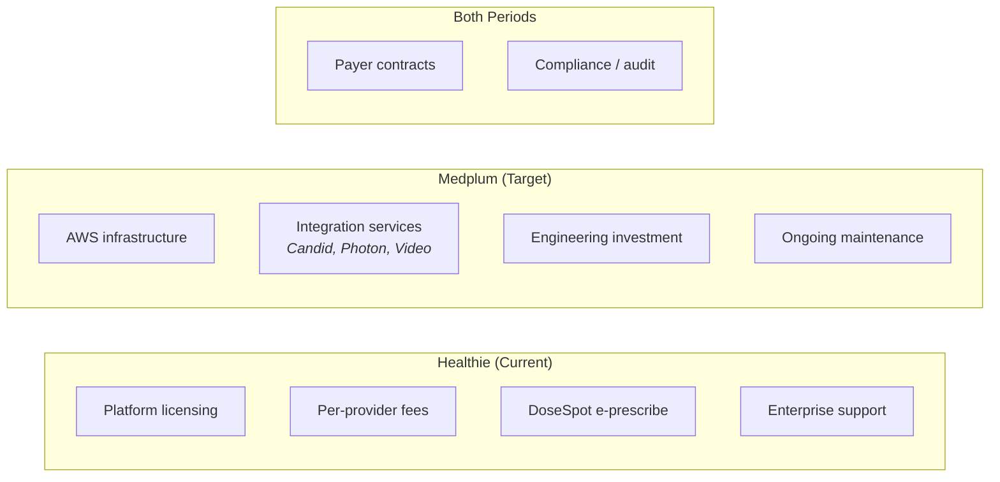

# Migration — Cost Model

> TCO comparison: Healthie licensing vs. Medplum self-hosting. Framework for the business case.

**See also:** [Self-Hosting](Self-Hosting%20on%20AWS.md) | [Phases](Phases.md) | [Risks](Risks.md)

---

## Cost Categories

---

## Healthie Cost Baseline

Healthie pricing is not public — these are the cost categories to gather from the current contract:

| Cost Category | Frequency | Notes |
|--------------|-----------|-------|
| Platform license fee | Monthly/Annual | Enterprise or Group plan (API access required) |
| Per-provider seat cost | Monthly | May scale with 20K+ provider network |
| DoseSpot e-prescribe | Per-Rx or monthly | Bundled or separate — verify contract |
| Overage / API call fees | Monthly | 400M+ calls/mo — check if usage-based pricing applies |
| Support tier | Annual | 5 hrs/mo Solutions Engineer included — is this sufficient? |
| Custom development | As-needed | Any Healthie professional services |

**Action item:** Pull the actual Healthie contract to populate these numbers.

---

## Medplum Self-Hosting Cost Estimate

### AWS Infrastructure (Monthly)

Based on Medplum's recommended production configuration:

| Service | Configuration | Est. Monthly Cost |
|---------|--------------|-------------------|
| ECS Fargate | 2 tasks × 4GB/2vCPU (baseline) | $250–400 |
| Aurora PostgreSQL | db.r6g.large writer + 1 read replica | $700–1,200 |
| ElastiCache Redis | cache.r6g.large (1 node) | $200–350 |
| S3 | Storage + requests (Binary resources, exports) | $50–200 |
| CloudFront | CDN for static assets + API caching | $50–150 |
| NAT Gateway | 2 AZs | $70–140 |
| Secrets Manager | Per-secret + API calls | $10–20 |
| CloudWatch | Logs + metrics + alarms | $50–150 |
| WAF | Web application firewall rules | $20–50 |
| Route 53 | DNS | $5–10 |
| **Subtotal (base)** | | **$1,400–2,700/mo** |

**At scale (250K visits/mo):**

| Scaling Factor | Change | Est. Additional |
|---------------|--------|-----------------|
| ECS Fargate scale-out | 4–6 tasks during peak | +$250–600 |
| Aurora read replicas | 2–3 replicas for search load | +$350–700 |
| ElastiCache scale | Larger node or cluster mode | +$100–300 |
| S3 growth | Accumulated Binary resources | +$50–200 |
| **Subtotal (scaled)** | | **$2,200–4,500/mo** |

### Integration Services (Monthly)

| Service | Purpose | Pricing Model | Est. Monthly |
|---------|---------|---------------|-------------|
| Candid Health | RCM, claims, eligibility | Per-claim or rev share | Varies — negotiate |
| Photon Health | E-prescribe | Per-Rx | Varies — negotiate |
| Video provider | Telehealth video | Per-participant-minute | $5K–20K (volume dependent) |
| Datadog | Monitoring | Per-host + logs | $500–1,500 |
| **Subtotal** | | | **$6K–22K+/mo** |

### Engineering Investment (One-Time)

| Phase | Duration | Team Size | Est. Cost |
|-------|----------|-----------|-----------|
| Phase 0: Foundation | 4 weeks | 4–6 engineers | Salary × 1 month |
| Phase 1: Pilot | 8 weeks | 6–8 engineers | Salary × 2 months |
| Phase 2: Expand | 12 weeks | 8–10 engineers | Salary × 3 months |
| Phase 3: Cutover | 12 weeks | 6–8 engineers | Salary × 3 months |
| **Total** | ~9 months | | ~9 months of dedicated team |

Note: This is the Platform team's primary focus — not net-new headcount if the team is already planned.

### Ongoing Maintenance (Monthly, Post-Migration)

| Category | Est. Monthly |
|----------|-------------|
| AWS infrastructure | $2,200–4,500 |
| Integration services | $6K–22K |
| Platform team (2–3 engineers) | Salary |
| Security/compliance audit (amortized) | $1K–3K |
| **Total ongoing** | **$10K–30K + salary** |

---

## Comparison Framework

| Category | Healthie | Medplum | Notes |
|----------|---------|---------|-------|
| Platform licensing | $$$$ (recurring) | $0 (Apache 2.0) | Medplum is open-source |
| Infrastructure | Included in license | $2K–5K/mo (AWS) | Self-managed |
| E-prescribe | DoseSpot (bundled?) | Photon (per-Rx) | Potentially similar cost |
| RCM | Built-in (limited) | Candid Health (per-claim) | More capable but separate cost |
| Video | Built-in | Separate provider ($5K–20K/mo) | New cost line item |
| Monitoring | Included | Datadog ($500–1.5K/mo) | New cost line item |
| Engineering (migration) | $0 | ~9 months team effort | One-time investment |
| Engineering (ongoing) | Minimal | 2–3 FTE platform team | Ongoing |
| Customization control | Limited by Healthie API | Full (own the code) | Strategic value |
| Vendor lock-in risk | High | None | Strategic value |
| FHIR interoperability | None | Native | Enterprise client requirement |

---

## Break-Even Considerations

The migration pays for itself when:

1. **Healthie licensing savings** exceed Medplum infrastructure + integration costs
2. **New enterprise clients** won through FHIR interoperability generate revenue
3. **Reduced vendor dependency** avoids future Healthie price increases
4. **Product velocity increases** from owning the platform vs. working around Healthie limitations

### Factors That Accelerate Break-Even

- High Healthie per-provider costs at 20K+ scale
- Enterprise clients requiring FHIR that were previously lost/unservable
- Faster feature development on owned platform
- RCM improvements via Candid Health (better claim acceptance rates)

### Factors That Delay Break-Even

- Low Healthie licensing costs (favorable contract)
- Migration timeline extends beyond 9 months
- Video provider costs significantly exceed Healthie's bundled video
- Integration service costs (Candid, Photon) higher than Healthie's bundled features

---

## What to Present to Leadership

1. **Current Healthie annual spend** — pull from contract
2. **Projected Medplum annual run-rate** — infrastructure + integrations + team
3. **Migration investment** — one-time engineering cost (9 months)
4. **Break-even timeline** — when cumulative savings exceed migration investment
5. **Strategic value** — FHIR interoperability, vendor independence, platform ownership (hard to quantify but real)
6. **Risk-adjusted timeline** — add 30–50% buffer to cost and timeline estimates
