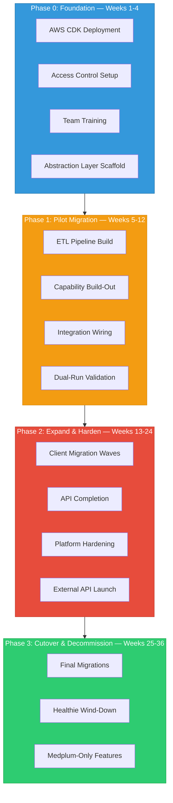

# Migration — Phased Roadmap

> Multi-phase approach to migrate OpenLoop from Healthie to Medplum without disrupting 250K+ monthly patient visits.

**See also:** [Capability Mapping](Capability%20Mapping.md) | [Data Migration](Data%20Migration.md) | [Architecture](Architecture.md) | [Risks](Risks.md)

---

## Guiding Principles

1. **Zero patient disruption** — existing client operations cannot break during migration
2. **Incremental value** — each phase delivers usable capabilities, not just infrastructure
3. **Dual-run period** — Healthie and Medplum operate in parallel until cutover is validated
4. **New features on Medplum** — stop building new capabilities on Healthie as soon as practical
5. **Abstraction layer first** — the customer-facing API insulates clients from the platform swap

---

## Phase 0: Foundation (Weeks 1–4)

**Goal:** Medplum running on OpenLoop's AWS, core team trained, abstraction layer scaffolded.

### Infrastructure
- [ ] Deploy Medplum via AWS CDK to OpenLoop's AWS account (see [Self-Hosting](Self-Hosting%20on%20AWS.md))
- [ ] Configure VPC, networking, WAF, domain (e.g., `fhir.openloop.health`)
- [ ] Set up Medplum Projects: `openloop-admin`, one pilot client Project
- [ ] Configure monitoring (Datadog sidecar), alerting, log aggregation
- [ ] Set up CI/CD pipeline for Bot deployments

### Access Control
- [ ] Define AccessPolicy templates per role (see [Access Control](Access%20Control%20&%20Multi-Tenancy.md))
- [ ] Configure authentication (OAuth2 client credentials for abstraction layer)
- [ ] Test tenant isolation between Projects

### Team Enablement
- [ ] FHIR fundamentals training for engineering teams (see [FHIR Glossary](FHIR%20R4%20Glossary.md))
- [ ] Medplum SDK workshop — MedplumClient, Bots, Subscriptions
- [ ] Set up local dev environments (Docker Compose)
- [ ] Distribute Medplum MCP tool for AI-assisted development

### Abstraction Layer
- [ ] Scaffold the customer-facing API service (TypeScript, API Gateway)
- [ ] Define v1 API contract for pilot domain (e.g., Scheduling or Patient intake)
- [ ] Implement FHIR translation layer for the pilot domain

**Exit criteria:** Medplum accessible in staging, team can create/query FHIR resources, abstraction layer serves one domain.

---

## Phase 1: Pilot Migration (Weeks 5–12)

**Goal:** One client running on Medplum through the abstraction layer. Healthie still active for all other clients.

### Data Migration (Pilot Client)
- [ ] Build ETL pipeline: Healthie GraphQL export → FHIR transformation → Medplum import
- [ ] Map Healthie IDs to FHIR-compliant IDs (cross-reference table)
- [ ] Migrate pilot client data: Patient, Practitioner, Appointment, Encounter
- [ ] Validate data integrity (counts, spot checks, referential integrity)

### Capability Build-Out
- [ ] Scheduling: Schedule/Slot/Appointment via abstraction API
- [ ] Patient management: Patient CRUD, search, demographics
- [ ] Forms & intake: Questionnaire/QuestionnaireResponse
- [ ] Notifications: FHIR Subscriptions → EventBridge bridge

### Integration Wiring
- [ ] E-prescribe: MedicationRequest via Medplum (replaces DoseSpot)
- [ ] Lab orders: ServiceRequest via Health Gorilla integration
- [ ] Billing: Coverage/Claim via Candid Health integration (if ready)

### Dual-Run Validation
- [ ] Pilot client operates on Medplum; verify equivalence with Healthie
- [ ] Shadow mode: run both systems in parallel, compare outputs
- [ ] Collect provider feedback on new workflows

**Exit criteria:** Pilot client fully operational on Medplum, provider satisfaction equivalent or better, no data loss.

---

## Phase 2: Expand & Harden (Weeks 13–24)

**Goal:** Multiple clients migrated. Abstraction API feature-complete for core use cases. Healthie on a deprecation path.

### Client Migration Waves
- [ ] Wave 1 (5–10 clients): Similar profiles to pilot client
- [ ] Wave 2 (20–30 clients): Broader client types (pharmacies, health plans, labs)
- [ ] Wave 3 (remaining): Long-tail clients, complex configurations
- [ ] Automate migration pipeline (self-service tooling for repeatable migrations)

### Abstraction API Completion
- [ ] Chat/messaging: Communication resources
- [ ] Clinical notes: DocumentReference, SOAP note workflows
- [ ] Care plans: CarePlan/Goal/Task
- [ ] White-label: Branding/customization via Project settings
- [ ] Reporting: Aggregate analytics endpoints

### Platform Hardening
- [ ] Load testing at OpenLoop scale (250K+ visits/month)
- [ ] Disaster recovery testing (RDS snapshots, cross-region)
- [ ] Security audit (pen testing, access policy review)
- [ ] SOC 2 Type II audit scope expansion to include Medplum infrastructure
- [ ] EPCS certification validation for controlled substance prescribing

### Customer-Facing API (External)
- [ ] API documentation portal
- [ ] Client onboarding SDK / quickstart
- [ ] Rate limiting, usage metering, API keys per client
- [ ] Sandbox environment for client developers

**Exit criteria:** 50%+ clients on Medplum, abstraction API covers all core Healthie capabilities, load-tested at scale.

---

## Phase 3: Cutover & Decommission (Weeks 25–36)

**Goal:** All clients on Medplum. Healthie decommissioned. Customer-facing API is the product surface.

### Final Migration
- [ ] Migrate remaining clients
- [ ] Migrate historical data (encounters, notes, billing records)
- [ ] Final data reconciliation between Healthie and Medplum

### Healthie Wind-Down
- [ ] Freeze Healthie writes (read-only)
- [ ] Redirect all API traffic through abstraction layer → Medplum
- [ ] Archive Healthie data exports
- [ ] Terminate Healthie contract

### New Capabilities (Medplum-Only)
- [ ] SMART on FHIR app launch (health system integrations)
- [ ] Bulk FHIR export for enterprise clients
- [ ] Advanced analytics via Athena/data warehouse on FHIR data
- [ ] AI-powered clinical workflows via MCP

**Exit criteria:** Zero Healthie dependency, all traffic on Medplum, customer-facing API GA.

---

## Timeline Summary

| Phase | Duration | Key Outcome |
|-------|----------|-------------|
| Phase 0: Foundation | Weeks 1–4 | Medplum on AWS, team trained, abstraction scaffolded |
| Phase 1: Pilot | Weeks 5–12 | One client live on Medplum |
| Phase 2: Expand | Weeks 13–24 | 50%+ clients migrated, API feature-complete |
| Phase 3: Cutover | Weeks 25–36 | Healthie decommissioned, full Medplum |

**Total estimated timeline: ~9 months** (aggressive but achievable with dedicated Platform team)

---

## Dependencies & Sequencing

