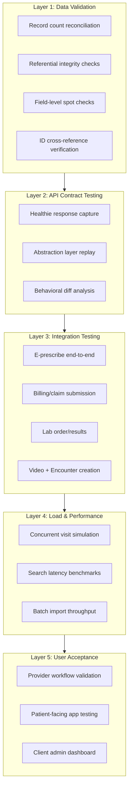

# Migration — Testing & Validation Strategy

> How to verify the Healthie → Medplum migration works correctly at OpenLoop's scale (250K+ visits/month, 120+ clients, 600+ payer contracts).

**See also:** [Phases](Phases.md) | [Risks](Risks.md) | [Data Migration](Data%20Migration.md)

---

## Testing Layers

---

## Layer 1: Data Validation

Run after every ETL batch to verify data integrity.

### Record Count Reconciliation

For each migrated entity, compare counts between Healthie and Medplum:

| Healthie Entity | FHIR Resource | Validation |
|----------------|---------------|------------|
| Patients | Patient | Count match, active/inactive split match |
| Providers | Practitioner + PractitionerRole | Count match per organization |
| Appointments | Appointment | Count match per date range |
| Encounters/Visits | Encounter | Count match, status distribution match |
| Prescriptions | MedicationRequest | Count match per patient |
| Lab Orders | ServiceRequest | Count match per patient |
| Insurance | Coverage | Count match, active coverage match |
| Claims | Claim | Count match per date range |
| Forms | Questionnaire + QuestionnaireResponse | Template count + submission count |
| Documents | DocumentReference | Count match, file size verification |

### Referential Integrity

Every FHIR Reference must resolve to an existing resource:
- `Encounter.subject` → valid Patient
- `MedicationRequest.requester` → valid Practitioner
- `Appointment.participant.actor` → valid Patient or Practitioner
- `Claim.patient` → valid Patient
- `Claim.provider` → valid Practitioner or Organization

Build a Bot or script that traverses all resources in a Project and validates every Reference resolves.

### Field-Level Spot Checks

For a random sample (5-10%) of each resource type:
- Patient demographics match (name, DOB, gender, contact info)
- Encounter dates and durations match
- Medication names and dosages match
- Diagnosis codes (ICD-10) match
- Insurance member IDs and payer match

### ID Cross-Reference

Verify the Healthie ID → FHIR ID mapping table is complete and bidirectional:
- Every Healthie record has exactly one FHIR ID
- Every migrated FHIR resource has a Healthie ID in an identifier or extension
- No orphaned mappings (IDs that don't resolve on either side)

---

## Layer 2: API Contract Testing

Verify that the abstraction layer produces equivalent responses to what clients received from Healthie.

### Capture Phase (Before Migration)

Record Healthie API responses for representative operations:
- Patient lookup by ID
- Patient search by name/DOB
- Appointment list for a provider on a date
- Encounter detail with observations
- Prescription list for a patient
- Eligibility check response

Store these as test fixtures (sanitized of PHI — use synthetic data or Healthie sandbox).

### Replay Phase (After Migration)

Replay the same operations against the abstraction layer and compare:

| Check | Method |
|-------|--------|
| Response structure | JSON schema validation against API contract |
| Data values | Field-by-field comparison with captured Healthie responses |
| Status codes | Same error handling behavior (404, 403, 422) |
| Pagination | Same page sizes and cursor behavior |
| Latency | Response time within acceptable range (< 500ms p95) |

### Behavioral Diff

For each client's most-used API operations, generate a diff report:
- Fields present in Healthie but missing from abstraction layer
- Fields with different values (data type changes, format changes)
- New fields in abstraction layer not present in Healthie
- Different error responses for edge cases

---

## Layer 3: Integration Testing

End-to-end verification of each integration pathway.

### E-Prescribe

| Test | Validation |
|------|------------|
| Standard Rx | MedicationRequest → e-prescribe service → pharmacy acknowledges |
| Controlled substance (EPCS) | Two-factor signing, DEA validation, Schedule II-V routing |
| Pharmacy selection | Patient's preferred pharmacy resolves correctly |
| Drug interaction | AllergyIntolerance triggers DetectedIssue before prescribing |
| Refill request | Incoming refill request creates new MedicationRequest |

### Billing/Claims

| Test | Validation |
|------|------------|
| Eligibility check | Coverage verified before encounter |
| Claim generation | Encounter completion triggers Claim creation with correct codes |
| Telehealth modifiers | POS 02, modifier 95/GT applied correctly |
| Claim submission | Claim reaches payer via Candid Health |
| Adjudication | ExplanationOfBenefit created with correct amounts |
| Denial handling | Denied claim creates correct ExplanationOfBenefit with reason |

### Lab Orders

| Test | Validation |
|------|------------|
| Order creation | ServiceRequest created with correct LOINC codes |
| Order routing | Health Gorilla receives and routes to Labcorp/Quest |
| Results return | DiagnosticReport created from lab results |
| Abnormal results | Flagged observations trigger appropriate alerts |

### Video + Encounter

| Test | Validation |
|------|------------|
| Session start | Video session creates Encounter (status: in-progress) |
| Session end | Encounter updated (status: finished, period populated) |
| Clinical data | Observations and Conditions created during visit persist |
| Post-visit | DocumentReference (SOAP note) linked to Encounter |

---

## Layer 4: Load & Performance Testing

Validate Medplum handles OpenLoop's production load.

### Target Metrics

| Metric | Target | Based On |
|--------|--------|----------|
| Concurrent encounters | 1,000+ simultaneous | 250K visits/mo ÷ ~250 working hours |
| API latency (p95) | < 500ms | Healthie's current 300-500ms |
| API latency (p99) | < 1,000ms | Acceptable tail latency |
| Search queries/sec | 500+ | Estimated from client API patterns |
| Batch import throughput | 10,000 resources/min | Migration import speed |
| Subscription processing | < 5s end-to-end | Bot trigger to completion |

### Load Test Scenarios

1. **Concurrent visit simulation:** Simulate 1,000 simultaneous encounters — create Encounter, add Observations, write MedicationRequest, finish Encounter
2. **Search under load:** 500 concurrent Patient and Encounter searches with different parameters
3. **Batch import stress:** Import 100K resources via Transaction bundles while serving normal read traffic
4. **Subscription storm:** Trigger 1,000 simultaneous Subscription fires and measure Bot execution latency
5. **Multi-tenant isolation:** Load test one Project heavily while verifying other Projects are unaffected

### Tools

| Tool | Use |
|------|-----|
| k6 | HTTP load testing against FHIR API |
| Artillery | Scenario-based load testing |
| Medplum CLI | Bulk import benchmarking |
| CloudWatch / Datadog | Infrastructure metrics during tests |

---

## Layer 5: User Acceptance Testing

### Provider Workflow Validation

For each clinical delivery area (Weight Loss, Mental Health, Primary Care, Urgent Care):
- [ ] Schedule appointment
- [ ] Conduct telehealth visit (video + clinical data entry)
- [ ] Write prescription (standard + controlled)
- [ ] Order labs
- [ ] Complete SOAP note
- [ ] Sign and attest documentation
- [ ] Bill encounter

### Patient-Facing App Testing

- [ ] Register and verify identity
- [ ] Schedule appointment
- [ ] Complete intake forms
- [ ] Join video visit
- [ ] View visit summary
- [ ] View prescriptions
- [ ] Message provider

### Client Admin Dashboard Testing

- [ ] View client's patient and visit metrics
- [ ] Manage providers for their tenant
- [ ] Access billing/revenue reports
- [ ] Configure white-label settings

---

## Per-Client Migration Verification Checklist

Run for each client when they are migrated:

- [ ] All patient records migrated (count match)
- [ ] Active appointments preserved (upcoming schedule intact)
- [ ] Insurance coverage records active
- [ ] Provider assignments correct
- [ ] Forms and intake templates migrated
- [ ] Historical encounters accessible (read-only)
- [ ] Client admin can access their dashboard
- [ ] Client's API integrations work against abstraction layer
- [ ] Billing/claims flowing correctly
- [ ] E-prescribe working for client's providers
