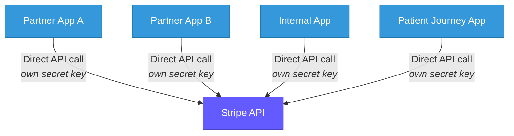
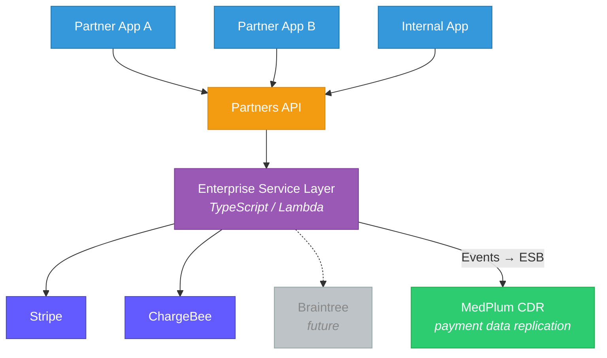
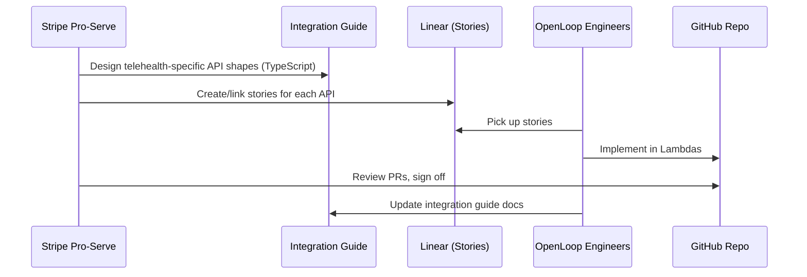

# Payments & Enterprise Service Layer (ESL)

> Centralized payment processing abstraction. Company OKR to standardize all payment operations behind a vendor-agnostic service layer. $1B+ currently running through Stripe.

**See also:** [Tech Stack](Tech%20Stack.md) | [Company Overview](Company%20Overview.md) | [Migration Architecture](../Migration/Architecture.md) | [Billing & RCM (Medplum)](../Medplum/Billing%20-%20RCM.md)

---

## Team

| Role | Person | Context |
|------|--------|---------|
| **Lead Engineer** | Clint Johnson | Payments & revenue domain + MedPlum migration |
| **PM / Project Lead** | Brian | Independent consultant; previously built similar system at Hertz. Introduced via Stripe. |
| **Stripe — Technical** | Nilay | Stripe pro-serve; designs API shapes, reviews PRs, enables newer features |
| **Stripe — Technical** | Connor | Nilay's counterpart |
| **Stripe — Engagement** | Justin | Engagement manager |
| **Stripe — Operations** | Jessica | Implementation consultant |
| **Product** | Jamie Gray | Heading up product overall |
| **RCM (separate)** | Kate / Kara | Revenue Cycle Management — out of scope for ESL |

---

## Current State — The Problem

- **$1B+** running through Stripe payment gateway
- Every application calls Stripe API directly with its own secret key
- Multiple point-to-point integrations — "a frickin' nightmare"
- No centralized architecture, no abstraction
- **Two billing systems**: Stripe Billing (majority) + ChargeBee (~12 customers)
- Even ChargeBee customers still use Stripe as the payment gateway

---

## Target State — ESL Architecture

### Goals

1. **Centralize** — all payment processing goes through ESL, no direct Stripe calls
2. **Abstract** — make Stripe a "black box"; vendor-agnostic architecture
3. **Simplify onboarding** — new partners deploy in minutes (org ID, not secret keys)
4. **Standardize** — telehealth-specific API shapes designed by Stripe pro-serve
5. **Replicate to MedPlum** — payment data flows into CDR for holistic visibility and FHIR access

---

## Scope

### In Scope

- Cash pay / credit card payments (majority of business)
- Subscription billing (free trials, recurring payments)
- Product and price management per organization (program catalog)
- Payment processing abstraction (Stripe first, ChargeBee, Braintree later)
- Refunds, invoicing, payment requests
- Partner onboarding (org-level payment configuration)

### Out of Scope (Currently)

- **Revenue Cycle Management (RCM)** — separate team (Kate/Kara)
- Insurance claims processing / X12 data
- Co-pay processing (no cash pay component in the RCM business)

---

## How the Stripe Pro-Serve Engagement Works

- Stripe designs **simplified, telehealth-specific** API shapes (not full cross-industry Stripe API)
- API shapes are TypeScript types — engineers implement in Lambda functions
- Stripe reviews code in the GitHub repo
- Integration guide (draft) documents all APIs — plan to host on Netlify
- Stories in Linear link to integration guide sections

---

## Active Projects (Linear — Payments & Revenue Domain)

| Project | Status | Description |
|---------|--------|-------------|
| **Integration Guide** | In progress | API catalog similar to public API docs; API shapes, endpoints, Linear links |
| **Program Catalog** | Active build | Products and prices by organization — what programs an org can sell, at what price points |
| **Free Trial Subscriptions** | Active | 28-day free trial enrollment via Stripe hosted checkout page |
| + 2 more | In backlog | Additional projects not yet detailed |

### Program Catalog — Key Use Case

Controls which programs each organization can sell with specific products and price points. Example flow:

1. Patient completes intake and questionnaires
2. Hits checkout (Stripe hosted page)
3. Enters credit card info
4. 28-day free trial enrollment begins
5. Stripe handles subscription lifecycle from there

---

## Timeline

| Period | Activity |
|--------|----------|
| **Dec 2025** | Stripe project kicked off |
| **Jan 5-31** | 24 discovery sessions across all business areas |
| **Feb 2026** | Building stories in Linear, determining ESL assets |
| **Mar 2026** | First steering committee meeting; Clint onboarding as lead engineer |
| **Ongoing** | Incremental ESL build-out, production deployments |

---

## MedPlum Integration Strategy

MedPlum is **not** the system of record for payments, but payment data will be replicated into MedPlum for:

1. **Holistic visibility** — clinical and financial data in one place
2. **FHIR access** — future health system customers can pull payment data via FHIR
3. **Encounter context** — link payments to clinical encounters

**Likely FHIR resources for payment replication:**

| FHIR Resource | Use Case |
|---------------|----------|
| `Account` | Patient billing account with Stripe customer ID as identifier |
| `ChargeItem` | Individual charges linked to encounters |
| `PaymentNotice` | Payment events from Stripe (succeeded, failed, refunded) |
| `Coverage` | Insurance coverage (if RCM scope expands) |
| `Invoice` | Maps to Stripe invoices for subscription billing |

**Integration pattern:** ESL publishes payment events to the Enterprise Service Bus. A MedPlum Bot subscribes to canonical payment events and creates/updates the corresponding FHIR resources with Stripe IDs stored as FHIR extensions (e.g., `https://openloop.health/stripe-payment-intent-id`).

---

## Development Infrastructure

- Dedicated repository (separate from monorepo)
- CI/CD pipelines established
- Stripe pro-serve has GitHub access for code review
- Lambda-based implementation (TypeScript)
- Linear for project management
