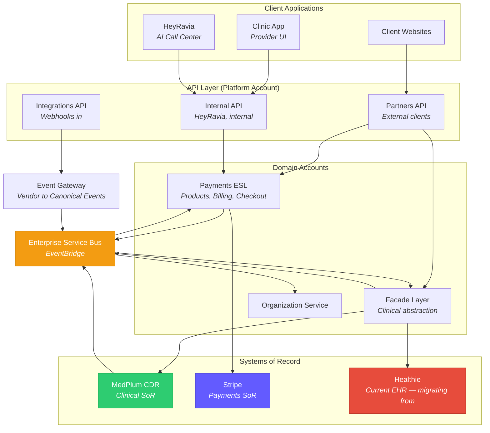
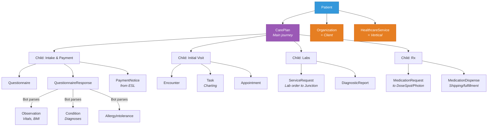

# OpenLoop — State of Play (Mar 9, 2026)

One week in. Everything synthesized.

---

## The Company in One Sentence

OpenLoop is a **B2B2C white-label telehealth platform** (20K+ clinicians, 50 states, 120+ clients) undergoing two parallel transformations: migrating its clinical data from Healthie to **MedPlum** and centralizing its $1B+ payment processing behind an **Enterprise Service Layer**.

---

## Your Two Domains

### 1. MedPlum Migration (Clinical)

**What's happening:** Replacing Healthie (proprietary GraphQL EHR) with MedPlum (open-source FHIR R4 CDR). This is a paradigm shift — GraphQL to FHIR REST, not a version upgrade.

**Where things stand:** The product team has been workshopping with Medplum's enterprise team since July 2025. Ten sessions have been completed. The key architectural decisions are **already made**:

| Decision | What It Means |
|----------|---------------|
| Organization = Client, HealthcareService = Vertical | Tenancy is solved — `meta.compartment` + `_compartment` search |
| Main Questionnaire per vertical with Concept IDs | Intake normalization is designed — clients customize wording, not semantics |
| PlanDefinition$apply for clinical protocols | Business logic lives in FHIR data, not code — non-technical staff can manage |
| Parameterized AccessPolicy | One policy template, parameterized per user's ProjectMembership |
| CarePlan hierarchy (4 child plans) | Patient journey modeled: Intake, Visit, Labs, Rx |
| MWL as first vertical | Medical Weight Loss is the pilot — highest volume, best understood |
| Cloud-hosted MedPlum | Security team decision — not self-hosted |

**What hasn't started yet:** Actual code migration. The workshops were design/scoping. Phase 0 (Foundation) is "Medplum on AWS, team trained, abstraction scaffolded" — that's where you come in.

**Your advantage:** Deep prior MedPlum experience. Curtis hired you specifically for this. The Medplum team (Maddy Li as FDE) is hand-holding the process. The repo is already cloned and explored — 17 of 21 identified needs have existing code in the Medplum repo.

**Key risks to watch:**
- R4: FHIR learning curve for the ~40 new engineers
- R6: Medplum performance at OpenLoop's scale (20K+ clinicians)
- R7: Abstraction layer complexity (Partners API hiding FHIR from 85% non-healthcare clients)
- R13: Scope creep (known organizational pattern)

### 2. Payments ESL (Financial)

**What's happening:** Building a centralized abstraction layer over Stripe (and eventually ChargeBee/Braintree) so no application talks to Stripe directly anymore.

**Where things stand:** Active build. Stripe pro-serve team (Nilay, Connor) is designing telehealth-specific TypeScript API shapes. Engineers implement in Lambda. Five projects in Linear, with **Program Catalog** as the current focus.

| Component | Status |
|-----------|--------|
| Dedicated repo + CI/CD | Done |
| Program Catalog (products/prices per org) | Active build — DynamoDB, async sync to Stripe |
| Internal API for HeyRavia | Phase 1 (in progress) |
| Partners API exposure + UI | Phase 2 (not started) |
| Cross-account VPC link architecture | Working — `@OLH` CDK constructs in CodeArtifact |
| ChargeBee/Braintree support | Future |
| MedPlum replication | Designed — ESB events, Bot, FHIR resources |

**Your PM is Brian** — independent consultant, introduced via Stripe, previously built similar system at Hertz. Alex Nima is the other engineer on the payments side.

**Key people you're working with:**
- **Brian** — PM, drives Linear stories and steering committee
- **Nilay / Connor** — Stripe pro-serve, design API shapes, review PRs
- **Alex Nima** — Engineer, walked you through the architecture, moving to Nashville
- **Curtis** — CTO, sets the vision (loosely coupled domains, event-driven, macro services)
- **Jamie Gray** — Head of Product, owns the end-to-end process map

---

## Architecture — How It All Fits

**Key architectural principles (from Curtis):**
- Domains are **macro services** — broad bounded contexts, not microservices
- Separate repos + AWS accounts per domain (enforced after the NPM supply chain attack)
- Communication via ESB — replicate data over events, not cross-domain API calls
- Each domain deploys independently (only platform infra as dependency)
- `@OLH` packages on AWS CodeArtifact for shared CDK constructs

---

## The Clinical Data Model (What MedPlum Will Hold)

---

## What You Should Do First

1. **Get on Brian's daily stand-ups** — Alex was going to get you added. If not done, ping Alex or Brian directly.

2. **Review the payments repo** — Once GitHub org access comes through (IT, then Alex grants repo access). Look at the Program Catalog domain, the `@OLH` CDK constructs, and how the cross-account VPC link works.

3. **Get into the MedPlum workshop cadence** — Curtis mentioned workshops with the MedPlum team. Make sure you're invited to the next session (March 2026 workshop scoping has already started).

4. **Absorb the integration guide** — The draft API docs that Stripe pro-serve is building in Mintlify. This shows the telehealth-specific API shapes you'll be implementing.

5. **Don't worry about RCM** — Kate/Kara's domain, separate system, no cash pay component. Out of scope for you.

---

## Tools

| Tool | Status |
|------|--------|
| GitHub | Pending IT org access |
| AWS Dev Account | Should be provisioned (30-45 min lag) |
| Linear | Should have access |
| Excalidraw | Shared diagrams available |
| Cursor | Available now |
| Claude Code | Procurement in progress |
| LocalStack | Being set up for payments domain |
| Healthie MCP Server | Available for local GraphQL API dev |
| OpenCode + Bedrock | Available via AWS dev account (Opus, 10% cheaper) |

---

## The Knowledge System

A **492-node, 2,060-relationship knowledge graph** in Memgraph (16 node labels, 25 relationship types), backed by a 72-document Obsidian vault, with semantic code intelligence on the Medplum repo via Serena. This gives the ability to trace from a product decision all the way down to the TypeScript implementation.

See [System Guide](System%20Guide.md) for how to interact with it.
