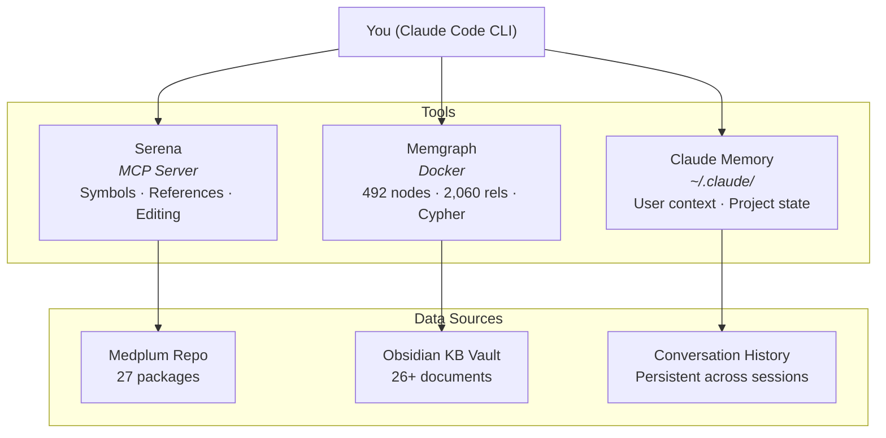

# System Guide — AI-Assisted Engineering Workspace

How to interact with Claude Code and the integrated tooling for OpenLoop engineering work.

---

## What You Have

Three systems work together to give you deep, persistent context across conversations:

| System | What It Does | Where It Lives |
|--------|-------------|----------------|
| **Claude Code** | AI pair programmer with file access, shell, and web tools | CLI / desktop — runs in your terminal |
| **Serena** | Semantic code intelligence — navigates symbols, types, references across codebases | MCP server — activated per-project |
| **Memgraph** | Knowledge graph of the KB — people, domains, decisions, risks, FHIR mappings, meetings | Local Docker — `bolt://localhost:7687`, Lab at `http://localhost:3003` |

### Persistent Memory

Claude Code maintains a memory directory (`~/.claude/projects/`) that persists across conversations. Key facts about you, OpenLoop, and project state carry forward automatically — you don't need to re-explain context each session.

---

## Starting a Session

### 1. Activate a Codebase (Serena)

Tell Claude which project to work with:

```
medplum
```

Claude will activate it in Serena, giving access to symbol navigation, reference tracing, and semantic editing across the full monorepo.

**Available projects:**
- `medplum` — `/Users/clint.johnson/Workspace/Code/medplum`
- Add more by cloning repos and pointing Serena at them

### 2. Query the Knowledge Graph (Memgraph)

The KB graph contains 492 nodes and 2,060 relationships extracted from this Obsidian vault. Ask questions like:

- "What risks are associated with the Payments domain?"
- "Which FHIR resources map to Healthie concepts?"
- "What decisions were made in the Stripe meeting?"
- "Show me all technologies used by OpenLoop"

Claude will translate these into Cypher queries against Memgraph.

### 3. Reference the KB Directly

Claude can read any file in this vault. Reference documents naturally:

- "What does the risk register say about multi-tenancy?"
- "Summarize the capability mapping"
- "What's in the phased roadmap?"

---

## Common Workflows

### Explore Medplum Code

Ask at any level of abstraction — Serena navigates intelligently:

| You Say | What Happens |
|---------|-------------|
| "What's in the core package?" | Lists the directory, reads symbol overviews |
| "How does MedplumClient handle auth?" | Finds the class, reads relevant methods |
| "Who calls createResource?" | Traces references across the monorepo |
| "Show me the FHIR router" | Navigates `packages/fhir-router`, lists symbols |
| "What types exist for Patient?" | Searches `fhirtypes` for Patient-related definitions |

**Tip:** You don't need to know file paths. Describe what you're looking for conceptually and Serena will locate it by symbol name, type, or pattern.

### Ask Architecture Questions

Combine the KB graph with code intelligence:

- "How does OpenLoop's current Healthie webhook model compare to Medplum's subscription system?"
- "What FHIR resources do we need for the Payments domain?"
- "Trace the encounter lifecycle from the telehealth doc through the Medplum code"

### Plan Implementation

Claude can read the migration docs, cross-reference with the actual codebase, and draft implementation plans:

- "Plan the AccessPolicy setup for multi-tenant client isolation"
- "What Medplum Bots do we need for the Phase 1 pilot?"
- "Design the data migration ETL for Patient resources"

### Edit Code

Serena supports surgical edits at the symbol level:

- "Add a method to handle webhook verification in the Payments service"
- "Refactor this function to use the FHIR bundle pattern"
- "Rename this type to match our naming conventions"

Changes are precise — Serena replaces specific symbol bodies rather than rewriting entire files.

### Research & Documentation

- "Look up the latest Medplum docs on Bot deployment" — fetches live documentation
- "What does FHIR R4 say about Claim resources?" — searches specs
- "Summarize what we discussed about Stripe in the last meeting" — queries Campfire notes via the graph

---

## Memgraph Quick Reference

### Graph Structure

```
Node Labels (16):
  Domain (6), Document (66), MeetingNote (6), Person (42),
  Organization (28), Technology (61), Integration (26),
  FhirResource (66), Phase (4), Risk (13), Decision (21),
  ActionItem (88), Project (9), Team (8), Topic (47),
  Incident (1)

  Total: 492 nodes

Key Relationships (25 types, 2,060 total):
  MENTIONS (1,379), REFERENCES (153), PRODUCED (88),
  USES (78), CONTAINS (51), ATTENDED_BY (50),
  DISCUSSES (49), EMPLOYS (42), ASSIGNED_TO (42),
  DECIDED_FOR (21), DECIDED_IN (21), MEMBER_OF (18),
  PROVIDES (15), THREATENS (13), MAPS_TO (9),
  LEADS (8), PART_OF (6), DEPENDS_ON (3),
  REPORTS_TO (3), AFFECTED (3), NEXT (2), OWNS (2),
  MIGRATING_FROM (1), MIGRATING_TO (1), CAUSED_BY (1),
  DISCUSSED_IN (1)
```

### Example Queries You Can Ask

```
"What domains exist and what do they contain?"
"Show all risks with severity high"
"What integrations does OpenLoop use?"
"Which FHIR resources map to Healthie concepts?"
"What action items came out of the Stripe meeting?"
"Who attended the payments kickoff?"
```

### Updating the Graph

When new KB files are added or existing ones change:

1. Update `scripts/catalog.ts` if there are new entities (FHIR resources, technologies, decisions, etc.)
2. Run `npx tsx load-graph.ts --clear` from `scripts/` to rebuild the graph
3. Run `npx tsx validate-graph.ts` to verify (43 assertions)
4. Update assertion counts in `validate-graph.ts` if entity counts changed

---

## Tips

- **Be specific about intent.** "Read the Patient type" vs. "Edit the Patient type" triggers different tool paths.
- **Name packages when you can.** "Test the core package" is faster than "run the tests" because Claude targets `turbo run test --filter=@medplum/core` directly.
- **Ask for traces.** "Who calls X?" and "What references Y?" are Serena's strengths — use them to understand impact before making changes.
- **Combine sources.** The most powerful queries cross-reference: "Based on our risk register and the Medplum access control code, what's our biggest gap?"
- **Sessions persist.** You don't need to re-explain who you are, what OpenLoop does, or what the migration is. Claude remembers.
- **Graph + Code = Full Picture.** Use Memgraph for the "what and why" (decisions, risks, mappings) and Serena for the "how" (actual implementation).

---

## Troubleshooting

| Problem | Fix |
|---------|-----|
| Serena not responding | Check that the MCP server is running; restart Claude Code if needed |
| Memgraph queries fail | Verify Docker is running: `docker ps` should show memgraph |
| "Project not activated" | Say the project name (e.g., "medplum") to activate it |
| Graph data seems stale | Run `npx tsx load-graph.ts --clear` from `scripts/` |
| Claude doesn't remember something | Check `~/.claude/projects/` memory files; add important facts there |
| Node/npm not found in scripts | Ensure nvm is loaded: `source ~/.nvm/nvm.sh && nvm use 24`; run `npm install` in `scripts/` first |

---

## Architecture


