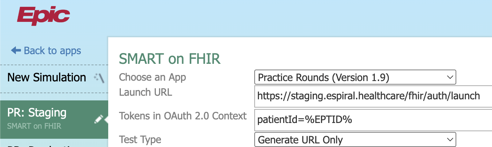

# eSpiral Health

[https://app.usefathom.com/share/qqfwyjng/%f0%9f%8c%80+espiral](https://app.usefathom.com/share/qqfwyjng/%f0%9f%8c%80+espiral)

<aside>
📆

# Calendar

[eSpiral Working List](References/eSpiral%20Working%20List/eSpiral%20Working%20List.csv)

</aside>

# Campfire

---

[Mar 17, 2026](Meetings/Mar%2017,%202026.md)

[Feb 3, 2026](Meetings/Feb%203,%202026.md)

[Jan 16, 2026 ](Meetings/Jan%2016,%202026.md)

[Jan 14, 2026](Meetings/Jan%2014,%202026.md)

[Dec 23, 2025](Meetings/Dec%2023,%202025.md)

[Oct 17, 2025](Meetings/Oct%2017,%202025.md)

[Sep 25, 2025 ](Meetings/Sep%2025,%202025.md)

[Aug 17, 2025 ](Meetings/Aug%2017,%202025.md)

[Aug 15, 2025 ](Meetings/Aug%2015,%202025.md)

[Aug 11, 2025](Meetings/Aug%2011,%202025.md)

[Aug 10, 2025](Meetings/Aug%2010,%202025.md)

[Aug 9, 2025](Meetings/Aug%209,%202025.md)

[Feb 13, 2025 ](Meetings/Feb%2013,%202025.md)

## Resources

---

[Infirmary Health](Clients/Infirmary%20Health/Home.md)

[The eSpiral Approach](Business/The%20eSpiral%20Approach.md)

[Documentation > FHIR > FHIR Tutorial](Technical/Documentation%20FHIR%20FHIR%20Tutorial.md)

[Technical Scholarly Summary](Technical/Technical%20Scholarly%20Summary.md)

[SST MIGRATION PLAN](Technical/SST%20MIGRATION%20PLAN.md)

[Installation Guide V2](Technical/Installation%20Guide%20V2.md)

[eSpiral Healthcare API Call Report](Technical/eSpiral%20Healthcare%20API%20Call%20Report.md)

[Residency Program CRM](Clients/Residency%20Program%20CRM/Residency%20Program%20CRM.md)

[Demo Script](Technical/Demo%20Script.md)

[eSpiral Showroom Content](Business/eSpiral%20Showroom%20Content.md)

[**HIPAA Compliance Audit Report**](Security/HIPAA%20Compliance%20Audit%20Report.md)

[eSpiral Cloud Security Details](Security/eSpiral%20Cloud%20Security%20Details.md)

[Business Plan](Business/Business%20Plan.md)

[2025 Tasks](Tasks.md)

[Icon Map](Product/Icon%20Map.md)

[PHI Access Log](Security/PHI%20Access%20Log.md)

[Multiple Views Feature](Product/Multiple%20Views%20Feature.md)

[Timeline Chart View (Rectangle)](Product/Timeline%20Chart%20View%20%28Rectangle%29.md)

[eSpiral QA Data ](Product/eSpiral%20QA%20Data.md)

[Related Encounters Info Button](Product/Related%20Encounters%20Info%20Button.md)

[Interrogate the patient record (dynamic search bar)](Product/Interrogate%20the%20patient%20record%20(dynamic%20search%20bar.md)

[Installation Guide V1](Technical/Installation%20Guide%20V1.md)

# Important

---

Site: https://espiral.healthcare/

- Company Name: eSpiral LLC | 📍117 Volanta Ave, Fairhope, AL 36532
- 📲 251.463.2114 (Dr. Clarkson) | 📲 248.568.3725 (Clint)

Source Code: https://github.com/spiralizer/espiral | Service Email Account: [espiral.health@gmail.com](mailto:espiral.health@gmail.com) | https://github.com/enterprise/startups

https://docs.espiral.healthcare/docs/context | username: `drscharting` | password: `vkx-ajy1yqy.gen!CNG`

- AWS (949973067293) - Credits: https://aws.amazon.com/startups/credits?lang=en-US (Exhausted)
- 🚨 [Sentry Alerting](https://grizzlydev.sentry.io/issues/?project=4505785764085760&query=is:unresolved&statsPeriod=7d)
- [AMIA FHIR Competition Application](Operations/eSpiral%20Working%20List/AMIA%20FHIR%20Competition%20Application.md)
- [Context tokens Document](https://vendorservices.epic.com/Article/Index?docid=token-library)

## Vendor Services Demo

- URL: [https://vendorservices.epic.com/HyperspaceSimulator](https://vendorservices.epic.com/HyperspaceSimulator)
- Configuration: Launch Url: [https://staging.espiral.healthcare/fhir/auth/launch](https://staging.espiral.healthcare/fhir/auth/launch) | Tokens: patientId=%EPTID%

## Monthly Costs

---

| AWS + Vanta | 720 |
| --- | --- |
| Github | 105 |
| Sentry | 90 |
| Fathom | 15 |
| Mailchimp | 20 |
| OpenAI | 10 |
| DeepGram | 0 |