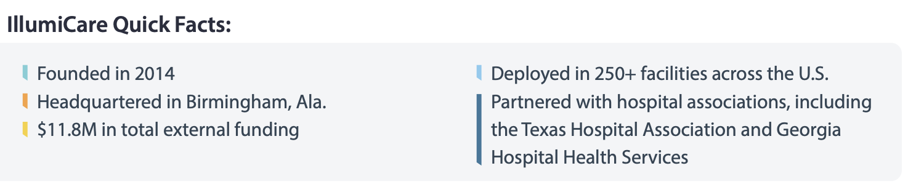

# 2025 Tasks

<aside>
☑️

### Agenda

---

- [ ]  Demo current state
- [ ]  Business needs

---

- [ ]  Bug fix discovery (real time)
- [ ]  Curate demo patients (real time)

---

- [ ]  Scroggie email & IH approach
- [ ]  Discovery Partner Acquisition Approach
</aside>

<aside>
🧑🏽‍💻

**Current State Topics | PR:** https://github.com/spiralizer/espiral/pull/106

---

1. Code restructure (Compliance dependencies)
2. Database restructure
3. Tethering Feature
4. Staging
5. Web page (In progress)
</aside>

<aside>
💡

**Business Needs**

---

1. **Go To Market Support**
    - [ ]  Mon Louis Ventures fractional CPO (Matt Wimberley 2 months)
        - [ ]  Pitch Deck and GTM strategy
        - [ ]  Demo to prospects (Matt and Clint)
        - [ ]  Onboard Infirmary Health
        - [ ]  Business development (list of prospects)
2. **Digital Storefront**
    - [ ]  Showroom Listing updates
    - [ ]  Updated Youtube videos
3. **Bugfix Support**
    - [ ]  Dr Clarkson show records of interest for date issue [external ids]
    - [ ]  Team interrogate record with problem list “not” disconnect
4. **Demo Support**
    - [ ]  Surface 1-3 “good” patients in Epic VS for round trip demo.
    - V1 Demo: leverage vendor services EHR simulation services, to provide an okay demo.
    - V2 Demo: leverage a beta partner TST environment or vendor services to craft a realistic demo, video recorded.
</aside>

<aside>
🏥

**Infirmary Health**

---

- **Scroggie email**: user management is complicated, maybe we open to all residents? Or maybe we go through security review…
- Natural beta (design) partnership?
</aside>

<aside>
🪝

**Business Development**

---

Potential partners, or investors

- IllumiCare (2014) - [Reference startup](https://www.illumicare.com/wp-content/uploads/2022/01/IllumiCare-Fact-Sheet-2022_V2.pdf)
    
    
    

Beta partners (aka design partner or health system)

- Infirmary Health
- Others
</aside>