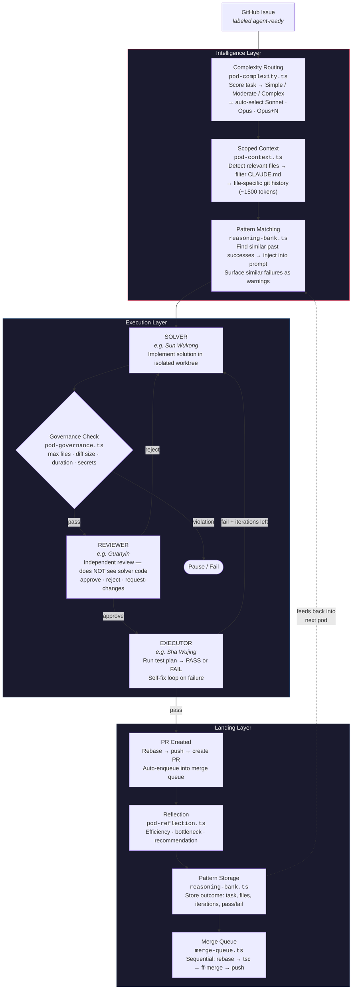

# Penpal

An operating system for running an AI workforce.

Penpal started as a way to manage terminal sessions across Claude Code, OpenCode, and Cursor Agent. It grew into a full operating system for orchestrating AI coding agents — visible as characters in an isometric game world, working autonomously on GitHub issues, communicating via Slack, and running across multiple machines.

Built by [1Putt Health](https://1putthealth.com) for creating and launching digital health products and software tools. Penpal builds itself — the pod system that solves GitHub issues is the same system we use to develop Penpal.

---

## What Penpal Does Today

### 1. Manage Current Operations

See every AI agent session running across your machines in one place.

- **Focus any terminal** running a Claude Code, OpenCode, or Cursor Agent session
- **Communicate via Slack** — each project gets its own channel, messages route to the right agent
- **Get DM'd** when an agent has a question or needs tool approval
- **World map** shows all your Penpal instances as pins with live status (fleet heartbeat via Slack)
- **Isometric lab view** — agents visualized as animated characters at workstations with status bubbles

### 2. Tee Up Background Work

Label a GitHub issue `agent-ready`, walk away, come back to a PR.

- **GitHub issue pipeline** — polls for `agent-ready` issues, spins up a 3-agent pod in an isolated worktree, pushes a PR on completion
- **Configurable runtime profiles** — run on Claude Opus (max quality), Sonnet (balanced), or local Ollama via OpenCode (zero cost)
- **Pod workflow**: Solver implements -> Reviewer validates independently -> Executor tests. Feedback loops on failure
- **Dispatch board** — unified view of all issues and pods in phase columns with agent avatars and controls
- **MCP servers** surfaced in one configurable area

### 3. Knowledge Management

A vault of markdown files backed by a knowledge graph.

- **Full markdown editor** — CodeMirror 6 with wikilinks, frontmatter, outline, templates, tabs, search
- **Knowledge graph** — ETL scripts generate a graph in Memgraph with embeddings in Qdrant
- **Google GOG CLI** integration for research and data access
- **Live file watching** — external edits sync immediately

### 4. Soundboard

Sound effects for meetings and fun. Vault and soundboard files live in your home directory where Apple iCloud handles backup.

---

## Vision

**Run your agentic business like an RPG video game.**

Penpal collapses the distance between "what are my agents doing" and "how do I make them better" into a single interface — a living game world where AI agents are visible colleagues with personalities, progression, and rivalries.

Agents are characters from *Journey to the West*. Pods are quests. The office is a scene. XP, leaderboards, seasons, and cosmetic rewards make invisible background work visible and engaging. You don't read logs — you watch the office.

### The Core Loop

```
Business Input (Slack, GitHub, Linear)
        ↓
  Penpal dispatches a Pod (3-agent team)
        ↓
  Agents work in the game world (visible, real-time)
        ↓
  Pod produces a PR (tested, reviewed, merged)
        ↓
  Analytics feed back into routing + learning
        ↓
  You tune the team, adjust presets, launch more pods
```

Every loop iteration makes the system smarter — the ReasoningBank remembers what worked, complexity routing picks better models, combo analytics reveal which agent teams produce the best code.

### Where We Are

The development lab is the first scene. It's self-referential — Penpal's pod system builds Penpal itself. The lab shows an isometric office where agent characters work at desks, take coffee breaks in the cafe, compete on leaderboards, and celebrate task completions with particle effects. You can press I to inspect any agent's bestiary card, watch pods solve issues in real-time with stage labels on workstations, and track which agent combos perform best in the Eval dashboard.

### Where We're Going

The game isn't decoration — it's the primary interface for managing AI-augmented operations.

**Near-term: Agent Interaction Layer**

The player character (WASD movement) is built but can't interact with the world yet. The next step is making the office interactive:

- Walk up to an agent's desk, press E → context menu: view stats, assign task, customize desk, check recent work
- Agents respond with dialog reflecting their Journey to the West persona and current mood
- Quest-giver NPCs at the whiteboard — click to see available GitHub issues, drag-to-assign to an agent
- Pod formation as a ritual — select 3 agents, see their combo stats, launch with a ceremony animation

**Mid-term: Multiple Scenes**

Each scene is a self-contained workspace with its own agent team, workflow patterns, and game mechanics — all managed from the world map.

| Scene | Purpose | Agent Team |
|-------|---------|------------|
| **Development Lab** (current) | Code — GitHub issues → PRs | Solvers, reviewers, executors |
| **Virtual Call Center** | Support — tickets → resolutions | Triage agents, escalation, QA |
| **Content Studio** | Marketing — briefs → published content | Writers, designers, SEO, social |
| **Mail Room** | Comms — inbox → responses + lead qualification | Email triage, auto-reply, CRM sync |
| **War Room** | Strategy — data → intelligence reports | Analysts, researchers, competitive intel |

**Long-term: The Self-Improving Workforce**

The intelligence layer (mostly built) closes the loop between work and learning:

1. **Preference capture** — every approve/reject is training data (DPO pairs logged to JSONL)
2. **Combo analytics** — track which agent triples produce the best code (collector running)
3. **Reasoning bank** — successful patterns injected into future solver prompts (integrated)
4. **Complexity routing** — auto-select Sonnet/Opus/local models by task difficulty (running)
5. **Fine-tuned local models** — DPO-train a 7B model on your preference data for zero-cost inference (planned)

The endgame: a 7B model trained on *your* patterns, running locally via Ollama, handling routine work at zero cost while Opus handles the hard problems. The game shows you which agents are learning and which need attention.

### Feature Status

#### Pod System

| Feature | Status | Wave | Description |
|---------|--------|------|-------------|
| 3-agent pipeline (Solver/Reviewer/Executor) | Done | — | Core workflow engine with iteration loops and self-fix |
| Isolated git worktrees | Done | — | Each pod gets its own branch + worktree, auto-cleanup |
| Runtime profiles (max/sonnet/economic) | Done | — | Per-phase model selection, custom profiles via JSON |
| Ollama/OpenCode economic mode | Done | — | Zero-cost local inference via qwen3-coder:30b |
| GitHub issue pipeline | Done | — | `agent-ready` label → pod → PR, watched repo management |
| Flight board (file conflict detection) | Done | — | Tracks files being edited by active pods |
| Best-of-N solver candidates | Done | — | Multi-candidate solving with self-evaluation selection |
| Rebase before PR | Done | W6 | Auto-rebase onto main, conflict detection, lock-file auto-resolve |
| Push-if-ahead | Done | W6 | Pushes local main to origin before creating worktrees |
| Stale worktree cleanup (`--cleanup`) | Done | W6 | Prunes worktrees older than 48h |
| Workflow pruning | Done | W6 | Caps persisted workflows at 100, auto-kills zombies |
| Expanded CLAUDE.md context (20 entries) | Done | W6 | Workflow log retention 5 → 20 |
| Scoped context injection | Done | W7 | Task-aware CLAUDE.md filtering, ~1500 tokens vs ~3000 |
| ReasoningBank (pattern learning) | Done | W7 | Stores outcomes, injects similar successes into solver |
| Complexity routing | Done | W7 | Auto-selects Sonnet/Opus/Opus+N by task complexity |
| Governance rules | Done | W7 | Max files, diff size, duration, forbidden paths |
| MRAP reflection | Done | W7 | Efficiency rating, bottleneck detection, fleet analytics |
| Merge queue (Refinery) | Done | W7 | Sequential rebase → tsc → merge → push pipeline |
| Shell injection hardening | Done | W7 | All `execSync` with user input → `execFileSync` |
| TweenBag lifecycle manager | Done | W6 | Replace 55-line manual tween teardown (#333) |
| Audio-manager setTimeout leak fix | Done | W6 | Cleanup timeouts on scene destroy (#334) |
| Walk animation speed sync | Done | W6 | Tie frame rate to movement speed (#337) |
| Particle pool size caps | Done | W6 | MAX constants per particle type + debug overlay (#338) |
| Pod pipeline cleanup CLI | Done | W6 | Cleanup flag + push-if-ahead (#339) |
| CLAUDE.md clobber prevention | Done | W8 | Restore CLAUDE.md from git before staging pod commits |
| Rebase exception → create PR | Done | W8 | Create PR with `needs-rebase` label instead of silent fail |
| Post-merge duplicate detection | Done | W8 | MergeQueue scans for duplicate class members before push |
| Combo analytics collector | Done | W8 | Track agent combo performance per pod run (JSONL) |
| presetId inference | Done | W8 | Reverse-lookup preset from agent IDs, no more "default" tag |
| storePodPattern on rebase path | Done | W8 | ReasoningBank captures patterns from all completion paths |
| Animation state classes | In progress | W6 | Extract idle/working/waiting into separate classes (#335) |
| Game-system hooks extraction | Planned | W6 | Decouple quest/leaderboard/credits from animation (#336) |

#### Game Surface (Isometric Lab)

| Feature | Status | Wave | Description |
|---------|--------|------|-------------|
| Agent workstations with sprites | Done | — | Desk, chair, monitor, sprite per agent |
| LOD system (3 levels) | Done | — | Overview → room-level → full detail based on zoom |
| Day/night atmosphere cycle | Done | — | Sky gradients, starfield, clouds, shadows, dawn/dusk flash |
| Cafe with coffee runs | Done | — | Agents walk to cafe, barista service, social interactions |
| Quest auto-wrapper | Done | — | Tasks → quests with difficulty inference, XP multipliers |
| Cosmetic tiers (rank-gated) | Done | — | Desk items unlock by XP rank (keyboard, lamp, plant, phone, gold, RGB) |
| Leaderboard + rivalries | Done | — | Season XP rankings, weekly MVP, 5% rivalry detection |
| 30-day seasons | Done | — | Themed challenges, 4 templates, auto-rotation |
| Credits economy | Done | — | Cosmetic currency, shop catalog |
| Celebration VFX | Done | — | Rank-up, task-complete, milestone, error effects |
| Particle systems (weather, ambient) | Done | — | Rain, snow, mako motes, sparks, steam |
| NavMesh A* pathfinding | Done | — | 12px grid, line-of-sight smoothing |
| Pod connecting lines + chat dots | Done | — | Visual links between pod team members |
| Minimap with click-to-pan | Done | — | Room outlines, viewport indicator, hover labels |
| Phaser audio + AudioManager | Done | W5 | Web Audio synthesis, M-key mute, 4-channel mixing |
| SFX triggers (task lifecycle) | Done | W5 | Keyboard clatter, celebration sounds, pod launch |
| Theme audit (3 themes work) | Done | W5+W8 | All hardcoded hex eliminated, particle pool re-init on theme switch |
| Cinematic letterbox bars | Done | W5 | Rank-up and season ceremony framing |
| In-game settings menu | Done | W5 | Volume sliders, theme selector, keybinds |
| Session replay (record/playback) | Done | W5 | Record and replay agent activity |
| 8-direction character spritesheet | Done | W5 | Walk cycle overhaul |
| Player character (WASD) | Done | W5 | Free-roaming player with keyboard movement |
| Agent bestiary viewer (I key) | Done | W8 | Character card with stats, lore, powers, rival/ally |
| Pod spectator mode | Done | W8 | Real-time stage labels + glow rings on active workstations |
| Combo analytics panel | Done | W8 | Combo leaderboard, agent role stats, stage timing in EvalsPanel |
| Bestiary integration | Done | W8 | Character colors on monitors, names, XP bars, natural rivalries |

#### Platform

| Feature | Status | Description |
|---------|--------|-------------|
| Multi-machine fleet (Slack) | Done | Heartbeat discovery, world map pins, DM alerts |
| Vault markdown editor | Done | CodeMirror 6, wikilinks, graph view, file tree |
| Knowledge graph (Memgraph + Qdrant) | Done | ETL pipeline, entity extraction, embeddings |
| MCP server | Done | 5 tool groups (meta, orchestrator, pods, office, vault) |
| Dispatch board | Done | Unified GitHub issue + pod workflow board |
| Eval dashboard | Done | Pod quality metrics, spot-check queue, digests |
| Embedded terminal (xterm.js) | Done | node-pty, inline agent interaction |
| Pod combo analytics | Done | Agent triple performance tracking (JSONL + EvalsPanel UI) |
| Pod spectator IPC | Done | Real-time stage changes forwarded to renderer |
| Linear integration | Planned | Pull tasks from Linear alongside GitHub Issues |
| Dispatch in game | Planned | Issues as quest markers, click desk to see pod |
| Slack-first operations | Planned | `!task`, `!pod status`, `!dispatch` from Slack |
| Agent interaction (E key) | Planned | Walk to desk → context menu → assign task / view stats |
| Multiple scenes | Vision | Dev Lab → Call Center → Content Studio → Mail Room → War Room |

### Future Scenes

Each scene is a self-contained workspace with its own agent team, workflow patterns, and game mechanics — all managed from the world map. The pod system generalizes across scenes: every scene dispatches work through the same Solver→Reviewer→Executor pipeline, but the agents, presets, and game visuals change.

| Scene | Visual Metaphor | Work Pattern | Agent Types |
|-------|----------------|-------------|-------------|
| **Development Lab** (current) | Isometric office with desks, monitors, cafe | GitHub issues → PRs | Coders, reviewers, testers |
| **Virtual Call Center** | Cubicle farm with headsets, call queues, escalation board | Support tickets → resolutions | Triage, specialist, QA |
| **Content Studio** | Open-plan creative space with drafting tables, mood boards | Briefs → published content | Writers, designers, SEO analysts |
| **Mail Room** | Sorting room with conveyor belts, mailboxes, priority bins | Inbox → responses + CRM entries | Email triage, auto-reply, lead qual |
| **War Room** | Dark room with screens, maps, data walls | Data → intelligence reports | Analysts, researchers, competitive intel |

The world map (CampusScene) is the hub. Each pin on the map is a Penpal instance. Double-click a pin to enter its scene. Same fleet, different workspaces.

---

## The Agent Roster

Agents have personas from *Journey to the West* with unique backstories, working styles, and roles.

| | Agent ID | Persona | Role | Pod Role |
|---|----------|---------|------|----------|
|  | `fullstack-dev` | **Sun Wukong** — The Monkey King | Senior full-stack developer | Solver |
|  | `nextjs-frontend` | **Erlang Shen** — The Three-Eyed God | Next.js / React frontend specialist | Solver |
|  | `electron-dev` | **Sha Wujing** — The Curtain-Lifting General | Electron / desktop specialist | Executor |
|  | `backend-arch` | **Guanyin** — Bodhisattva of Compassion | Backend architecture reviewer | Reviewer |
|  | `expo-mobile` | **Nezha** — The Third Lotus Prince | React Native / Expo mobile | Solver |
|  | `embedded-dev` | **Bull Demon King** — Great Sage Who Pacifies Heaven | Embedded systems / low-level | Solver |
|  | `videogame-dev` | **Red Boy** — Holy Child King | Phaser / game development | Solver |
|  | `ui-designer` | **Ao Guang** — Dragon King of the East Sea | UI/UX design reviewer | Reviewer |
|  | `product-mgr` | **Tripitaka** — The Monk | Product management / planning | Reviewer |
|  | `product-marketer` | **Ao Run** — White Dragon Horse | Content marketing | Solver |
|  | `exec-assistant` | **Zhu Bajie** — Marshal of the Heavenly Canopy | Executive assistant / ops | Executor |

Each agent has a catchphrase, backstory, and working style injected into their system prompt. Pod presets combine agents into teams:

| Preset | Solver | Reviewer | Executor |
|--------|--------|----------|----------|
| `frontend-feature` | Erlang Shen | Ao Guang | Sha Wujing |
| `backend-feature` | Sun Wukong | Guanyin | Sha Wujing |
| `full-stack` | Sun Wukong | Guanyin | Sha Wujing |
| `content-pipeline` | Ao Run | Tripitaka | Zhu Bajie |

---

## Pod System — How Issues Become PRs

Pods are 3-agent teams that turn GitHub issues into merged PRs. The system is self-improving — each pod run feeds data back into routing, context, and pattern matching for the next one.

### The Pipeline



**Max iterations**: configurable per profile. Economic mode gets 5 rounds; max gets 3.

### Intelligence Modules

Six modules wrap the execution pipeline. Inspired by patterns from [ruflo](https://github.com/ruvnet/ruflo) (3-tier routing), [agentic-flow](https://github.com/ruvnet/agentic-flow) (ReasoningBank), [Dossier](https://github.com/rwliebs/Dossier) (scoped context), [gastown](https://github.com/gastownhall/gastown) (merge queue), and [DAA](https://github.com/ruvnet/daa) (governance + MRAP loop).

| Module | File | When |
|--------|------|------|
| **Complexity Routing** | `pod-complexity.ts` | Before pod starts — scores task, selects model tier |
| **Scoped Context** | `pod-context.ts` | At worktree creation — builds task-specific CLAUDE.md |
| **ReasoningBank** | `reasoning-bank.ts` | Before solver (query) and after completion (store) |
| **Governance** | `pod-governance.ts` | After solver — checks file count, diff size, duration, forbidden paths |
| **Reflection** | `pod-reflection.ts` | After completion — rates efficiency, detects bottleneck |
| **Merge Queue** | `merge-queue.ts` | After PR — sequential rebase-test-merge pipeline |

### Governance Rules

Default constraints (configurable via `data/governance-rules.json`):

| Rule | Limit | Action |
|------|-------|--------|
| Max files modified | 12 | Warn |
| Max diff lines | 800 | Warn |
| Max duration | 30 minutes | Auto-pause |
| Forbidden paths | `.env`, `credentials`, `secrets`, `.pem`, `.key` | Fail |

### CLI

```bash
npm run pod:create -- --task "..." --preset frontend-feature   # auto-selects model tier
npm run pod:create -- --merge-queue                            # drain merge queue
npm run pod:create -- --merge-next                             # merge next PR in queue
npm run pod:create -- --cleanup                                # prune stale worktrees >48h
```

---

## Fleet — Multiple Machines

Penpal instances discover each other via Slack. No port forwarding, no central broker.

### How It Works

1. Each instance posts a heartbeat to `#sk-fleet` every 60 seconds
2. Heartbeat includes: hostname, username, sessions, pods, health, IP geolocation
3. Messages are updated in-place (`chat.update`) — one message per instance
4. The world map renders pins for each instance (red = you, blue = remote, gray = stale)

### Setup on a New Machine

1. Clone the repo
2. `npm install` in `Penny/`
3. Add Slack tokens to `Penny/.env` (or they auto-load from `.env.shared`)
4. `npm run dev` — your pin appears on the world map within 60 seconds

Fleet pins show the OS username as a hover label. Same-city instances nudge apart slightly so both are clickable.

---

## Runtime Profiles

Configure once in the Profiles panel. Every new pod inherits the default.

| Profile | Plan Model | Execute Model | Validate Model | Timeout | Iterations | Self-Fixes | Cost |
|---------|-----------|---------------|----------------|---------|------------|------------|------|
| `max` | Opus | Opus | Sonnet | 1x | 3 | 1 | $$$ |
| `sonnet` | Sonnet | Sonnet | Sonnet | 1.5x | 3 | 1 | $$ |
| `economic` | ollama:qwen3-coder:30b | ollama:qwen3-coder:30b | ollama:qwen3-coder:30b | 8x | 5 | 3 | Free |

**Economic mode**: Routes through OpenCode CLI (which has tool use + file editing) to your local Ollama instance. More iterations and self-fixes compensate for the smaller model. Zero API cost.

**Per-issue override**: Label a GitHub issue with `economic`, `max`, or `sonnet` to override the default profile for that issue.

**Custom profiles**: Create your own in the Profiles panel — mix models per phase, tune timeouts, save to `data/pod-profiles.json`.

---

## Game Systems — Dev Studio Tycoon

The isometric lab isn't just a visualizer — it's a game layer on top of real work.

| System | Description |
|--------|-------------|
| **Quests** | Every agent task auto-wraps into a quest. Difficulty inferred from priority. XP/credit multipliers: trivial 1x, normal 1.5x, hard 2x, epic 3x, legendary 5x |
| **Cosmetic Tiers** | Desk items gated by XP rank — interns get bare desks, higher ranks unlock keyboard, lamp, plant, phone, gold trim, RGB underglow |
| **Leaderboard** | Season XP rankings. Weekly MVP. Rivalries detected when agents are within 5% XP. Toggle with `L` key |
| **Seasons** | 30-day arcs with themed challenges (Neon Sprint, Deep Focus, Ship It, Blitz Mode). Auto-rotates on expiry |
| **Credits** | Cosmetic-only currency earned from quests. Shop: room themes, desk LED colors, particle effects, name colors |
| **Achievements** | 13 badges with unlock triggers: first hire, full house, speed demon, marathon, night owl, team player |
| **Bestiary** | Journey to the West character cards per agent — realm, stats (5 axes), weapon, powers, rival/ally, signature move. Press `I` to view |
| **Natural Rivalries** | Bestiary-defined rival pairs shown as crimson dashed lines between desks, with periodic clash VFX at midpoints |
| **Pod Spectator** | Real-time stage labels (SOLVING/REVIEWING/EXECUTING) + glow rings on active workstations during pod runs |
| **Day/Night** | Atmospheric cycle with sky gradients, starfield, clouds, shadows, dawn/dusk flash transitions |
| **Cafe** | Agents take coffee breaks, sit at stools, social emoji interactions between seated agents |
| **Audio** | 4-channel Web Audio synthesis (ambient/sfx/ui/music), day/night phase shifts, keyboard clatter scaling, M-key mute |
| **Settings** | In-game ESC menu with volume sliders, theme selector, keybind reference |

### Keyboard Shortcuts

| Key | Action |
|-----|--------|
| Tab / Shift-Tab | Cycle agent selection |
| Enter | Open selected agent in terminal |
| I | Toggle bestiary card for selected agent |
| L | Toggle leaderboard overlay |
| C | Toggle season challenges |
| B | Toggle cosmetic shop |
| T | Cycle color theme (dark/light/neon) |
| M | Toggle audio mute |
| H / ? | Help overlay |
| ESC | Settings / deselect |
| WASD / Arrows | Move player character |
| F | Toggle focus mode |
| Backtick | Debug overlay |

---

## Quick Start

```bash
npm install
npm run dev       # electron-vite dev (hot reload)
npm run build     # production build to out/
```

### Environment Setup

Secrets go in `Penny/.env` (gitignored). Shared config lives in `.env.shared` (committed).

```bash
# Penny/.env (required for full functionality)
SLACK_BOT_TOKEN=xoxb-...
SLACK_APP_TOKEN=xapp-...
SLACK_OWNER_USER_ID=U...        # Your Slack member ID for DM alerts
FIRECRAWL_API_KEY=fc-...
GITHUB_PERSONAL_ACCESS_TOKEN=ghp_...
BROWSERBASE_API_KEY=bb_live_...
NOTION_API_KEY=ntn_...

# Optional
PENNY_TASK_RUNNER=claude        # Default headless backend (claude/opencode/cursor-agent)
PENNY_OLLAMA_BASE_URL=http://127.0.0.1:11434
PENNY_OLLAMA_MODEL=qwen3-coder:30b
FLEET_MAP_X=820                 # Pin position on world map (3840x2160 space)
FLEET_MAP_Y=1020
```

### Adding Watched Repos

In the Dispatch panel, click **Sources** to add GitHub repos. Issues labeled `agent-ready` in those repos will be picked up by the pipeline.

```
Sources → + Add repository → owner/repo → local clone path
```

### OpenCode + Ollama Setup (Economic Mode)

`opencode.json` (committed) configures the Ollama provider:

```json
{
  "provider": {
    "ollama": {
      "npm": "@ai-sdk/openai-compatible",
      "name": "Ollama (local)",
      "options": { "baseURL": "http://127.0.0.1:11434/v1" },
      "models": { "qwen3-coder:30b": { "name": "Qwen3 Coder 30B" } }
    }
  }
}
```

Requires Ollama running locally with `qwen3-coder:30b` pulled: `ollama pull qwen3-coder:30b`

---

## Architecture

### Main Process (`src/main/`)

| Module | Purpose |
|--------|---------|
| `pods.ts` | 3-agent workflow engine — Solver/Reviewer/Executor with runtime profiles, complexity routing, governance, pattern learning, reflection, merge queue |
| `github-pipeline.ts` | `agent-ready` issues -> isolated worktree -> pod -> PR creation |
| `github-issues.ts` | GitHub issue poller, watched repo management, card aggregation |
| `fleet-heartbeat.ts` | Multi-instance discovery via Slack `#sk-fleet`, IP geolocation, 60s cycle |
| `slack-bridge.ts` | Per-project Slack channels, bidirectional message routing, `!task` commands, fleet re-export |
| `sessions.ts` | Discovers Claude Code / Cursor / OpenCode sessions, reads JSONL transcripts, headless agent execution |
| `orchestrator.ts` | Task queue with priority routing, agent scoring, dispatch loop (10s), health monitor (30s) |
| `agents.ts` | Agent configs from `agent-types.yaml`, CLI arg building, headless backend chains, model mapping |
| `ollama-client.ts` | Local Ollama HTTP client (`/api/generate`, `/api/tags`) |
| `pod-context.ts` | Scoped context builder — task-aware CLAUDE.md filtering, file-specific git history |
| `pod-complexity.ts` | Three-tier complexity scorer — auto-selects runtime profile (Sonnet/Opus/Opus+candidates) |
| `pod-governance.ts` | Governance rule engine — max files, diff size, duration, forbidden paths |
| `reasoning-bank.ts` | Pattern storage — stores pod outcomes, finds similar past successes for solver injection |
| `pod-reflection.ts` | MRAP reflection — efficiency rating, bottleneck detection, fleet analytics |
| `merge-queue.ts` | Sequential merge pipeline — rebase, type-check, fast-forward merge, push |
| `flight-board.ts` | Tracks files being edited by active pods for conflict detection |
| `vault.ts` | Vault file manager — CRUD, search, tags, backlinks, `vault://` protocol |
| `health.ts` | Infrastructure health checks (Memgraph, Qdrant, Docker) |
| `ipc.ts` | All `ipcMain.handle()` registrations with `wrapHandler` error boundary |

### Renderer (`src/renderer/src/`)

**Panels:**

| Panel | Description |
|-------|-------------|
| `CommandCenter.tsx` | World map (CampusScene with fleet pins) + isometric lab (OfficeScene with agent visualization), status bar with fleet pill, scheduler, health, leaderboard |
| `OrchestratorModal.tsx` | Dispatch board — unified GitHub issue + pod workflow board with phase columns, agent avatars, expand for pod detail with team grid and controls |
| `ProfilesPanel.tsx` | Runtime profile editor — visual Plan/Execute/Validate pipeline, model dropdowns, timeout/iteration/self-fix knobs, default selection |
| `VaultPanel.tsx` | Full markdown editor with file tree, wikilinks, graph view, frontmatter, search, tags, backlinks |
| `EvalsPanel.tsx` | Agent evaluation dashboard — pod quality metrics, spot-check queue, weekly digests |
| `DataPanel.tsx` | Data exploration, ETL scripts, graph queries |
| `SettingsPanel.tsx` | Appearance/theme, GitHub repo management, config snapshot viewer |
| `SoundboardPanel.tsx` | Sound effect browser and playback |

**Game (`game/`):**

50+ modules, ~20,000 lines. Two Phaser 3 scenes:

| Scene | Description |
|-------|-------------|
| `CampusScene.ts` | World map — illustrated 3840x2160 backdrop, sprite marker pins per fleet instance, anchor-based lat/lon projection, hover labels, click-to-zoom, double-click-to-enter-lab |
| `OfficeScene.ts` | Isometric lab orchestrator (~4700 lines) — delegates to 18+ modules for workstations, rooms, animations, atmosphere, particles, UI overlays, cafe, pods, minimap, camera |

Key game modules:

| Module | Lines | Description |
|--------|------:|-------------|
| `workstation-animation.ts` | ~2100 | Status bubbles, mood, monitor glow, idle micro-variety (refactor in progress — Wave 6 splits into animation state classes) |
| `workstation-creation.ts` | ~1100 | Desk/chair/monitor/sprite creation, rank-gated cosmetics |
| `office-workstation.ts` | ~1700 | Workstation lifecycle, XP bars, sparklines, progress rings |
| `celebrations.ts` | ~1130 | Rank-up, task-complete, milestone, error effects |
| `penny-cafe.ts` | ~830 | Cafe with stools, coffee runs, social interactions |
| `office-atmosphere.ts` | ~740 | Day/night cycle, sky, starfield, clouds, shadows |
| `office-rooms.ts` | ~1070 | Room creation, doors, headers, animated resize |
| `quest-system.ts` | ~220 | Quest auto-wrapper, difficulty inference, XP multipliers |
| `seasons.ts` | ~310 | 30-day seasonal arcs with themed challenges |
| `leaderboard.ts` | ~235 | XP rankings, weekly MVP, rivalry detection |

### Agents (`agents/`)

| File | Description |
|------|-------------|
| `agent-types.yaml` | Agent definitions — persona (name, backstory, style, catchphrase), skills, model, pod role, runtime profiles, pod presets |
| `CLAUDE.md` | Shared team memory — injected into all agent system prompts. Pod results are appended here as team knowledge |
| `mcp-profiles/` | MCP server configurations per agent role (e.g. `qa-executor.json` with Playwright tools) |

### Data (`data/`)

Runtime state files (JSON, gitignored):

| File | Description |
|------|-------------|
| `pod-workflows.json` | Pod workflow state (all active + recent completed) |
| `pod-profiles.json` | Custom runtime profiles (merged with YAML built-ins) |
| `agent-sessions.json` | Agent ID -> session/PID mapping |
| `task-queue.json` | Orchestrator task queue |
| `flight-board.json` | Active file claims for conflict detection |
| `reasoning-bank.json` | Pod pattern history for similarity matching (max 200 entries) |
| `merge-queue.json` | Merge queue state (last 50 entries) |
| `governance-rules.json` | Optional custom governance rules (overrides defaults) |
| `github-pipeline.json` | Pipeline issue tracking state |
| `spot-checks.json` | Eval spot-check queue |

---

## MCP Server

Penpal exposes an MCP (Model Context Protocol) server so Claude sessions can programmatically discover and invoke Penpal's capabilities.

```bash
npm run mcp:start        # stdio transport
```

| Group | Tools |
|-------|--------|
| **meta** | `meta:list-tools`, `meta:describe-tool` |
| **orchestrator** | `orchestrator:enqueue`, `orchestrator:queue`, `orchestrator:agent-health` |
| **pods** | `pod:list`, `pod:status`, `pod:create` |
| **office** | `office:rooms`, `office:agents`, `office:leaderboard` |
| **vault** | `vault:read`, `vault:search`, `vault:write` |

Connect via `.mcp.json`:

```json
{
  "mcpServers": {
    "penny-mcp": {
      "command": "npm",
      "args": ["run", "--prefix", "Penny", "mcp:start"]
    }
  }
}
```

---

## Stack

| Layer | Technology |
|-------|-----------|
| Shell | Electron 33, electron-vite 5 |
| UI | React 18, Tailwind 3, Zustand |
| Game | Phaser 3.90 |
| Editor | CodeMirror 6 |
| Terminal | xterm.js + node-pty |
| Graph | neo4j-driver (Memgraph) |
| Slack | @slack/bolt 4 (Socket Mode) |
| Language | TypeScript 5.7 |
| Testing | Vitest (315 unit tests), Playwright (E2E) |

## Scripts

```bash
npm run dev              # electron-vite dev with HMR
npm run build            # production build
npm run sprites:all      # rebuild all sprite sheets (9 scripts)
npm run test             # vitest unit tests
npm run mcp:start        # start MCP server
npm run pod:create       # CLI pod launcher
npm run typecheck        # tsc --noEmit
npm run package          # electron-forge package
npm run make             # electron-forge make (distributable)
```

<details>
<summary>Full IPC API Reference</summary>

All IPC calls go through `window.api.*`. Each handler uses `wrapHandler` which catches errors and returns `{ error: string }`.

**Sessions**: `getClaudeSessions()`, `sendToSession(tty, msg)`, `focusSession(tty)`, `createNewSession(cwd)`, `approveSession(tty, choice)`, `broadcastToSessions(msg)`, `pruneStaleSessions(maxIdleMinutes?)`

**Agents**: `getAgents()`, `getAgentStatuses()`, `launchAgent(id, cwd)`, `focusAgent(id)`

**Pods**: `createPod(task, opts?)`, `listPods()`, `getPodStatus(id)`, `pausePod(id)`, `resumePod(id)`, `cancelPod(id)`, `overridePod(id, phase, override)`, `getPodPresets()`, `getPodAnalytics(lookbackHours?)`

**Pod Profiles**: `podProfiles()`, `podSaveProfile(name, profile)`, `podDeleteProfile(name)`, `podSetDefaultProfile(name)`

**Orchestrator**: `orchestratorQueue()`, `orchestratorEnqueue(...)`, `orchestratorCancelTask(id)`, `orchestratorRetryTask(id)`, `orchestratorStats()`, `orchestratorXP()`, `orchestratorCredits()`

**GitHub**: `githubCards()`, `githubPollNow()`, `githubAddRepo(owner, repo, path)`, `githubRemoveRepo(owner, repo)`, `githubListRepos()`

**Fleet**: `fleetStatus()` — all instances with heartbeat data, health, geolocation

**Vault**: `vaultList(path)`, `vaultRead(path)`, `vaultWrite(path, content)`, `vaultCreate(path)`, `vaultSearch(query)`, `vaultTags()`, `vaultBacklinks(path)`, `vaultGraphData()`

**Slack**: `slackStatus()`, `slackStart()`, `slackStop()`

**Evals**: `evalsSpotCheckQueue()`, `evalsSpotCheckSample(count)`, `evalsSpotCheckReview(id, verdict)`, `evalsPodQuality()`

**Flight Board**: `flightBoardList()`, `flightBoardFilesInFlight()`

**Config**: `configSnapshot()`, `configAddProjectMcp(server)`, `configRemoveProjectMcp(name)`

</details>

## macOS Notes

- `titleBarStyle: hiddenInset` with custom traffic light offset
- Agent terminal interaction via iTerm2 AppleScript (requires iTerm2)
- Session focus uses `AXRaise` for reliable window foregrounding
- Vault + soundboard files in home directory for iCloud backup
