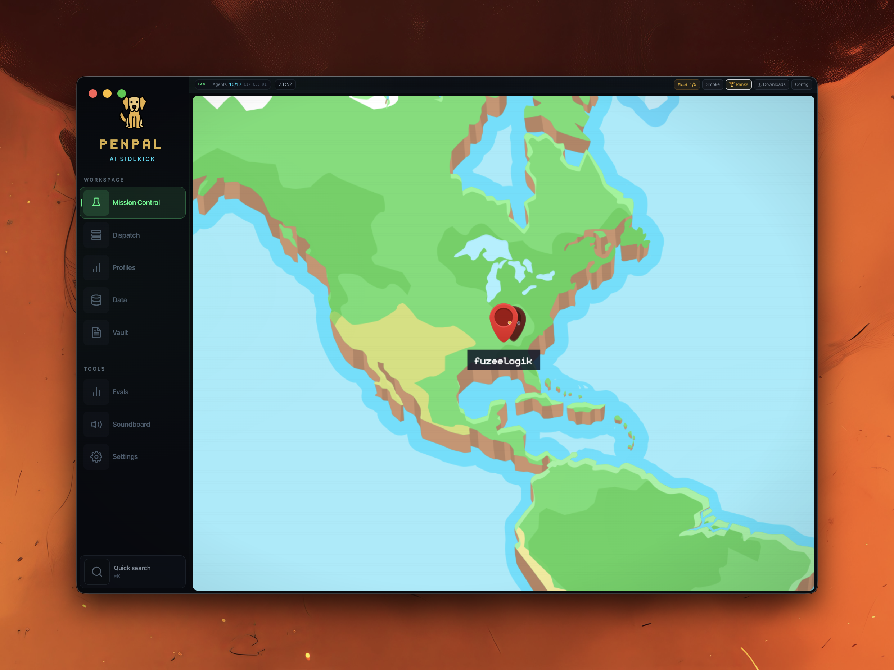
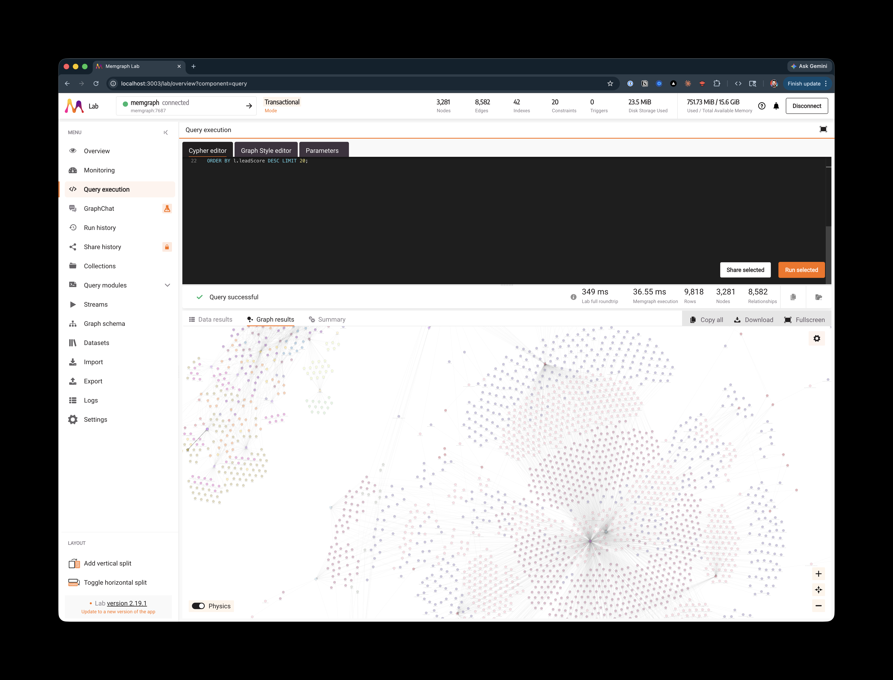
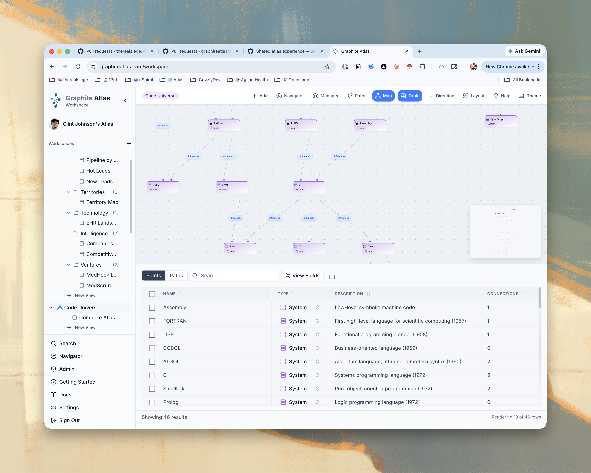

# Penpal

An AI Operating System for Product Engineers. Orchestrates teams of autonomous Claude Code agents through a visual command center, manages knowledge via a graph database, and ships code through a three-phase pod pipeline with built-in quality gates.

> This is 💯 a work in progress, but with that being said I use this tool to run my development workflow.
> I refer to agents as duders.

## Current Utility and Workflow

1. I plan with claude-code agents and use the lab view to quickly locate and focus on terminal windows that belong to a specific instance. Clicking a desk focuses on the terminal session no matter where it is. I was getting lost in terminal windows previously. It surfaces all of my llm sessions no matter their flavor (claude code, cursor agent, nemoclaw, opencode) to one place.
2. My planning creates github issues. I make sure claude-code or cursor agent (whatever I'm using at the time) creates small issues that have a solid definition of done. I even allow this agent to provide a execution strategy for the github issues as some of them can depend on each other. The pod system has mechanisms to help from collisions and pod to pod communication.
3. Agents from the pods are split into triplets (planning, executing and validating), they are connected to slack. This connection gives them the ability to DM me when they have questions (usually the planning agent).
4. While interacting with the issues and the pods, I am often toggling the github labels to retrigger the planning duder after answering a question, this allows me to simulate revving an agent in plan mode, but through the github issue comments, or slack.
5. Execution creates a branch, does the work, writes a test to validate, then sets the issue to the label our validation triplet is waiting for. The validator runs playwright e2e tests, then raises a PR or labels the issue as a failure and notifies me.
- When pods finish the validation pod raises a pull request into the default branch usually `main`.

## Vision: Run Your Business Like an RPG

Penpal turns your entire operation into a game. Your AI agents are characters in a pixel-art world. Your GitHub issues are quests. Shipping code earns XP. Every department is a scene on the world map, staffed by specialized duders who share a single knowledge graph — the company's brain.

### World Map


The overworld. Each pin is a department, a Penpal instance, or a remote service. Click a location to enter it. The vision: multiple Penpal instances communicating across users and machines, each one a different part of the business.



The map auto-zooms to the continent where your fleet instances are pinned. Each pin is a Penpal instance — click it to enter that lab. The sidebar gives quick access to every workspace panel: Mission Control, Dispatch, Profiles, Data, Vault, Evals, Soundboard, and Settings.

### Departments (Scenes)

Each department is a pixel-art scene with its own agents, tools, and purpose. They all read from and write to the same knowledge graph.

| Department | Status | What it does |
|-----------|--------|-------------|
| **The Lab** | Live | R&D headquarters — agents ship code, run tests, raise PRs |
| **Marketing Studio** | Next | Content creation, SEO, social distribution, competitive research |
| **Design Studio** | Planned | Visual asset generation — images, video, brand management |
| **Call Center** | Planned | AI voice agents with scripted call flows, appointment booking, CRM updates |
| **War Room** | Planned | Strategy — pipeline reviews, competitive response, quarterly planning |

### The Lab


The R&D headquarters. Agents ("duders") sit at desks, take coffee breaks at the cafe, and walk through laser doorways. Every Claude Code session is a living character in the lab. The more you ship, the more the lab comes alive.

- Agents work at assigned desks with directional sit animations
- Baristas run the cafe -- Latte Larry and Mocha Maya serve the team
- Laser doors open as agents walk through corridors
- Idle agents take walk breaks on the NavMesh floor
- Scene layout driven by `lab-map.json` -- edit positions, rooms, and animations without touching code
- XP, ranks, seasons, leaderboards, cosmetic rewards -- gamification built into every workflow

### Marketing Studio

The content factory. Marketing agents draft blog posts informed by the knowledge graph — pulling competitive positioning, customer pain points, and product messaging from the same brain the lab uses to build features. They distribute across channels, track performance, and feed results back into the graph. Competitive intel agents scrape competitor blogs and pricing pages, summarize changes, and auto-update Knowledge Wiki pages so your positioning stays current.

- Blog pipeline: Vault draft → MDX → ship to 1putthealth.com → social distribution
- Email campaigns and drip sequences via Resend
- Social scheduling across LinkedIn, X, and threads
- SEO optimization with keyword tracking and content gap analysis
- Competitive content scraping via Firecrawl — auto-updates Knowledge Wiki
- Performance tracking via Fathom analytics — close the loop on what works

### Design Studio

The creative department. Agents generate images, produce video, and manage brand assets. AI image generation via Nano Banana and Replicate for everything from hero images to social graphics. Video production via Runway and Kling for product demos and social clips. Sharp and FFmpeg handle processing. Brand guidelines live in the knowledge graph so every generated asset stays on-brand without manual review.

- AI image generation — concepts, social graphics, hero images, icon sets
- Video production — product demos, social clips, explainer animations
- Asset processing — resize, crop, format conversion, sprite sheet generation
- Brand consistency enforced by graph-stored guidelines and style rules
- CDN publishing — assets optimized and deployed to Cloudflare R2

### Call Center

The virtual phone bank. AI voice agents handle inbound and outbound calls using decision-tree scripts stored in the knowledge graph. Twilio routes calls to Bland.ai or Vapi voice agents. Scripts branch by caller intent — book a demo via Cal.com, answer pricing from the product graph, or route support issues to the lab as GitHub issues. Every call is transcribed, the lead's graph node is updated with the outcome, and call metrics flow into the daily briefing.

- Scripted call flows stored as graph entities — A/B testable, version-controlled
- Real-time transcription via Deepgram, saved to the Vault
- Appointment booking via Cal.com — confirmation emails via Resend
- Automatic CRM updates — call outcomes write back to lead nodes in the graph
- Call metrics in daily briefings — volume, conversion, script performance

### War Room

The situation room. The heaviest consumer of the knowledge graph. Agents run pipeline reviews by querying lead data across territories and stages. They model revenue from lead scores, analyze competitive shifts flagged by marketing, and draft quarterly plans. Graphite Atlas provides the visual exploration layer for strategy sessions. Every other department feeds intelligence in; the War Room synthesizes it into decisions.

- Pipeline analysis — lead flow by stage, territory, EHR, venture
- Revenue modeling — lead scores x conversion rates x ACV projections
- Competitive response playbooks — triggered by Knowledge Wiki updates
- Territory planning — coverage gaps, expansion targets, resource allocation
- Cross-department synthesis — connects lab velocity, marketing performance, and call center conversion

### Dispatch Board & Pod System

Your quest log. GitHub issues flow through a three-phase pipeline — **Plan, Execute, Validate** — powered by agent pods. Label an issue `agent-ready` and the system picks it up automatically.


Agents work in **pods** — triplets of specialized roles that take an issue from plan to merged PR:

1. **Plan** — Explore the codebase, design the implementation approach
2. **Execute** — Implement the code in an isolated git worktree
3. **Validate** — Run Playwright E2E tests, assert pass/fail, raise PR or report failure

Each phase is a column on the dispatch board. Pods advance automatically. If validation fails, the solver gets feedback and iterates (up to 3 rounds).

### Runtime Profiles

Route pods between frontier cloud models and local inference to balance speed vs cost:

| Profile | Plan | Execute | Validate | Timeout | Cost |
|---------|------|---------|----------|---------|------|
| **max** | Opus | Opus | Sonnet | 1x | Max plan quota |
| **economic** | coder:30b | coder:30b | coder:30b | 5x | $0 (local Ollama) |
| **sonnet** | Sonnet | Sonnet | Sonnet | 1.5x | Lower quota |

Set the system default in `agents/agent-types.yaml` or override per-issue with `economic` / `max` GitHub labels.

### Pod Coordination — Flight Board

Multiple pods running in parallel share a **flight board** that prevents collisions:

- **Planning broadcast** — when a pod's planner finishes, it publishes its plan summary and file manifest
- **Cross-pod awareness** — new pods see what's already in flight before they start planning
- **File-level gating** — dispatch queues pods that would touch overlapping files
- **Rebase-before-PR** — pods rebase onto latest main before creating PRs

## Roadmap

| Phase | Focus | Status |
|-------|-------|--------|
| 1 | The Lab + Knowledge Graph + Dispatch + Pods | Live |
| 2 | Living Lab — animation polish, dynamic lighting, sound design, VFX | In Progress |
| 3 | Marketing Studio — content pipeline, competitive intel, social distribution | Next |
| 4 | Design Studio — AI asset generation, video production, brand management | Planned |
| 5 | Call Center — AI voice agents, scripted call flows, CRM integration | Planned |
| 6 | War Room — strategy synthesis, pipeline modeling, cross-department intelligence | Planned |
| 7 | Multi-instance — Penpal instances communicating across machines and users | Vision |

### Shared Infrastructure

Every department plugs into the same foundation. The knowledge graph (Memgraph + Qdrant + Graphite Atlas) is the shared brain. The pod system (Plan → Execute → Validate) is the shared workflow. Gamification (XP, ranks, seasons, leaderboards) applies to every agent in every department. The Slack bridge lets any agent DM you regardless of which scene they're in. The Knowledge Wiki compiles intelligence that all departments consume. The scheduler keeps everything fresh automatically.

## Knowledge Graph

Every department, every agent, every decision draws from the same knowledge graph. It's the flow of all knowledge through the business — not a static database, but a living network that grows as agents work.


*queryable by every agent via MCP tools*

Your markdown files, emails, RSS feeds, and alerts all feed into a structured graph. When a lab agent builds a feature, it knows which customers asked for it. When a marketing agent writes a blog post, it pulls competitive context from the same graph. Every department reads from and writes to the same brain.

**How it works:**

1. **Parse** -- Walk every markdown file. Extract frontmatter, links, tags, and prose.
2. **Extract** -- Claude identifies entities in the text: people, companies, technologies, regulations, sales leads.
3. **Connect** -- Build a relationship graph in Memgraph. Documents link to entities. Entities link to each other (WORKS_AT, COMPETES_WITH, MENTIONS).
4. **Embed** -- Chunk content and embed into Qdrant vectors for semantic similarity search.
5. **Analyze** -- Run graph algorithms (PageRank, community detection, betweenness centrality) to surface the most important nodes and hidden connections.
6. **Refresh** -- Scheduler runs cron jobs to ingest Google Alerts, RSS feeds, email mining (via [gog CLI](https://gogcli.sh/)), and daily briefings. The graph stays current automatically.
7. **Wiki** -- Synthesize intelligence pages from the graph into the Vault's `Knowledge/` folder. Each page is Claude-written analysis (not data dumps) with wikilinks that build the Vault's backlink graph. Inspired by [Karpathy's LLM Wiki pattern](https://gist.github.com/karpathy/442a6bf555914893e9891c11519de94f).
8. **Sync** -- Push the graph to Graphite Atlas for visual exploration alongside the Memgraph query engine.

The result is a self-updating web of your entire knowledge base that every agent in every department can query.

### Graphite Atlas



The knowledge graph syncs to [Graphite Atlas](https://graphiteatlas.com) — a visual graph workspace that makes the Memgraph data browsable and explorable. Workspaces organize views by domain: Pipeline, Hot Leads, Territories, Technology landscape, Intelligence (companies and competitive analysis), and Ventures. The dual-graph architecture keeps Memgraph as the fast query engine while Atlas provides the visual layer for exploring entity relationships, running path queries, and spotting patterns that raw Cypher can't surface.

**What agents can do with it:**

| MCP Tool | What it does |
|----------|-------------|
| `search_knowledge` | Semantic search across all document chunks |
| `query_graph` | Run Cypher queries against the full graph |
| `find_entity` | Look up any entity and its relationships |
| `ask_knowledge` | RAG-powered Q&A with source citations |
| `find_similar` | Find related documents by vector similarity |
| `pipeline_status` | Sales analytics by stage, territory, EHR, score |
| `discover_connections` | Find paths between two entities in the graph |
| `list_communities` | Show entity clusters from community detection |

### Panels

| Panel | Description |
|-------|-------------|
| **Lab** | Pixel-art agent headquarters with live session status |
| **Dispatch** | Kanban quest board for the GitHub issue pipeline |
| **Data** | ETL pipeline controls, ingestion scripts |
| **Vault** | Knowledge base editor with linked documents, tags, and graph viz |
| **Evals** | Agent evaluation metrics and quality tracking |
| **Soundboard** | Audio clip player (synced via ~/Documents/Sound Effects/) |
| **Settings** | Appearance, theme controls, service config |

## Repository Structure

```
Penpal/
  Penny/                # Electron dashboard (React + Tailwind + Phaser)
    agents/             # Agent personas (Journey to the West), shared memory, MCP profiles
    public/sprites/     # Sprite sheets, lab-map.json, GDS scene assets
    src/main/           # Main process (IPC, pods, flight board, sessions, soundboard)
    src/renderer/       # React shell + Phaser game (50+ game modules)
    tests/              # Playwright E2E + Vitest unit tests
    data/               # Runtime state (flight-board.json, pod-workflows.json)
  analytics/            # Graph ETL pipeline, MCP server, scheduler
    src/etl/            # Entity extraction, sales pipeline, RSS ingestion
    src/etl/wiki/       # Knowledge Wiki generator (Claude-synthesized entity pages)
    src/mcp/            # MCP server (8 tools for graph + vector queries)
    schedule.yaml       # Cron job definitions
  scripts/              # Vault utilities (image automation, transcription, cleanup)
  tools/                # Dispatch scripts
  data/                 # Eval outcomes
  macos/                # macOS service installers (Finder automations, Whisper)
  docs/                 # Screenshots and documentation
```

### External Directories

These live outside the repo and are synced via iCloud across devices:

```
~/Documents/Sound Effects/    # Soundboard audio clips (mp3)
~/Documents/Vault/            # Knowledge base (markdown files — source for ETL)
```

## Quick Start

```bash
# Infrastructure
cd analytics
npm install
npm run infra:up          # Start Memgraph + Qdrant via Docker

# ETL
npm run etl               # Run full pipeline (parse, extract, embed, analyze, wiki, sync)
npm run etl -- --venture 1putt   # Single venture
npm run wiki:generate     # Regenerate Knowledge Wiki pages only
npm run atlas:sync        # Sync graph to Graphite Atlas only

# MCP Server
npm run mcp:dev           # Start MCP server

# Dashboard
cd Penny
npm install
npm run dev               # Electron dev with hot reload
npm run build             # Production build

# Agent Dispatch
# Label a GitHub issue with 'agent-ready' to trigger the pipeline
# Add 'economic' label to route to local Ollama model
```

## Requirements

- Node.js 18+
- Docker (Memgraph + Qdrant)
- macOS (Electron + iTerm2 for agent terminal interaction)
- `ANTHROPIC_API_KEY` -- agent execution and LLM extraction
- `OPENAI_API_KEY` -- embeddings
- Optional: Ollama with `coder:30b` for economic mode
- Optional: `SLACK_BOT_TOKEN` + `SLACK_APP_TOKEN` for Slack bridge
- Optional: `GRAPHITE_ACCESS_TOKEN` for Graphite Atlas visual graph sync
