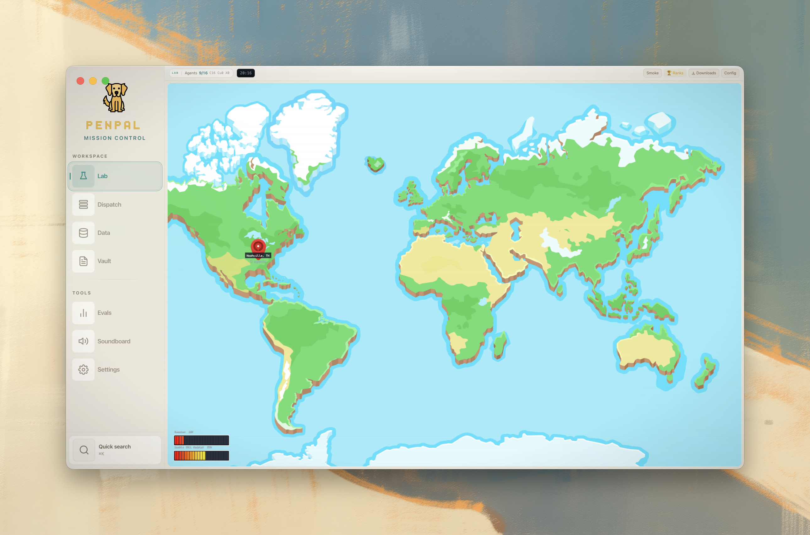
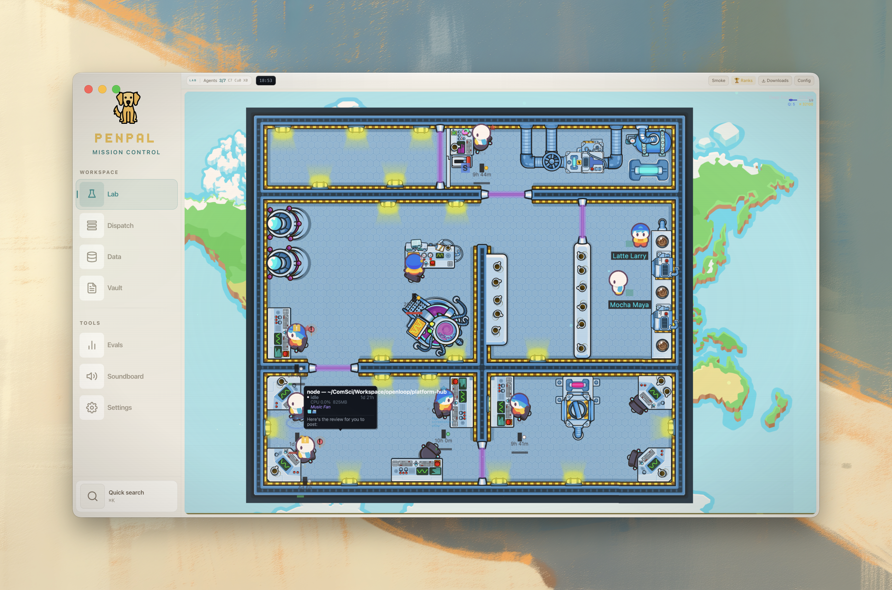
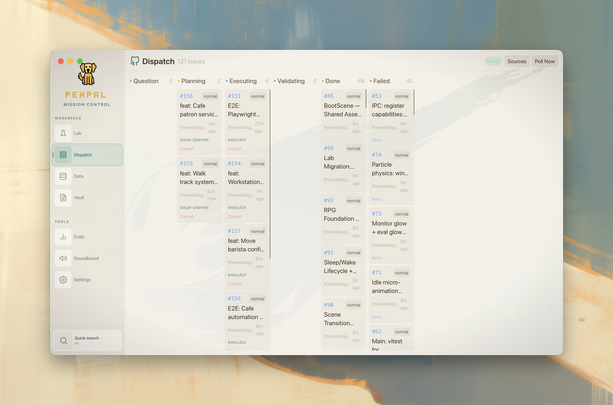

# Penpal

An AI Operating System for Product Engineers. Orchestrates teams of autonomous Claude Code agents through a visual command center, manages knowledge via a graph database, and ships code through a three-phase pod pipeline with built-in quality gates.



## Penpal — Visual Command Center

Penpal is the dashboard. A pixel-art lab where your AI agents sit at desks, take coffee breaks, and ship code. Every Claude Code session becomes a character you can watch, interact with, and dispatch work to.

### World Map

Click a location marker to enter the lab. Double-click empty space to return to the map.



### Lab Scene

A GDS-exported pixel-art backdrop with 10 workstation positions, a cafe with animated baristas, and purple laser doorways that open as agents walk through.

- **Live agent sessions** rendered as animated characters at assigned desks
- **Baristas** (Latte Larry & Mocha Maya) run choreographed work loops in the cafe
- **Laser doors** fade open/closed based on agent proximity
- **NavMesh pathfinding** -- agents walk only on valid floor tiles
- **lab-map.json** -- single JSON config for desks, rooms, walk tracks, and animations

### Dispatch Board

Kanban board tracking GitHub issues through the agent pipeline. Label an issue `agent-ready` and the system picks it up automatically.



### Panels

| Panel | Description |
|-------|-------------|
| **Lab** | Pixel-art agent lab with live session status |
| **Dispatch** | Kanban board for the GitHub issue pipeline |
| **Tasks** | Orchestrator queue, Veritas board, GitHub issues |
| **Data** | ETL pipeline controls, ingestion scripts |
| **Vault** | CodeMirror 6 editor with wikilinks, tags, graph viz |
| **Evals** | Agent evaluation metrics and quality tracking |
| **Soundboard** | Audio clip player (synced via ~/Documents/Sound Effects/) |
| **Settings** | Appearance, theme controls, service config |

## Agent Personas — Journey to the West

Every agent is a character from the Chinese epic *Journey to the West*, with a specialty, backstory, and assigned desk in the lab.

| Agent | Title | Role | Model | Specialty |
|-------|-------|------|-------|-----------|
| **Sun Wukong** | The Monkey King | Solver | Opus | Full-stack — transforms into whatever the codebase needs |
| **Erlang Shen** | The Three-Eyed God | Solver | Opus | Frontend — third eye sees broken layouts |
| **Guanyin** | Bodhisattva of Compassion | Reviewer | Opus | Backend architecture — sees the whole system |
| **Tang Sanzang** | The Monk Tripitaka | Reviewer | Opus | Product management — keeps the mission on track |
| **Dragon King Ao Guang** | King of the East Sea | Reviewer | Opus | UI/UX — every pixel intentional |
| **Sha Wujing** | Curtain-Lifting General | Executor | Sonnet | Validation & QA — if he says it passes, it passes |
| **Zhu Bajie** | Marshal of the Heavenly Canopy | Executor | Sonnet | Executive ops — brute-force effective |
| **Nezha** | The Third Lotus Prince | Solver | Opus | Mobile — everything must be instant |
| **Red Boy** | Holy Child King | Solver | Opus | Game dev — creative fire, playful destruction |
| **Bull Demon King** | Great Sage Who Pacifies Heaven | Solver | Opus | Embedded/systems — zero waste, low-level mastery |
| **White Dragon Horse** | Third Prince of the West Sea | Solver | Opus | Content & marketing — carries the message |

Executor agents default to Sonnet with 1.5x timeout -- validation doesn't need Opus-level reasoning.

## Pod System — Three-Phase Pipeline

Agents work in **pods** -- three-phase workflows inspired by AgentCoder:

1. **Plan** -- Explore the codebase, design the approach
2. **Execute** -- Implement in an isolated git worktree
3. **Validate** -- Run Playwright E2E tests, assert pass/fail

### Runtime Profiles

Route pods between frontier cloud models and local inference to balance speed vs cost:

| Profile | Plan | Execute | Validate | Timeout | Cost |
|---------|------|---------|----------|---------|------|
| **max** | Opus | Opus | Sonnet | 1x | Max plan quota |
| **economic** | coder:30b | coder:30b | coder:30b | 5x | $0 (local Ollama) |
| **sonnet** | Sonnet | Sonnet | Sonnet | 1.5x | Lower quota |

Set the system default in `agents/agent-types.yaml` or override per-issue with `economic` / `max` GitHub labels.

### Pod Coordination — Flight Board

Multiple pods running in parallel share a **flight board** that prevents collisions:

- **Planning broadcast** -- when a pod's planner finishes, it publishes its plan summary and file manifest
- **Cross-pod awareness** -- new pods see what's already in flight before they start planning
- **File-level gating** -- dispatch queues pods that would touch overlapping files
- **Rebase-before-PR** -- pods rebase onto latest main before creating PRs

## Knowledge Graph — The Vault's Nervous System

Your markdown files aren't just documents -- they're a living knowledge network. The ETL pipeline in `analytics/` reads every file in the vault and builds a structured graph of everything it finds: people, companies, technologies, regulations, sales leads, and how they all connect.

**How it works:**

1. **Parse** -- Walk every markdown file. Extract frontmatter, wikilinks, tags, and prose.
2. **Extract** -- Claude identifies entities in the text: people, companies, EHR systems, billing codes, technologies.
3. **Connect** -- Build a relationship graph in Memgraph. Documents link to entities. Entities link to each other (WORKS_AT, COMPETES_WITH, USES_EHR, MENTIONS).
4. **Embed** -- Chunk content and embed into Qdrant vectors for semantic similarity search.
5. **Analyze** -- Run graph algorithms (PageRank, community detection, betweenness centrality) to surface the most important nodes and hidden connections.

The result is a queryable web of your entire knowledge base. Agents use it via MCP tools to answer questions, find connections, and make decisions with full context.

**What agents can do with it:**

| MCP Tool | What it does |
|----------|-------------|
| `search_knowledge` | Semantic search across all document chunks |
| `query_graph` | Run Cypher queries against the full graph |
| `find_entity` | Look up any entity and its relationships |
| `ask_knowledge` | RAG-powered Q&A with source citations |
| `find_similar` | Find related documents by vector similarity |
| `pipeline_status` | Sales analytics by stage, territory, EHR, score |
| `discover_connections` | Find paths between two entities in the graph |
| `list_communities` | Show entity clusters from community detection |

**Keeps itself fresh:**

- **Scheduler** runs cron jobs: RSS ingestion from healthcare feeds, daily briefings, NPI enrichment
- **Multi-project** support: each project gets its own ETL config, scoring profile, and pipeline

## Repository Structure

```
sidekick/
  Penny/              # Electron dashboard (React + Tailwind + Phaser)
    agents/           # Agent personas, shared memory, MCP profiles
    public/sprites/   # Sprite sheets, lab-map.json, GDS scene assets
    src/main/         # Main process (IPC, pods, flight board, sessions)
    src/renderer/     # React shell + Phaser game (50+ game modules)
  analytics/          # Graph ETL pipeline, MCP server, scheduler
  Docs/               # Documentation and knowledge bases
  tools/              # Utility scripts (dispatch, etc.)
```

## Quick Start

```bash
# Infrastructure
cd analytics
npm install
npm run infra:up          # Start Memgraph + Qdrant via Docker

# ETL
npm run etl               # Run full pipeline
npm run etl -- --project myapp   # Single project

# MCP Server
npm run mcp:dev           # Start MCP server

# Dashboard
cd Penny
npm install
npm run dev               # Electron dev with hot reload
npm run build             # Production build

# Agent Dispatch
# Label a GitHub issue with 'agent-ready' to trigger the pipeline
# Add 'economic' label to route to local Ollama model
```

## Requirements

- Node.js 18+
- Docker (Memgraph + Qdrant)
- macOS (Electron + iTerm2 for agent terminal interaction)
- `ANTHROPIC_API_KEY` -- agent execution and LLM extraction
- `OPENAI_API_KEY` -- embeddings
- Optional: Ollama with `coder:30b` for economic mode
- Optional: `SLACK_BOT_TOKEN` + `SLACK_APP_TOKEN` for Slack bridge
