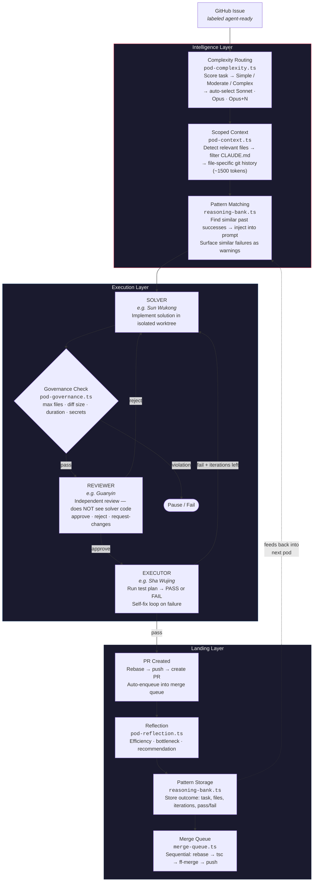

# Penpal

An operating system for running an AI workforce.

Penpal started as a way to manage terminal sessions across Claude Code, OpenCode, and Cursor Agent. It grew into a full operating system for orchestrating AI coding agents — visible as characters in an isometric game world, working autonomously on GitHub issues, communicating via Slack, and running across multiple machines.

Built by [1Putt Health](https://1putthealth.com) for creating and launching digital health products and software tools. Penpal builds itself — the pod system that solves GitHub issues is the same system we use to develop Penpal.

---

## What Penpal Does Today

### 1. Manage Current Operations

See every AI agent session running across your machines in one place.

- **Communicate via Slack** — each project gets its own channel, messages route to the right agent
- **Get DM'd** when an agent has a question or needs tool approval

### 2. Tee Up Background Work

Label a GitHub issue `agent-ready`, walk away, come back to a PR.

- **GitHub issue pipeline** — polls for `agent-ready` issues, spins up a 3-agent pod in an isolated worktree, pushes a PR on completion
- **Configurable runtime profiles** — run on Claude Opus (max quality), Sonnet (balanced), or local Ollama via OpenCode (zero cost)
- **Pod workflow**: Solver implements -> Reviewer validates independently -> Executor tests. Feedback loops on failure
- **Dispatch board** — unified view of all issues and pods in phase columns with agent avatars and controls
- **MCP servers** surfaced in one configurable area

---

## Vision

### Pod System

| Feature | Status | Wave | Description |
|---------|--------|------|-------------|
| 3-agent pipeline (Solver/Reviewer/Executor) | Done | — | Core workflow engine with iteration loops and self-fix |
| Isolated git worktrees | Done | — | Each pod gets its own branch + worktree, auto-cleanup |
| Runtime profiles (max/sonnet/economic) | Done | — | Per-phase model selection, custom profiles via JSON |
| Ollama/OpenCode economic mode | Done | — | Zero-cost local inference via qwen3-coder:30b |
| GitHub issue pipeline | Done | — | `agent-ready` label → pod → PR, watched repo management |
| Flight board (file conflict detection) | Done | — | Tracks files being edited by active pods |
| Best-of-N solver candidates | Done | — | Multi-candidate solving with self-evaluation selection |
| Rebase before PR | Done | W6 | Auto-rebase onto main, conflict detection, lock-file auto-resolve |
| Push-if-ahead | Done | W6 | Pushes local main to origin before creating worktrees |
| Stale worktree cleanup (`--cleanup`) | Done | W6 | Prunes worktrees older than 48h |
| Workflow pruning | Done | W6 | Caps persisted workflows at 100, auto-kills zombies |
| Expanded CLAUDE.md context (20 entries) | Done | W6 | Workflow log retention 5 → 20 |
| Scoped context injection | Done | W7 | Task-aware CLAUDE.md filtering, ~1500 tokens vs ~3000 |
| ReasoningBank (pattern learning) | Done | W7 | Stores outcomes, injects similar successes into solver |
| Complexity routing | Done | W7 | Auto-selects Sonnet/Opus/Opus+N by task complexity |
| Governance rules | Done | W7 | Max files, diff size, duration, forbidden paths |
| MRAP reflection | Done | W7 | Efficiency rating, bottleneck detection, fleet analytics |
| Merge queue (Refinery) | Done | W7 | Sequential rebase → tsc → merge → push pipeline |
| Shell injection hardening | Done | W7 | All `execSync` with user input → `execFileSync` |
| Pod pipeline cleanup CLI | PR ready | W6 | Cleanup flag + push-if-ahead (#339 → PR #344) |

#### Platform

| Feature | Status | Description |
|---------|--------|-------------|
| Multi-machine fleet (Slack) | Done | Heartbeat discovery, world map pins, DM alerts |
| MCP server | Done | 5 tool groups (meta, orchestrator, pods, office, vault) |
| Dispatch board | Done | Unified GitHub issue + pod workflow board |
| Eval dashboard | Done | Pod quality metrics, spot-check queue, digests |
| Linear integration | Planned | Pull tasks from Linear alongside GitHub Issues |
| Slack-first operations | Planned | `!task`, `!pod status`, `!dispatch` from Slack |

---

## Pod System — How Issues Become PRs

Pods are 3-agent teams that turn GitHub issues into merged PRs. The system is self-improving — each pod run feeds data back into routing, context, and pattern matching for the next one.

### The Pipeline



**Max iterations**: configurable per profile. Economic mode gets 5 rounds; max gets 3.

### Intelligence Modules

Six modules wrap the execution pipeline. Inspired by patterns from [ruflo](https://github.com/ruvnet/ruflo) (3-tier routing), [agentic-flow](https://github.com/ruvnet/agentic-flow) (ReasoningBank), [Dossier](https://github.com/rwliebs/Dossier) (scoped context), [gastown](https://github.com/gastownhall/gastown) (merge queue), and [DAA](https://github.com/ruvnet/daa) (governance + MRAP loop).

| Module | File | When |
|--------|------|------|
| **Complexity Routing** | `pod-complexity.ts` | Before pod starts — scores task, selects model tier |
| **Scoped Context** | `pod-context.ts` | At worktree creation — builds task-specific CLAUDE.md |
| **ReasoningBank** | `reasoning-bank.ts` | Before solver (query) and after completion (store) |
| **Governance** | `pod-governance.ts` | After solver — checks file count, diff size, duration, forbidden paths |
| **Reflection** | `pod-reflection.ts` | After completion — rates efficiency, detects bottleneck |
| **Merge Queue** | `merge-queue.ts` | After PR — sequential rebase-test-merge pipeline |

### Governance Rules

Default constraints (configurable via `data/governance-rules.json`):

| Rule | Limit | Action |
|------|-------|--------|
| Max files modified | 12 | Warn |
| Max diff lines | 800 | Warn |
| Max duration | 30 minutes | Auto-pause |
| Forbidden paths | `.env`, `credentials`, `secrets`, `.pem`, `.key` | Fail |

### CLI

```bash
npm run pod:create -- --task "..." --preset frontend-feature   # auto-selects model tier
npm run pod:create -- --merge-queue                            # drain merge queue
npm run pod:create -- --merge-next                             # merge next PR in queue
npm run pod:create -- --cleanup                                # prune stale worktrees >48h
```

---

## Fleet — Multiple Machines

Penpal instances discover each other via Slack. No port forwarding, no central broker.

### How It Works

1. Each instance posts a heartbeat to `#sk-fleet` every 60 seconds
2. Heartbeat includes: hostname, username, sessions, pods, health, IP geolocation
3. Messages are updated in-place (`chat.update`) — one message per instance
4. The world map renders pins for each instance (red = you, blue = remote, gray = stale)

### Setup on a New Machine

1. Clone the repo
2. `npm install` in `Penpal/`
3. Add Slack tokens to `Penpal/.env` (or they auto-load from `.env.shared`)
4. `npm run dev` — your pin appears on the world map within 60 seconds

Fleet pins show the OS username as a hover label. Same-city instances nudge apart slightly so both are clickable.

---

## Runtime Profiles

Configure once in the Profiles panel. Every new pod inherits the default.

| Profile | Plan Model | Execute Model | Validate Model | Timeout | Iterations | Self-Fixes | Cost |
|---------|-----------|---------------|----------------|---------|------------|------------|------|
| `max` | Opus | Opus | Sonnet | 1x | 3 | 1 | $$$ |
| `sonnet` | Sonnet | Sonnet | Sonnet | 1.5x | 3 | 1 | $$ |
| `economic` | ollama:qwen3-coder:30b | ollama:qwen3-coder:30b | ollama:qwen3-coder:30b | 8x | 5 | 3 | Free |

**Economic mode**: Routes through OpenCode CLI (which has tool use + file editing) to your local Ollama instance. More iterations and self-fixes compensate for the smaller model. Zero API cost.

**Per-issue override**: Label a GitHub issue with `economic`, `max`, or `sonnet` to override the default profile for that issue.

**Custom profiles**: Create your own in the Profiles panel — mix models per phase, tune timeouts, save to `data/pod-profiles.json`.

---

## Game Systems — Dev Studio Tycoon

The isometric lab isn't just a visualizer — it's a game layer on top of real work.

| System | Description |
|--------|-------------|
| **Quests** | Every agent task auto-wraps into a quest. Difficulty inferred from priority. XP/credit multipliers: trivial 1x, normal 1.5x, hard 2x, epic 3x, legendary 5x |
| **Cosmetic Tiers** | Desk items gated by XP rank — interns get bare desks, higher ranks unlock keyboard, lamp, plant, phone, gold trim, RGB underglow |
| **Leaderboard** | Season XP rankings. Weekly MVP. Rivalries detected when agents are within 5% XP. Toggle with `L` key |
| **Seasons** | 30-day arcs with themed challenges (Neon Sprint, Deep Focus, Ship It, Blitz Mode). Auto-rotates on expiry |
| **Credits** | Cosmetic-only currency earned from quests. Shop: room themes, desk LED colors, particle effects, name colors |
| **Day/Night** | Atmospheric cycle with sky gradients, starfield, clouds, shadows, dawn/dusk flash transitions |
| **Cafe** | Agents take coffee breaks, sit at stools, social emoji interactions between seated agents |

---

## Quick Start

```bash
npm install
npm run dev       # electron-vite dev (hot reload)
npm run build     # production build to out/
```

### Environment Setup

Secrets go in `Penpal/.env` (gitignored). Shared config lives in `.env.shared` (committed).

```bash
# Penpal/.env (required for full functionality)
SLACK_BOT_TOKEN=xoxb-...
SLACK_APP_TOKEN=xapp-...
SLACK_OWNER_USER_ID=U...        # Your Slack member ID for DM alerts
FIRECRAWL_API_KEY=fc-...
GITHUB_PERSONAL_ACCESS_TOKEN=ghp_...
BROWSERBASE_API_KEY=bb_live_...
NOTION_API_KEY=ntn_...

# Optional
PENNY_TASK_RUNNER=claude        # Default headless backend (claude/opencode/cursor-agent)
PENNY_OLLAMA_BASE_URL=http://127.0.0.1:11434
PENNY_OLLAMA_MODEL=qwen3-coder:30b
FLEET_MAP_X=820                 # Pin position on world map (3840x2160 space)
FLEET_MAP_Y=1020
```

### Adding Watched Repos

In the Dispatch panel, click **Sources** to add GitHub repos. Issues labeled `agent-ready` in those repos will be picked up by the pipeline.

```
Sources → + Add repository → owner/repo → local clone path
```

### OpenCode + Ollama Setup (Economic Mode)

`opencode.json` (committed) configures the Ollama provider:

```json
{
  "provider": {
    "ollama": {
      "npm": "@ai-sdk/openai-compatible",
      "name": "Ollama (local)",
      "options": { "baseURL": "http://127.0.0.1:11434/v1" },
      "models": { "qwen3-coder:30b": { "name": "Qwen3 Coder 30B" } }
    }
  }
}
```

Requires Ollama running locally with `qwen3-coder:30b` pulled: `ollama pull qwen3-coder:30b`

---

## Architecture

### Main Process (`src/main/`)

| Module | Purpose |
|--------|---------|
| `pods.ts` | 3-agent workflow engine — Solver/Reviewer/Executor with runtime profiles, complexity routing, governance, pattern learning, reflection, merge queue |
| `github-pipeline.ts` | `agent-ready` issues -> isolated worktree -> pod -> PR creation |
| `github-issues.ts` | GitHub issue poller, watched repo management, card aggregation |
| `fleet-heartbeat.ts` | Multi-instance discovery via Slack `#sk-fleet`, IP geolocation, 60s cycle |
| `slack-bridge.ts` | Per-project Slack channels, bidirectional message routing, `!task` commands, fleet re-export |
| `sessions.ts` | Discovers Claude Code / Cursor / OpenCode sessions, reads JSONL transcripts, headless agent execution |
| `orchestrator.ts` | Task queue with priority routing, agent scoring, dispatch loop (10s), health monitor (30s) |
| `agents.ts` | Agent configs from `agent-types.yaml`, CLI arg building, headless backend chains, model mapping |
| `ollama-client.ts` | Local Ollama HTTP client (`/api/generate`, `/api/tags`) |
| `pod-context.ts` | Scoped context builder — task-aware CLAUDE.md filtering, file-specific git history |
| `pod-complexity.ts` | Three-tier complexity scorer — auto-selects runtime profile (Sonnet/Opus/Opus+candidates) |
| `pod-governance.ts` | Governance rule engine — max files, diff size, duration, forbidden paths |
| `reasoning-bank.ts` | Pattern storage — stores pod outcomes, finds similar past successes for solver injection |
| `pod-reflection.ts` | MRAP reflection — efficiency rating, bottleneck detection, fleet analytics |
| `merge-queue.ts` | Sequential merge pipeline — rebase, type-check, fast-forward merge, push |
| `flight-board.ts` | Tracks files being edited by active pods for conflict detection |
| `vault.ts` | Vault file manager — CRUD, search, tags, backlinks, `vault://` protocol |
| `health.ts` | Infrastructure health checks (Memgraph, Qdrant, Docker) |
| `ipc.ts` | All `ipcMain.handle()` registrations with `wrapHandler` error boundary |

### Renderer (`src/renderer/src/`)

**Panels:**

| Panel | Description |
|-------|-------------|
| `OrchestratorModal.tsx` | Dispatch board — unified GitHub issue + pod workflow board with phase columns, agent avatars, expand for pod detail with team grid and controls |
| `ProfilesPanel.tsx` | Runtime profile editor — visual Plan/Execute/Validate pipeline, model dropdowns, timeout/iteration/self-fix knobs, default selection |
| `EvalsPanel.tsx` | Agent evaluation dashboard — pod quality metrics, spot-check queue, weekly digests |
| `SettingsPanel.tsx` | Appearance/theme, GitHub repo management, config snapshot viewer |


## MCP Server

Penpal exposes an MCP (Model Context Protocol) server so Claude sessions can programmatically discover and invoke Penpal's capabilities.

```bash
npm run mcp:start        # stdio transport
```

| Group | Tools |
|-------|--------|
| **meta** | `meta:list-tools`, `meta:describe-tool` |
| **orchestrator** | `orchestrator:enqueue`, `orchestrator:queue`, `orchestrator:agent-health` |
| **pods** | `pod:list`, `pod:status`, `pod:create` |
| **office** | `office:rooms`, `office:agents`, `office:leaderboard` |

Connect via `.mcp.json`:

```json
{
  "mcpServers": {
    "penny-mcp": {
      "command": "npm",
      "args": ["run", "--prefix", "Penpal", "mcp:start"]
    }
  }
}
```

---

## Stack

| Layer | Technology |
|-------|-----------|
| Shell | Electron 33, electron-vite 5 |
| UI | React 18, Tailwind 3, Zustand |
| Slack | @slack/bolt 4 (Socket Mode) |
| Language | TypeScript 5.7 |
| Testing | Vitest (315 unit tests), Playwright (E2E) |

## Scripts

```bash
npm run dev              # electron-vite dev with HMR
npm run build            # production build
npm run sprites:all      # rebuild all sprite sheets (9 scripts)
npm run test             # vitest unit tests
npm run mcp:start        # start MCP server
npm run pod:create       # CLI pod launcher
npm run typecheck        # tsc --noEmit
npm run package          # electron-forge package
npm run make             # electron-forge make (distributable)
```

<details>
<summary>Full IPC API Reference</summary>

All IPC calls go through `window.api.*`. Each handler uses `wrapHandler` which catches errors and returns `{ error: string }`.

**Sessions**: `getClaudeSessions()`, `sendToSession(tty, msg)`, `focusSession(tty)`, `createNewSession(cwd)`, `approveSession(tty, choice)`, `broadcastToSessions(msg)`, `pruneStaleSessions(maxIdleMinutes?)`

**Agents**: `getAgents()`, `getAgentStatuses()`, `launchAgent(id, cwd)`, `focusAgent(id)`

**Pods**: `createPod(task, opts?)`, `listPods()`, `getPodStatus(id)`, `pausePod(id)`, `resumePod(id)`, `cancelPod(id)`, `overridePod(id, phase, override)`, `getPodPresets()`, `getPodAnalytics(lookbackHours?)`

**Pod Profiles**: `podProfiles()`, `podSaveProfile(name, profile)`, `podDeleteProfile(name)`, `podSetDefaultProfile(name)`

**Orchestrator**: `orchestratorQueue()`, `orchestratorEnqueue(...)`, `orchestratorCancelTask(id)`, `orchestratorRetryTask(id)`, `orchestratorStats()`, `orchestratorXP()`, `orchestratorCredits()`

**GitHub**: `githubCards()`, `githubPollNow()`, `githubAddRepo(owner, repo, path)`, `githubRemoveRepo(owner, repo)`, `githubListRepos()`

**Fleet**: `fleetStatus()` — all instances with heartbeat data, health, geolocation

**Vault**: `vaultList(path)`, `vaultRead(path)`, `vaultWrite(path, content)`, `vaultCreate(path)`, `vaultSearch(query)`, `vaultTags()`, `vaultBacklinks(path)`, `vaultGraphData()`

**Slack**: `slackStatus()`, `slackStart()`, `slackStop()`

**Evals**: `evalsSpotCheckQueue()`, `evalsSpotCheckSample(count)`, `evalsSpotCheckReview(id, verdict)`, `evalsPodQuality()`

**Flight Board**: `flightBoardList()`, `flightBoardFilesInFlight()`

**Config**: `configSnapshot()`, `configAddProjectMcp(server)`, `configRemoveProjectMcp(name)`

</details>

## macOS Notes

- `titleBarStyle: hiddenInset` with custom traffic light offset
- Session focus uses `AXRaise` for reliable window foregrounding
