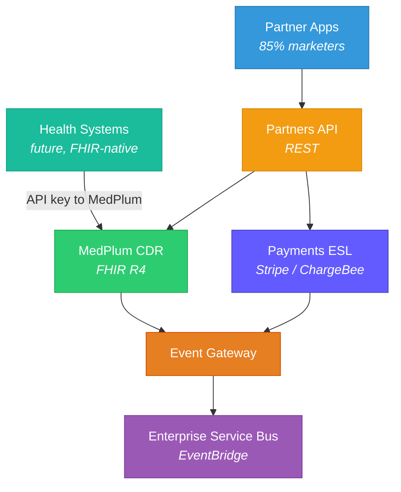

# Migration — Architecture & Abstraction Layer

> 85% of OpenLoop customers are performance marketers who'd "throw up" at FHIR. The Partners API abstracts FHIR behind a domain-friendly REST API. Future health system customers get direct FHIR access via API key to the MedPlum instance.

**See also:** [Tech Stack](Tech%20Stack.md) | [Payments & ESL](../OpenLoop/Payments%20&%20ESL.md) | [Access Control](../Medplum/Access%20Control%20&%20Multi-Tenancy.md) | [Phases](Phases.md)

## The Problem

OpenLoop's B2B2C clients are primarily performance marketers — non-technical, non-healthcare companies. They are good at patient acquisition and engagement but need an abstracted REST API, not FHIR. Only future health system customers (long sales cycle) will want FHIR directly.

## Partners API Design (formerly "Abstraction Layer")

The customer-facing API is called the **Partners API** internally. It serves as the single ingress point for all external integrations, abstracting both MedPlum (clinical) and the Payments ESL (financial).

## Architectural Alignment

| Pattern | OpenLoop Current | Medplum Target |
|---------|-----------------|---------------|
| Serverless compute | Lambda | Medplum Bots (can run on Lambda) |
| Event system | EventBridge | FHIR Subscriptions → EventBridge bridge |
| API layer | API Gateway + AppSync | API Gateway (abstraction) + Medplum FHIR API (internal) |
| Orchestration | Step Functions | Step Functions (unchanged) + Medplum Bots |
| Database | DynamoDB + Aurora | Medplum PostgreSQL (FHIR) + DynamoDB (non-clinical) |

## Domain Organization

OpenLoop uses **macro services** (broad domains with subdomains) rather than microservices. Each domain is a bounded context owned by a team.

- Each domain has its **own repo** and **own AWS account** (migrating from monorepo)
- Domains communicate primarily through the **Enterprise Service Bus** (EventBridge)
- Some exceptions for data that doesn't make sense to replicate (e.g., organization service — direct calls)
- **Event Gateway** transforms events from disparate sources, removes vendor implementation details, publishes canonical OpenLoop events to the ESB

## Key Architectural Decisions

1. **MedPlum as internal FHIR layer** — not exposed directly to most customers
2. **Partners API as the product surface** — domain-friendly REST for the 85%
3. **Direct FHIR access for health systems** — API key to MedPlum instance for future enterprise customers
4. **Bots for integration logic** — maps to existing Lambda patterns
5. **Event Gateway → ESB** — canonical OpenLoop events, vendor-agnostic
6. **Multi-tenant via MedPlum Projects** — each client gets isolated data/access policies
7. **Payments replication into MedPlum** — ESL is SoR for payments, but data replicates to CDR for holistic view
8. **Separate repos + accounts per domain** — enforces boundaries, prevents cross-domain dependencies
